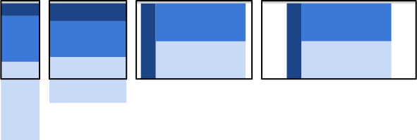

project_path: /web/fundamentals/_project.yaml
book_path: /web/fundamentals/_book.yaml
description: Responsive web design patterns are quickly evolving, but there are a handful of established patterns that work well across the desktop and mobile devices

{# wf_updated_on: 2019-11-03 #}
{# wf_published_on: 2014-04-29 #}
{# wf_blink_components: Blink>CSS #}

# Responsive Web Design Patterns {: .page-title }



Responsive web design patterns are quickly evolving, but there are a handful of established patterns that work well across the desktop and mobile devices.

Most layouts used by responsive web pages can be categorized into one of five
patterns: mostly fluid, column drop, layout shifter, tiny tweaks, and off canvas.
In some cases, a page may use a combination of patterns, for example column drop
and off canvas.  These patterns, originally identified by [Luke
Wroblewski](http://www.lukew.com/ff/entry.asp?1514), provide a solid starting
point for any responsive page.

### The patterns

For simplicity and ease of understanding, each the samples below were created with real markup using
[`flexbox`](https://developer.mozilla.org/en-US/docs/Web/Guide/CSS/Flexible_boxes),
typically with three content `div`'s contained within a primary container `div`.
 Each sample was written starting with the smallest view first, and breakpoints
were added when necessary.  The [flexbox layout mode is well
supported](http://caniuse.com/#search=flexbox) for modern browsers, though may
still require vendor prefixing for optimal support.

## Mostly Fluid

The mostly fluid pattern consists primarily of a fluid grid.  On large or
medium screens, it usually remains the same size, simply adjusting the margins
on wider screens.

On smaller screens, the fluid grid causes the main content to reflow,
while columns are stacked vertically.  One major advantage of this pattern is
that it usually only requires one breakpoint between small screens and large
screens.

<a href="https://googlesamples.github.io/web-fundamentals/fundamentals/design-and-ux/responsive/mostly-fluid.html" class="button button-primary">Try it</a>

In the smallest view, each content `div` is stacked vertically.  When the screen
width hits 600px, the primary content `div` remains at `width: 100%`, while the
secondary `div`'s are shown as two columns below the primary `div`.  Beyond
800px, the container `div` becomes fixed width and is centered on the screen.

Sites using this pattern include:

 * [A List Apart](http://mediaqueri.es/ala/){: .external }
 * [Media Queries](http://mediaqueri.es/){: .external }
 * [SimpleBits](http://simplebits.com/){: .external }

<pre class="prettyprint">

</pre>

## Column drop 

For full-width multi-column layouts, column drop simply stacks the columns
vertically as the window width becomes too narrow for the content.

Eventually this results in all of the columns being stacked vertically.  Choosing
breakpoints for this layout pattern is dependent on the content and changes
for each design.

<a href="https://googlesamples.github.io/web-fundamentals/fundamentals/design-and-ux/responsive/column-drop.html" class="button button-primary">Try it</a>

Like the mostly fluid sample, content is stacked vertically in the smallest
view, but as the screen expands beyond 600px, the primary and secondary content
`div`'s take the full width of the screen.  The order of the `div`'s is set using
the order CSS property.  At 800px all three content `div`'s are shown, using the
full screen width.

Sites using this pattern include:

 * [Modernizr](https://modernizr.com/){: .external }

<pre class="prettyprint">

</pre>

## Layout shifter

The layout shifter pattern is the most responsive pattern, with multiple
breakpoints across several screen widths.

Key to this layout is the way content moves about, instead of reflowing and
dropping below other columns.  Due to the significant differences between each
major breakpoint, it is more complex to maintain and likely involves changes
within elements, not just overall content layout.

<a href="https://googlesamples.github.io/web-fundamentals/fundamentals/design-and-ux/responsive/layout-shifter.html" class="button button-primary">Try it</a>

This simplified example shows the layout shifter pattern, on smaller screens
content is stacked vertically, but changes significantly as the screen becomes
larger, with a left `div` and two stacked `div`'s on the right.

Sites using this pattern include:

 * [Andersson-Wise Architects](http://www.anderssonwise.com/){: .external }

<pre class="prettyprint">

</pre>

## Tiny tweaks

Tiny tweaks simply makes small changes to the layout, such as adjusting font
size, resizing images, or moving content around in very minor ways.

It works well on single column layouts such as one page linear websites and text-heavy articles.

<a href="https://googlesamples.github.io/web-fundamentals/fundamentals/design-and-ux/responsive/tiny-tweaks.html" class="button button-primary">Try it</a>

As its name implies, not much changes with this sample as the screen size changes.
As the screen width gets larger, so do the font size and padding.

Sites using this pattern include:

 * [Ginger Whale](http://gingerwhale.com/){: .external }
 * [Future Friendly](http://futurefriendlyweb.com/){: .external }

<pre class="prettyprint">

</pre>

## Off canvas

Rather than stacking content vertically, the off canvas pattern places less
frequently used content&mdash;perhaps navigation or app menus&mdash;off screen, only
showing it when the screen size is large enough, and on smaller screens,
content is only a click away.

<a href="https://googlesamples.github.io/web-fundamentals/fundamentals/design-and-ux/responsive/off-canvas.html" class="button button-primary">Try it</a>

Rather than stacking content vertically, this sample uses a `transform: translate(-250px, 0)` declaration to hide two of the content `div`s off screen.  JavaScript is used
to show the divs by adding an open class to the element to make visible.  As the
screen gets wider, the off-screen positioning is removed from the elements and
they're shown within the visible viewport.

Note in this sample, Safari for iOS 6 and Android Browser do not support the
`flex-flow: row nowrap` feature of `flexbox`, so we’ve had to fall back to
absolute positioning.

Sites using this pattern include:

 * [HTML5Rocks Articles](http://www.html5rocks.com/en/tutorials/developertools/async-call-stack/){: .external }
 * [Google Nexus](https://www.google.com/nexus/){: .external }
 * [Facebook's Mobile Site](https://m.facebook.com/){: .external }

<pre class="prettyprint">

</pre>

## Feedback {: #feedback }


