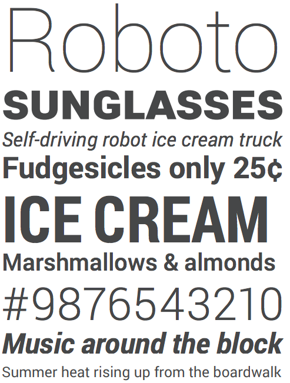
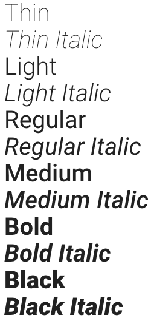
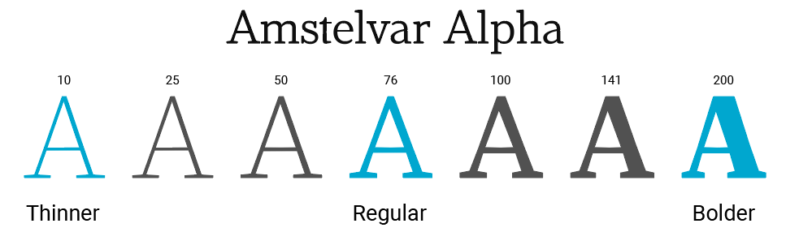
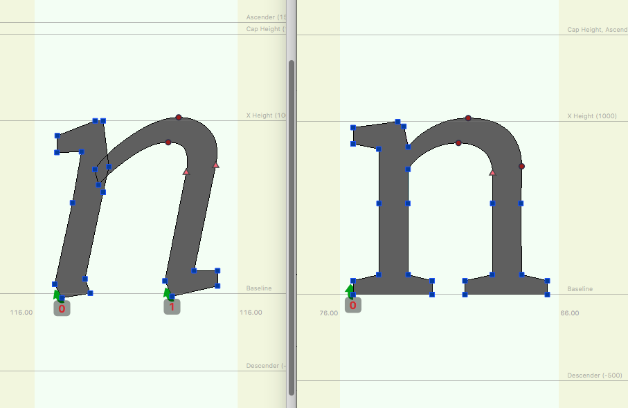
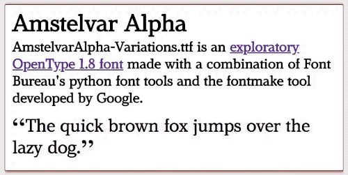
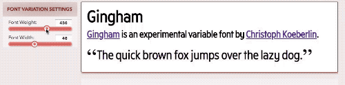
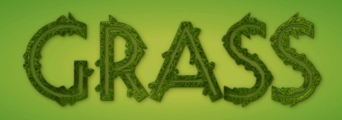
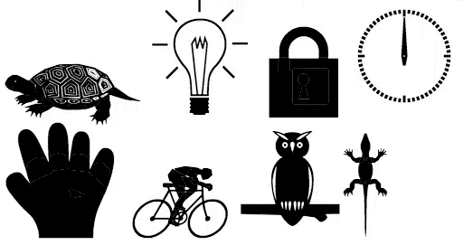

project_path: /web/fundamentals/_project.yaml
book_path: /web/fundamentals/_book.yaml
description: We will look at what variable fonts are, how we can use them in our work.

{# wf_updated_on: 2018-02-19 #}
{# wf_published_on: 2018-02-19 #}

# Introduction to variable fonts on the web {: .page-title }



In this article, we will look at what variable fonts are, how we can use them in our work, and the potential possibilities they entail. But to understand what they offer, first, we must explore how typography and font loading currently work on the web. 

## Introduction

The terms font and typeface are used interchangeably in the developer industry. However there is a difference: A typeface includes the entire family design, for example, [Roboto](https://fonts.google.com/specimen/Roboto), while a font is one of the digital files of that family, like Roboto Bold or Roboto Italic. In other words, a typeface is what you see, and the font is what you use. 

  <figure>
    
  </figure>

  <figure>
    
  </figure>

<strong>Note:</strong> Roboto Family designed by Christian Robertson.
On the left, a specimen of Roboto. On the right different members of the Roboto family.

### Challanges for the Designer and Developer

When a graphic designer prepares their work, they typically export the final artwork in a way that either embeds all of the fonts used, or they would provide an export archive that contains all of the assets used, a bit like a basic website. The cost to the designer depends on the suitability of the typeface for the rendering context  (is it legible at small sizes for example) and the license to use the fonts. 

On the web, we have both of the above for consideration, but also the associated bandwidth cost. For every member of the family or style used in our designs, we require that font file to be downloaded by the reader before the text is rendered. Just including the regular and bold styles plus their italic variations can amount to 500k or more of data. This has been a sticking point for web designers, and developers as a customized typography experience can come at a cost. This is even before we have dealt how the font renders and the patterns we are going to use (FOIT and FOUT). 

## Anatomy of a variable font
A variable font is a collection of masters, with one Default master, (usually the Regular font), and multiple registered “Axes”, such as the Weight axis, which would include the Regular and Black weights of the typeface. These individual styles along the axes are called instances. <strong>Width</strong>, <strong>Optical Size</strong> and <strong>Slant</strong> are other examples, where the instances along those axes represent the range of that axes, ([OT spec](https://docs.microsoft.com/en-gb/typography/opentype/spec/dvaraxisreg){: .external}).

<figure>
  
  <figcaption>Typeface Amstelvar, designed by David Berlow, type designer and typographer at Font Bureau.</figcaption>
</figure>

All of these axes share the Default, and by traversing between the masters of each axis we get to explore multiple options of the font, not just the specific axes, but their combinations. For example, variable font Amstelvar has three masters for its <strong>Weight axis</strong>, Regular, which is at the center of the Weight axis scale, and two masters, thinner and bolder at the opposite ends of the axis. Between these, there are potentially 200 variations on the axis that give the designer or developer an array of weights to choose from and explore. 

[Amstelvar](https://github.com/TypeNetwork/Amstelvar){: .external} also has three masters for its Width axis, Regular, which is at the center of the axis scale, and two masters, much more narrow and wider at the opposite ends of the axis. These not only provide all the widths in between but also all the widths and weights combined. So each axis adds styles like powers of 2, 3 and 4 do to numbers.

So among Amstelvar’s registered axes, width, weight and optical size, there are thousands of styles which may seem like massive overkill, and Amstelvar is only an example of a Latin typeface design. Considering the needs of all the world’s scripts, and for some of today’s typographic applications, quality of user experience can be remarkably enhanced by this diversity of type styles within a font. And, if it is without performance penalty, the user can use a few, or use many, it’s up to their design.

### Italics are slightly different
Type families like Helvetica or Roboto have interpolation compatible contours, so their Roman and Italic works well when interpolating between different axes. So long as there are no other significant changes the slant axis can be used to get from Roman to Italic.

Other typefaces such as Garamond, Baskerville, or Bodoni have Roman and Italic glyph contours that are not interpolation compatible so that typically used to define an italic lowercase “n”  do not match the points used to define a Roman lowercase “n”.

<figure>
  
  <figcaption>Amstelvar's Regular "n", (12 point, regular weight, normal width), and future 12 point, regular weight, normal width, italic l.c."n" contours. 
</figcaption>
</figure>

<aside class="note"><strong>Note:</strong> This is illustrating the capability in variables to, instead of interpolating, substitute one contour for another, here on the "ital" axis.

Image: David Berlow, type designer and typographer at Font Bureau.</aside>

In variable fonts, this is solved by using the registered Italic axis. If the user selects it, this axis changes from Roman to the new Italic structure as if switched, rather than interpolated across an axis. After the switch to Italic, the axes available to the user are the same as those for the Roman and each Italic will match. 

In the example above we see this glyph substitution capability also makes it possible to switch to another contour, for an individual glyph, anywhere in the design space of a variable font.

Another use case for using a different registered axis would be for a Dollar sign ‘$’. The design with two vertical bars works best at large point sizes, but only one bar works at small sizes. This is because at smaller sizes we have fewer pixels available to use to render the glyph, so by adding two bars we end up with something that becomes illegible. To combat this, much like the italics examples mentioned earlier, a glyph substitution of one glyph for another can occur along the optical size axis, where the type designer wants it to switch.

In summary, where the contours allow for it, the type designer lets you interpolate between various masters in a multi-dimensional design space. This gives you granular control over the type presentation and a great deal of power.

## Axes Definitions 

Five typical axes allow you to vary a font. They are <strong>Weight</strong>, <strong>Width</strong>, <strong>Optical Size</strong>, <strong>Slant</strong> and <strong>Italic</strong>. The font designer will define these, so it is essential to check the fonts documentation to what you have available. For example, the available axes for Gingham, designed by Christoph Koeberlin, has two axes, Width and Weight. But Amstelvar has doe not contain a Slant but uses something known as Grade, plus many more variations. Grade axis is interesting as it changes the weight of the font without changing the width. 

A font is made of white & black, x-height and width. These are what make up <em>‘the colors of the font’</em>. By playing with the Grade of a font allows you to explore endless possibilities rather than being forced to change the weight and width. 

<figure>
  
  <figcaption>Grade axis being changed on the fly.
</figcaption>
</figure>

The five reserved registered axes plus Grade can are defined like this;

<table class="responsive">
  <tbody>
    <tr>
      <th colspan=2>Axis and CSS Value </th>
    </tr>
    <tr>
      <td>
        Weight
      </td>
      <td>
        <code>wght</code>
      </td>
    </tr>
      <tr>
      <td>
        Width
      </td>
      <td>
        <code>wdth</code>
      </td>
    </tr>
          <tr>
      <td>
        Slant
      </td>
      <td>
        <code>slnt</code>
      </td>
    </tr>
          <tr>
      <td>
        Optical Size 
      </td>
      <td>
        <code>opsz</code>
      </td>
    </tr>
          <tr>
      <td>
        Italics
      </td>
      <td>
        <code>ital</code>
      </td>
    </tr>
          <tr>
      <td>
        Grade
      </td>
      <td>
        <code>grad</code>
      </td>
    </tr>
  </tbody>
</table>

In order to add a variable font first we must load it as with any custom font;
 
<pre class="prettyprint">
       @font-face { 
	        font-family: 'AmstelvarAlpha'; 
	        src: url('../fonts/AmstelvarAlpha-VF.ttf'); 
        }</pre>

The way we define or change an axis by using the property CSS font-variations; 
 
<pre class="prettyprint">       #font-amstelvar {
	        font-family: 'AmstelvarAlpha';
	        font-variation-settings: 'wdth' 400, 'wght' 98;
        }
</pre> 

<figure>
  
  <figcaption>In this example you can see the axes being changed on the fly.  
</figcaption>
</figure>

## Responsibility of the typesetter
Changing the define five axes are down to personal taste and standard best practice. The danger with any new technology is its misuse and typographic terms that means that being overly artistic and exploratory could also mean illegibility of the actual text. For titles exploring different axes to create great artist designs are fantastic, but for body copy, this can be a little dangerous due to making the type illegible. 

<figure>
  
</figure>
One great example of above of artistic expression can be see by Mandy Michael’s explorations of the typeface [Decovar](https://www.typenetwork.com/brochure/decovar-a-decorative-variable-font-by-david-berlow){: .external}, you can also view the [Codepen here](https://codepen.io/mandymichael/pen/YYaWop){: .external}.

<figure>
  
</figure>
There is also a possibility to explore animating characters with variable fonts, in this example different axes being used with the typeface Zycon. [Example from Axis Praxis](https://www.axis-praxis.org/specimens/zycon){: .external}.

## Variable fonts performance gains
OpenType variable fonts allow us to store multiple variations of a type family into a single font file. [Monotype](http://www.monotype.com/blog/articles/part-2-from-truetype-gx-to-variable-fonts/){: .external} ran an experiment by combinings 12 input fonts to generate eight weights, across three widths, across both the Italic and Roman postures which lead to 48 individual typeface styles stored in a single font file. They then compared the performance of loading individual font files and the variable font and saw a <strong>88% reduction in file size</strong>.  

With variable fonts, app and website makers can explore really rich typography experiences that express each brand without the complete cost of bandwidth. It should also be noted that if you are using a single font such as Roboto Regular and nothing else, you might see a net gain in font size if you were to include the variable font version will all variations. As always it depends on your use case. 

## Fallbacks and browser support 

Current support is limited, but will work in Chrome and Safari, with support in Edge 17. See [caniuse.com](https://caniuse.com/#search=font-variation-settings){: .external} for more details.

It is possible to use @supports in you CSS to create a viable fallback. 

<pre class="prettyprint">
        @supports (font-variations-setting: 'wdth' 200) {
          @font-face { 
            /* https://github.com/TypeNetwork/Amstelvar */
            font-family: AmstelvarAlpha; 
            src: url('../fonts/AmstelvarAlpha-VF.ttf'); 
            font-weight: normal; 
            font-style: normal; 
          }

          #font-amstelvar {
            font-family: AmstelvarAlpha;
            font-variation-settings: 'wdth' 400, 'wght' 98;
          }
        }
</pre>

## Fallbacks and browser support 
This article would have only been made possible with the help of the following people

* David Berlow, type designer and typographer at [Font Bureau](https://fontbureau.typenetwork.com/){: .external} 
* Laurence Penney, developer of [axis-praxis.org](https://axis-praxis.org){: .external} 
* [Mandy Michael](https://twitter.com/Mandy_Kerr){: .external} 
* Dave Crossland, Program Manager, Google Fonts
