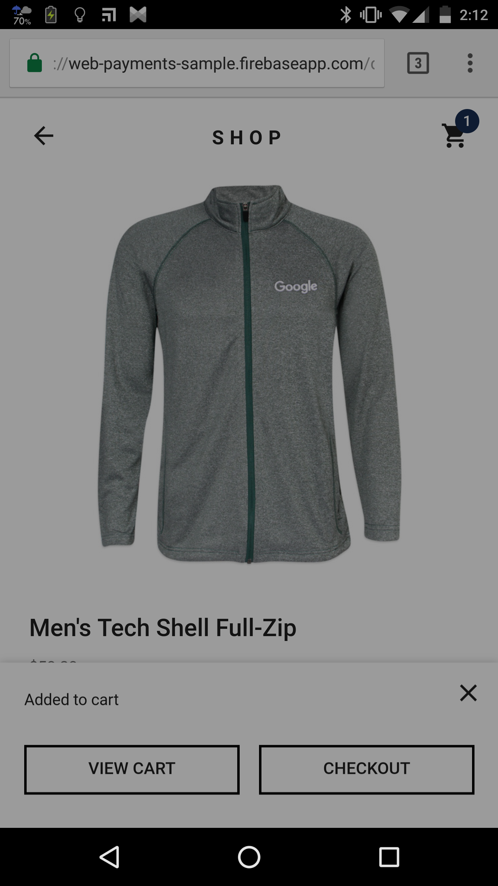
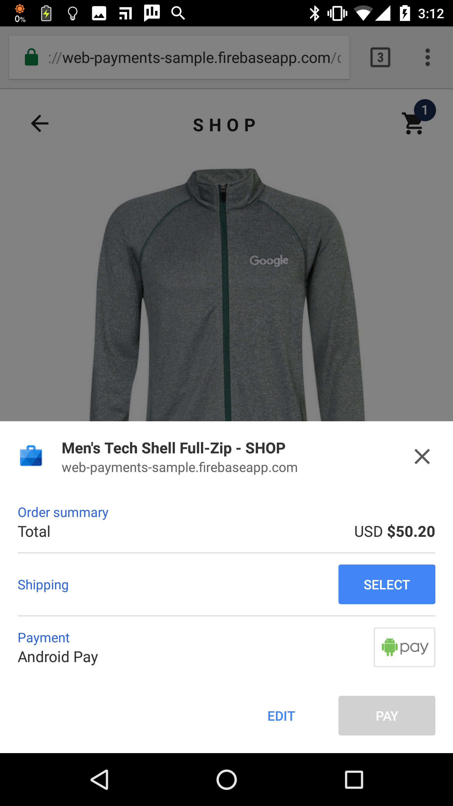
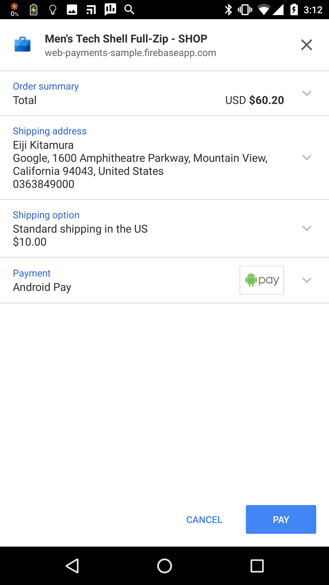
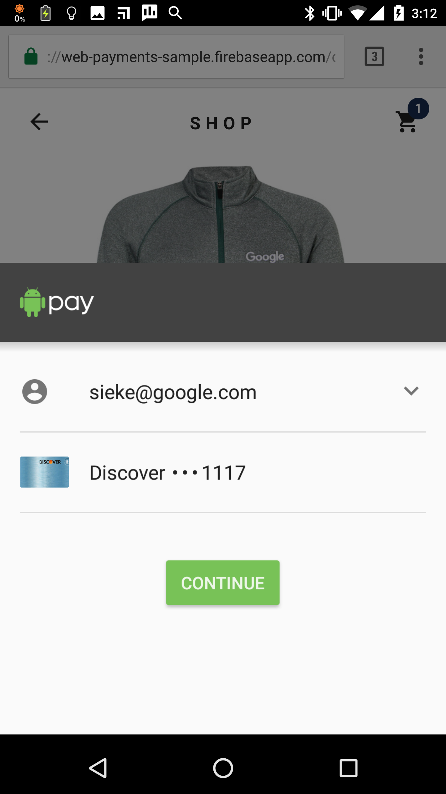
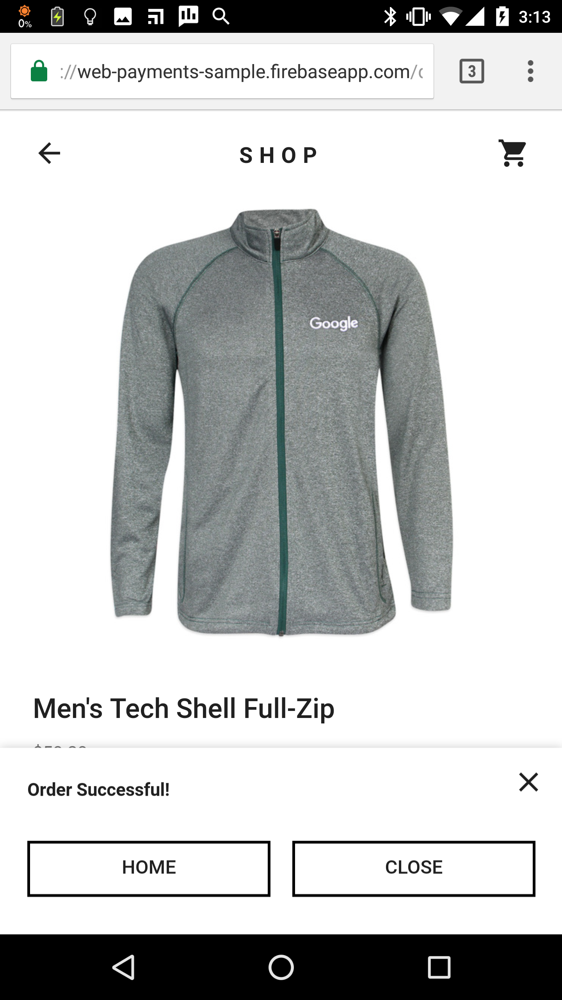
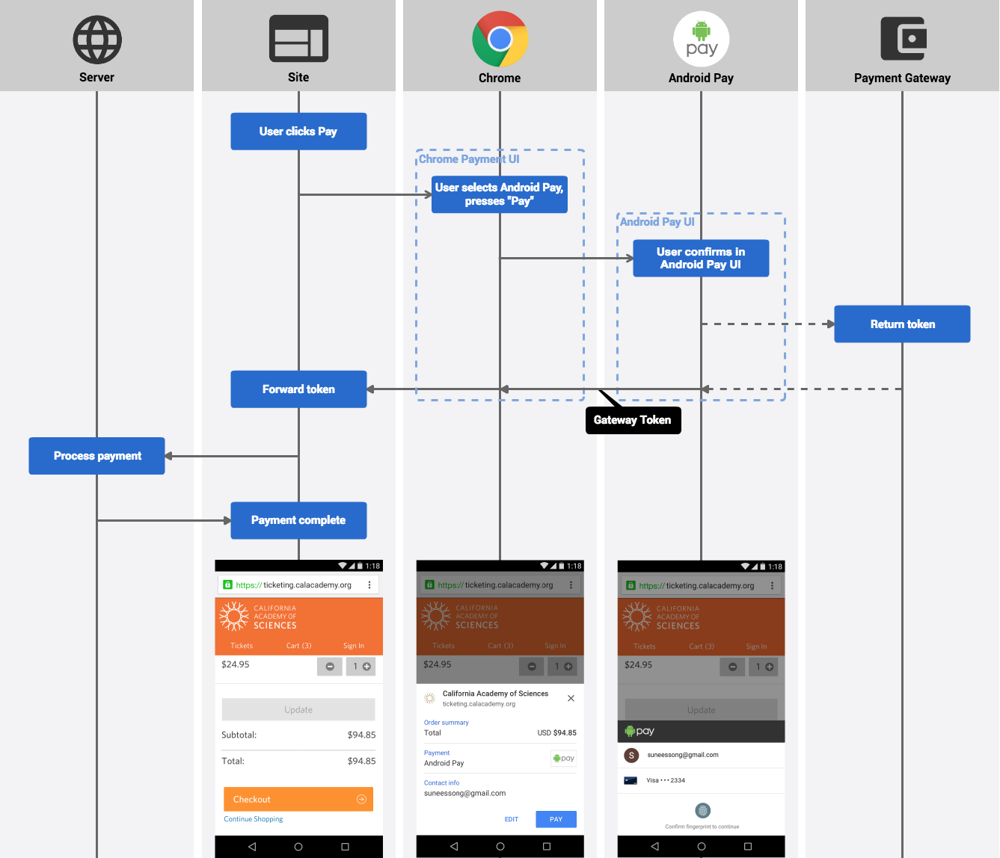
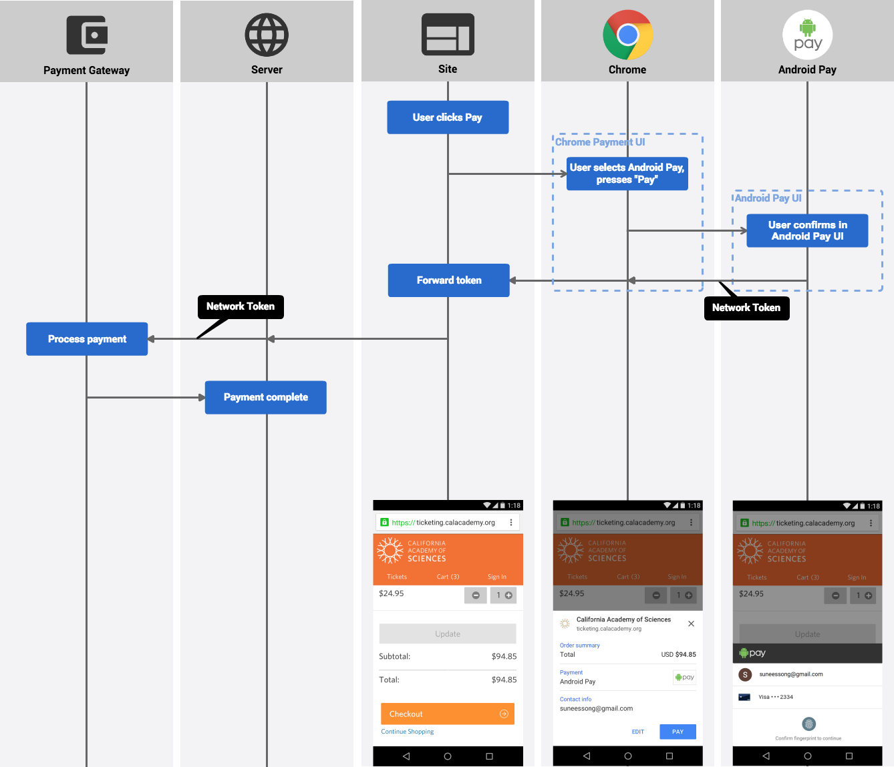

project_path: /web/_project.yaml
book_path: /web/fundamentals/_book.yaml
description: Android Pay enables simple and secure purchases online and eliminates the need for users to remember and manually enter their payment information. Integrate Android Pay to reach millions of Android users, drive higher conversion, and give users a true one-touch checkout experience.

{# wf_updated_on: 2016-12-06 #}
{# wf_published_on: 2016-09-07 #}

# Integrating Android Pay into Payment Request {: .page-title }




Android Pay enables simple and secure purchases online and eliminates the
need for users to remember and manually enter their payment information.
Integrate Android Pay to reach millions of Android users, drive higher
conversion, and give users a true one-touch checkout experience.

**Simple:** Accepting Android Pay is easy and requires no changes to your
payment processing. Leading
[payment gateways](/android-pay/) and
processing platforms are also adding support to make it even easier for
developers to enable Android Pay.

**Secure:** Android Pay works by securely storing a virtual account number
that maps to a user’s payment account.  This enables online purchases without
the user having to send their real credit or debit card number.  Android Pay
encrypts every payment transaction, keeping your user’s data safe.

**Support:** Android Pay is supported in a growing number of countries and by
a majority of major credit card networks and banks, and is available on all
Android Phones with KitKat and above. Please refer to this
[help center page](https://support.google.com/androidpay/answer/6314169) for
complete documentation on availability by country and card type.

## How it works

  <figure>
    
    <figcaption>1. Press "Checkout".</figcaption>
  </figure>
  <figure>
    
    <figcaption>2. Payment Request UI pops up.</figcaption>
  </figure>
  <figure>
    
    <figcaption>3. Choose payment method, etc., and press "Pay".</figcaption>
  </figure>
  <figure>
    
    <figcaption>4. When the Android Pay app pops up, click to continue (the user may be prompted to unlock phone / authenticate with fingerprint)</figcaption>
  </figure>
  <figure>
    
    <figcaption>5. Checkout is complete.</figcaption>
  </figure>

## Getting ready

### Required knowledge

* Because Android Pay in Chrome uses the PaymentRequest API, it is essential to familiarize yourself with the [integration guide](.) before continuing.
* Even if you are not an Android developer, it will be useful to acquaint yourself with the [Android Pay in-app APIs](/android-pay/android/tutorial). Because the responses returned by Android Pay are the same on Android and Chrome, the information on response handling is useful.
* Review the Android Pay detailed [content policies](https://support.google.com/payments/merchant/answer/75724?payments_to_biz=&rd=1) to make sure your specific goods or services are supported.

### Setting up the environment

* Make sure you have the Android Pay app installed on your device. You need to be in one of the supported countries to install it. Check on [android.com/pay](https://www.android.com/pay/){: .external } to see if your country is supported.
* For testing, you need to [add a credit card](https://support.google.com/androidpay/answer/6289372) to Android Pay on your device.
* Sign up for Android Pay
    * Add your company, site origin, and a company email etc. using [this form.](https://androidpay.developers.google.com/signup)
* Ensure that [your payment gateway / processor supports Android Pay tokens](/android-pay/#processors).
* Acquire a key-pair used to encrypt the response from Android Pay if you are using [the network token approach](#integration-using-network-token).
    * Google recommends that you work with your payment processor to obtain a public key. This simplifies the process as your processor will be able to handle decryption of the Android Pay Payload. Find more information at your payment processor documentation.
    * If you want to handle encryption yourself, please refer to [Payment Token Cryptography](/android-pay/integration/payment-token-cryptography) for generating a base64 encoded Elliptic Curve Integrated Encryption key.

## Integrating Android Pay into Payment Request
With Android Pay for Payment Request API, you may request one of two payment token types: gateway or network. If you are using Braintree, Stripe, or Vantiv as your payment gateway, then you may request a gateway token from Android Pay. Otherwise, you may request an encrypted network token bundle. You may either handle the network token yourself or work with your processor to handle decrypting the token bundle.

### Gateway Token approach
Android Pay does not process the payment. The merchant would still need to invoke gateway APIs to charge/process the gateway token returned from Android Pay.

Let Android Pay API return a gateway token. This is the recommended flow if you are using Braintree, Stripe, or Vantiv.

### Network Token approach
Let Android Pay API return an encrypted network token bundle. You may then either decrypt the token yourself or leverage your processor APIs to handle decryption and charge the token.

## Integration using Gateway Token
The following example outlines how to request a token directly from your payment gateway. In this example we outline how to request a Stripe token. If you use other payment gateways such as Braintree or Vantiv please contact your processor for for payment gateway specific parameters.

In requesting a gateway token, Android Pay makes a call to your processor on your behalf and returns a chargeable gateway token.

#### Parameters

    var supportedInstruments = [
      {
        supportedMethods: ['amex', 'discover','mastercard','visa']
      },
      {
        supportedMethods: ['https://android.com/pay'],
        data: {
          //merchant ID obtained from Google that maps to your origin
          merchantId: '02510116604241796260',
          environment: 'TEST',
          // Credit Cards allowed via Android Pay
          allowedCardNetworks: ['AMEX', 'MASTERCARD', 'VISA', 'DISCOVER'],
          paymentMethodTokenizationParameters: {
            tokenizationType: 'GATEWAY_TOKEN',
            parameters: {
              'gateway': 'stripe',
              // Place your own Stripe publishable key here.
              'stripe:publishableKey': 'pk_live_fD7ggZCtrB0vJNApRX5TyJ9T',
              'stripe:version': '2016-07-06'
            }
          }
        }
      }
    ];

In order to use Android Pay with the gateway token approach, add a JSON object that contains the following parameters per the above example.

* `supportedMethods: [ 'https://android.com/pay' ]`: Indicate this is a payment method using Android Pay.
* `data`: These are Android Pay specific values which are not yet standardized.
    * `merchantId`: The Android Pay Merchant ID you obtained by [signing up to Android Pay](https://androidpay.developers.google.com/signup).
    * `environment:'TEST'`: Add this if you are testing with Android Pay. The generated gateway token will be invalid.
    * `allowedCardNetworks`: Provide an array of credit card networks that constitute a valid Android Pay response. It accepts "AMEX", "DISCOVER", "MASTERCARD" and "VISA".
    * `paymentMethodTokenizationParameters`:
        * `tokenizationType`: 'GATEWAY_TOKEN': Indicates you are taking the gateway token approach.
        * `parameters`: Payment gateway specific parameters. Refer to specific payment gateway documentation.

#### Handling the Android Pay response
After you add the Android Pay object, Chrome can request a chargeable gateway token.

    var payment = new PaymentRequest(
      supportedInstruments, // required payment method data
      details,              // required information about transaction
      options               // optional parameter for things like shipping, etc.
    );

    payment.show().then(function(response) {
      // Process response
      response.complete("success");
    }).catch(function(err) {
      console.error("Uh oh, something bad happened", err.message);
    });

The response from PaymentRequest will contain the shipping and contact information as in the examples outlined in the [PaymentRequest integration guide](.), but now includes an additional response from Android Pay containing

* Billing address information
* Contact information
* Information about the payment instrument
* Details about the payment token

How you handle a submitted gateway token depends on the payment gateway. Please refer to the specific gateway's documentation for more details.

#### Putting it all together

    function onBuyClicked() {
      const ANDROID_PAY = 'https://android.com/pay';

      if (!window.PaymentRequest) {
        // PaymentRequest API is not available. Forwarding to
        // legacy form based experience.
        location.href = '/checkout';
        return;
      }

      var supportedInstruments = [
        {
          supportedMethods: [
            'visa', 'mastercard', 'amex', 'discover', 'maestro',
            'diners', 'jcb', 'unionpay', 'bitcoin'
          ]
        },
        {
          supportedMethods: [ ANDROID_PAY ],
          data: {
            merchantId: '02510116604241796260',
            environment: 'TEST',
            allowedCardNetwork: [ 'AMEX', 'MASTERCARD', 'VISA', 'DISCOVER' ],
            paymentMethodTokenizationParameters: {
              tokenizationType: 'GATEWAY_TOKEN',
              parameters: {
                'gateway': 'stripe',
                'stripe:publishableKey': 'pk_live_fD7ggZCtrB0vJNApRX5TyJ9T',
                'stripe:version': '2016-07-06'
              }
            }
          }
        }
      ];

      var details = {
        displayItems: [{
          label: 'Original donation amount',
          amount: { currency: 'USD', value: '65.00' }
        }, {
          label: 'Friends and family discount',
          amount: { currency: 'USD', value: '-10.00' }
        }],
        total: {
          label: 'Total due',
          amount: { currency: 'USD', value : '55.00' }
        }
      };

      var options = {
        requestShipping: true,
        requestPayerEmail: true,
        requestPayerPhone: true,
        requestPayerName: true
      };

      // Initialization
      var request = new PaymentRequest(supportedInstruments, details, options);

      // When user selects a shipping address
      request.addEventListener('shippingaddresschange', e => {
        e.updateWith(((details, addr) => {
          var shippingOption = {
            id: '',
            label: '',
            amount: { currency: 'USD', value: '0.00' },
            selected: true
          };
          // Shipping to US is supported
          if (addr.country === 'US') {
            shippingOption.id = 'us';
            shippingOption.label = 'Standard shipping in US';
            shippingOption.amount.value = '0.00';
            details.total.amount.value = '55.00';
          // Shipping to JP is supported
          } else if (addr.country === 'JP') {
            shippingOption.id = 'jp';
            shippingOption.label = 'International shipping';
            shippingOption.amount.value = '10.00';
            details.total.amount.value = '65.00';
          // Shipping to elsewhere is unsupported
          } else {
            // Empty array indicates rejection of the address
            details.shippingOptions = [];
            return Promise.resolve(details);
          }
          // Hardcode for simplicity
          if (details.displayItems.length === 2) {
            details.displayItems[2] = shippingOption;
          } else {
            details.displayItems.push(shippingOption);
          }
          details.shippingOptions = [shippingOption];

          return Promise.resolve(details);
        })(details, request.shippingAddress));
      });

      // When user selects a shipping option
      request.addEventListener('shippingoptionchange', e => {
        e.updateWith(((details) => {
          // There should be only one option. Do nothing.
          return Promise.resolve(details);
        })(details));
      });

      // Show UI then continue with user payment info
      request.show().then(result => {
        // POST the result to the server
        return fetch('/pay', {
          method: 'POST',
          credentials: 'include',
          headers: {
            'Content-Type': 'application/json'
          },
          body: JSON.stringify(result.toJSON())
        }).then(res => {
          // Only if successful
          if (res.status === 200) {
            return res.json();
          } else {
            throw 'Failure';
          }
        }).then(response => {
          // You should have received a JSON object
          if (response.success == true) {
            return result.complete('success');
          } else {
            return result.complete('fail');
          }
        }).then(() => {
          console.log('Thank you!',
              result.shippingAddress.toJSON(),
              result.methodName,
              result.details.toJSON());
        }).catch(() => {
          return result.complete('fail');
        });
      }).catch(function(err) {
        console.error('Uh oh, something bad happened: ' + err.message);
      });
    }

    document.querySelector('#start').addEventListener('click', onBuyClicked);

### Integration using Network Token
Requesting a network token requires two pieces of information to be included in the PaymentRequest.

1. `merchantId` obtained at registration
1. `publicKey` passed as part of `paymentMethodTokenizationParameters`

#### Parameters

    var supportedInstruments = [
      {
        supportedMethods: ['amex', 'discover','mastercard','visa']
      },
      {
        supportedMethods: ['https://android.com/pay'],
        data: {
          //merchant ID obtained from Google that maps to your origin
          merchantId: '02510116604241796260',
          environment: 'TEST',
          allowedCardNetworks: ['AMEX', 'MASTERCARD', 'VISA', 'DISCOVER'],
          paymentMethodTokenizationParameters: {
            tokenizationType: 'NETWORK_TOKEN',
            parameters: {
              //public key to encrypt response from Android Pay
              'publicKey': 'BC9u7amr4kFD8qsdxnEfWV7RPDR9v4gLLkx3jfyaGOvxBoEuLZKE0Tt5O/2jMMxJ9axHpAZD2Jhi4E74nqxr944='
            }
          }
        }
      }
    ];

In order to use Android Pay with the network token approach, add a JSON object that contains the following parameters per the above example.

* `supportedMethods: [ 'https://android.com/pay' ]`: Indicate this is a payment method using Android Pay.
* `data`:
    * `merchantId`: The Android Pay Merchant ID you obtained by [signing up to Android Pay](https://androidpay.developers.google.com/signup).
    * `environment:'TEST'`: Add this if you are testing with Android Pay. The generated token will be invalid.  For production environment, remove this line.
    * `allowedCardNetworks`: Provide an array of credit card networks that constitute a valid Android Pay response.
    * `paymentMethodTokenizationParameters`:
        * `tokenizationType: 'NETWORK_TOKEN'`: Indicates you are taking the network token approach.
        * `parameters`: Public key required to receive a network token. (See [How to generate encryption keys](/android-pay/integration/gateway-processor-integration#retrieving-the-encrypted-payload).)

#### Handling the Android Pay response
After you add the Android Pay object, Chrome can request a chargeable network token.

    var payment = new PaymentRequest(
      supportedInstruments, // required payment method data
      details,              // required information about transaction
      options               // optional parameter for things like shipping, etc.
    );

    payment.show().then(function(response) {
      // Process response
      response.complete("success");
    }).catch(function(err) {
      console.error("Uh oh, something bad happened", err.message);
    });

The encrypted response from PaymentRequest will contain the shipping and contact information as in the examples outlined in the [PaymentRequest integration guide](.), but now includes an additional response from Android Pay containing

* A tokenized credit card information
* Billing address information
* Information about the payment instrument
* Details about the payment token

For a simpler integration of network tokens, we recommend passing the encrypted payload directly to your payment gateway and allowing them to handle decryption.  Decrypting the payload yourself is more complex and involves private key management.  Please contact your payment gateway to see if this functionality is available.

How you handle a submitted network token depends on the payment gateway. Please refer to the specific gateway's documentation for more details.

A code example is omitted here, as there is no difference with the gateway token approach except in constructing the PaymentRequest object.
