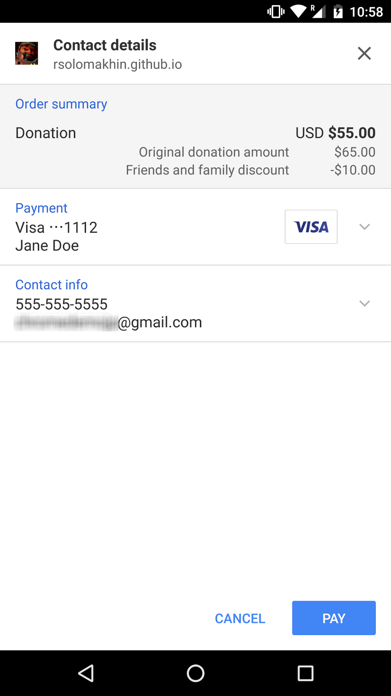
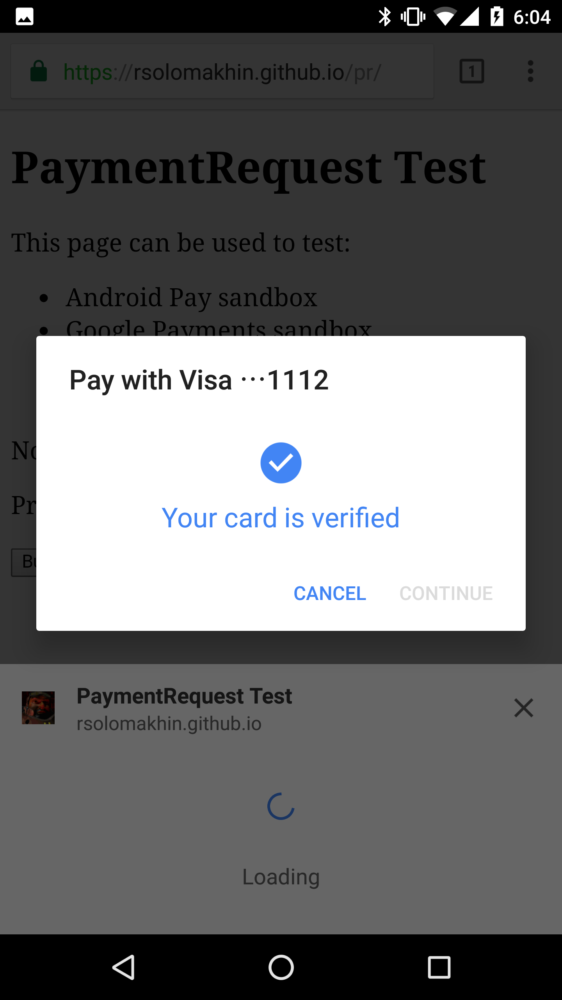
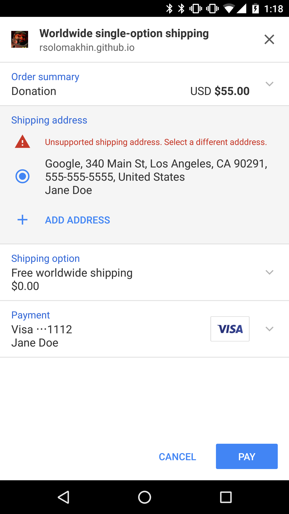

project_path: /web/_project.yaml
book_path: /web/fundamentals/_book.yaml
description: Payment Request API is for fast, easy payments on the web.

{# wf_published_on: 2016-07-25 #}
{# wf_updated_on: 2016-12-06 #}

# Payment Request API: an Integration Guide {: .page-title }





Dogfood: `PaymentRequest` is still in development. While we think it's stable
enough to implement, it may continue to change. We'll keep this page updated to
always reflect the current status of the API([M56 changes](https://docs.google.com/document/d/1I8ha1ySrPWhx80EB4CVPmThkD4ILFM017AfOA5gEFg4/edit#)).
Meanwhile, to protect yourself from API changes that may be backwards
incompatible, we're offering [a shim](https://storage.googleapis.com/prshim/v1/payment-shim.js)
that can be embedded on your site. The shim will paper over any API
differences for two major Chrome versions.

Buying goods online is a convenient but often frustrating experience, particularly on mobile devices. Although mobile traffic continues to increase, mobile conversions account for only about a third of all completed purchases. In other words, users abandon mobile purchases twice as often as desktop purchases. Why?

*Why users abandon mobile purchase forms*

Online purchase forms are user-intensive, difficult to use, slow to load and refresh, and require multiple steps to complete. This is because two primary components of online payments&mdash;security and convenience&mdash;often work at cross-purposes; more of one typically means less of the other.

Most of the problems that lead to abandonment can be directly traced to purchase forms. Each app or site has its own data entry and validation process, and users often find they must enter the same information at every app's purchase point. Also, application developers struggle to create purchase flows that support multiple unique payment methods; even small differences in payment method requirements can complicate the form completion and submission process.

Any system that improves or solves one or more of those problems is a welcome change. We started solving the problem already with [Autofill](/web/updates/2015/06/checkout-faster-with-autofill), but now we'd like to talk about a more comprehensive solution.

## Introducing the Payment Request API {: #introducing }

The Payment Request API is a system that is meant to *eliminate checkout forms*. It vastly improves user workflow during the purchase process, providing a more consistent user experience and enabling web merchants to easily leverage disparate payment methods. The Payment Request API is not a new payment method, nor does it integrate directly with payment processors; rather, it is a process layer whose goals are:

* To let the browser act as intermediary among merchants, users, and payment methods
* To standardize the payment communication flow as much as possible
* To seamlessly support different secure payment methods
* To work on any browser, device, or platform&mdash;mobile or otherwise

The Payment Request API is an open and cross-browser standard that replaces traditional checkout flows by allowing merchants to request and accept any payment in a single API call. The Payment Request API allows the web page to exchange information with the user agent while the user is providing input, before approving or denying a payment request.

Best of all, with the browser acting as an intermediary, all the information necessary for a fast checkout can be stored in the browser, so users can just confirm and pay, all with a single click.

### Payment transaction process {: #transaction-process }
Using the Payment Request API, the transaction process is made as seamless as possible for both users and merchants.

*The payment transaction process*

The process begins when the merchant site creates a new `PaymentRequest` and passes to the browser all the information required to make the purchase: the amount to be charged, what currency they expect payment in, and what payment methods are accepted by the site. The browser determines compatibility between the accepted payment methods for the site and the methods the user has installed on the target device.

  <figure>
    
    <figcaption>Payment Request Interface</figcaption>
  </figure>

The browser then presents the payments UI to the user, who selects a payment method and authorizes the transaction. A payment method can be as straightforward as a credit card that is already stored by the browser, or as esoteric as third-party application written specifically to deliver payments to the site (this functionality is coming soon). After the user authorizes the transaction, all the necessary payment details are sent directly back to the site. For example, for a credit card payment, the site will get back a card number, a cardholder name, an expiration date, and a CVC.

Payment Request can also be extended to return additional information, such as shipping addresses and options, payer email, and payer phone. This allows you to get all the information you need to finalize a payment without ever showing the user a checkout form.

The beauty of the new process is threefold: from the user's perspective, all the previously tedious interaction&mdash;request, authorization, payment, and result&mdash;now takes place in a single step; from the website's perspective, it requires only a single JavaScript API call; from the payment method's perspective, there is no process change whatsoever.

## Using the Payment Request API {: #using }

### Load Payment Request API shim

To mitigate pains of catching up with this living standard API, we strongly
recommend you to add this shim in `<head>` section of your code. This shim
will be updated as API changes and will do its best to keep your code working
at least 2 major releases of Chrome.

    <script src="https://storage.googleapis.com/prshim/v1/payment-shim.js">

### Create a PaymentRequest {: #create-paymentrequest }

The first step is to create a [`PaymentRequest`](https://www.w3.org/TR/payment-request/#paymentrequest-interface) object by calling the [`PaymentRequest`](https://www.w3.org/TR/payment-request/#paymentrequest-constructor) constructor. This step is typically (but not always) associated with a user-initiated action indicating their intent to make a purchase. The object is constructed using parameters that contain required data.

    var request = new PaymentRequest(
      methodData, // required payment method data
      details,    // required information about transaction
      options     // optional parameter for things like shipping, etc.
    );

*PaymentRequest constructor*

#### The methodData parameter {: #methoddata-parameter }

The `methodData` parameter contains a list of supported payment methods and, if relevant, additional information about the payment method. This sequence contains `PaymentMethodData` dictionaries, including standard identifiers that are associated with the payment methods the app intends to accept, and any payment method-specific data. See [Payment Request API Architecture](https://w3c.github.io/browser-payment-api/specs/architecture.html) for more details.

Right now, `PaymentRequest` in Chrome only supports the following standard credit cards: '`amex`', '`diners`', '`discover`', '`jcb`', '`maestro`', '`mastercard`', '`unionpay`', and '`visa`'.

    var methodData = [
      {
        supportedMethods: ["visa", "mastercard"]
      }
    ]

*Payment methods and data*

#### The details parameter {: #details-parameter }

The `details` parameter contains information about the transaction. There are two major components: a total, which reflects the total amount and currency to be charged, and an optional set of `displayItems` that indicate how the final amount was calculated. This parameter is not intended to be a line-item list, but is rather a summary of the order's major components: subtotal, discounts, tax, shipping costs, etc.

  <figure>
    
    <figcaption>Payment Request Interface</figcaption>
  </figure>

It is important to note that the Payment Request API does not do arithmetic. That is, it does not and cannot ensure that the display components correctly sum to the total amount due. These calculations are the developer's responsibility. So you should always ensure that the list items sum to the same amount in the total. Also, `PaymentRequest` doesn't support refunds, so the amounts should always be positive (but individual list items can be negative, such as discounts).

The browser will render the labels as you define them and automatically render the correct currency formatting based on the user's locale. Note that the labels should be rendered in the same language as your content.

    var details = {
      displayItems: [
        {
          label: "Original donation amount",
          amount: {
            currency: "USD",
            value : "65.00",
            // ISO4217 is default. You can ommit.
            currencySystem: "urn:iso:std:iso:4217"
          },
        },
        {
          label: "Friends and family discount",
          amount: { currency: "USD", value : "-10.00" }, // -US$10.00
          pending: true // The price is not determined yet
        }
      ],
      total:  {
        label: "Total",
        amount: { currency: "USD", value : "55.00" }, // US$55.00
      }
    }

*Transaction details*

`pending` is commonly used to show items such as shipping or tax amounts that depend upon selection of shipping address or shipping option. Chrome indicates pending fields in the UI for the payment request.

Repeated or calculated values used in the `details` can be specified either as string literals or as individual string variables.

    var currency = "USD";
    var amount = "65.00";
    var discount = "-10.00";
    var total = "55.00";

*PaymentRequest variables*

### Display the PaymentRequest {: #display-paymentrequest }

  <figure>
    
    <figcaption>Payment Request Interface</figcaption>
  </figure>

Activate the `PaymentRequest` interface by calling its [`show()`](https://www.w3.org/TR/payment-request/#show) method. This method invokes a native UI that allows the user to examine the details of the purchase, add or change information, and finally, pay. A [`Promise`](https://developer.mozilla.org/en-US/docs/Web/JavaScript/Reference/Global_Objects/Promise) (indicated by its `then()` method and callback function) that resolves will be returned when the user accepts or rejects the payment request.

    payment.show().then(function(paymentResponse) {
      // Process paymentResponse here
      paymentResponse.complete("success");
    }).catch(function(err) {
      console.error("Uh oh, something bad happened", err.message);
    });

*PaymentRequest show method*

### Abort a Payment Request {: #abort-paymentrequest }
You can intentionally abort a `PaymentRequest` by calling its [`abort()`](https://www.w3.org/TR/payment-request/#abort) method. This is particulary useful when the shopping session is timed out or an item in the cart sells out during the transaction.

Use this method if the app needs to cancel the payment request after the `show()` method has been called but before the promise has been resolved &mdash; For example, if an item is no longer available, or the user fails to confirm the purchase within an allotted amount of time.

If you abort a request, you'll need to create a new instance of `PaymentRequest` before you can call `show()` again.

    var paymentTimeout = window.setTimeout(function() {
      window.clearTimeout(paymentTimeout);
      payment.abort().then(function() {
        console.log('Payment timed out after 20 minutes.');
      }).catch(function() {
        console.log('Unable to abort.');
      });
    }, 20 * 60 * 1000);  /* 20 minutes */

*PaymentRequest abort method*

### Process the PaymentResponse {: # process-paymentresponse}
Upon a user approval for a payment request, the [`show()`](https://www.w3.org/TR/payment-request/#show) method's promise resolves, resulting in a `PaymentResponse` object.

<table class="properties responsive">
<tr>
  <th colspan="2"><code>PaymentResponse</code> has the following fields:</th>
</tr>
<tr>
  <td><code>methodName</code></td>
  <td>A string indicating what the chosen payment method is (e.g., visa)</td>
</tr>
<tr>
  <td><code>details</code></td>
  <td>A dictionary containing information for <code>methodName</code></td>
</tr>
<tr>
  <td><code>shippingAddress</code></td>
  <td>The shipping address of the user, if requested</td>
</tr>
<tr>
  <td><code>shippingOption</code></td>
  <td>The ID of the selected shipping option, if requested</td>
</tr>
<tr>
  <td><code>payerEmail</code></td>
  <td>The email address of the payer, if requested</td>
</tr>
<tr>
  <td><code>payerPhone</code></td>
  <td>The phone number of the payer, if requested</td>
</tr>
<tr>
  <td><code>payerName</code></td>
  <td>The name of the payer, if requested</td>
</tr>
</table>

For credit card payments, the response is standardized. For non-credit card payments (e.g., Android Pay), the response will be documented by the provider. A credit card response contains the following dictionary:

`cardholderName`
`cardNumber`
`expiryMonth`
`expiryYear`
`cardSecurityCode`
`billingAddress`

After payment information is received, the app should submit the payment information to your payment processor for processing. The UI will show a spinner while the request takes place. When a response has come back, the app should call `complete()` to close the UI.

    payment.show().then(paymentResponse => {
      var paymentData = {
        // payment method string, e.g. “visa”
        method: paymentResponse.methodName,
        // payment details as you requested
        details: paymentResponse.details
      };
      return fetch('/pay', {
        method: 'POST',
        credentials: 'include',
        headers: {
          'Content-Type': 'application/json'
        },
        body: JSON.stringify(paymentData)
      }).then(res => {
        if (res.status === 200) {
          return res.json();
        } else {
          throw 'Payment Error';
        }
      }).then(res => {
        paymentResponse.complete("success");
      }, err => {
        paymentResponse.complete("fail");
      });
    }).catch(err => {
      console.error("Uh oh, something bad happened", err.message);
    });

  <figure>
    
    <figcaption>Payment Request Interface</figcaption>
  </figure>

The [`complete()`](https://www.w3.org/TR/payment-request/#complete) method tells the user agent that the user interaction is over and allows the app to notify the user of the result and to address the disposition of any remaining UI elements.

    paymentResponse.complete('success').then(() => {
      // Success UI
    }

    paymentResponse.complete('fail').then(() => {
      // Error UI
    };

*PaymentRequest complete method*

## Collecting a shipping address {: #shipping-address }

  <figure>
    
    <figcaption>Payment Request Interface</figcaption>
  </figure>

If you are a merchant selling physical goods, you may want to collect the user's shipping address using the Payment Request API. This is accomplished by adding `requestShipping: true` to the `options` parameter. With this parameter set, "Shipping" will be added to the UI, and users can select from a list of stored addresses or add a new shipping address.

You can alternatively use "Delivery" or "Pickup" instead of "Shipping" in the UI by specifying `shippingType`. This is solely for display purposes.

Note: <code><a href="https://www.w3.org/TR/payment-request/#paymentdetails-dictionary" target="_blank">details</a>.shippingOptions</code> need to be <code>undefined</code> or an empty array upon initialization in order to receive <code>shippingaddresschange</code> event. Otherwise, the event won't be fired.

    var options = {
      requestShipping: true,
      shippingType: "shipping" // "shipping"(default), "delivery" or "pickup"
    };

    var request = new PaymentRequest(methodData, details, options);

*Transaction options*

  <figure>
    
    <figcaption>Payment Request Interface</figcaption>
  </figure>

Shipping options can be dynamically calculated whenever a user selects or adds a new shipping address. You can add an event listener for the `shippingaddresschange` event, which fires on user selection of a shipping address. You can then validate the ability to ship to that address, calculate shipping options, and update your [`details`](https://www.w3.org/TR/payment-request/#paymentdetails-dictionary)`.shippingOptions` with the new shipping options and pricing information. You can offer a default shipping option by setting `selected` to `true` on an option.

In order to reject an address for reasons such as non-supported region, pass `details.shippingOptions` an empty array. The UI will tell the user that the selected address is not available for shipping.

Note: Resolving <code>shippingaddresschange</code> event and leaving <code>details.shippingOptions</code> as an empty array also means address rejection (in other words you cannot ship to that location). Always make sure your shipping options are up-to-date and match whatever address the user provided.

    payment.addEventListener('shippingaddresschange', e => {
      e.updateWith(((details, addr) => {
        if (addr.country === 'US') {
          var shippingOption = {
            id: '',
            label: '',
            amount: {currency: 'USD', value: '0.00'},
            selected: true
          };
          if (addr.region === 'US') {
            shippingOption.id = 'us';
            shippingOption.label = 'Standard shipping in US';
            shippingOption.amount.value = '0.00';
            details.total.amount.value = '55.00';
          } else {
            shippingOption.id = 'others';
            shippingOption.label = 'International shipping';
            shippingOption.amount.value = '10.00';
            details.total.amount.value = '65.00';
          }
          if (details.displayItems.length === 2) {
            details.displayItems.splice(1, 0, shippingOption);
          } else {
            details.displayItems.splice(1, 1, shippingOption);
          }
          details.shippingOptions = [shippingOption];
        } else {
          details.shippingOptions = [];
        }
        return Promise.resolve(details);
      })(details, request.shippingAddress));
    });

  <figure>
    
    <figcaption>Payment Request Interface</figcaption>
  </figure>

Upon user approval for a payment request, the [`show()`](https://www.w3.org/TR/payment-request/#show) method's promise resolves. The app may use the `.shippingAddress` property of the [`PaymentResponse`](https://www.w3.org/TR/payment-request/#paymentresponse-interface) object to inform the payment processor of the shipping address, along with other properties.

    payment.show().then(paymentResponse => {
      var paymentData = {
        // payment method string
        method: paymentResponse.methodName,
        // payment details as you requested
        details: paymentResponse.details.toJSON(),
        // shipping address information
        address: paymentResponse.shippingAddress.toJSON()
      };
      // Send information to the server
    });

## Adding shipping options {: #shipping-options}
If your service allows users to select shipping options such as "free", "standard", or "express", you can also do that through Payment Request UI. To offer such choices, add the  [`shippingOptions`](https://www.w3.org/TR/payment-request/#paymentshippingoption-dictionary) property and its options to the `details` object. By setting one choice to `selected: true`, the UI will render it as pre-selected (which means your total amount should reflect the price for that shipping option).

    var details = {
      total: {label: 'Donation', amount: {currency: 'USD', value: '55.00'}},
      displayItems: [
        {
          label: 'Original donation amount',
          amount: {currency: 'USD', value: '65.00'}
        },
        {
          label: 'Friends and family discount',
          amount: {currency: 'USD', value: '-10.00'}
        }
      ],
      shippingOptions: [
        {
          id: 'standard',
          label: 'Standard shipping',
          amount: {currency: 'USD', value: '0.00'},
          selected: true
        },
        {
          id: 'express',
          label: 'Express shipping',
          amount: {currency: 'USD', value: '12.00'}
        }
      ]
    };
    var request = new PaymentRequest(methodData, details, options);

Note: As noted earlier, <code><a href="https://www.w3.org/TR/payment-request/#paymentdetails-dictionary" target="_blank">details</a>.shippingOptions</code> need to be <code>undefined</code> or an empty array upon initialization in order to receive <code>shippingaddresschange</code> event. Set this value on initialization only when shipping options won't change based on address (such as global free shipping).

Changing shipping options may have different prices. In order to add the shipping fee and change the total price, you may add an event listener for the `shippingoptionchange` event, which fires on user selection of a shipping option, so that you can run a programmatic examination of the option data. You may change the shipping fee depending on the shipping address as well.

    payment.addEventListener('shippingoptionchange', e => {
      e.updateWith(((details, shippingOption) => {
        var selectedShippingOption;
        var otherShippingOption;
        if (shippingOption === 'standard') {
          selectedShippingOption = details.shippingOptions[0];
          otherShippingOption = details.shippingOptions[1];
          details.total.amount.value = '55.00';
        } else {
          selectedShippingOption = details.shippingOptions[1];
          otherShippingOption = details.shippingOptions[0];
          details.total.amount.value = '67.00';
        }
        if (details.displayItems.length === 2) {
          details.displayItems.splice(1, 0, selectedShippingOption);
        } else {
          details.displayItems.splice(1, 1, selectedShippingOption);
        }
        selectedShippingOption.selected = true;
        otherShippingOption.selected = false;
        return Promise.resolve(details);
      })(details, request.shippingOption));
    });

  <figure>
    
    <figcaption>Payment Request Interface</figcaption>
  </figure>

Upon user approval for a payment request, the [`show()`](https://www.w3.org/TR/payment-request/#show) method's promise resolves. The app may use the `.shippingOption` property of the [`PaymentResponse`](https://www.w3.org/TR/payment-request/#paymentresponse-interface) object to inform the payment processor of the shipping option, along with other properties.

    payment.show().then(paymentResponse => {
      var paymentData = {
        // payment method string
        method: paymentResponse.methodName,
        // payment details as you requested
        details: paymentResponse.details.toJSON(),
        // shipping address information
        address: paymentResponse.shippingAddress.toJSON(),
        // shipping option
        shippingOption: paymentResponse.shippingOption
      };
      // Send information to the server
    });

## Adding optional contact information {: #contact-information}
You can also collect a user's email address, phone number or name by configuring the `options` object.

    var options = {
      requestPayerPhone: true,  // Request user's phone number
      requestPayerEmail: true,  // Request user's email address
      requestPayerName:  true   // Request user's name
    };

    var request = new PaymentRequest(methodData, details, options);

  <figure>
    
    <figcaption>Payment Request Interface</figcaption>
  </figure>

Upon user approval for a payment request, the [`show()`](https://www.w3.org/TR/payment-request/#show) method's promise resolves. The app may use the `.payerPhone`, `.payerEmail` and/or `.payerName` properties of the [`PaymentResponse`](https://www.w3.org/TR/payment-request/#paymentresponse-interface) object to inform the payment processor of the user choice, along with other properties.

    payment.show().then(paymentResponse => {
      var paymentData = {
        // payment method string
        method: paymentResponse.methodName,
        // payment details as you requested
        details: paymentResponse.details.toJSON(),
        // shipping address information
        address: paymentResponse.shippingAddress.toJSON(),
        // shipping option string
        shippingOption: paymentResponse.shippingOption,
        // payer's phone number string
        phone: paymentResponse.payerPhone,
        // payer's email address string
        email: paymentResponse.payerEmail,
        // payer's name string
        name: paymentResponse.payerName
      };
      // Send information to the server
    });

## Making PaymentRequest a progressive enhancement {: #request-progressive}
As Payment Request API is an emerging feature, many browsers don't yet support it. To determine whether the feature is available, query `window.PaymentRequest`.

    if (window.PaymentRequest) {
      // PaymentRequest supported
      // Continue with PaymentRequest API
    } else {
      // PaymentRequest NOT supported
      // Continue with existing form based solution
    }

## Putting them all together {: #putting-them-together}

    function onBuyClicked() {
      if (!window.PaymentRequest) {
        // PaymentRequest API is not available. Forwarding to
        // legacy form based experience.
        location.href = '/checkout';
        return;
      }

      var supportedInstruments = [{
        supportedMethods: [
          'visa', 'mastercard', 'amex', 'discover', 'maestro',
          'diners', 'jcb', 'unionpay', 'bitcoin'
        ]
      }];

      var details = {
        displayItems: [{
          label: 'Original donation amount',
          amount: { currency: 'USD', value: '65.00' }
        }, {
          label: 'Friends and family discount',
          amount: { currency: 'USD', value: '-10.00' }
        }],
        total: {
          label: 'Total due',
          amount: { currency: 'USD', value : '55.00' }
        }
      };

      var options = {
        requestShipping: true,
        requestPayerEmail: true,
        requestPayerPhone: true,
        requestPayerName: true
      };

      // Initialization
      var request = new PaymentRequest(supportedInstruments, details, options);

      // When user selects a shipping address
      request.addEventListener('shippingaddresschange', e => {
        e.updateWith(((details, addr) => {
          var shippingOption = {
            id: '',
            label: '',
            amount: { currency: 'USD', value: '0.00' },
            selected: true
          };
          // Shipping to US is supported
          if (addr.country === 'US') {
            shippingOption.id = 'us';
            shippingOption.label = 'Standard shipping in US';
            shippingOption.amount.value = '0.00';
            details.total.amount.value = '55.00';
          // Shipping to JP is supported
          } else if (addr.country === 'JP') {
            shippingOption.id = 'jp';
            shippingOption.label = 'International shipping';
            shippingOption.amount.value = '10.00';
            details.total.amount.value = '65.00';
          // Shipping to elsewhere is unsupported
          } else {
            // Empty array indicates rejection of the address
            details.shippingOptions = [];
            return Promise.resolve(details);
          }
          // Hardcode for simplicity
          if (details.displayItems.length === 2) {
            details.displayItems[2] = shippingOption;
          } else {
            details.displayItems.push(shippingOption);
          }
          details.shippingOptions = [shippingOption];

          return Promise.resolve(details);
        })(details, request.shippingAddress));
      });

      // When user selects a shipping option
      request.addEventListener('shippingoptionchange', e => {
        e.updateWith(((details) => {
          // There should be only one option. Do nothing.
          return Promise.resolve(details);
        })(details));
      });

      // Show UI then continue with user payment info
      request.show().then(result => {
        // POST the result to the server
        return fetch('/pay', {
          method: 'POST',
          credentials: 'include',
          headers: {
            'Content-Type': 'application/json'
          },
          body: JSON.stringify(result.toJSON())
        }).then(res => {
          // Only if successful
          if (res.status === 200) {
            return res.json();
          } else {
            throw 'Failure';
          }
        }).then(response => {
          // You should have received a JSON object
          if (response.success == true) {
            return result.complete('success');
          } else {
            return result.complete('fail');
          }
        }).then(() => {
          console.log('Thank you!',
              result.shippingAddress.toJSON(),
              result.methodName,
              result.details.toJSON());
        }).catch(() => {
          return result.complete('fail');
        });
      }).catch(function(err) {
        console.error('Uh oh, something bad happened: ' + err.message);
      });
    }

    document.querySelector('#start').addEventListener('click', onBuyClicked);

