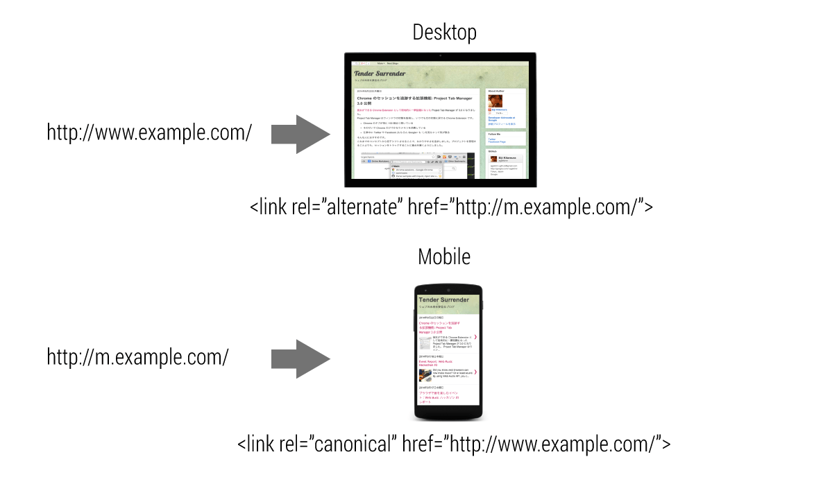
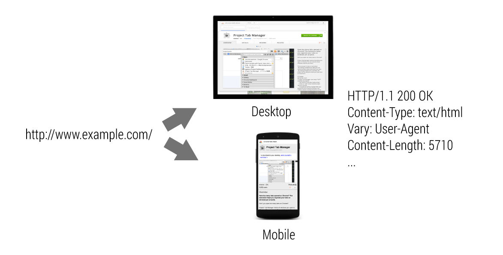
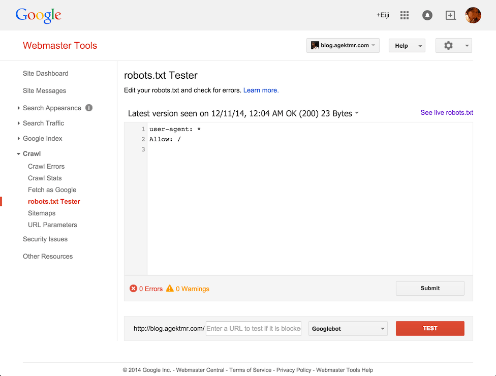
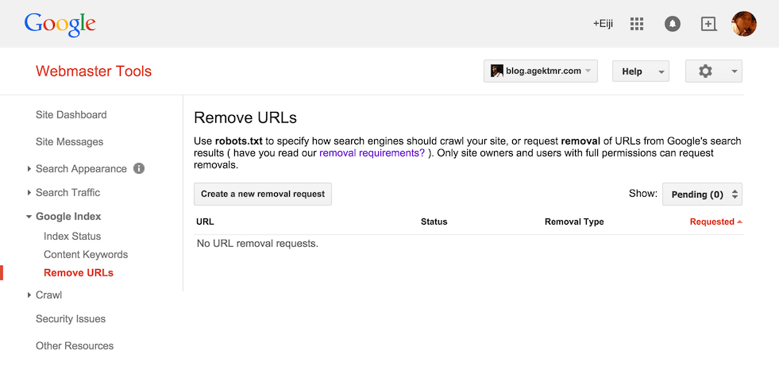

project_path: /web/fundamentals/_project.yaml
book_path: /web/fundamentals/_book.yaml
description: Websites are visited not only by humans, but also by search engine web crawlers. Learn how to improve search accuracy and ranking for your website.

{# wf_updated_on: 2017-07-24 #}
{# wf_published_on: 2014-08-30 #}

# Search Optimization {: .page-title }



Websites are visited not only by humans, but also by search engine web crawlers. Learn how to improve search accuracy and ranking for your website.

### TL;DR {: .hide-from-toc }
- Determine the URL structure of your web page.
- Responsive design is most recommended.
- Use <code>rel='canonical'</code> + <code>rel='alternate'</code> for separate desktop/mobile sites.
- Use <code>Vary HTTP</code> header for a single URL dynamically serving separate desktop/mobile HTMLs.
- Use <code>noindex</code> for pages you want to limit access to those who know the URL.
- Use relevant authentication mechanism for pages you want to keep private.

## Give search engines your site structure

How your website appears in search results is important to multi-device site design. This guide helps you optimize your website for search engines based on its URL structure.

Are you planning to build a responsive web page? Is there a mobile-specific
version with a separate URL? Are you serving both the desktop version and the
mobile version from the same URL? Regardless, you can always do a better job of
optimizing your website for search engines.

### Give your site a URL structure

There are several ways to serve content to different devices. The three most
common methods are:

**Responsive web design:** serves the same HTML from one URL and uses CSS
media queries to determine how the content is rendered on the client side.
For example, Desktop and Mobile: http://www.example.com/

**Separate mobile site:** redirects users to a different URL depending on the
user-agent. For example, Desktop: http://www.example.com/
Mobile: http://m.example.com/

**Dynamic serving:** serves different HTML from one URL depending on the user-
agent. For example, Desktop and Mobile: http://www.example.com/

The best approach is to use **responsive web design**, though many websites use other methods.
 
Determine which URL structure suits your web page. Then try the respective best
practices to optimize it for search engines.

### We recommend responsive web design

The benefits of making your website responsive are:

* Friendlier for user sharing.
* Quicker page load without redirects.
* Single URL for search results.

  
Learn to build websites with responsive web design at [Responsive Web Design Basics](/web/fundamentals/design-and-ux/responsive/).

### Use `link[rel=canonical]` and `link[rel=alternate]` when serving separate URLs

Serving similar contents on a desktop version and a mobile version at different
URLs may cause confusion for both users and search engines because it's not
obvious to viewers that they are intended to be identical. You should indicate:

* That the content of the two URLs are identical.
* Which is the mobile version.
* Which is the desktop (canonical) version.

This information helps search engines better index content and ensures that
users find what they're looking for in a format that works for their device.

#### Use alternate for desktop

When serving the desktop version, indicate that there's a mobile version on
another URL by adding a `link` tag with a `rel="alternate" attribute that points
to the mobile version in the `href` attribute.

[http://www.example.com/](http://www.example.com/){: .external } HTML

    <title>...</title>
    <link rel="alternate" media="only screen and (max-width: 640px)" href="http://m.example.com/">
    

#### Use canonical for mobile

When serving the mobile version, indicate that there's a desktop (canonical)
version on another URL by adding a `link` tag with a `rel="canonical"` attribute
that points to the desktop version in the `href` attribute. Help search engines
understand that the mobile version is explicitly for small screens by adding a `media` attribute with a value of `"only screen and (max-width: 640px)"`.

[http://m.example.com/](http://m.example.com/){: .external } HTML

    <title>...</title>
    <link rel="canonical" href="http://www.example.com/">
    
  

### Use the Vary HTTP header

Serving different HTML based on device type reduces unnecessary redirects,
serves optimized HTML, and provides single URL for search engines. It also has
several disadvantages:

* There may be intermediate proxies between a user's browsers and the server.
Unless the proxy knows that the content varies depending on user agent, it may serve
unexpected results.
* Changing contents depending on user agent risks being considered 
"[cloaking](https://support.google.com/webmasters/answer/66355)", which is a
violation of Google’s Webmaster Guidelines.

By letting search engines know that the content varies depending on user agent,
they can optimize search results for the user agent that is sending queries.

To indicate that the URL serves different HTML depending on user agent, provide a b
`Vary: User-Agent` in the HTTP header. This allows search indexing to treat
desktop and mobile versions separately, and intermediate proxies to cache those
contents gracefully.

[http://www.example.com/](http://www.example.com/){: .external } HTTP Header

    HTTP/1.1 200 OK
    Content-Type: text/html
    Vary: User-Agent
    Content-Length: 5710
    

To learn more about building URL structure across desktop and mobile, read [about building smartphone-optimized websites](/webmasters/smartphone-sites/).

## Control crawling and indexing from search engines

Being listed properly on search engines is critical to delivering your website
to the world, but poor configuration can cause unexpected content to be included
in the results. This section helps you avoid such problems by explaining how
crawlers work and how they index websites.

Sharing information has no better place than the web. When you publish a
document, it's immediately available to the entire world. The page will be
visible to anyone who knows the URL. That's where search engines come in. They need to be able to find your website.

However, there are some cases where you don't want people to find those
documents even though you want to put them on the web. For example, a blog's
admin page is something only certain people should have access to. There's no
benefit to letting people find those pages through search engines.

This section also explains how to restrict certain pages from appearing in search results.

### The difference between "crawl" and "index"

Before you learn how to control search results, you need to understand how search engines interact with your web page. From your site's point of view, there are roughly two things search engines do to your site: crawling and indexing.  

**Crawling** is when a search engine bot fetches your web page to analyze its content. The content is stored in the search engine's database and can be used to populate search result details, rank pages, and discover new pages by following links.  

**Indexing** is when a search engine stores a website's URL and any associated information in its database so it is ready to serve as a search result. 

Note: Many people confuse crawling with indexing. Prohibiting crawling doesn't mean that the page won't show up in the search results. For example, if a third-party website has a link to one of your web pages, it can still be indexed even though it's blocked from crawling. In this case, the search result lacks a detailed description.

### Control crawling with robots.txt

You can use a text file called `robots.txt` to control how well-behaved crawlers access your web page. `Robots.txt` is a simple text file describing how you want
search bots to crawl your site. (Not all crawlers necessarily respect
`robots.txt`. Imagine that anyone can create their own stray crawlers.)

Place `robots.txt` at the root directory of your website's host. For example,
if your site's host is `http://pages.example.com/`, then the `robots.txt` file
should be located at `http://pages.example.com/robots.txt`. If the domain has
different schema, subdomains, or other ports, they are considered
different hosts and should have `robots.txt` for each of their root
directories.

Here's a quick example:  

**http://pages.example.com/robots.txt**

    User-agent: *
    Disallow: /
    

This indicates that you want to disallow all bots from crawling your entire
website.

Here's another example:

**http://pages.example.com/robots.txt**

    User-agent: Googlebot
    Disallow: /nogooglebot/
    

You can specify the behavior per bot (user agent) by indicating a user-agent
name. In the above case, you are disallowing the user agent called `Googlebot`
from crawling `/nogooglebot/` and all contents below this directory.  

Learn more about each search engine's bots on their help pages:

* [Google](/webmasters/control-crawl-index/docs/robots_txt)
* [Bing](http://www.bing.com/webmaster/help/how-to-create-a-robots-txt-file-cb7c31ec)
* [Yandex](https://help.yandex.com/webmaster/controlling-robot/robots-txt.xml)

Note: `robots.txt` is only required **if** you want to control the way your site is crawled. Do not return response code 500 for the url: `/robots.txt`. This terminates all subsequent crawls for the entire host resulting in empty search result details.

#### Test robots.txt

Depending on which crawlers your robots.txt is targeting, search engine
providers may provide a tool to test `robots.txt`. For example, for Google 
there's a validator in
[Webmaster Tools](https://www.google.com/webmasters/tools/robots-testing-tool)
that you can use to test your robots.txt.

Yandex provides [a similar tool](https://webmaster.yandex.com/tools/robotstxt/).  

### Control search indexing with meta tags

If you don't want your web page to show up in search results, robots.txt isn't
the solution. You need to allow those pages to be crawled, and explicitly
indicate that you don't want them to be indexed. There are two solutions:

To indicate you don't want an HTML page to be indexed, use a specific kind of `<meta>` tag, one with its attributes set as `name="robots"` and `content="noindex"`.  

    <!DOCTYPE html>
    <html><head>
    <meta name="robots" content="noindex" />
    

By changing the value of the `name` attribute to a specific user agent name, you can narrow the scope. For example, `name="googlebot"` (case insensitive) indicates that you don't want Googlebot to index the page.  

    <!DOCTYPE html>
    <html><head>
    <meta name="googlebot" content="noindex" />
    

Other options for the robots meta tag include:  

* [Google](/webmasters/control-crawl-index/docs/robots_meta_tag)
* [Bing](http://www.bing.com/webmaster/help/which-robots-metatags-does-bing-support-5198d240)
* [Yandex](https://help.yandex.com/webmaster/controlling-robot/html.xml)

#### X-Robots-Tag

To indicate that you don't want resources such as images, stylesheets, or script
files to be indexed, add `X-Robots-Tag: noindex` in an HTTP header.

    HTTP/1.1 200 OK
    X-Robots-Tag: noindex
    Content-Type: text/html; charset=UTF-8
    

If you want to narrow the scope to a specific user agent, insert the user agent name before `noindex`.  

    HTTP/1.1 200 OK
    X-Robots-Tag: googlebot: noindex
    Content-Type: text/html; charset=UTF-8
    

To learn more about X-Robots-Tag:  

* [Google](/webmasters/control-crawl-index/docs/robots_meta_tag)
* [Bing](http://www.bing.com/webmaster/help/how-can-i-remove-a-url-or-page-from-the-bing-index-37c07477)

Note: If you disallow crawls using `robots.txt`,  search bots still may index those pages without knowing that you don't want those pages to be indexed. This can happen because:<ul><li>Search bots may find your web pages by following links from other websites.</li><li>Search engines that can't crawl can't detect <code>noindex</code>.</li></ul>

Don't expect `robots.txt` to control search indexes.

### Examples by content type

What are the best solutions to control crawling and indexing? Here are some example solutions for different types of pages.

#### Fully accessible and searchable by anyone

Most of the pages on the web are of this type.  

* No `robots.txt` required.
* No robots meta tags required.

#### Limited access by people who know the URL

Examples include:  

* Login page for a blog admin console.
* Private content shared by passing a URL for novice internet users.

In this case, you don't want search engines to index those pages.  

* No `robots.txt` required.
* Use `noindex` meta tags for HTML pages.
* Use `X-Robots-Tag: noindex` for non HTML resources (images, pdf, etc).

Note: Wondering if you should prohibit crawling JavaScript and Stylesheet files? <a href='http://googlewebmastercentral.blogspot.com/2014/05/understanding-web-pages-better.html' target='_blank'>Google tries its best to understand them</a> so that it can find contents available through modern technologies such as AJAX. You should definitely allow crawlers to crawl JavaScript.

#### Restricted access from authorized people

In this case, even if someone finds the URL, the server refuses to present the result without a proper credential. For example:  

* Privately shared content on a social network.
* Enterprise expense system.

In these types of pages, search engines should neither crawl nor index them.  

* Return response code 401 "Unauthorized" for an access without a proper
credential (or redirect the user to a login page).
* Don't use `robots.txt` to disallow crawling these pages. Otherwise, 401 can't be detected.

The restriction mechanism here can be an IP address, a cookie, basic auth,
OAuth, etc. How to implement such authentication/authorization depends on your
infrastructure and is beyond this article's scope.

### Request a page removal from a search engine

You might want to remove a search result when:  

* The page no longer exists.
* A page was accidentally indexed that includes confidential information.

Major search engines provide a way to send a request to remove such pages. The process usually takes the following:  

1. Make sure the page you want removed:
    * Is already deleted from your server and returns 404
    * Is configured not to be indexed (ex: noindex)

1. Go to the request page on each search engine. (Google and Bing require you to register and validate ownership of your website.)
1. Send a request.

Check out concrete steps at the respective search engine's help pages:  

* [Google](https://support.google.com/webmasters/answer/1663419)
* [Bing](http://www.bing.com/webmaster/help/bing-content-removal-tool-cb6c294d)
* [Yandex](https://help.yandex.com/webmaster/yandex-indexing/removing-from-index.xml)

### Appendix: List of crawler user agents

* [Google](https://support.google.com/webmasters/answer/1061943)
* [Bing](http://www.bing.com/webmaster/help/which-crawlers-does-bing-use-8c184ec0)
* [Yandex](https://help.yandex.com/search/robots/logs.xml)

