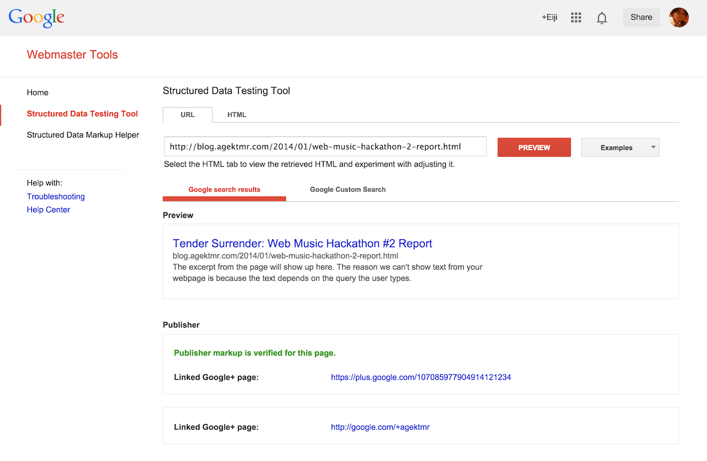
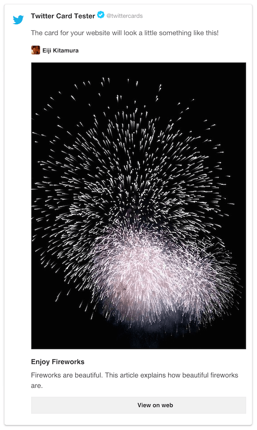

project_path: /web/fundamentals/_project.yaml
book_path: /web/fundamentals/_book.yaml
description: You can influence the way your site appears when shared via social media by adding a few lines of code to each page. This can help bring more people to your site by providing previews with richer information than would otherwise be available.

{# wf_updated_on: 2017-07-24 #}
{# wf_published_on: 2014-10-07 #}

# Social Discovery {: .page-title }



You can influence the way your site appears when shared via social media by
adding a few lines of code to each page. This can help bring more people to
your site by providing previews with richer information than would otherwise
be available.

### TL;DR {: .hide-from-toc }
- Use schema.org microdata to provide page title, description, and an image for Google+.
- Use Open Graph Protocol (OGP) to provide page title, description, and an image for Facebook.
- Use Twitter Cards to provide page title, description, an image, and a Twitter id for Twitter.

You can influence the way your site appears when shared via social media by
adding a few lines of code to each page. This can help increase engagement by
providing previews with richer information than would otherwise be available.
Without it, social sites will provide only basic information, without images or
other helpful information. 

Which one do you think is more likely to be clicked? People are drawn to images
and feel more confident they'll like what they find when they have an early
preview.

  <figure>
    
    <figcaption class="success">
      With the appropriate markup: the correct title, a short
      description, and an image are included. Adding these items can help
      increase engagement.
     </figcaption>
  </figure>

  <figure>
    
    <figcaption class="warning">
      Without the proper mark up, only the page title is
      included.
     </figcaption>
  </figure>

When someone on a social network wants to share your website with their friends,
they would probably add some notes explaining how awesome it is, and share it.
But describing a website tends be cumbersome and can miss the point from the
page owner's point of view. Some services restrict the number of characters users can
put in the note.

By adding the appropriate metadata to your pages, you can simplify the sharing
process for users by providing the title, a description, and an attractive
image. This means they don't have to spend valuable time (or characters)
describing the link.

## Use schema.org + microdata to provide rich snippets on Google+

Crawlers use many methods to parse a page and understand its content. By using
[microdata](http://www.w3.org/TR/microdata/){: .external }, and
[schema.org](https://schema.org/){: .external } vocabulary, you help social sites and search
engines better understand the contents of the page.

Here's an example:

<pre class="prettyprint">

</pre>

While most metadata are embedded in the head section of a web page, microdata
lives where the context exists.

### Add `itemscope` to define microdata scope
By adding `itemscope`, you can specify the tag as a block of contents about a
particular item.

### Add `itemtype` to define type of your website
You can specify the type of item by using the `itemtype` attribute along with the
`itemscope`. The value of an `itemtype` can be determined according to the type
of content on your web page. You should be able to find one that is relevant
in [this page](https://schema.org/docs/full.html).

### Add `itemprop` to describe each item using schema.org vocabulary
`itemprop` defines properties for `itemtype` in the scope. For providing
metadata to social sites, typical `itemprop` values are `name`, `description`,
and `image`.

### Learn more
These microdata provide semantic information to crawlers, typically for
[Google+](https://plus.google.com/){: .external } and Google Search. To learn more about
snippets and rendering on Google+, read the following documents:

* [Article Rendering - Google+ Platform](/+/web/snippet/article-rendering)
* [Snippet - Google+ Platform](/+/web/snippet/)

### Validate rich snippets
In order to validate rich snippets on Google+, you can use tools such as:

* [Structured Data Testing Tool](https://www.google.com/webmasters/tools/richsnippets) - Webmaster Tools  

## Use Open Graph Protocol (OGP) to provide rich snippets on Facebook

The [Open Graph Protocol (OGP)](http://ogp.me/){: .external } provides Facebook with the
metadata necessary to allow web pages to have the same functionality as other
Facebook objects.

<pre class="prettyprint">

</pre>

When included in the head section of your page, this metadata provides rich
snippet information when the page is shared.

### Use `og:` namespaced `meta` tags to describe metadata
A `meta` tag consists of a `property` attribute and a `content` attribute.
Properties and contents may take the following values:

<table>
  <thead>
    <tr>
      <th data-th="Property">Property</th>
      <th data-th="Content">Content</th>
    </tr>
  </thead>
  <tbody>
    <tr>
      <td data-th="Property"><code>og:title</code></td>
      <td data-th="Content">The title of the web page.</td>
    </tr>
    <tr>
      <td data-th="Property"><code>og:description</code></td>
      <td data-th="Content">The description of the web page.</td>
    </tr>
    <tr>
      <td data-th="Property"><code>og:url</code></td>
      <td data-th="Content">The canonical url of the web page.</td>
    </tr>
    <tr>
      <td data-th="Property"><code>og:image</code></td>
      <td data-th="Content">URL to an image attached to the shared post.</td>
    </tr>
    <tr>
      <td data-th="Property"><code>og:type</code></td>
      <td data-th="Content">A string that indicates the type of the web page. You can find one that is suitable for your web page <a href="https://developers.facebook.com/docs/reference/opengraph/">here</a>.</td>
    </tr>
  </tbody>
</table>

These meta tags provide semantic information to crawlers from social sites,
typically from [Google+](https://plus.google.com/){: .external } and
[Facebook](https://www.facebook.com/){: .external }.

### Learn more
To learn more about things you can attach to the post on Facebook, visit the
official Open Graph Protocol site.

* [ogp.me](http://ogp.me/){: .external }

### Validate rich snippets
In order to validate your markup on Facebook, you can use tools such as:

* [Debugger](https://developers.facebook.com/tools/debug/){: .external }

## Use Twitter Cards to provide rich snippets on Twitter
[Twitter Cards](https://dev.twitter.com/docs/cards) are an extension to the
Open [Graph Protocol applicable for Twitter](https://twitter.com/){: .external }. They allow
you to add media attachments like images and video to Tweets with a link to
your web page. By adding the appropriate metadata, Tweets with links to your
page will have a card added that includes the rich detail you've added.

### Use `twitter:` namespaced meta tags to describe metadata
In order to get a Twitter Card working, [your domain must be
approved](https://cards-dev.twitter.com/validator) and must
contain a meta tag that has `twitter:card` as the `name` attribute instead of
`property` attribute.
  
Here's a quick example:

<pre class="prettyprint">

</pre>

By assigning the Twitter id to the value of twitter:site, Twitter embeds this
information in the shared post so that people can easily engage with the page
owner.

### Learn more
To learn more about Twitter Cards, visit:

* [Twitter's developer site](https://dev.twitter.com/docs/cards)

### Validate rich snippets
In order to validate your markup, Twitter provides:

* [Card Validator](https://cards-dev.twitter.com/validator)

## The Best Practice
Given all three options, the best thing you can do is to include them all in
your web page. Here's an example:

<pre class="prettyprint">

</pre>

Notice that microdata and OGP share some markup:

* `itemscope` is located at `head` tag
* `title` and `description` are shared between microdata and OGP
* `itemprop="image"` is using `link` tag with `href` attribute instead of
reusing `meta` tag with `property="og:image"`
  
Lastly, make sure to validate that your web page appears as expected on each
social site before publishing.

