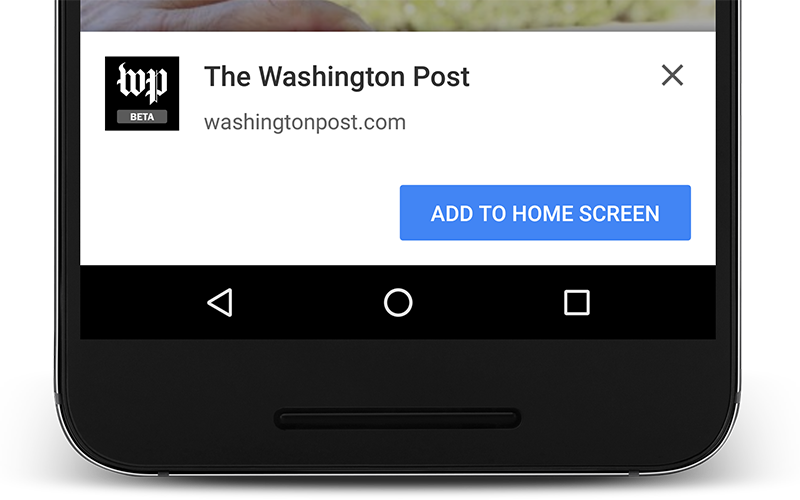

project_path: /web/_project.yaml
book_path: /web/fundamentals/_book.yaml
description: Connect with your users and keep them coming back. Use any to improve your site. Use all if you're working towards a progressive web app.

{# wf_updated_on: 2016-08-25 #}
{# wf_published_on: 2015-09-08 #}

# Enage and Retain Users {: .page-title }

Connect with your users and keep them coming back. Use any to improve your
site. Use **all** if you're working towards a [progressive web app](/web/progressive-web-apps/).

Foundational to many of these features is the [web app manifest](web-app-manifest/),
if your site doesn't have one, consider adding it. It's a simple file that let's
you control how your app appears to the user in areas where they would expect
to see apps (for example the mobile home screen), direct what the user can 
launch, and define its appearance at launch.

  <h2>Add to Home Screen</h2>
  
  

    Web app install banners give you the ability to let your users quickly
    and seamlessly add your web app to their home screen, making it easy to
    launch and return to your app.
    <a href="app-install-banners/">Get Started</a>
  

  <h2>Web Push Notifications</h2>
  
  

    Web push notifications makes it easy to re-engage with users by
    showing relevant, timely, and contextual notifications, even when 
    the browser is closed.
    <a href="push-notifications/">Get Started</a>
  

