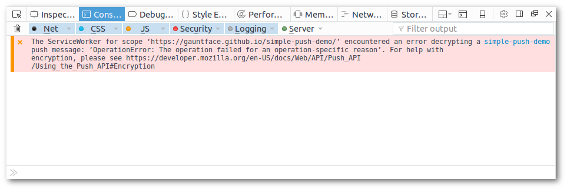
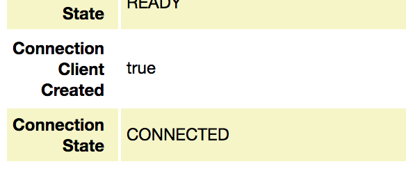

project_path: /web/_project.yaml
book_path: /web/fundamentals/_book.yaml
description: There are right ways of using notifications, and ways of using them better. Learn what makes a good notification. We won't just show you what to do. We'll show you how to do it.

{# wf_updated_on: 2017-03-30 #}
{# wf_published_on: 2017-03-30 #}

# Web Push: Common Issues and Reporting Bugs {: .page-title }



When you hit an issue with web push, it can be difficult to debug the issue or
find help. This doc outlines some of the common issues and what you should
do if you've found a bug in Chrome or Firefox.

Before we dive into debugging push, you may be hitting issues with debugging
service workers themselves, the file not updating, failing to register or
generally just unusual behavior. There is an
[awesome document on debugging service workers](/web/fundamentals/getting-started/codelabs/debugging-service-workers/)
that I would strongly recommend checking out if you are new to
service worker development.

There are two distinct stages to check off when developing and testing web push,
each with their own set of common issues / problems.

- **Sending a Message:** Make sure that sending messages is successful.
   You should be getting a 201 HTTP code. If you aren't :
    - **Check for Authorization Errors:** If you receive an authorization
       error message see the
       [Authorization Issues section](#authorization_issues).
    - **Other API Errors:** If you receive a non-201 status code response,
       see the [HTTP Status Codes section](#http_status_codes) for
       guidance on the cause of the issue.
- **Receiving a Message**: If you're able to send a message successfully,
   but the message is not received on the browser:
    - **Check for Encryption Issues:** See the [Payload Encryption
       Issue Section](#payload_encryption_issue).
    - **Check for Connection Issues:** If the problem is on Chrome, it
       may be a connection. See [Connection Issues section](#connection_issue)
       for more info.

If you aren't able to send and receive a push message and the relevant sections
in this doc aren't helping debug the problem then you may have found a
bug. In this case, refer to the [Raising Bug Reports](#raising_bug_reports)
section to file a good bug report with all the necessary information to expedite
the bug fixing process.

One thing I'd like to call out before we start is that **Firefox and the
Mozilla AutoPush Service have great errors messages.** If you get stuck and not
sure what the problem is, be sure to test in Firefox and see if you get a
more helpful error message.

## Authorization Issues

Authorization issues are one of the most common issues developers hit when
starting out with web push. This is normally a problem with configuration of a
sites [Application Server Keys (a.k.a VAPID keys)
](https://tools.ietf.org/html/draft-ietf-webpush-vapid-02).

The easiest way to support push in both Firefox and Chrome is to supply an
`applicationServerKey` in the `subscribe()` call. The down side is that
any discrepancy between your front end and servers keys will result in an
authorization error.

### On Chrome + FCM

For Chrome, which uses FCM as a push service, you'll receive an
`UnauthorizedRegistration` response from FCM for a range of different
errors, all involving the application server keys.

You'll receive an `UnauthorizedRegistration` error in any of the following
situations:

* If you fail to define an `Authorization` header in the request to FCM.
* Your application key used to subscribe the user doesn't match the key used
  to sign the Authorization header.
* The expiration is invalid in your JWT, i.e. the expiration exceeds 24 hours or
  the JWT has expired.
* The JWT is malformed or has invalid values.

The full error response looks like this:

```
<HTML>\n<HEAD>\n<TITLE>UnauthorizedRegistration</TITLE>\n</HEAD>\n<BODY BGCOLOR="#FFFFFF" TEXT="#000000">\n<H1>UnauthorizedRegistration</H1>\n<H2>Error 400</H2>\n</BODY>\n</HTML>\n
```
If you receive this error message in Chrome, consider testing in Firefox to see
if it'll provide more insight to the problem.

### Firefox and Mozilla AutoPush

Firefox and Mozilla AutoPush provides a friendly set of error messages for
`Authorization` issues.

You'll also receive an `Unauthorized` error response from
Mozilla AutoPush if the `Authorization` header is not included in your push
request.

```
{  
	"errno": 109,  
	"message": "Request did not validate missing authorization header",  
	"code": 401,  
	"more_info": "http://autopush.readthedocs.io/en/latest/http.html\#error-codes",  
	"error": "Unauthorized"  
}
```

If the expiration used in your JWT has expired, you'll also receive an
`Unauthorized` error with a message that highlights that the token has
expired.

```
{  
	"code": 401,  
	"errno": 109,  
	"error": "Unauthorized",  
	"more_info": "http://autopush.readthedocs.io/en/latest/http.html\#error-codes",  
	"message": "Request did not validate Invalid bearer token: Auth expired"  
}
```

If the application server keys are different between when the user was
subscribed and when the Authorization header was signed, a `Not Found`
error will be returned:

```
{  
	"errno": 102,  
	"message": "Request did not validate invalid token",  
	"code": 404,  
	"more_info": "http://autopush.readthedocs.io/en/latest/http.html\#error-codes",  
	"error": "Not Found"  
}
```

Lastly if you have an invalid value in your JWT (for example if the "alg" value
is an unexpected value) you'll receive the following error from Mozilla
AutoPush:

```
{  
	"code": 401,  
	"errno": 109,  
	"error": "Unauthorized",  
	"more_info": "http://autopush.readthedocs.io/en/latest/http.html\#error-codes",  
	"message": "Request did not validate Invalid Authorization Header"  
}
```

## HTTP Status Codes

There are a range of issues that can result in a non-201 response code from a
push service. Below is a list of HTTP status codes and what it means in relation
to web push.

<table>
<tr>
<th>Status Code</th>
<th>Description</th>
</tr>
<tr>
<td>429</td>
<td>Too many requests. Your application server has reached a rate limit with a
push service. The push service should include a 'Retry-After' header to
indicate how long before another request can be made.</td>
</tr>
<tr>
<td>400</td>
<td>Invalid request. This generally means one of your headers is invalid or
poorly formatted.</td>
</tr>
<tr>
<td>404</td>
<td>Not Found. This occurs when the subscription has expired. In this case you
should delete the PushSubscription from your back end and wait for an
opportunity to resubscribe the user.</td>
</tr>
<tr>
<td>410</td>
<td>Gone. The subscription is no longer valid and should be removed from your
back end. This can be reproduced by calling `unsubscribe()` on a
PushSubscription.</td>
</tr>
<tr>
<td>413</td>
<td>Payload size too large. The minimum size payload a push service must
support is 4096 bytes (or 4kb). Anything larger can result in this error.</td>
</tr>
</table>

If the http status code is not in this list and the error message is not
helpful, check the [Web Push Protocol
spec](https://tools.ietf.org/html/draft-ietf-webpush-protocol) to see if the
status code is referenced along with a scenario of when that status code can
be used.

## Payload Encryption Issue

If you can successfully trigger a push message (i.e. send a message to a web
push service and receive a 201 response code) but the push event never fires in
your service worker, this is normally an indication that the browser failed to
decrypt the message it received.

If this is the case, you should see an error message in Firefox's DevTools
console like so:



To check if this is the issue in Chrome, do the following:

1. Go to chrome://gcm-internals and click the "Start Recording" button.


1. Trigger a push message, and look under the "Message Decryption Failure Log".


If there was an issue with the decryption of the payload, you'll see an error
similar to the one displayed above. Notice the `AES-GCM decryption failed`
message in the details column.

There are a few tools which may help debug encryption if this if your issue:

* [Push Encryption Verifier tool by Peter
  Beverloo](https://tests.peter.sh/push-encryption-verifier/).
* [Web Push: Data Encryption Test Page by
  Mozilla](https://mozilla-services.github.io/WebPushDataTestPage/)

## Connection Issue

If you aren't receiving a push event in your service worker and you aren't
seeing any decryption errors, then the browser may be failing to connect to
a push service.

In Chrome you can check whether the browser is receiving messages by examining
the 'Receive Message Log' in `chrome://gcm-internals`.


If you aren't seeing the message arrive in a timely fashion then make sure that
the connection status of your browser is `CONNECTED`:



If it's **not** 'CONNECTED', you may need to delete your current profile and
[create a new one](https://support.google.com/chrome/answer/2364824). If that
still doesn't solve the issue, please raise a bug report as suggested below.

## Raising Bug Reports

If none of the above helps with your issue and there is no sign of what the
problem could be, please raise an issue against the browser you are having an
issue with:

For Chrome, you'd raise the issue here:
[https://bugs.chromium.org/p/chromium/issues/list](https://bugs.chromium.org/p/chromium/issues/list)  
For Firefox, you should raise the issue on:
[https://bugzilla.mozilla.org/](https://bugzilla.mozilla.org/)

To provide a good bug report you should try and provide the following details:

* Browsers you've tested in (i.e. Chrome version 50, Chrome version 51, Firefox
  version 50, Firefox version 51).
* An example `PushSubscription` that demonstrates the problem.
* Include any example requests (i.e. content of network requests to a push
  service, including headers).
* Include any example responses from network requests as well.

If you can provide a reproducible example, either source code or a hosted web
site, it often speeds up diagnosing and solving the problem.
