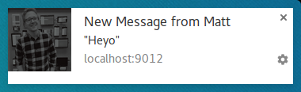
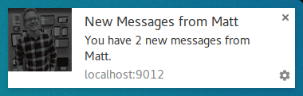

project_path: /web/_project.yaml
book_path: /web/fundamentals/_book.yaml

{# wf_updated_on: 2017-03-03 #}
{# wf_published_on: 2016-06-30 #}

# Common Notification Patterns {: .page-title }




There are a few common patterns that developers are implementing in their web app when it comes
 to web pus and we're going to look at how we can implement them in our apps.

This will involve using a few different API's that are available in the service worker.

## Notification Close Event

In the last section saw how we can listen for `notificationclick` events.

There is also a `notificationclose` event that is called if the user dismisses one of your
 notifications (i.e. rather than click the notification, the user clicks the cross or swipes
 the notification away).

This event is normally used for analytics to track user engagement with notifications.

``` javascript
self.addEventListener('notificationclose', function(event) {
  const dismissedNotification = event.notification;

  const promiseChain = notificationCloseAnalytics();
  event.waitUntil(promiseChain);
});
```

## Adding Data to a Notification

When a push message is received it's common to have data that isn't useful the user has clicked
 the notification. For example, the URL that should be opened if the user clicks on a
 notification. The data can be passed in with the push event but it's not going to be used
 until the `notificationclick` event.

The easiest way to do this is to add data to a notification in the options for
`showNotification()` like this:

``` javascript
    const options = {
      body: 'This notification has data attached to it that is printed ' +
        'to the console when it\'s clicked.',
      tag: 'data-notification',
      data: {
        time: new Date(Date.now()).toString(),
        message: 'Hello, World!'
      }
    };
    registration.showNotification('Notification with Data', options);
```

Inside a click handler the data can be accessed with `event.notification.data`.

``` javascript
  const notificationData = event.notification.data;
  console.log('');
  console.log('The data notification had the following parameters:');
  Object.keys(notificationData).forEach((key) => {
    console.log(`  ${key}: ${notificationData[key]}`);
  });
  console.log('');
```

## Open a Window

One of the most common actions performance when a user clicks on a notification is to open a
 window / tab to a specific URL. We can do this with the
 [clients.openWindow()](https://developer.mozilla.org/en-US/docs/Web/API/Clients/openWindow)
 API.

In our `notificationclick` event we'd run some kind like this:

``` javascript
  const examplePage = '/demos/notification-examples/example-page.html';
  const promiseChain = clients.openWindow(examplePage);
  event.waitUntil(promiseChain);
```

In the next section we'll look at how to check if the page we want to direct the user to is
 already open or not. This way we can focus on the open tab rather than constantly opening new
 tabs.

## Focus an Existing Window

When it's possible, we should focus a window rather than open a new window every time the user
 clicks a notification.

Before we look at how to achieve this, it's worth highlighting that this is **only possible for
 pages on your origin**. This is because we can only see what pages are open that belong to our
 site, this prevents developers from being able to see all the sites their users are viewing.

Taking the previous example where we opened
'/demos/notification-examples/example-page.html', we'll alter it to see if it's already open or
 not.

``` javascript
  const urlToOpen = new URL(examplePage, self.location.origin).href;

  const promiseChain = clients.matchAll({
    type: 'window',
    includeUncontrolled: true
  })
  .then((windowClients) => {
    let matchingClient = null;

    for (let i = 0; i < windowClients.length; i++) {
      const windowClient = windowClients[i];
      if (windowClient.url === urlToOpen) {
        matchingClient = windowClient;
        break;
      }
    }

    if (matchingClient) {
      return matchingClient.focus();
    } else {
      return clients.openWindow(urlToOpen);
    }
  });

  event.waitUntil(promiseChain);
```

Let's step through the code.

First we parse our example page using the URL API. This is a neat trick I picked up from [Jeff
 Posnick](https://twitter.com/jeffposnick). Calling `new URL()` with the `location` object will
 return an absolute URL if the string passed in is relative (i.e. '/' will become 'http://<Site
 Origin>/').

We make the URL absolute so we can match it against the window URL's later on.

``` javascript
  const urlToOpen = new URL(examplePage, self.location.origin).href;
```

Then we get a list of the "WindowClients", which are the list of currently open tabs / windows
 (remember these are tabs for your origin only).

``` javascript
  const promiseChain = clients.matchAll({
    type: 'window',
    includeUncontrolled: true
  })
```

The options passed into `matchAll` just inform the browser that we only want
to search for "window type" clients (i.e. just look for tabs and windows. Exclude web workers).
 `includeUncontrolled` is to search to tabs that aren't controlled by the service worker this
 code is running in. Generally, you'll always want this to be true when using the API for
 looking for windows to focus.

We capture the returned promise as `promiseChain` so that we can pass it into
`event.waitUntil()` later on, keeping our service worker alive.

When the `matchAll()` promise resolves, we iterate through the returned window clients and
 compare the clients URL to the URL we want to open. If we find a match, we need to focus that
 client, which will bring that window to the users attention. Focusing is done with the
 `matchingClient.focus()` call.

If we can't find a matching client, we open a new window, same as the previous section.

``` javascript
  .then((windowClients) => {
    let matchingClient = null;

    for (let i = 0; i < windowClients.length; i++) {
      const windowClient = windowClients[i];
      if (windowClient.url === urlToOpen) {
        matchingClient = windowClient;
        break;
      }
    }

    if (matchingClient) {
      return matchingClient.focus();
    } else {
      return clients.openWindow(urlToOpen);
    }
  });
```

**Note:** We are returning the promise for `matchingClient.focus()` and
`clients.openWindow()` so that the promises are accounted for in our promise
chain.

## Merging notifications

We saw that adding a tag to a notification opts in to a behavior where any
existing notification with the same tag is replaced.

You can however get more sophisticated with the collapsing of notifications using the
 Notifications API. Consider a chat app, where the developer might want a new notification to
 show a message similar to "You have 2 messages from Matt" rather than just showing the latest
 message.

You can do this, or manipulate current notifications in other ways, using the
 [registration.getNotifications()](https://developer.mozilla.org/en-US/docs/Web/API/ServiceWorkerRegistration/getNotifications)
 API which gives you access to all the currently visible notifications for your web app.

Let's look at how we could use this API to implement the chat example.

In our chat app, let's assume each notification has as some data which includes a username.

First thing we'll want to do is find any open notifications for a user with a specific
 username. We'll get `registration.getNotifications()` and loop over them and check the
 `notification.data` for a specific username:

``` javascript
    const promiseChain = registration.getNotifications()
    .then(notifications => {
      let currentNotification;

      for(let i = 0; i < notifications.length; i++) {
        if (notifications[i].data &&
          notifications[i].data.userName === userName) {
          currentNotification = notifications[i];
        }
      }

      return currentNotification;
    })
```

The next step is to replace this notification with a new notification.

In this fake message app, we'll track the number of new messages by adding a count to our new
 notifications data and increment it with each new notification.

``` javascript
    .then((currentNotification) => {
      let notificationTitle;
      const options = {
        icon: userIcon,
      }

      if (currentNotification) {
        // We have an open notification, let's do something with it.
        const messageCount = currentNotification.data.newMessageCount + 1;

        options.body = `You have ${messageCount} new messages from ${userName}.`;
        options.data = {
          userName: userName,
          newMessageCount: messageCount
        };
        notificationTitle = `New Messages from ${userName}`;

        // Remember to close the old notification.
        currentNotification.close();
      } else {
        options.body = `"${userMessage}"`;
        options.data = {
          userName: userName,
          newMessageCount: 1
        };
        notificationTitle = `New Message from ${userName}`;
      }

      return registration.showNotification(
        notificationTitle,
        options
      );
    });
```

If there was a notification currently display we increment the message count and set the
 notification title and body message accordingly. If there
were no notifications, we create a new notification with a `newMessageCount` of 1.

The end result is that the first message would look like this:

{: .center-image }

A second notification would collapse the notifications into this:

{: .center-image }

The nice thing with this approach is that if your user witnesses the
notifications appearing one over the other, it'll look / feel more cohesive
than just replacing with notification with the latest message.

## The Exception to Rule

I've been stating that you **must** show a notification when you receive a push and this is
 true *most* of the time. The one scenario where you don't have to show a notification is when
 the user has your site open and focused.

Inside you're push event you can check whether you need to show a notification or not by
 examining the window clients and looking for a focused window.

The code to getting all the windows and looking for a focused window looks like this:

``` javascript
function isClientFocused() {
  return clients.matchAll({
    type: 'window',
    includeUncontrolled: true
  })
  .then((windowClients) => {
    let clientIsFocused = false;

    for (let i = 0; i < windowClients.length; i++) {
      const windowClient = windowClients[i];
      if (windowClient.focused) {
        clientIsFocused = true;
        break;
      }
    }

    return clientIsFocused;
  });
}
```

We use [clients.matchAll()](https://developer.mozilla.org/en-US/docs/Web/API/Clients/matchAll)
 to get all of our window clients and then we loop over them checking the `focused` parameter.

Inside our push event we'd use this function to decide if we need to show a notification or not:

``` javascript
  const promiseChain = isClientFocused()
  .then((clientIsFocused) => {
    if (clientIsFocused) {
      console.log('Don\'t need to show a notification.');
      return;

    }

    // Client isn't focused, we need to show a notification.
    return self.registration.showNotification('Had to show a notification.');
  });

  event.waitUntil(promiseChain);
```

## Message Page from a Push Event

We've seen that you can skip showing a notification is the user is currently on your site. But
 what if you still wanted to let the user know that an event has occurred, but a notification
 is too heavy handed?

One approach is to send a message from the service worker to the page, this way the web page
 can show a notification or update to the user informing them of the event. This is useful for
 scenarios when a subtle notification in the page is better / friendlier for the user.

Let's say we've received and push and checked that our web app is currently focused, we can
 "post a message" to each open page, like so:

``` javascript
  const promiseChain = isClientFocused()
  .then((clientIsFocused) => {
    if (clientIsFocused) {
      windowClients.forEach((windowClient) => {
        windowClient.postMessage({
          message: 'Received a push message.',
          time: new Date().toString()
        });
      });
    } else {
      return self.registration.showNotification('No focused windows', {
        body: 'Had to show a notification instead of messaging each page.'
      });
    }
  });

  event.waitUntil(promiseChain);
```

In each of pages, we listen for these messages by adding a message event
listener:

``` javascript
    navigator.serviceWorker.addEventListener('message', function(event) {
      console.log('Received a message from service worker: ', event.data);
    });
```

In this message listener you could do anything you want, show a toast, a
notification bubble or completely ignore the message.

It's also worht nothing that if you don't define a message listener in your web page, the
 messages from the service worker will not do anything.

## Cache a Page and Open Window

One scenario that is out of the scope of this book but worth just calling it is that you can
 improve the overall UX of your web app by caching web pages you expect users to visit after
 clicking on your notification.

This requires having your service worker set-up to handle `fetch` events, but if you do
 implement it, make sure you take advantage of it in you `push` event by caching the page and
 assets you'll need before showing your notification.

For more information check out this [introduction to service workers
 post](/web/fundamentals/getting-started/primers/service-workers).
