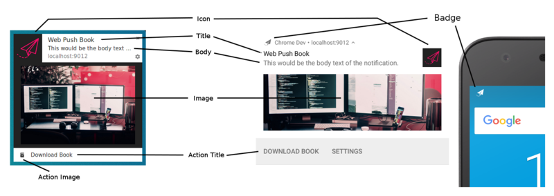

project_path: /web/_project.yaml
book_path: /web/fundamentals/_book.yaml

{# wf_updated_on:  #}
{# wf_published_on: 2016-06-30 #}

# Displaying a Notification {: .page-title }



# Displaying a Notification

I've split up notification options into two sections, one that deals with the visual aspects (this
 section) and one section that explains the behavioural aspects of notifications.

The reason for this is that every developer will need to be worried about the visual aspects but the
 behavioural aspects will depend on your specific to your use case.

All of the source code for these demo's is taken from a demo page I put together. If you want to test
 them out for yourself then click the button below.

<a class="button" href="/demos/notification-examples/" target="\_blank">Notification Demos</a>

## Visual Options

The API for showing a notification is simply:

    <ServiceWorkerRegistration>.showNotification(<title>, <options>);

Where the title is a string and options can be any of the following:

    {
      "//": "Visual Options",
      "body": "<String>",
      "icon": "<URL String>",
      "image": "<URL String>",
      "badge": "<URL String>",
      "vibrate": "<Array of Integers>",
      "sound": "<URL String>",
      "dir": "<String of 'auto' | 'ltr' | 'rtl'>",
    
      "//": "Behavioural Options",
      "tag": "<String>",
      "data": "<Anything>",
      "requireInteraction": "<boolean>",
      "renotify": "<Boolean>",
      "silent": "<Boolean>",
    
      "//": "Both Visual & Behavioural Options",
      "actions": "<Array of Strings>",
    
      "//": "Doesn't seem to affect any visual aspect of the notification.",
      "timestamp": "<Long>"
    }

First let's look at the visual options. For desktop and mobile, here are how the different options
 are used.

{: .center-image }

### Title and Body Options

The title and body options are exactly as they sound, two different pieces of text to display on the
 notification.

If we ran the following code:

        const title = 'Simple Title';
        const options = {
          body: 'Simple piece of body text.\nSecond line of body text :)'
        };
        registration.showNotification(title, options);

We'd get this notification on Chrome:

{: .center-image }

On Firefox on Linux it would look like this:

{: .center-image }

I was curious about what would happen if I added lots of text and this was the result.

{: .center-image }

Interestingly, Firefox on Linux collapses the body text until you hover the notification, causing the
 notification to expand.

{: .center-image }

{:
 .center-image }

The reason I've included these examples is two fold. There will be differences between browsers, just
 looking at text, Firefox and Chrome look and act differently. Secondly there are differences across
 platforms. Chrome has a custom UI for all platforms whereas Firefox uses the system notifications on
 my Linux machine. The same notifications on Windows with Firefox look like this:

{: .center-image
 }

{:
 .center-image }

### Icon

The "icon" option is essentially a small image you can show next to the title and body text.

In your code you just need to provide a URL to the image you'd like to load.

        const title = 'Icon Notification';
        const options = {
          icon: '/images/demos/icon-512x512.png'
        };
        registration.showNotification(title, options);

On Chrome we get this notification on Linux:

{: .center-image }

and on Firefox:

{: .center-image }

Sadly there aren't any solid guidelines for what size image to use for an icon.

[Android seems to want a 64dp
 image](http://stackoverflow.com/questions/7220738/honeycomb-notifications-how-to-set-largeicon-to-the-right-size)
 (which is 64px multiples by the device pixel ratio).

If we assume the highest pixel ratio for a device will be 3, an icon size of >= 192px is a safe bet.

> **Note**: Some browsers may require the image be served over HTTPS. Just calling it out in case you
 intend to use a third party image over HTTP.

### Badge

The badge is a small monochrome icon that is used to portray a little more information to the user
 about where the notification is from.

        const title = 'Badge Notification';
        const options = {
          badge: '/images/demos/badge-128x128.png'
        };
        registration.showNotification(title, options);

At the time of writing the badge is only used on Chrome for Android.

{: .center-image }

On other browsers (or Chrome without the badge), you'll see an icon of the browser.

{: .center-image }

As with the `icon` option, there are no real guidelines on what size to use.

Digging through [Android
 guidelines](https://developer.android.com/guide/practices/ui_guidelines/icon_design_status_bar.html)
 the recommended size is 24px multiplied by the device pixel ratio.

Meaning an image of >= 72px should be good (assuming a max device pixel ratio of 3).

### Image

The "image" option can be used to display a larger image to the user. This is particularly useful to
 display a preview image to the user.

        const title = 'Image Notification';
        const options = {
          image: '/images/demos/unsplash-farzad-nazifi-1600x1100.jpg'
        };
        registration.showNotification(title, options);

On desktop the notification will look like this:

{: .center-image }

On Android the cropping and ratio is different.

{: .center-image }

Given the differences in ratio between desktop and mobile it's extremely hard to suggest guidelines.

Since Chrome on desktop doesn't fill the available space and has a ratio of 4:3, perhaps the best
 approach is to serve an image with this ratio and allow Android to crop the image. That being said,
 the `image` option is still new and this behavior may change.

On Android, the only [guideline width](https://code.google.com/p/android/issues/detail?id=36744) I
 could find was a width of 450dp.

Using this guideline, an image of width >= 1350px would be a good bet.

### Actions

Actions allow you to define buttons that are displayed along with a notification and can be
 interacted with by the user.

        const title = 'Actions Notification';
        const options = {
          actions: [
            {
              action: 'coffee-action',
              title: 'Coffee',
              icon: '/images/demos/action-1-128x128.png'
            },
            {
              action: 'doughnut-action',
              title: 'Doughnut',
              icon: '/images/demos/action-2-128x128.png'
            },
            {
              action: 'gramophone-action',
              title: 'gramophone',
              icon: '/images/demos/action-3-128x128.png'
            },
            {
              action: 'atom-action',
              title: 'Atom',
              icon: '/images/demos/action-4-128x128.png'
            }
          ]
        };
    
        const maxVisibleActions = Notification.maxActions;
        if (maxVisibleActions < 4) {
          options.body = `This notification will only display ` +
            `${maxVisibleActions} actions.`;
        } else {
          options.body = `This notification can display up to ` +
            `${maxVisibleActions} actions.`;
        }
    
        registration.showNotification(title, options);

At the time of writing only Chrome and Opera for Android support actions.

{: .center-image }

For each action you can define a title, an "action" (which is essentially an ID) and an icon. The
 title and icon is what you can see in the notification. The ID is used when detecting that the
 action button had been clicked (We'll look into this more in the next section).

In the example above I've defined 4 actions to illustrate that you can define more actions than will
 be displayed. If you want to know the number actions that will be displayed by the browser you can
 check `Notification.maxActions`, which is used in the body text in the demo.

On desktop the action button icons display their colors (See the pink doughtnut above).

On Android Marshmallow the icons are colored to match the system color scheme:

{: .center-image }

Chrome will hopefully change it's behavior on desktop to match android (i.e. apply the appropriate
 color scheme to make the icons match the system look and feel). In the mean you can match Chrome's
 text color by making your icons have a color of "#333333"..

On Android Nougat the action icons aren't shown at all.

It's also worth calling out that that icons look crisp on Android but **not** on desktop.

The best size I could get to work on desktop Chrome was 24px x 24px. This sadly looks out of place on
 Android.

The best practice we can draw from these differences:

- Stick to a consistent color scheme for your icons so at least all your icons are consistently
 displayed to the user.
- Make sure they work in monochrome as some platforms may display them in such a way.
- Test the size and see what works for you. 128px x 128px works well on Android for me but was poor
 quality on desktop.
- Expect your action icons not to be displayed at all.

The Notification spec is exploring a way to define multiple sizes of icons, but it looks like it'll
 be some time before anything is agreed upon.

### Direction

The "dir" parameter allows you to define which direction the text should be displayed, right-to-left
 or left-to-right.

In testing it seemed that the direction was largely determined by the text rather than this
 parameter. Reading through the spec it calls out this can be used to suggest to the browser how to
 layout options like actions, but I saw no difference.

Probably best to define if you can, otherwise the browser should do the right thing according to the
 text supplied.

        const title = 'المغلوطة حول استنكار  النشوة وتمجيد الألم نشأت بالفعل، وسأعرض لك التفاصيل
 لتكتشف حقيقة وأساس تلك السعادة البشرية، فلا أحد يرفض أو يكره أو يتجنب الشعور بالسعادة، ولكن بفضل
 هؤ.';
        const options = {
          body: 'المغلوطة حول استنكار  النشوة وتمجيد الألم نشأت بالفعل، وسأعرض لك التفاصيل لتكتشف
 حقيقة وأساس تلك السعادة البشرية، فلا أحد يرفض أو يكره أو يتجنب الشعور بالسعادة، ولكن بفضل هؤ.',
          dir: 'rtl',
          actions: [{
            title: 'الصف 1 العمود 1',
            action: 'action-1'
          }, {
            title: 'الصف 1 العمود 2',
            action: 'action-2'
          }]
        };
        registration.showNotification(title, options);

The parameter should be set to either `auto`, `ltr` or `rtl`.

A right-to-left language used on Chrome on Linux looks like this:

{: .center-image }

On Firefox (while hovering over it) you'll get this:

{: .center-image }

### Vibrate

The vibrate option allows you to define a vibration pattern that'll run when a notification is
 displayed, assuming the user's current settings allow for vibrations (i.e. the device isn't in
 silent mode).

The format of the vibrate option should be an array of numbers that describe the number of
 milliseconds the device should vibrate followed by the number of milliseconds the device should
 *not* vibrate.

        const title = 'Vibrate Notification';
        const options = {
          // Star Wars shamelessly taken from the awesome Peter Beverloo
          // https://tests.peter.sh/notification-generator/
          vibrate: [500,110,500,110,450,110,200,110,170,40,450,110,200,110,170,40,500]
        };
        registration.showNotification(title, options);

This only affects devices that support vibration.

### Sound

The sound parameter allows you to define a sounds to play when the notification is received.

Sadly at the time of writing no browser has support for this option.

        const title = 'Sound Notification';
        const options = {
          sound: '/demos/notification-examples/audio/notification-sound.mp3'
        };
        registration.showNotification(title, options);

### Timestamp

Timestamp allows you to tell the platform the time the notification was intended for (i.e. when the
 event the notification relates to occurred).

The `timestamp` should be the number of milliseconds since 00:00:00 UTC on
1 January 1970 (i.e. the unix epoch).

        const title = 'Timestamp Notification';
        const options = {
          body: 'Timestamp is set to "01 Jan 2000 00:00:00".',
          timestamp: Date.parse('01 Jan 2000 00:00:00')
        };
        registration.showNotification(title, options);

## UX Best Practices

The biggest UX fail I've seen with notifications is a lack of specificity in the information
 displayed by a notification.

You should consider why you sent the push message in the first place and make sure all of the
 notification options are used to help users understand why they are reading that notification.

To be honest, it's easy to see examples and think "I'll never make that mistake" but it's easier to
 fall into that trap than you might think.

Some common pitfalls to avoid:

1. Don't put your website in the title or the body. Browsers include your domain in the notification
 so **don't duplicate it**.
   

1. Use all information you have available to you. If you send a push message because someone sent a
 message to a user, rather than using a title of 'New Message' and body of 'Click here to read it.'
 use a title of 'John just sent a new message' and set the body of the notification to part of the
 message.

    

## Browsers and Feature Detection

At the time of writing there is a pretty big disparity between Chrome and Firefox in terms of feature
 support for notifications.

Luckily, you can feature detect support for notification features by looking at the Notification
 prototype.

Let's say we wanted to know if a notification has support action buttons, we'd do the following:

    if ('actions' in Notification.prototype) {
      // Action buttons are supported.
    } else {
      // Action buttons are NOT supported.
    }

With this, we could change the notification we display to our users.

With the other options, just do the same as above, replacing 'actions' with the desired parameter
 name.
