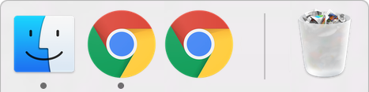
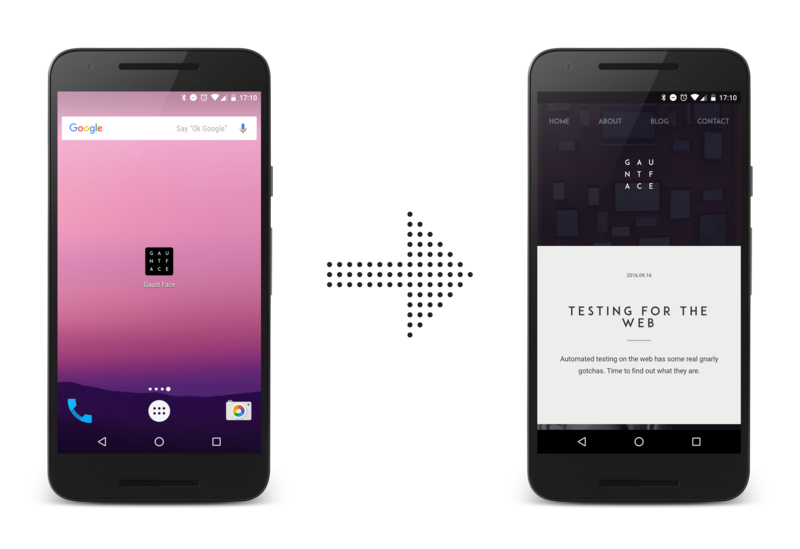

project_path: /web/_project.yaml
book_path: /web/fundamentals/_book.yaml

{# wf_updated_on: 2017-03-03 #}
{# wf_published_on: 2016-06-30 #}

# FAQ {: .page-title }



## Why Doesn't Push Work when the Browser is Closed?

This question crops up quite a bit, largely because there are a few scenarios that make it
difficult to reason with / understand.

Let's start with Android. The Android OS is designed to listen for push messages and upon
receiving a push message, wake up the appropriate Android app to handle the push message,
regardless of whether the app is closed or not.

This is exactly the same with any browser on Android, the browser will be woken
up when a push message is received and the browser will then wake up your
service worker and dispatch the push event.

On desktop OS's, it's more nuanced and it's easiest to explain on Mac OS X
because there is a visual indicator to help explain the different scenarios.

On Mac OS X, you can tell if a program is running or not by a marking
under the app icon in the dock.

If you compare the two Chrome icons in the following dock, the one on the left
is running, illustrated by the marking under the icon, where as the Chrome
on the right is **not running**, hence the lack of the marking underneath.

{: .center-image }

In the context of receiving push messages on desktop, you will receive messages
when the browser is running, i.e. has the marking underneath the icon.

This means the browser can have no windows open, and you'll still receive the push message in
your service worker, because the browser in running in the background.

The only time a push won't be received is if the browser is completely closed, i.e. not running
at all - no marking. The same applies for Windows, although it's a little trickier to determine
whether Chrome is running in the background or not.

## How Do I Make My Homescreen Web App Open Fullscreen from a Push?

On Chrome for Android, a web app can be added to the home screen and when the web app is opened
from the homescreen, it can launch in a fullscreen mode without the URL bar, as shown below.

{: .center-image }

To keep this experience consistent, developers want their notifications clicked to open their
web app in fullscreen as well.

Chrome "sort of" implemented support for this, although you may find it unreliable / hard to
reason with. The relevant implementation detail is as follows:

> Sites which have been added to homescreen on Android should be
> allowed to open in standalone mode in response to push notifications. As
> Chromium cannot detect what sites are on the homescreen after they
> have been added, the heuristic is sites which have been launched from
> homescreen within the last ten days will be opened in standalone from
> a tap on a notification.
> --[Chrome Issue](https://bugs.chromium.org/p/chromium/issues/detail?id=541711)

What this means is that unless your user is visiting your site through the home screen icon
fairly regularly, your notifications will open in the normal browser UI.

This issue will be worked on further.

**Note:** This is just the behavior of Chrome, other browsers may do different things as well.
Feel free to [raise an issue](https://github.com/gauntface/web-push-book/issues) if you have
anything you think should be mentioned with this question.

## Why is this Any Better than Web Sockets?

The reason web push is preferable is that a service worker can be brought to
life, when the browser window is closed. A web socket will only live as long as the browser and
web page is kept open.

## What is the deal with GCM, FCM, Web Push and Chrome?

This question has a number of facets to it and the easiest way to explain is to
step through the history of web push and Chrome (Don't worry it's short).

##### December 2014
When Chrome first implemented web push, Chrome used Google Cloud Messaging (or GCM as it's
known) to power the sending of push messages from the server to the browser.

This **was not web push**. There are a few reasons this early set-up of Chrome and GCM wasn't
"real" web push.

1. GCM requires developers to set up an account on the Google Developers Console.
1. Chrome + GCM needed a special sender ID to be shared by a web app to be able to set up
messaging correctly.
1. GCM's servers accepted a custom API request that wasn't a web standard.

##### July 2016
In July a new feature in web push landed - Application Server Keys (or VAPID as the spec is
known). When Chrome added support for this new API, anyone who used it will get Chrome to use
Firebase Cloud Messaging (also known as FCM) instead of GCM. This is important for a few
reasons.

1. Chrome + Application Sever Keys **do not** need any kind of project to be setup with Google
or Firebase, it'll just work.
1. FCM supports the *web push protocol*, which is the API that all web push services will
support. This means that regardless of what push service a browser uses, you just make the same
kind of request and it'll send the message.

##### Why is it confusing today?
There is a large amount of confusion now that content has been written on the topic of web
push, much of which references GCM or FCM. If content references GCM, you should probably treat
it as a sign that it's either old content OR it's focusing too much on Chrome (I'm guilty of
doing this in a number of old posts).

Instead, think of web push as consisting of a browser, which uses a push service to manage
sending and receiving message, where the push service will accept a "web push protocol"
request. If you think in these terms, you can ignore which browser and which push service it's
using and get to work.

This book has been written to focus on the standards approach of web push and purposefully
ignores anything else.

The *only* time you should care about this back story is if and when you want to support older
versions of Chrome, Samsung Internet browser and / or Opera for Android, all of whom use the
older GCM trick / proprietary API's / hacks. If you want to support these browsers you'll need
to implement this older GCM API which is [documented in the non-standrards / legacy section of
this book here](/chapter-06/01-non-standards-browsers/).

## Firebase has a JavaScript SDK. What and Why?

For those of you who have found the Firebase web SDK and noticed is has a messaging API for
JavaScript, you may be wondering how it differs from web push.

The messaging SDK (known as Firebase Cloud Messaging JS SDK) does a few tricks behind the
scenes to make it easier to implement web push.

1. Instead of worrying about PushSubscriptions and the various fields, you only need to worry
about an FCM Token (A string).
1. Using the tokens for each user, you can use the proprietary FCM API to trigger push
messages. This API doesn't require encrypting payloads, you can send plain payload in a POST
request body.
1. FCM's proprietary API supports custom features, for example [FCM
Topics](https://firebase.google.com/docs/cloud-messaging/android/topic-messaging) (It does work
on web too - just poorly documented).
1. Finally FCM supports Android, iOS and web, so for some teams is easier to work with in
existing projects.

This uses web push behind the scenes, but it's goal is to abstract it away.

Like a said in the previous question, if you consider web push as just a browser and push
service, then you can consider the Messaging SDK in Firebase as a library to try and simplify
implementing web push.
