project_path: /web/_project.yaml
book_path: /web/fundamentals/_book.yaml
description: There are right ways of using notifications, and ways of using them better. Learn what makes a good notification. We won't just show you what to do. We'll show you how to do it.

{# wf_updated_on: 2016-09-12 #}
{# wf_published_on: 2016-06-30 #}

# What Makes a Good Notification? {: .page-title }



<figure class="attempt-right">
  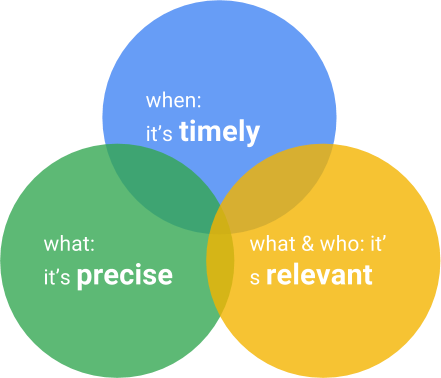
  <figcaption>Timely, precise, and relevant</figcaption>
</figure>

Don't annoy your users, or you'll lose access to them forever. Do we need to
say anything more than that? We do because it's easier said than done. 

Push notifications are one of the most valuable capabilities of native apps, 
and this capability is now available on the web. To get the most out of them,
notifications need to be timely, precise, and relevant.

**Timely**—A timely notification is one that appears when users want it and when
it matters to them.

**Precise**—A precise notification is one that has specific information that can
be acted on immediately.

**Relevant**—A relevant message is one about people or subjects that the user cares
about.

## Timely {: #timely }

A timely notification is a notification that appears when users want it and
when it matters to them. Timely means timely to the user, not necessarily timely
to you.

### Make it available regardless of connectivity {: #make-it-available }

You'll want to show most notices right away. There are reasons to hold on to a
notice before showing it, the least of which is that push payloads may not be
supported on all platforms, so you may need to fetch the critical information
before displaying it.

Until recently only mobile apps could do this. With service workers you can
store a notification until a user wants it. When the user clicks it, the status
of the network is irrelevant.

    self.addEventListener('push', event => {
      var dataPromise;
      if (data in event) {
        dataPromise = Promise.resolve(event.data.json());
      } else {
        dataPromise = fetch('notification/end/point/data.json')
          .then(response => {
            return response.json();
          });
      }
    
      event.waitUntil(
        dataPromise
        .then(msgData => {
          // Now tell the user.
          return self.registration.showNotification(data.title, {
            // Whether you show data and how much you show depends on
            // content of the data itself.
            body: event.data.body,
            icon: 'images/icon.png'
          });
        })
      );
    }); 
    

### Use vibration judiciously {: #vibrate-judiciously }

Vibration may seem like an odd thing to list under timely. In fact, it's closely
related and there are several issues.

First, vibration may seem like the ideal way to make users aware of new
notifications. But not all users have vibrations turned on and some devices
can't vibrate. Consequently, any urgency that you intend to communicate with
vibration can be lost.

Second, making every notification vibrate can create a false sense of urgency.
If users are being nagged by notifications that aren't as important as they
seem, they may turn off notifications entirely.

In short, let the user decide how to use vibrations. Give them the ability to
select which notifications use vibrations or whether to use them at all. If you
have different categories of notifications, you could even let them select
different vibration patterns.

Finally, remember that to vibrate, a mobile device has to run a motor and motors
use more power than do on-screen notifications.

## Precise {: #precise }

A precise notification is one that has specific information that can be acted on
immediately. Consider the image from the anatomy lesson again.

{:width="316px"}

It tells you everything you need to know in one glance:

* Who sent the message - the airline.
* What's happened - your new flight is delayed.
* What else - your new flight time.

### Offer enough information that the user doesn't need to visit your site {: #offer-enough }

This may not be appropriate in every case, but if the information is simple
enough to convey in a small space, don't make users open your website to read
it. For example, if you wanted to notify one user of acknowledgment by another,
then don't show a message that says, "New notification." Show one that says,
'Pete said, "No"'.

  <figure>
    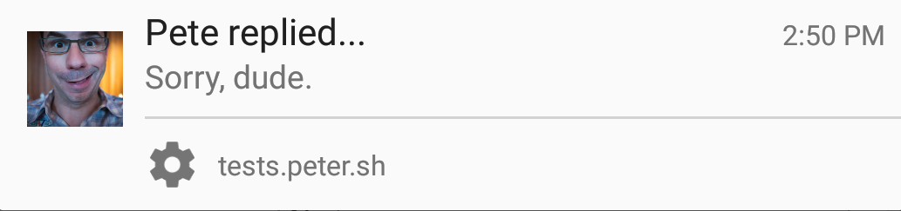
    <figcaption class="success"><b>Do:</b> Offer enough information
    so that users don't need to visit.</figcaption>
  </figure>

  <figure>
    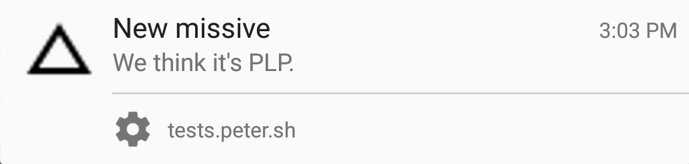
    <figcaption class="warning"><b>Don’t:</b> Don't make your messages
    vague and cryptic.</figcaption>
  </figure>

This is especially important for critical information.

  <figure>
    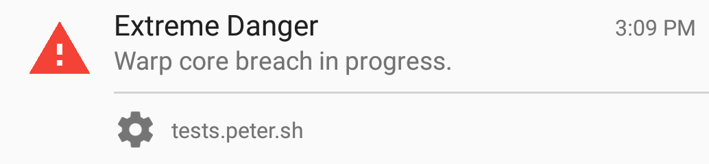
    <figcaption class="success"><b>Do:</b> Offer enough information
    so that users don't need to visit.</figcaption>
  </figure>

  <figure>
    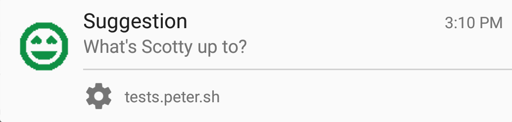
    <figcaption class="warning"><b>Don’t:</b> Don't make your messages
    vague and cryptic.</figcaption>
  </figure>

### Put actions right in the notification {: #offer-actions }

We've seen this a few times already and the anatomy lesson even showed how to
add them to a notification. The service worker needs to process those actions.
Do this in the `notificationclick` event.

    self.addEventListener('notificationclick', event => {
      var messageId = event.notification.data;
      
      event.notification.close();
    
      if (event.action) {
        // Send the response directly to the server.
      } else {
        // Open the app.
      }
    }, false);
    

### Make the title and content specific {: #specific-title }

Make the title relevant to the context of the message and include something
specific from the message. Content the recipient already knows, such as the name
of your app, isn't helpful. Niether is information the recipient doesn't know,
such as technology used to send the message.

  <figure>
    
    <figcaption class="success"><b>Do:</b> Make the title include
    something specific from the message.</figcaption>
  </figure>

  <figure>
    
    <figcaption class="warning"><b>Don’t:</b> Don't include
    information that users already know or don't understand.</figcaption>
  </figure>

### Put important information up front

This means putting information important to your user in the part of the
notification that gets the most attention. For example, in western languages
text is read from left to right and from top to bottom, so a messaging app would put the name of the sender at the top and left.

  <figure>
    
    <figcaption class="success"><b>Do:</b> The sender name is at 
    the top and left.</figcaption>
  </figure>

  <figure>
    
    <figcaption class="warning"><b>Don’t:</b> The information at the
    top and left is redundant.</figcaption>
  </figure>

### Keep the message short {: #keep-it-short }

Notifications aren't emails. The intent of notifications is to tease users so
they'll open your app. The `PushMessageData` object lets you send data to the
user immediately, but   you may not want to show all of that data to the user,
especially if additional   data could accumulate on the server after the
notification is sent.

## Relevant {: #relevant }

A relevant message is one about people or subjects the user cares about.

### Prefer logged-in users {: #prefer-logged }

Only ask for notification permissions from users who are logged in.
If you don't know who your users are it's hard to send them relevant
notifications. And if notifications aren't relevant, users might  call them
spam.

### Don't repeat information {: #dont-repeat }

You have little space to convey much information. Don't waste it by duplicating
information between parts of the notification. The duplicate information may be
relevant information, but removing duplication gives you extra room for other
information. For example if your title contains the day of the week,
don't also list it in the body.

  <figure>
    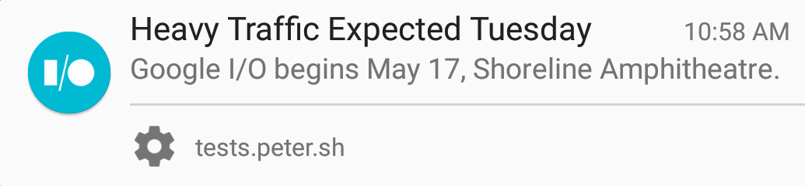
    <figcaption class="success"><b>Do:</b> Information in the title
    isn't repeated.</figcaption>
  </figure>

  <figure>
    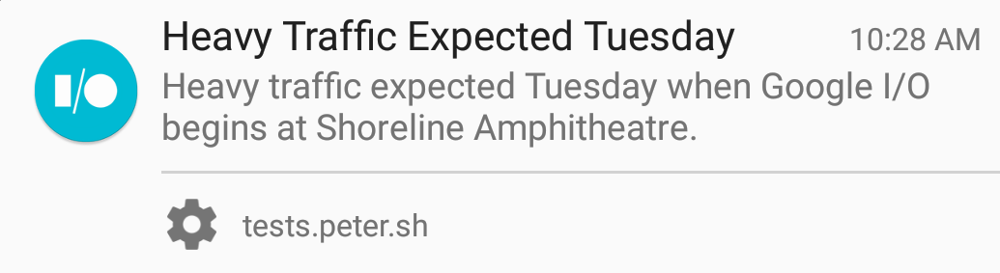
    <figcaption class="warning"><b>Don’t:</b> Message content repeats information in the title.</figcaption>
  </figure>

Also, if the app is open, it's possible the new information is already on the
screen. Instead of a notification, use the application UI to notify the user.

### Don't advertise your native app {: #dont-advertise-native }

The point of service workers, the technology behind push notifications, is that
you can avoid the time and expense of writing an application separate from your
website. A user who has both your service worker and your native app may get
duplicate notifications unless you write server-side code to prevent it. You can 
avoid the problem completely; don't encourage users to run both.

### Don't advertise {: #dont-advertise }

You'll have opportunities to monetize the user experience once they're in your
app. Don't blow it by spamming your users when they're not. If you spam your
users with notifications, you may lose them altogether.

### Don't Include your website name or domain {: #no-website }

Notifications already contain your domain name, and space is tight anyway.

  <figure>
    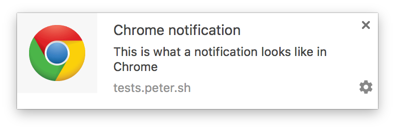
  </figure>

  <figure>
    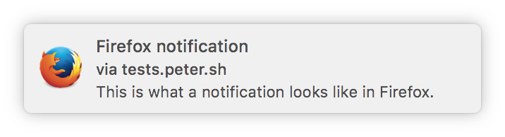
  </figure>

### Make the icon contextual {: #contextual-icon }

<figure class="attempt-right">
  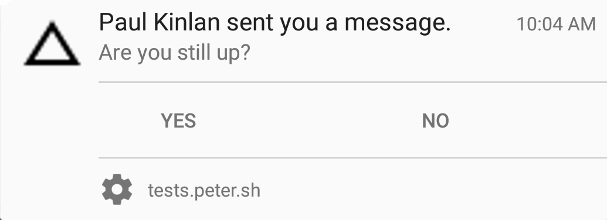
  <figcaption class="warning"><b>Don’t:</b> Use a generic icon.
  </figcaption>
</figure>

Icons should convey something about the message they accompany. Consider this
example.

It tells us exactly who sent the message. But the icon, which in many
notifications is the site or app logo, tells us nothing.

Instead, let's use the sender's profile image.

<figure class="attempt-right">
  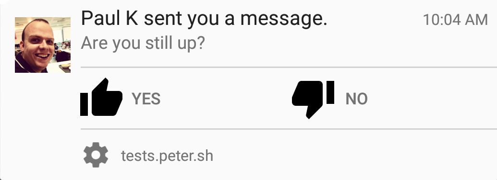
  <figcaption class="success"><b>Do:</b> Use an icon that provides
  some contextual information about the message.</figcaption>
</figure>

But please keep the icon simple. Too much nuance may be lost on the user.
