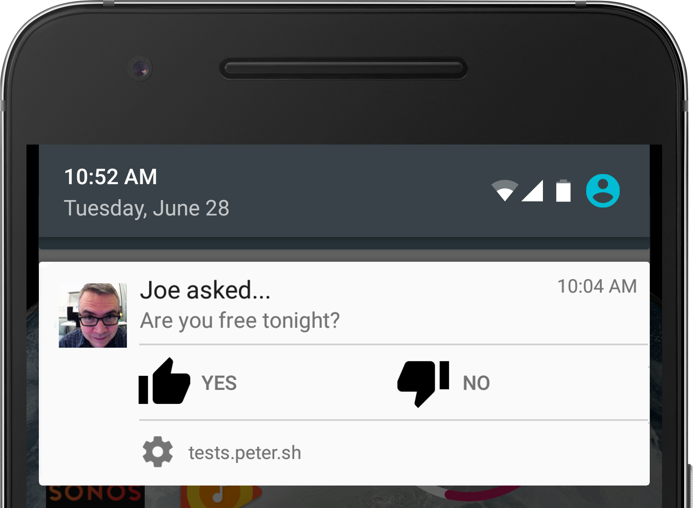

project_path: /web/_project.yaml
book_path: /web/fundamentals/_book.yaml
description: Push notifications are one of the most valuable capabilities of native apps, and this capability is now available on the web. To get the most out of them, notifications need to be timely, precise, and relevant.

{# wf_updated_on: 2016-06-30 #}
{# wf_published_on: 2016-06-30 #}

# Web Push Notifications {: .page-title }



If you ask a room of developers what mobile device features are missing from
the web, push notifications are always high on the list.

Web push notifications allow users to opt-in to timely updates from sites
they love and allow you to effectively re-engage them with customized,
relevant content. 

The Push API and Notification API open a whole new set of possibilities for
you to re-engage with your users.

## Are service workers involved? {: #service-worker-involved }

Yes! If you're not familiar with them, check out the 
[service worker introduction](/web/fundamentals/getting-started/primers/service-workers).
We will use service worker code in later sections when we show you how to
implement pushes and notifications.

## Two technologies {: #two-technologies }

Push and notification are different, but complementary, features: a **push** is
the action of the server supplying information to a service worker; a
**notification** is the action of a service worker or web page showing the
information to a user.

## A little notification anatomy {: #anatomy }

In the next section we're going to throw a bunch of pictures at you, but we
promised code. So, here it is. With a service worker registration you call
`showNotification` on a registration object.

    serviceWorkerRegistration.showNotification(title, options);
    

The `title` argument appears as a heading in the notification. The `options`
argument is an object literal that sets the other properties of a notification.
A typical options object looks something like this:

    {
      "body": "Are you free tonight?",
      "icon": "images/joe.png",
      "vibrate": [200, 100, 200, 100, 200, 100, 400],
      "tag": "request",
      "actions": [
        { "action": "yes", "title": "Yes!", "icon": "images/thumb-up.png" },
        { "action": "no", "title": "No", "icon": "images/thumb-down.png" }
      ]
    }
    

In the next few sections we'll provide tips to help you build better
notifications. We'll go on to describe the mechanics of implementing them,
including handling permissions and subscriptions, sending messages, and
responding to them.
