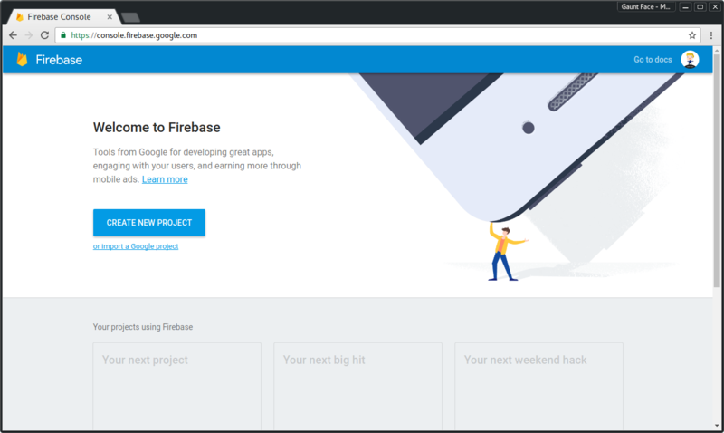
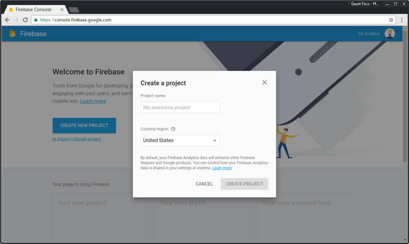
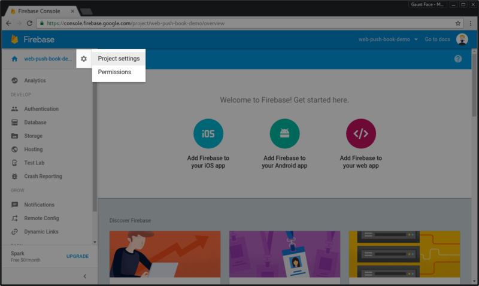
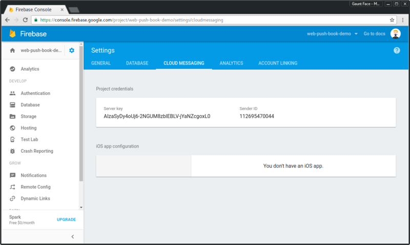
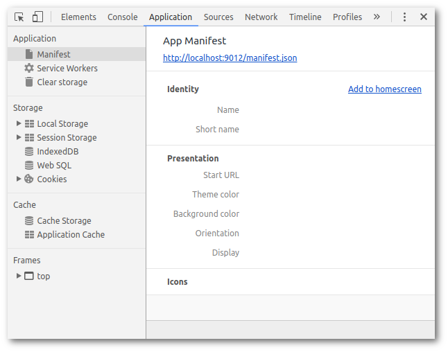

project_path: /web/_project.yaml
book_path: /web/fundamentals/_book.yaml

{# wf_updated_on:  #}
{# wf_published_on: 2016-06-30 #}

# Non-Standards Browsers {: .page-title }



# Non-Standards Browsers

Throughout this book we've been using the application server key to identify our application with push services. This is the Web Standards approach of application identification.

In older versions of Chrome (version 51 and before), Opera for Android and the Samsung Internet Browser there was a non-standards approach for identifying your application.

In these browsers they required a `gcm_sender_id` parameter to be added to a [web app manifest](https://developer.mozilla.org/en-US/docs/Web/Manifest) and the value have to be a Sender ID for a Google Developer Project.

This was completely proprietary and only required since the application server key / VAPID spec had not been defined.

In this section we are going to look at how we can add support for these browsers. Please note that this isn't recommended, but if you have a large audience on any of these browsers / browser versions, you should consider this.

## What is gcm_sender_id?

The "gcm_sender_id" parameter came about in the early versions of Chrome
when web push was first implemented. Google had a push service called "Google
Cloud Messaging", which is now called "Firebase Cloud Messaging", both of which
are commonly referred to as "GCM" and "FCM" for short.

For the Chrome team to implement push they decided to use "GCM" as it was a Google controller push service that they could work with, but it had
two major drawbacks.

1. GCM needed a developer account to be set up and a "Sender ID" passed to
Chrome.
1. GCM used a proprietary API to trigger messages. The API required a special "Authorization" header which is an API key the developer account, this way GCM can match the API key to the sender ID.

First we'll look at how to create a Firebase project to get the
"Sender ID" and API key used for the "Authorization" header.

Then we'll look at adding the "gcm_sender_id" and what the API looks like to trigger a push.

## Creating a Firebase Account

I briefly mentioned that Google Cloud Messaging was renamed to Firebase
Cloud Messaging. For this reason we can use details from a Firebase project to work with the older GCM API. The reason we are doing this is that setting up a Firebase project is easier than an older Google Developer project.

The first step is to create a new Firebase project on [https://console.firebase.google.com](https://console.firebase.google.com).

{: .center-image }

Creating a new project is simple, just fill in your project name and select
your country.

{: .center-image }

Once you've created your project, you'll find all the important push specific
info in settings, which can be found by hovering / clicking the cog next
to your projects name.

{: .center-image }

In settings, click on the "Cloud Messaging" tab and here you'll find a "Server
key" and a "Sender ID". We'll need these two pieces of information shortly.

{: .center-image }

## Adding a Web App Manifest

The non-standards browsers will look for your sender ID in a web app manifest. For anyone who's new to the web app manifest, it's a  JSON file that browsers can use to gain extra information about their web app. This includes meta data like your web app's name, icon, theme color and other goodies, to learn more [check out the MDN docs](https://developer.mozilla.org/en-US/docs/Web/Manifest).

For push, all we need is a JSON file with the field "gcm_sender_id" and we'll give it a value of the Sender ID from our Firebase project, like this:

    {
      "gcm_sender_id": "547903344792"
    }

Save this JSON as a file on your site, the demo for this site has a file
called 'manifest.json' at the root of the site, i.e. '/manifest.json'.

Browsers will look for the manifest by looking for a "manifest" `link` tag in the `head` of our page.

    <link rel="manifest" href="/manifest.json">

With this set up, when `subscribe()` is called, browsers that require this will retrieve the web app manifest and use the `gcm_sender_id` value to subscribe the user to "GCM".

If anything does wrong, you might receive an error like this:

    Registration failed - no sender id provided

    Registration failed - manifest empty or missing

    Registration failed - gcm_sender_id not found in manifest

    Failed to subscribe the user. DOMException: Registration failed - missing applicationServerKey, and manifest empty or missing

If this happens, make sure your manifest is valid JSON and make sure you have the write sender ID value.

If you are still stumped as to what the problem could be go into Chrome DevTools, select the **Application** pane, select the **Manifest** tab and click the 'Add to homescreen' link, this will force Chrome to get the manifest and parse it. This can often give a more helpful error message if there is a problem.

{: .center-image }

In Chrome, you can test whether your `gcm_sender_id` works or not by removing the *applicationServerKey* from your `subscribe()` options. This will result on Chrome using the `gcm_sender_id` as a fallback.

## Using the Server Key

Once you've got a `PushSusbcription`, you can tell if it's using the
`gcm_sender_id` from your manifest because the endpoint for the subscription
will start with `https://android.googleapis.com/gcm/send/`. This is the old endpoint for GCM.

For these `PushSubscriptions`, you can still send a Web Push Protocol request,
but you need to set the **Authorization** header to `key=<Server Key from Firebase Project>`.

Remember, the 'Authorization' header would normally be the signed JWT using your application server keys, you can determine which to use based on the endpoint. Most (if not all) [Web Push libraries on Github](https://github.com/web-push-libs/) will manage this for you.

The code that does this for the Node Web Library is:

    const isGCM = subscription.endpoint.indexOf(
      'https://android.googleapis.com/gcm/send') === 0;
    if (isGCM) {
      requestDetails.headers.Authorization = 'key=' + currentGCMAPIKey;
    } else {
      // Add Application Server Key Details
      ...
    }

## Browser Specifics

### Opera for Desktop

One thing to call out with Opera is that at the time of writing push is supported on their Android browser. On Desktop the API's are visible, but once you call subscribe, it will reject. There is no obvious way of feature detecting this sadly.

You'll need to either detect you are in Opera on desktop via user agent sniffing or simply let users go through your UI to enable push and fail at the last step.

### No Payload

At the time of writing the Samsung Internet Browser doesn't support
sending data with a push message (although it should do soon). This may also
be the case with new browsers as they start to support web push.

This isn't necessarily a bad thing as you can make an API call when
a push message is received, but for some this causes a great deal of
complication. If you fall into the bracket of requiring payload support you
can feature detect payload support by checking for the existence of `getKey()` on the `PushSubscription` prototype.

    // payloadSupport is true when supported, false otherwise.
    const payloadSupport = 'getKey' in PushSubscription.prototype;

## Conclusion

Please just remember that when you see references to GCM, it's referring to a legacy, non-standard implementation of web push and will be phased out.

Only implement this *if* you have an audience from supporting browsers that warrant use of GCM.
