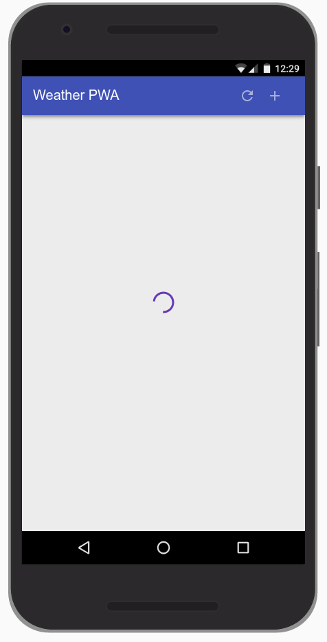
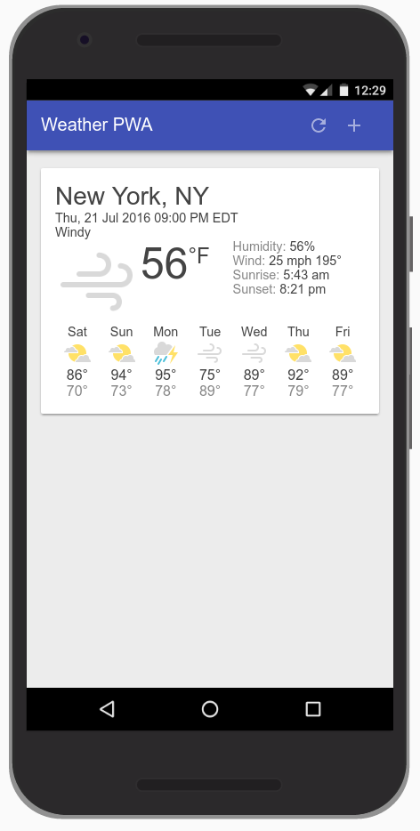
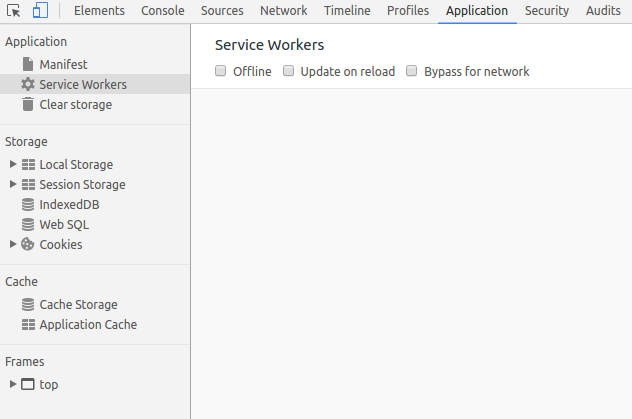
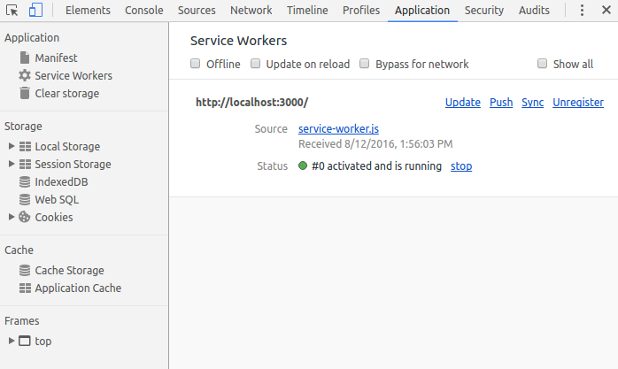
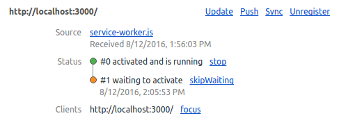
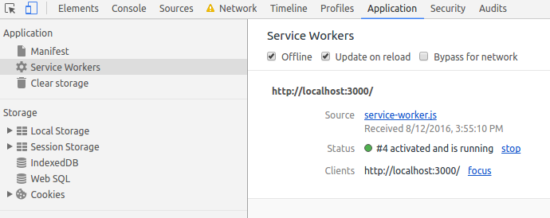
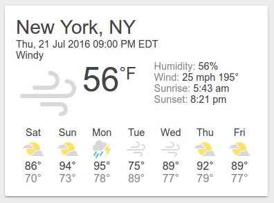
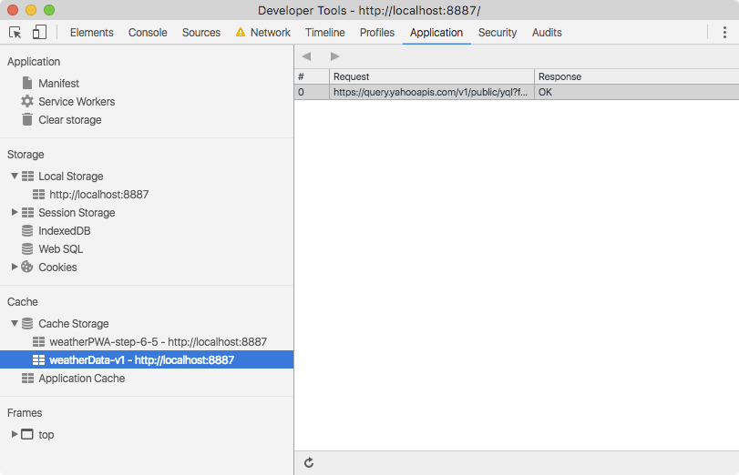
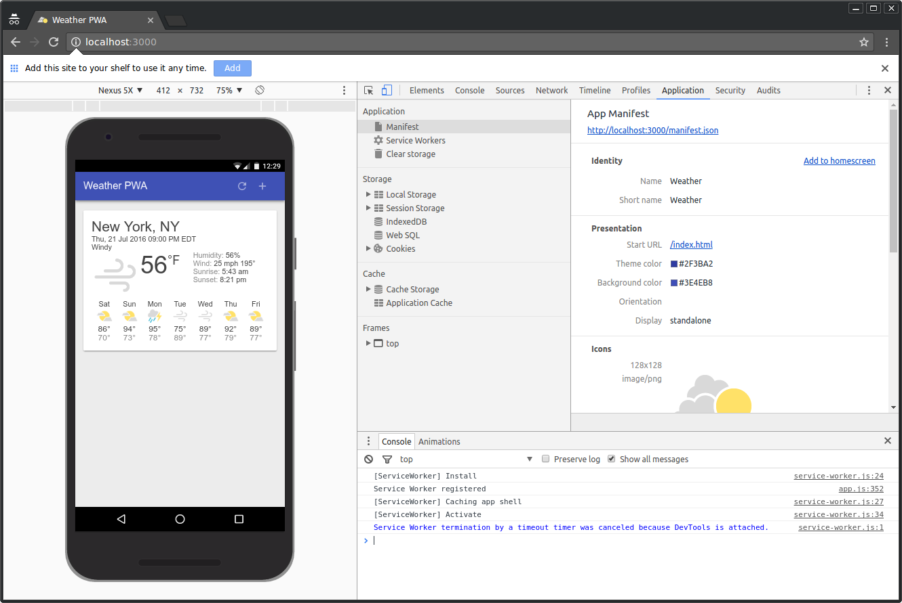

project_path: /web/_project.yaml
book_path: /web/fundamentals/_book.yaml
description: In this codelab, you'll build a Progressive Web App, which loads quickly, even on flaky networks, has an icon on the homescreen, and loads as a top-level, full screen experience.

{# wf_updated_on: 2016-11-02T10:11:19Z #}
{# wf_published_on: 2016-01-01 #}


# Your First Progressive Web App {: .page-title }




## Introduction


[Progressive Web Apps](/web/progressive-web-apps) are experiences that combine the best of the web and the best of apps. They are useful to users from the very first visit in a browser tab, no install required. As the user progressively builds a relationship with the app over time, it becomes more and more powerful. It loads quickly, even on flaky networks, sends relevant push notifications, has an icon on the home screen, and loads as a top-level, full screen experience.

### What is a Progressive Web App?

A Progressive Web App is:

* __Progressive__ - Works for every user, regardless of browser choice because it's built with progressive enhancement as a core tenet.
* __Responsive__ - Fits any form factor: desktop, mobile, tablet, or whatever is next.
* __Connectivity independent__ - Enhanced with service workers to work offline or on low-quality networks.
* __App-like__ - Feels like an app to the user with app-style interactions and navigation because it's built on the app shell model.
* __Fresh__ - Always up-to-date thanks to the service worker update process.
* __Safe__ - Served via HTTPS to prevent snooping and to ensure content hasn't been tampered with.
* __Discoverable__ - Is identifiable as an "application" thanks to W3C manifest and service worker registration scope, allowing search engines to find it.
* __Re-engageable__ - Makes re-engagement easy through features like push notifications.
* __Installable__ - Allows users to "keep" apps they find most useful on their home screen without the hassle of an app store.
* __Linkable__ - Easily share via URL, does not require complex installation.

This codelab will walk you through creating your own Progressive Web App, including the design considerations, as well as implementation details to ensure that your app meets the key principles of a Progressive Web App.

### What are we going to be building?

### What you'll learn

* How to design and construct an app using the "app shell" method
* How to make your app work offline
* How to store data for use offline later

### What you'll need

* Chrome 52 or above
*  [Web Server for Chrome](https://chrome.google.com/webstore/detail/web-server-for-chrome/ofhbbkphhbklhfoeikjpcbhemlocgigb), or your own web server of choice
* The sample code
* A text editor
* Basic knowledge of HTML, CSS, JavaScript, and Chrome DevTools

This codelab is focused on Progressive Web Apps. Non-relevant concepts and code blocks are glossed over and are provided for you to simply copy and paste.


## Getting set up


### Download the Code

Click the following button to download all the code for this codelab:

[Link](https://github.com/googlecodelabs/your-first-pwapp/archive/master.zip)

Unpack the downloaded zip file. This will unpack a root folder (`your-first-pwapp-master`), which contains one folder for each step of this codelab, along with all of the resources you will need.

The `step-NN` folders contain the desired end state of each step of this codelab. They are there for reference. We'll be doing all our coding work in a directory called `work`.

### Install and verify web server

While you're free to use your own web server, this codelab is designed to work well with the Chrome Web Server. If you don't have that app installed yet, you can install it from the Chrome Web Store.

[Link](https://chrome.google.com/webstore/detail/web-server-for-chrome/ofhbbkphhbklhfoeikjpcbhemlocgigb?hl=en)

After installing the Web Server for Chrome app, click on the Apps shortcut on the bookmarks bar: 


In the ensuing window, click on the Web Server icon: 


You'll see this dialog next, which allows you to configure your local web server:


Click the __choose folder__ button, and select the `work` folder. This will enable you to serve your work in progress via the URL highlighted in the web server dialog (in the __Web Server URL(s)__ section).

Under Options, check the box next to "Automatically show index.html", as shown below:


Then stop and restart the server by sliding the toggle labeled "Web Server: STARTED" to the left and then back to the right.


Now visit your work site in your web browser (by clicking on the highlighted Web Server URL) and you should see a page that looks like this:



Obviously, this app is not yet doing anything interesting - so far, it's just a minimal skeleton with a spinner we're using to verify your web server functionality. We'll add functionality and UI features in subsequent steps. 


## Architect your App Shell


### What is the app shell?

The app's shell is the minimal HTML, CSS, and JavaScript that is required to power the user interface of a progressive web app and is one of the components that ensures reliably good performance. Its first load should be extremely quick and immediately cached. "Cached" means that the shell files are loaded once over the network and then saved to the local device. Every subsequent time that the user opens the app, the shell files are loaded from the local device's cache, which results in blazing-fast startup times. 

App shell architecture separates the core application infrastructure and UI from the data. All of the UI and infrastructure is cached locally using a service worker so that on subsequent loads, the Progressive Web App only needs to retrieve the necessary data, instead of having to load everything.


Put another way, the app shell is similar to the bundle of code that you'd publish to an app store when building a native app. It is the core components necessary to get your app off the ground, but likely does not contain the data.

### Why use the App Shell architecture?

Using the app shell architecture allows you to focus on speed, giving your Progressive Web App similar properties to native apps: instant loading and regular updates, all without the need of an app store.

### Design the App Shell 

The first step is to break the design down into its core components.

Ask yourself:

* What needs to be on screen immediately?
* What other UI components are key to our app?
* What supporting resources are needed for the app shell? For example images, JavaScript, styles, etc.

When designing a more complex app, content that isn't needed for the initial load can be requested later and then cached for future use. For example, we could defer the loading of the New City dialog until after we've rendered the first run experience and have some idle cycles available.


## Implement your App Shell


There are multiple ways to get started with any project, and we generally recommend using Web Starter Kit. But, in this case, to keep our project as simple as possible and concentrate on Progressive Web Apps, we've provided you with all of the resources you'll need.

### Create the HTML for the App Shell

Now we'll add the core components we discussed in  [Architect the App Shell](/web/fundamentals/getting-started/your-first-progressive-web-app/step-01).

Remember, the key components will consist of:

* Header with a title, and add/refresh buttons
* Container for forecast cards
* A forecast card template
* A dialog for adding new cities
* A loading indicator

The `index.html` file that is already in your `work` directory should look something like this (this is a subset of the actual contents, don't copy this code into your file):

```
<!DOCTYPE html>
<html>
<head>
  <meta charset="utf-8">
  <meta http-equiv="X-UA-Compatible" content="IE=edge">
  <meta name="viewport" content="width=device-width, initial-scale=1.0">
  <title>Weather PWA</title>
  <link rel="stylesheet" type="text/css" href="styles/inline.css">
</head>
<body>
  <header class="header">
    <h1 class="header__title">Weather PWA</h1>
    <button id="butRefresh" class="headerButton"></button>
    <button id="butAdd" class="headerButton"></button>
  </header>

  <main class="main">
    <div class="card cardTemplate weather-forecast" hidden>
    . . .
    </div>
  </main>

  <div class="dialog-container">
  . . .
  </div>

  <div class="loader">
    <svg viewBox="0 0 32 32" width="32" height="32">
      <circle id="spinner" cx="16" cy="16" r="14" fill="none"></circle>
    </svg>
  </div>

  <!-- Insert link to app.js here -->
</body>
</html>
```

Notice the loader is visible by default. This ensures that the user sees the loader immediately as the page loads, giving them a clear indication that the content is loading.

To save time, we've also already created the stylesheet for you to use.

### Check out the key JavaScript app code

Now that we have most of the UI ready, it's time to start hooking up the code to make everything work. Like the rest of the app shell, be conscious about what code is necessary as part of the key experience and what can be loaded later.

Your work directory also already includes the app code (`scripts/app.js`), in it you'll find:

* An `app` object that contains some of the key information necessary for the app.
* The event listeners for all of the buttons in the header (`add/refresh`) and in the add city dialog (`add/cancel`).
* A method to add or update forecast cards (`app.updateForecastCard`).
* A method to get the latest weather forecast data from the Firebase Public Weather API (`app.getForecast`).
* A method to iterate the current cards and call `app.getForecast` to get the latest forecast data (`app.updateForecasts`).
* Some fake data (`initialWeatherForecast`) you can use to quickly test how things render.

### Test it out

Now that you've got the core HTML, styles and JavaScript, it's time to test the app.

To see how the fake weather data is rendered, uncomment the following line at the bottom of your `index.html` file:

    <!--<script src="scripts/app.js" async></script>-->

Next, uncomment the following line at the bottom of your `app.js` file:

    // app.updateForecastCard(initialWeatherForecast);

Reload your app. The result should be a nicely formatted (though fake, as you can tell by the date) forecast card with the spinner disabled, like this:



[Link](https://weather-pwa-sample.firebaseapp.com/step-04/)

Once you've tried it and verified it works as expected, you can remove the call to  `app.updateForecastCard` with the fake data again. We only needed it to ensure that everything worked as expected.


## Start with a fast first load


Progressive Web Apps should start fast and be usable immediately. In its current state, our Weather App starts quickly, but it's not useable. There's no data. We could make an AJAX request to get that data, but that results in an extra request and makes the initial load longer. Instead, provide real data in the first load.

### Inject the weather forecast data

For this code lab, we'll simulate the server injecting the weather forecast directly into the JavaScript, but in a production app, the latest weather forecast data would be injected by the server based on the IP address geo-location of the user.

The code already contains the data that we're going to inject. It's the `initialWeatherForecast` that we used in the previous step.

### Differentiating the first run

But, how do we know when to display this information, which may not be relevant on future loads when the weather app is pulled from the cache? When the user loads the app on subsequent visits, they may have changed cities, so we need to load the information for those cities, not necessarily the first city they ever looked up.

User preferences, like the list of cities a user has subscribed to, should be stored locally using IndexedDB or another fast storage mechanism. To simplify this code lab as much as possible, we've used  [localStorage](https://developer.mozilla.org/en-US/docs/Web/API/Window/localStorage), which is not ideal for production apps because it is a blocking, synchronous storage mechanism that is potentially very slow on some devices.

First, let's add the code required to save user preferences. Find the following TODO comment in your code.

```
  // TODO add saveSelectedCities function here
```

And add the following code below the comment.

```
  // Save list of cities to localStorage.
  app.saveSelectedCities = function() {
    var selectedCities = JSON.stringify(app.selectedCities);
    localStorage.selectedCities = selectedCities;
  };
```

Next, let's add the startup code to check if the user has any saved cities and render those, or use the injected data. Find the following comment:

```
  // TODO add startup code here
```

And add the following code below this comment:

```
/************************************************************************
   *
   * Code required to start the app
   *
   * NOTE: To simplify this codelab, we've used localStorage.
   *   localStorage is a synchronous API and has serious performance
   *   implications. It should not be used in production applications!
   *   Instead, check out IDB (https://www.npmjs.com/package/idb) or
   *   SimpleDB (https://gist.github.com/inexorabletash/c8069c042b734519680c)
   ************************************************************************/

  app.selectedCities = localStorage.selectedCities;
  if (app.selectedCities) {
    app.selectedCities = JSON.parse(app.selectedCities);
    app.selectedCities.forEach(function(city) {
      app.getForecast(city.key, city.label);
    });
  } else {
    /* The user is using the app for the first time, or the user has not
     * saved any cities, so show the user some fake data. A real app in this
     * scenario could guess the user's location via IP lookup and then inject
     * that data into the page.
     */
    app.updateForecastCard(initialWeatherForecast);
    app.selectedCities = [
      {key: initialWeatherForecast.key, label: initialWeatherForecast.label}
    ];
    app.saveSelectedCities();
  }
```

The startup code checks if there are any cities saved in local storage. If so, then it parses the local storage data and then displays a forecast card for each of the saved cities. Else, the startup code just uses the fake forecast data and saves that as the default city.

### Save the selected cities

Finally, you need to modify the "add city" button handler to save the selected city to local storage.

Update your `butAddCity` click handler so that it matches the following code:

```
document.getElementById('butAddCity').addEventListener('click', function() {
    // Add the newly selected city
    var select = document.getElementById('selectCityToAdd');
    var selected = select.options[select.selectedIndex];
    var key = selected.value;
    var label = selected.textContent;
    if (!app.selectedCities) {
      app.selectedCities = [];
    }
    app.getForecast(key, label);
    app.selectedCities.push({key: key, label: label});
    app.saveSelectedCities();
    app.toggleAddDialog(false);
  });
```

The new additions are the initialization of `app.selectedCities` if it doesn't exist, and the calls to `app.selectedCities.push()` and `app.saveSelectedCities()`.

### Test it out

* When first run, your app should immediately show the user the forecast from `initialWeatherForecast`.
* Add a new city (by clicking the + icon on the upper right) and verify that two cards are shown.
* Refresh the browser and verify that the app loads both forecasts and shows the latest information.

[Link](https://weather-pwa-sample.firebaseapp.com/step-05/)


## Use service workers to pre-cache the App Shell


Progressive Web Apps have to be fast, and installable, which means that they work online, offline, and on intermittent, slow connections. To achieve this, we need to cache our app shell using service worker, so that it's always available quickly and reliably.

If you're unfamiliar with service workers, you can get a basic understanding by reading  [Introduction To Service Workers](/web/fundamentals/primers/service-worker/) about what they can do, how their lifecycle works and more. Once you've completed this code lab, be sure to check out the  [Debugging Service Workers code lab](http://goo.gl/jhXCBy) for a more indepth look at how to work with service workers.

Features provided via service workers should be considered a progressive enhancement, and added only if supported by the browser. For example, with service workers you can cache the app shell and data for your app, so that it's available even when the network isn't. When service workers aren't supported, the offline code isn't called, and the user gets a basic experience. Using feature detection to provide progressive enhancement has little overhead and it won't break in older browsers that don't support that feature.

### Register the service worker if it's available

The first step to making the app work offline is to register a service worker, a script that allows background functionality without the need for an open web page or user interaction.

This takes two simple steps:

1. Tell the browser to register the JavaScript file as the service worker.
2. Create a JavaScript file containing the service worker.

First, we need to check if the browser supports service workers, and if it does, register the service worker. Add the following code to `app.js` (after the `// TODO add service worker code here` comment):

```
  if ('serviceWorker' in navigator) {
    navigator.serviceWorker
             .register('./service-worker.js')
             .then(function() { console.log('Service Worker Registered'); });
  }
```

### Cache the site assets

When the service worker is registered, an install event is triggered the first time the user visits the page. In this event handler, we will cache all the assets that are needed for the application.

When the service worker is fired, it should open the  [caches](https://developer.mozilla.org/en-US/docs/Web/API/Cache) object and populate it with the assets necessary to load the App Shell. Create a file called `service-worker.js` in your application root folder (which should be `your-first-pwapp-master/work` directory). This file must live in the application root because the scope for service workers is defined by the directory in which the file resides. Add this code to your new `service-worker.js` file:

```
var cacheName = 'weatherPWA-step-6-1';
var filesToCache = [];

self.addEventListener('install', function(e) {
  console.log('[ServiceWorker] Install');
  e.waitUntil(
    caches.open(cacheName).then(function(cache) {
      console.log('[ServiceWorker] Caching app shell');
      return cache.addAll(filesToCache);
    })
  );
});
```

First, we need to open the cache with `caches.open()` and provide a cache name. Providing a cache name allows us to version files, or separate data from the app shell so that we can easily update one but not affect the other.

Once the cache is open, we can then call `cache.addAll()`, which takes a list of URLs, then fetches them from the server and adds the response to the cache. Unfortunately, `cache.addAll()` is atomic, if any of the files fail, the entire cache step fails!

Alright, let's start getting familiar with how you can use DevTools to understand and debug service workers. Before reloading your page, open up DevTools, go the __Service Worker __pane on the __Application __panel. It should look like this.



When you see a blank page like this, it means that the currently open page does not have any registered service workers.

Now, reload your page. The Service Worker pane should now look like this.



When you see information like this, it means the page has a service worker running.

OK, now we're are going to take a brief detour and demonstrate a gotcha that you may encounter when developing service workers. To demonstrate, let's add an `activate` event listener below the `install` event listener in your `service-worker.js` file. 

```
self.addEventListener('activate', function(e) {
  console.log('[ServiceWorker] Activate');
});
```

The `activate` event is fired when the service worker starts up.

Open up the DevTools Console and reload the page, switch to the Service Worker pane in the Application panel and click inspect on the activated service worker. You expect to see the `[ServiceWorker] Activate` message logged to the console, but it didn't happen. Check out your Service Worker pane and you can see that the new service worker (that includes the activate event listener) appears to be in a "waiting" state.



Basically, the old service worker continues to control the page as long as there is a tab open to the page. So, you  *could * close and re-open the page or press the __skipWaiting __button, but a longer-term solution is to just enable the __Update on Reload __checkbox on the Service Worker pane of DevTools. When this checkbox is enabled, the service worker is forcibly updated every time that the page reloads.

Enable the __update on reload __checkbox now and reload the page to confirm that the new service worker gets activated.

__Note:__ You may see an error in the Service Worker pane of the Application panel similar to the one below, it's __safe__ to ignore this error.


That's all for now regarding inspecting and debugging service workers in DevTools. We'll show you some more tricks later. Let's get back to building your app.

Let's expand on the `activate` event listener to include some logic to update the cache. Update your code to match the code below.

```
self.addEventListener('activate', function(e) {
  console.log('[ServiceWorker] Activate');
  e.waitUntil(
    caches.keys().then(function(keyList) {
      return Promise.all(keyList.map(function(key) {
        if (key !== cacheName) {
          console.log('[ServiceWorker] Removing old cache', key);
          return caches.delete(key);
        }
      }));
    })
  );
  return self.clients.claim();
});
```

This code ensures that your service worker updates its cache whenever any of the app shell files change. In order for this to work, you'd need to increment the `cacheName` variable at the top of your service worker file.

The last statement fixes a corner-case which you can read about in the (optional) information box below.

Finally, let's update the list of files required for the app shell. In the array, we need to include all of the files our app needs, including images, JavaScript, stylesheets, etc. Near the top of your `service-worker.js` file, replace `var filesToCache = [];` with the code below:

```
var filesToCache = [
  '/',
  '/index.html',
  '/scripts/app.js',
  '/styles/inline.css',
  '/images/clear.png',
  '/images/cloudy-scattered-showers.png',
  '/images/cloudy.png',
  '/images/fog.png',
  '/images/ic_add_white_24px.svg',
  '/images/ic_refresh_white_24px.svg',
  '/images/partly-cloudy.png',
  '/images/rain.png',
  '/images/scattered-showers.png',
  '/images/sleet.png',
  '/images/snow.png',
  '/images/thunderstorm.png',
  '/images/wind.png'
];
```

Our app doesn't work offline quite yet. We've cached the app shell components, but we still need to load them from the local cache.

### Serve the app shell from the cache

Service workers provide the ability to intercept requests made from our Progressive Web App and handle them within the service worker. That means we can determine how we want to handle the request and potentially serve our own cached response.

For example:

```
self.addEventListener('fetch', function(event) {
  // Do something interesting with the fetch here
});
```

Let's now serve the app shell from the cache. Add the following code to the bottom of your `service-worker.js` file:

```
self.addEventListener('fetch', function(e) {
  console.log('[ServiceWorker] Fetch', e.request.url);
  e.respondWith(
    caches.match(e.request).then(function(response) {
      return response || fetch(e.request);
    })
  );
});
```

Stepping from inside, out, `caches.match()` evaluates the web request that triggered the  [fetch](https://developer.mozilla.org/en-US/docs/Web/API/Fetch_API) event, and checks to see if it's available in the cache. It then either responds with the cached version, or uses `fetch` to get a copy from the network. The `response` is passed back to the web page with `e.respondWith()`.

### Test it out

Your app is now offline-capable! Let's try it out.

Reload your page and then go to the __Cache Storage__ pane on the __Application__ panel of DevTools. Expand the section and you should see the name of your app shell cache listed on the left-hand side. When you click on your app shell cache you can see all of the resources that it has currently cached.


Now, let's test out offline mode. Go back to the __Service Worker__ pane of DevTools and enable the __Offline__ checkbox. After enabling it, you should see a little yellow warning icon next to the __Network__ panel tab. This indicates that you're offline.



Reload your page and... it works! Kind of, at least. Notice how it loads the initial (fake) weather data.



Check out the `else` clause in `app.getForecast()` to understand why the app is able to load the fake data.

The next step is to modify the app and service worker logic to be able to cache weather data, and return the most recent data from the cache when the app is offline.

__Tip:__ To start fresh and clear all saved data (localStoarge, indexedDB data, cached files) and remove any service workers, use the Clear storage pane in the Application tab.

[Link](https://weather-pwa-sample.firebaseapp.com/step-06/)

### Beware of the edge cases

As previously mentioned, this code __must not be used in production__ because of the many unhandled edge cases.

#### Cache depends on updating the cache key for every change

For example this caching method requires you to update the cache key every time content is changed, otherwise, the cache will not be updated, and the old content will be served. So be sure to change the cache key with every change as you're working on your project!

#### Requires everything to be redownloaded for every change

Another downside is that the entire cache is invalidated and needs to be re-downloaded every time a file changes. That means fixing a simple single character spelling mistake will invalidate the cache and require everything to be downloaded again. Not exactly efficient.

#### Browser cache may prevent the service worker cache from updating

There's another important caveat here. It's crucial that the HTTPS request made during the install handler goes directly to the network and doesn't return a response from the browser's cache. Otherwise the browser may return the old, cached version, resulting in the service worker cache never actually updating!

#### Beware of cache-first strategies in production

Our app uses a cache-first strategy, which results in a copy of any cached content being returned without consulting the network. While a cache-first strategy is easy to implement, it can cause challenges in the future. Once the copy of the host page and service worker registration is cached, it can be extremely difficult to change the configuration of the service worker (since the configuration depends on where it was defined), and you could find yourself deploying sites that are extremely difficult to update!

#### How do I avoid these edge cases?

So how do we avoid these edge cases? Use a library like  [sw-precache](https://github.com/GoogleChrome/sw-precache), which provides fine control over what gets expired, ensures requests go directly to the network and handles all of the hard work for you.

### Tips for testing live service workers

Debugging service workers can be a challenge, and when it involves caching, things can become even more of a nightmare if the cache isn't updated when you expect it. Between the typical service worker life cycle and bug in your code, you may become quickly frustrated. But don't. There are some tools you can use to make your life easier.

#### Start Fresh

In some cases, you may find yourself loading cached data or that things aren't updated as you expect. To clear all saved data (localStoarge, indexedDB data, cached files) and remove any service workers, use the Clear storage pane in the Application tab.

Some other tips:

* Once a service worker has been unregistered, it may remain listed until its containing browser window is closed.
* If multiple windows to your app are open, the new service worker will not take effect until they've all been reloaded and updated to the latest service worker.
* Unregistering a service worker does not clear the cache, so it may be possible you'll still get old data if the cache name hasn't changed.
* If a service worker exists and a new service worker is registered, the new service worker won't take control until the page is reloaded, unless you take  [immediate control](https://github.com/GoogleChrome/samples/tree/gh-pages/service-worker/immediate-control).


## Use service workers to cache the forecast data


Choosing the right  [caching strategy](https://jakearchibald.com/2014/offline-cookbook/) for your data is vital and depends on the type of data your app presents. For example, time-sensitive data like weather or stock quotes should be as fresh as possible, while avatar images or article content can be updated less frequently.

The  [cache-first-then-network](https://jakearchibald.com/2014/offline-cookbook/#cache-network-race) strategy is ideal for our app. It gets data on screen as quickly as possible, then updates that once the network has returned the latest data. In comparison to network-first-then-cache, the user does not have to wait until the  [fetch](https://developer.mozilla.org/en-US/docs/Web/API/Fetch_API) times out to get the cached data.

Cache-first-then-network means we need to kick off two asynchronous requests, one to the cache and one to the network. Our network request with the app doesn't need to change much, but we need to modify the service worker to cache the response before returning it.

Under normal circumstances, the cached data will be returned almost immediately providing the app with recent data it can use. Then, when the network request returns, the app will be updated using the latest data from the network.

### Intercept the network request and cache the response

We need to modify the service worker to intercept requests to the weather API and store their responses in the cache, so we can easily access them later. In the cache-then-network strategy, we expect the network response to be the ‘source of truth', always providing us with the most recent information. If it can't, it's OK to fail because we've already retrieved the latest cached data in our app.

In the service worker, let's add a `dataCacheName` so that we can separate our applications data from the app shell. When the app shell is updated and older caches are purged, our data will remain untouched, ready for a super fast load. Keep in mind, if your data format changes in the future, you'll need a way to handle that and ensure the app shell and content stay in sync.

Add the following line to the top of your `service-worker.js` file:

```
var dataCacheName = 'weatherData-v1';
```

Next, update the `activate` event handler so that it doesn't delete the data cache when it cleans up the app shell cache.

```
if (key !== cacheName && key !== dataCacheName) {
```

Finally, update the `fetch` event handler to handle requests to the data API separately from other requests.

```
self.addEventListener('fetch', function(e) {
  console.log('[Service Worker] Fetch', e.request.url);
  var dataUrl = 'https://query.yahooapis.com/v1/public/yql';
  if (e.request.url.indexOf(dataUrl) > -1) {
    /*
     * When the request URL contains dataUrl, the app is asking for fresh
     * weather data. In this case, the service worker always goes to the
     * network and then caches the response. This is called the "Cache then
     * network" strategy:
     * https://jakearchibald.com/2014/offline-cookbook/#cache-then-network
     */
    e.respondWith(
      caches.open(dataCacheName).then(function(cache) {
        return fetch(e.request).then(function(response){
          cache.put(e.request.url, response.clone());
          return response;
        });
      })
    );
  } else {
    /*
     * The app is asking for app shell files. In this scenario the app uses the
     * "Cache, falling back to the network" offline strategy:
     * https://jakearchibald.com/2014/offline-cookbook/#cache-falling-back-to-network
     */
    e.respondWith(
      caches.match(e.request).then(function(response) {
        return response || fetch(e.request);
      })
    );
  }
});
```

The code intercepts the request and checks if the URL starts with the address of the weather API. If it does we'll use  [fetch](https://developer.mozilla.org/en-US/docs/Web/API/Fetch_API) to make the request. Once the response is returned, our code opens the cache, clones the response, stores it in the cache, and finally returns the response to the original requestor.

Our app won't work offline quite yet. We've implemented caching and retrieval for the app shell, but even though we're caching the data, the app doesn't yet check the cache to see if it has any weather data. 

### Making the requests

As mentioned previously, the app needs to kick off two asynchronous requests, one to the cache and one to the network. The app uses the `caches` object available in `window` to access the cache and retrieve the latest data. This is an excellent example of progressive enhancement as the `caches` object may not be available in all browsers, and if it's not the network request should still work.

To do this, we need to:

1. Check if the `caches` object is available in the global `window` object.
2. Request data from the cache. 

* If the server request is still outstanding, update the app with the cached data.

3. Request data from the server.

* Save the data for quick access later.
* Update the app with the fresh data from the server.

#### Get data from the cache

Next, we need to check if the `caches` object exists and request the latest data from it. Find the `TODO add cache logic here` comment in `app.getForecast()`, and then add the code below under the comment.

```
    if ('caches' in window) {
      /*
       * Check if the service worker has already cached this city's weather
       * data. If the service worker has the data, then display the cached
       * data while the app fetches the latest data.
       */
      caches.match(url).then(function(response) {
        if (response) {
          response.json().then(function updateFromCache(json) {
            var results = json.query.results;
            results.key = key;
            results.label = label;
            results.created = json.query.created;
            app.updateForecastCard(results);
          });
        }
      });
    }
```

Our weather app now makes two asynchronous requests for data, one from the `cache` and one via an XHR. If there's data in the cache, it'll be returned and rendered extremely quickly (tens of milliseconds) and update the card only if the XHR is still outstanding. Then, when the XHR responds, the card will be updated with the freshest data direct from the weather API.

Notice how the cache request and the XHR request both end with a call to update the forecast card. How does the app know whether it's displaying the latest data? This is handled in the following code from `app.updateForecastCard`:

```
    var cardLastUpdatedElem = card.querySelector('.card-last-updated');
    var cardLastUpdated = cardLastUpdatedElem.textContent;
    if (cardLastUpdated) {
      cardLastUpdated = new Date(cardLastUpdated);
      // Bail if the card has more recent data then the data
      if (dataLastUpdated.getTime() < cardLastUpdated.getTime()) {
        return;
      }
    }
```

Every time that a card is updated, the app stores the timestamp of the data on a hidden attribute on the card. The app just bails if the timestamp that already exists on the card is newer than the data that was passed to the function.

### Test it out

The app should be completely offline-functional now. Save a couple of cities and press the refresh button on the app to get fresh weather data, and then go offline and reload the page. 

Then go to the __Cache Storage__ pane on the __Application__ panel of DevTools. Expand the section and you should see the name of your app shell and data cache listed on the left-hand side. Opening the data cache should should the data stored for each city.



[Link](https://weather-pwa-sample.firebaseapp.com/step-07/)


## Support native integration


Nobody likes to have to type in long URLs on a mobile keyboard if they don't need to. With the Add To home screen feature, your users can choose to add a shortcut link to their device just as they would install a native app from a store, but with a lot less friction.

### Web App Install Banners and Add to Homescreen for Chrome on Android

Web app install banners give you the ability to let your users quickly and seamlessly add your web app to their home screen, making it easy to launch and return to your app. Adding app install banners is easy, and Chrome handles most of the heavy lifting for you. We simply need to include a web app manifest file with details about the app.

Chrome then uses a set of criteria including the use of a service worker, SSL status and visit frequency heuristics to determine when to show the banner. In addition a user can manually add it via the "Add to Home Screen" menu button in Chrome.

#### Declare an app manifest with a `manifest.json` file

The web app manifest is a simple JSON file that gives you, the developer, the ability to control how your app appears to the user in the areas that they would expect to see apps (for example the mobile home screen), direct what the user can launch and more importantly how they can launch it.

Using the web app manifest, your web app can:

* Have a rich presence on the user's Android home screen
* Be launched in full-screen mode on Android with no URL bar
* Control the screen orientation for optimal viewing
* Define a "splash screen" launch experience and theme color for the site
* Track whether you're launched from the home screen or URL bar

Create a file named `manifest.json` in your `work` folder and copy/paste the following contents:

```
{
  "name": "Weather",
  "short_name": "Weather",
  "icons": [{
    "src": "images/icons/icon-128x128.png",
      "sizes": "128x128",
      "type": "image/png"
    }, {
      "src": "images/icons/icon-144x144.png",
      "sizes": "144x144",
      "type": "image/png"
    }, {
      "src": "images/icons/icon-152x152.png",
      "sizes": "152x152",
      "type": "image/png"
    }, {
      "src": "images/icons/icon-192x192.png",
      "sizes": "192x192",
      "type": "image/png"
    }, {
      "src": "images/icons/icon-256x256.png",
      "sizes": "256x256",
      "type": "image/png"
    }],
  "start_url": "/index.html",
  "display": "standalone",
  "background_color": "#3E4EB8",
  "theme_color": "#2F3BA2"
}
```

The manifest supports an array of icons, intended for different screen sizes. At the time of this writing, Chrome and Opera Mobile, the only browsers that support web app manifests, won't use anything smaller than 192px.

An easy way to track how the app is launched is to add a query string to the `start_url` parameter and then use an analytics suite to track the query string. If you use this method, remember to update the list of files cached by the App Shell to ensure that the file with the query string is cached.

#### Tell the browser about your manifest file

Now add the following line to the bottom of the `<head>` element in your `index.html` file: 

```
<link rel="manifest" href="/manifest.json">
```

#### Best Practices

* Place the manifest link on all your site's pages, so it will be retrieved by Chrome right when the user first visits, no matter what page they land on.
* The `short_name` is preferred on Chrome and will be used if present over the name field.
* Define icon sets for different density screens. Chrome will attempt to use the icon closest to 48dp, for example, 96px on a 2x device or 144px for a 3x device.
* Remember to include an icon with a size that is sensible for a splash screen and don't forget to set the `background_color`.

Further Reading:

[Using app install banners](/web/fundamentals/engage-and-retain/simplified-app-installs/)

### Add to Homescreen elements for Safari on iOS

In your `index.html`, add the following to the bottom of the `<head>` element:

```
  <!-- Add to home screen for Safari on iOS -->
  <meta name="apple-mobile-web-app-capable" content="yes">
  <meta name="apple-mobile-web-app-status-bar-style" content="black">
  <meta name="apple-mobile-web-app-title" content="Weather PWA">
  <link rel="apple-touch-icon" href="images/icons/icon-152x152.png">
```

### Tile Icon for Windows

In your `index.html`, add the following to the bottom of the `<head>` element:

```
  <meta name="msapplication-TileImage" content="images/icons/icon-144x144.png">
  <meta name="msapplication-TileColor" content="#2F3BA2">
```

### Test it out

In this section we'll show you a couple of ways to test your web app manifest.

The first way is DevTools. Open up the __Manifest __pane on the __Application __panel. If you've added the manifest information correctly, you'll be able to see it parsed and displayed in a human-friendly format on this pane.

You can also test the add to homescreen feature from this pane. Click on the __Add to homescreen __button. You should see a "add this site to your shelf" message below your URL bar, like in the screenshot below.



This is the desktop equivalent of mobile's add to homescreen feature. If you can successfully trigger this prompt on desktop, then you can be assured that mobile users can add your app to their devices.

The second way to test is via Web Server for Chrome. With this approach, you expose your local development server (on your desktop or laptop) to other computers, and then you just access your progressive web app from a real mobile device.

On Web Server for Chrome configuration dialog, select the `Accessible on local network` option:


Toggle the Web Server to `STOPPED` and back to `STARTED`. You'll see a new URL which can be used to access your app remotely.

Now, access your site from a mobile device, using the new URL.

You will see service worker errors in the console when testing this way because the service worker is not being served over HTTPS.

Using Chrome from an Android device, try adding the app to the homescreen and verifying that the launch screen appears properly and the right icons are used.

On Safari and Internet Explorer, you can also manually add the app to your homescreen.

[Link](https://weather-pwa-sample.firebaseapp.com/step-08/)


## Deploy to a secure host and celebrate


The final step is to deploy our weather app to a server that supports HTTPS. If you don't already have one, the absolute easiest (and free) approach is to use the static content hosting from Firebase. It's super easy to use, serves content over HTTPS and is backed by a global CDN.

### Extra credit: minify and inline CSS

There's one more thing that you should consider, minifying the key styles and inlining them directly into `index.html`.  [Page Speed Insights](/speed) recommends serving the above the fold content in the first 15k bytes of the request.

See how small you can get the initial request with everything inlined.

Further Reading:  [PageSpeed Insight Rules](/speed/docs/insights/rules)

### Deploy to Firebase

If you're new to Firebase, you'll need to create your account and install some tools first.

1. Create a Firebase account at  [https://firebase.google.com/console/](https://firebase.google.com/console/)
2. Install the Firebase tools via npm: `npm install -g firebase-tools`

Once your account has been created and you've signed in, you're ready to deploy!

1. Create a new app at  [https://firebase.google.com/console/](https://firebase.google.com/console/)
2. If you haven't recently signed in to the Firebase tools, update your credentials: `firebase login`
3. Initialize your app, and provide the directory (likely `work`) where your completed app lives: `firebase init`
4. Finally, deploy the app to Firebase: `firebase deploy`
5. Celebrate. You're done! Your app will be deployed to the domain: `https://YOUR-FIREBASE-APP.firebaseapp.com`

Further reading:  [Firebase Hosting Guide](https://www.firebase.com/docs/hosting/guide/)

### Test it out

* Try adding the app to your home screen then disconnect the network and verify the app works offline as expected.

[Link](https://weather-pwa-sample.firebaseapp.com/final/)


## Found an issue, or have feedback? {: .hide-from-toc }
Help us make our code labs better by submitting an 
[issue](https://github.com/googlecodelabs/your-first-pwapp/issues) today. And thanks!
