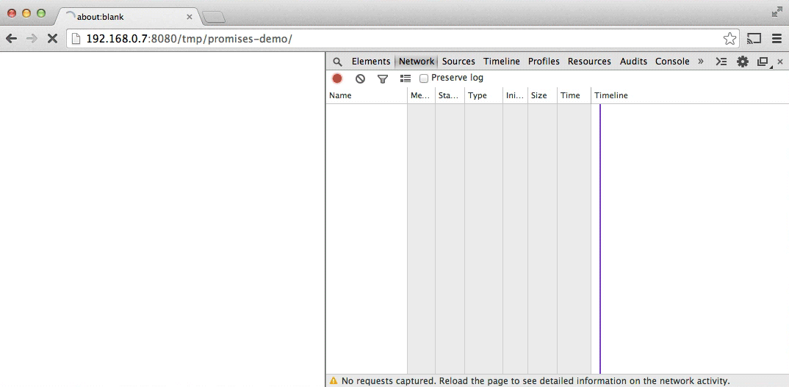
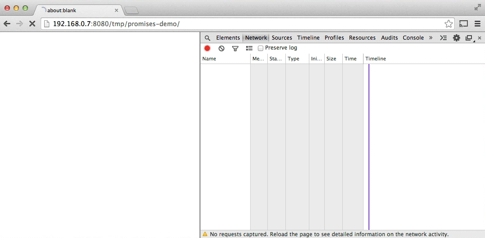

project_path: /web/_project.yaml
book_path: /web/fundamentals/_book.yaml
description: "Promises simplify deferred and asynchronous computations. A promise represents an operation that hasn't completed yet."

{# wf_published_on: 2013-12-16 #}
{# wf_updated_on: 2014-01-29 #}

# JavaScript Promises: an Introduction {: .page-title }



Ladies and gentlemen, prepare yourself for a pivotal moment in the history of
web development.

<em>[Drumroll begins]</em>

Promises have arrived natively in JavaScript!

<em>[Fireworks explode, glittery paper rains from above, the crowd goes wild]</em>

At this point you fall into one of these categories:

* People are cheering around you, but you're not sure what all the fuss is about. Maybe you're not even sure what a "promise" is. You'd shrug, but the weight of glittery paper is weighing down on your shoulders. If so, don't worry about it, it took me ages to work out why I should care about this stuff. You probably want to begin at the [beginning](#whats-all-the-fuss-about).
* You punch the air! About time right? You've used these Promise things before but it bothers you that all implementations have a slightly different API. What's the API for the official JavaScript version? You probably want to begin with the [terminology](#promise-terminology).
* You knew about this already and you scoff at those who are jumping up and down like it's news to them. Take a moment to bask in your own superiority, then head straight to the [API reference](#promise-api-reference).

## What's all the fuss about? {: #whats-all-the-fuss-about }

JavaScript is single threaded, meaning that two bits of script cannot run at the same time; they have to run one after another. In browsers, JavaScript shares a thread with a load of other stuff that differs from browser to browser. But typically JavaScript is in the same queue as painting, updating styles, and handling user actions (such as highlighting text and interacting with form controls). Activity in one of these things delays the others.

As a human being, you're multithreaded. You can type with multiple fingers, you can drive and hold a conversation at the same time. The only blocking function we have to deal with is sneezing, where all current activity must be suspended for the duration of the sneeze. That's pretty annoying, especially when you're driving and trying to hold a conversation. You don't want to write code that's sneezy.

You've probably used events and callbacks to get around this. Here are events:

    var img1 = document.querySelector('.img-1');

    img1.addEventListener('load', function() {
      // woo yey image loaded
    });

    img1.addEventListener('error', function() {
      // argh everything's broken
    });

This isn't sneezy at all. We get the image, add a couple of listeners, then JavaScript can stop executing until one of those listeners is called.

Unfortunately, in the example above, it's possible that the events happened before we started listening for them, so we need to work around that using the "complete" property of images:

    var img1 = document.querySelector('.img-1');

    function loaded() {
      // woo yey image loaded
    }

    if (img1.complete) {
      loaded();
    }
    else {
      img1.addEventListener('load', loaded);
    }

    img1.addEventListener('error', function() {
      // argh everything's broken
    });

This doesn't catch images that error'd before we got a chance to listen for them; unfortunately the DOM doesn't give us a way to do that. Also, this is loading one image, things get even more complex if we want to know when a set of images have loaded.

## Events aren't always the best way

Events are great for things that can happen multiple times on the same object&mdash;keyup, touchstart etc. With those events you don't really care about what happened before you attached the listener. But when it comes to async success/failure, ideally you want something like this:

    img1.callThisIfLoadedOrWhenLoaded(function() {
      // loaded
    }).orIfFailedCallThis(function() {
      // failed
    });

    // and…
    whenAllTheseHaveLoaded([img1, img2]).callThis(function() {
      // all loaded
    }).orIfSomeFailedCallThis(function() {
      // one or more failed
    });

This is what promises do, but with better naming. If HTML image elements had a "ready" method that returned a promise, we could do this:

    img1.ready().then(function() {
      // loaded
    }, function() {
      // failed
    });

    // and…
    Promise.all([img1.ready(), img2.ready()]).then(function() {
      // all loaded
    }, function() {
      // one or more failed
    });

At their most basic, promises are a bit like event listeners except:

* A promise can only succeed or fail once. It cannot succeed or fail twice, neither can it switch from success to failure or vice versa.
* If a promise has succeeded or failed and you later add a success/failure callback, the correct callback will be called, even though the event took place earlier.

This is extremely useful for async success/failure, because you're less interested in the exact time something became available, and more interested in reacting to the outcome.

## Promise terminology {: #promise-terminology }

[Domenic Denicola](https://twitter.com/domenic) proof read the first draft of this article and graded me "F" for terminology. He put me in detention, forced me to copy out [States and Fates](https://github.com/domenic/promises-unwrapping/blob/master/docs/states-and-fates.md) 100 times, and wrote a worried letter to my parents. Despite that, I still get a lot of the terminology mixed up, but here are the basics:

A promise can be:

* **fulfilled** - The action relating to the promise succeeded
* **rejected** - The action relating to the promise failed
* **pending** - Hasn't fulfilled or rejected yet
* **settled** - Has fulfilled or rejected

[The spec](https://people.mozilla.org/~jorendorff/es6-draft.html#sec-promise-objects) also uses the term **thenable** to describe an object that is promise-like, in that it has a `then` method. This term reminds me of ex-England Football Manager [Terry Venables](https://en.wikipedia.org/wiki/Terry_Venables) so I'll be using it as little as possible.

## Promises arrive in JavaScript!

Promises have been around for a while in the form of libraries, such as:

* [Q](https://github.com/kriskowal/q)
* [when](https://github.com/cujojs/when)
* [WinJS](https://msdn.microsoft.com/en-us/library/windows/apps/br211867.aspx)
* [RSVP.js](https://github.com/tildeio/rsvp.js)

The above and JavaScript promises share a common, standardised behaviour called [Promises/A+](https://github.com/promises-aplus/promises-spec). If you're a jQuery user, they have something similar called [Deferreds](https://api.jquery.com/category/deferred-object/). However, Deferreds aren't Promise/A+ compliant, which makes them [subtly different and less useful](https://thewayofcode.wordpress.com/tag/jquery-deferred-broken/), so beware. jQuery also has [a Promise type](https://api.jquery.com/Types/#Promise), but this is just a subset of Deferred and has the same issues.

Although promise implementations follow a standardised behaviour, their overall APIs differ. JavaScript promises are similar in API to RSVP.js. Here's how you create a promise:

    var promise = new Promise(function(resolve, reject) {
      // do a thing, possibly async, then…

      if (/* everything turned out fine */) {
        resolve("Stuff worked!");
      }
      else {
        reject(Error("It broke"));
      }
    });

The promise constructor takes one argument, a callback with two parameters, resolve and reject. Do something within the callback, perhaps async, then call resolve if everything worked, otherwise call reject.

Like `throw` in plain old JavaScript, it's customary, but not required, to reject with an Error object. The benefit of Error objects is they capture a stack trace, making debugging tools more helpful.

Here's how you use that promise:

    promise.then(function(result) {
      console.log(result); // "Stuff worked!"
    }, function(err) {
      console.log(err); // Error: "It broke"
    });

`then()` takes two arguments, a callback for a success case, and another for the failure case. Both are optional, so you can add a callback for the success or failure case only.

JavaScript promises started out in the DOM as "Futures", renamed to "Promises", and finally moved into JavaScript. Having them in JavaScript rather than the DOM is great because they'll be available in non-browser JS contexts such as Node.js (whether they make use of them in their core APIs is another question).

Although they're a JavaScript feature, the DOM isn't afraid to use them. In fact, all new DOM APIs with async success/failure methods will use promises. This is happening already with [Quota Management](https://dvcs.w3.org/hg/quota/raw-file/tip/Overview.html#idl-def-StorageQuota), [Font Load Events](http://dev.w3.org/csswg/css-font-loading/#font-face-set-ready), [ServiceWorker](https://github.com/slightlyoff/ServiceWorker/blob/cf459d473ae09f6994e8539113d277cbd2bce939/service_worker.ts#L17), [Web MIDI](https://webaudio.github.io/web-midi-api/#widl-Navigator-requestMIDIAccess-Promise-MIDIOptions-options), [Streams](https://github.com/whatwg/streams#basereadablestream), and more.

## Browser support &amp; polyfill

There are already implementations of promises in browsers today.

As of Chrome 32, Opera 19, Firefox 29, Safari 8 &amp; Microsoft Edge, promises are enabled by default.

To bring browsers that lack a complete promises implementation up to spec compliance, or add promises to other browsers and Node.js, check out [the polyfill](https://github.com/jakearchibald/ES6-Promises#readme) (2k gzipped).

## Compatibility with other libraries

The JavaScript promises API will treat anything with a `then()` method as promise-like (or `thenable` in promise-speak _sigh_), so if you use a library that returns a Q promise, that's fine, it'll play nice with the new JavaScript promises.

Although, as I mentioned, jQuery's Deferreds are a bit … unhelpful. Thankfully you can cast them to standard promises, which is worth doing as soon as possible:

    var jsPromise = Promise.resolve($.ajax('/whatever.json'))

Here, jQuery's `$.ajax` returns a Deferred. Since it has a `then()` method, `Promise.resolve()` can turn it into a JavaScript promise. However, sometimes deferreds pass multiple arguments to their callbacks, for example:

    var jqDeferred = $.ajax('/whatever.json');

    jqDeferred.then(function(response, statusText, xhrObj) {
      // ...
    }, function(xhrObj, textStatus, err) {
      // ...
    })

Whereas JS promises ignore all but the first:

    jsPromise.then(function(response) {
      // ...
    }, function(xhrObj) {
      // ...
    })

Thankfully this is usually what you want, or at least gives you access to what you want. Also, be aware that jQuery doesn't follow the convention of passing Error objects into rejections.

## Complex async code made easier

Right, let's code some things. Say we want to:

1. Start a spinner to indicate loading
1. Fetch some JSON for a story, which gives us the title, and urls for each chapter
1. Add title to the page
1. Fetch each chapter
1. Add the story to the page
1. Stop the spinner

… but also tell the user if something went wrong along the way. We'll want to stop the spinner at that point too, else it'll keep on spinning, get dizzy, and crash into some other UI.

Of course, you wouldn't use JavaScript to deliver a story, [serving as HTML is faster](https://jakearchibald.com/2013/progressive-enhancement-is-faster/), but this pattern is pretty common when dealing with APIs: Multiple data fetches, then do something when it's all done.

To start with, let's deal with fetching data from the network:

## Promisifying XMLHttpRequest

Old APIs will be updated to use promises, if it's possible in a backwards compatible way. `XMLHttpRequest` is a prime candidate, but in the mean time let's write a simple function to make a GET request:

    function get(url) {
      // Return a new promise.
      return new Promise(function(resolve, reject) {
        // Do the usual XHR stuff
        var req = new XMLHttpRequest();
        req.open('GET', url);

        req.onload = function() {
          // This is called even on 404 etc
          // so check the status
          if (req.status == 200) {
            // Resolve the promise with the response text
            resolve(req.response);
          }
          else {
            // Otherwise reject with the status text
            // which will hopefully be a meaningful error
            reject(Error(req.statusText));
          }
        };

        // Handle network errors
        req.onerror = function() {
          reject(Error("Network Error"));
        };

        // Make the request
        req.send();
      });
    }

Now let's use it:

    get('story.json').then(function(response) {
      console.log("Success!", response);
    }, function(error) {
      console.error("Failed!", error);
    })

[Click here to see that in action](https://github.com/googlesamples/web-fundamentals/blob/gh-pages/fundamentals/getting-started/primers/story.json){: target="_blank" .external }, check the console in DevTools to see the result. Now we can make HTTP requests without manually typing `XMLHttpRequest`, which is great, because the less I have to see the infuriating camel-casing of `XMLHttpRequest`, the happier my life will be.

## Chaining

`then()` isn't the end of the story, you can chain `then`s together to transform values or run additional async actions one after another.

### Transforming values
You can transform values simply by returning the new value:

    var promise = new Promise(function(resolve, reject) {
      resolve(1);
    });

    promise.then(function(val) {
      console.log(val); // 1
      return val + 2;
    }).then(function(val) {
      console.log(val); // 3
    })

As a practical example, let's go back to:

    get('story.json').then(function(response) {
      console.log("Success!", response);
    })

The response is JSON, but we're currently receiving it as plain text. We could alter our get function to use the JSON [`responseType`](https://developer.mozilla.org/en-US/docs/Web/API/XMLHttpRequest#responseType), but we could also solve it in promises land:

    get('story.json').then(function(response) {
      return JSON.parse(response);
    }).then(function(response) {
      console.log("Yey JSON!", response);
    })

Since `JSON.parse()` takes a single argument and returns a transformed value, we can make a shortcut:

    get('story.json').then(JSON.parse).then(function(response) {
      console.log("Yey JSON!", response);
    })

[See that in action here](https://github.com/googlesamples/web-fundamentals/blob/gh-pages/fundamentals/getting-started/primers/story.json){: target="_blank" .external }, check the console in DevTools to see the result. In fact, we could make a `getJSON()` function really easily:

    function getJSON(url) {
      return get(url).then(JSON.parse);
    }

`getJSON()` still returns a promise, one that fetches a url then parses the response as JSON.

### Queuing asynchronous actions

You can also chain `then`s to run async actions in sequence.

When you return something from a `then()` callback, it's a bit magic. If you return a value, the next `then()` is called with that value. However, if you return something promise-like, the next `then()` waits on it, and is only called when that promise settles (succeeds/fails). For example:

    getJSON('story.json').then(function(story) {
      return getJSON(story.chapterUrls[0]);
    }).then(function(chapter1) {
      console.log("Got chapter 1!", chapter1);
    })

Here we make an async request to `story.json`, which gives us a set of URLs to request, then we request the first of those. This is when promises really start to stand out from simple callback patterns.

You could even make a shortcut method to get chapters:

    var storyPromise;

    function getChapter(i) {
      storyPromise = storyPromise || getJSON('story.json');

      return storyPromise.then(function(story) {
        return getJSON(story.chapterUrls[i]);
      })
    }

    // and using it is simple:
    getChapter(0).then(function(chapter) {
      console.log(chapter);
      return getChapter(1);
    }).then(function(chapter) {
      console.log(chapter);
    })

We don't download `story.json` until `getChapter` is called, but the next time(s) `getChapter` is called we reuse the story promise, so `story.json` is only fetched once. Yay Promises!

## Error handling

As we saw earlier, `then()` takes two arguments, one for success, one for failure (or fulfill and reject, in promises-speak):

    get('story.json').then(function(response) {
      console.log("Success!", response);
    }, function(error) {
      console.log("Failed!", error);
    })

You can also use `catch()`:

    get('story.json').then(function(response) {
      console.log("Success!", response);
    }).catch(function(error) {
      console.log("Failed!", error);
    })

There's nothing special about `catch()`, it's just sugar for `then(undefined, func)`, but it's more readable. Note that the two code examples above do not behave the same, the latter is equivalent to:

    get('story.json').then(function(response) {
      console.log("Success!", response);
    }).then(undefined, function(error) {
      console.log("Failed!", error);
    })

The difference is subtle, but extremely useful. Promise rejections skip forward to the next `then()` with a rejection callback (or `catch()`, since it's equivalent). With `then(func1, func2)`, `func1` or `func2` will be called, never both. But with `then(func1).catch(func2)`, both will be called if `func1` rejects, as they're separate steps in the chain. Take the following:

    asyncThing1().then(function() {
      return asyncThing2();
    }).then(function() {
      return asyncThing3();
    }).catch(function(err) {
      return asyncRecovery1();
    }).then(function() {
      return asyncThing4();
    }, function(err) {
      return asyncRecovery2();
    }).catch(function(err) {
      console.log("Don't worry about it");
    }).then(function() {
      console.log("All done!");
    })

The flow above is very similar to normal JavaScript try/catch, errors that happen within a "try" go immediately to the `catch()` block. Here's the above as a flowchart (because I love flowcharts):

  <iframe style="position:absolute;top:0;left:0;width:100%;height:100%;overflow:hidden" src="imgs/promise-flow.svg" frameborder="0" allowtransparency="true"></iframe>

Follow the blue lines for promises that fulfill, or the red for ones that reject.

### JavaScript exceptions and promises
Rejections happen when a promise is explicitly rejected, but also implicitly if an error is thrown in the constructor callback:

    var jsonPromise = new Promise(function(resolve, reject) {
      // JSON.parse throws an error if you feed it some
      // invalid JSON, so this implicitly rejects:
      resolve(JSON.parse("This ain't JSON"));
    });

    jsonPromise.then(function(data) {
      // This never happens:
      console.log("It worked!", data);
    }).catch(function(err) {
      // Instead, this happens:
      console.log("It failed!", err);
    })

This means it's useful to do all your promise-related work inside the promise constructor callback, so errors are automatically caught and become rejections.

The same goes for errors thrown in `then()` callbacks.

    get('/').then(JSON.parse).then(function() {
      // This never happens, '/' is an HTML page, not JSON
      // so JSON.parse throws
      console.log("It worked!", data);
    }).catch(function(err) {
      // Instead, this happens:
      console.log("It failed!", err);
    })

### Error handling in practice

With our story and chapters, we can use catch to display an error to the user:

    getJSON('story.json').then(function(story) {
      return getJSON(story.chapterUrls[0]);
    }).then(function(chapter1) {
      addHtmlToPage(chapter1.html);
    }).catch(function() {
      addTextToPage("Failed to show chapter");
    }).then(function() {
      document.querySelector('.spinner').style.display = 'none';
    })

If fetching `story.chapterUrls[0]` fails (e.g., http 500 or user is offline), it'll skip all following success callbacks, which includes the one in `getJSON()` which tries to parse the response as JSON, and also skips the callback that adds chapter1.html to the page. Instead it moves onto the catch callback. As a result, "Failed to show chapter" will be added to the page if any of the previous actions failed.

Like JavaScript's try/catch, the error is caught and subsequent code continues, so the spinner is always hidden, which is what we want. The above becomes a non-blocking async version of:

    try {
      var story = getJSONSync('story.json');
      var chapter1 = getJSONSync(story.chapterUrls[0]);
      addHtmlToPage(chapter1.html);
    }
    catch (e) {
      addTextToPage("Failed to show chapter");
    }
    document.querySelector('.spinner').style.display = 'none'

You may want to `catch()` simply for logging purposes, without recovering from the error. To do this, just rethrow the error. We could do this in our `getJSON()` method:

    function getJSON(url) {
      return get(url).then(JSON.parse).catch(function(err) {
        console.log("getJSON failed for", url, err);
        throw err;
      });
    }

So we've managed to fetch one chapter, but we want them all. Let's make that happen.

## Parallelism and sequencing: getting the best of both

Thinking async isn't easy. If you're struggling to get off the mark, try writing the code as if it were synchronous. In this case:

    try {
      var story = getJSONSync('story.json');
      addHtmlToPage(story.heading);

      story.chapterUrls.forEach(function(chapterUrl) {
        var chapter = getJSONSync(chapterUrl);
        addHtmlToPage(chapter.html);
      });

      addTextToPage("All done");
    }
    catch (err) {
      addTextToPage("Argh, broken: " + err.message);
    }

    document.querySelector('.spinner').style.display = 'none'

[Try it](https://googlesamples.github.io/web-fundamentals/fundamentals/getting-started/primers/sync-example.html){: target="_blank" .external }

That works (see [code](https://github.com/googlesamples/web-fundamentals/blob/gh-pages/fundamentals/getting-started/primers/sync-example.html){: target="_blank" .external })! 
But it's sync and locks up the browser while things download. To make this
work async we use `then()` to make things happen one after another.

    getJSON('story.json').then(function(story) {
      addHtmlToPage(story.heading);

      // TODO: for each url in story.chapterUrls, fetch &amp; display
    }).then(function() {
      // And we're all done!
      addTextToPage("All done");
    }).catch(function(err) {
      // Catch any error that happened along the way
      addTextToPage("Argh, broken: " + err.message);
    }).then(function() {
      // Always hide the spinner
      document.querySelector('.spinner').style.display = 'none';
    })

But how can we loop through the chapter urls and fetch them in order? This **doesn't work**:

    story.chapterUrls.forEach(function(chapterUrl) {
      // Fetch chapter
      getJSON(chapterUrl).then(function(chapter) {
        // and add it to the page
        addHtmlToPage(chapter.html);
      });
    })

`forEach` isn't async-aware, so our chapters would appear in whatever order they download, which is basically how Pulp Fiction was written. This isn't Pulp Fiction, so let's fix it.

### Creating a sequence
We want to turn our `chapterUrls` array into a sequence of promises. We can do that using `then()`:

    // Start off with a promise that always resolves
    var sequence = Promise.resolve();

    // Loop through our chapter urls
    story.chapterUrls.forEach(function(chapterUrl) {
      // Add these actions to the end of the sequence
      sequence = sequence.then(function() {
        return getJSON(chapterUrl);
      }).then(function(chapter) {
        addHtmlToPage(chapter.html);
      });
    })

This is the first time we've seen `Promise.resolve()`, which creates a promise that resolves to whatever value you give it. If you pass it an instance of `Promise` it'll simply return it (**note:** this is a change to the spec that some implementations don't yet follow). If you pass it something promise-like (has a `then()` method), it creates a genuine `Promise` that fulfills/rejects in the same way. If you pass in any other value, e.g., `Promise.resolve('Hello')`, it creates a promise that fulfills with that value. If you call it with no value, as above, it fulfills with "undefined".

There's also `Promise.reject(val)`, which creates a promise that rejects with the value you give it (or undefined).

We can tidy up the above code using [`array.reduce`](https://developer.mozilla.org/en-US/docs/Web/JavaScript/Reference/Global_Objects/Array/Reduce):

    // Loop through our chapter urls
    story.chapterUrls.reduce(function(sequence, chapterUrl) {
      // Add these actions to the end of the sequence
      return sequence.then(function() {
        return getJSON(chapterUrl);
      }).then(function(chapter) {
        addHtmlToPage(chapter.html);
      });
    }, Promise.resolve())

This is doing the same as the previous example, but doesn't need the separate "sequence" variable. Our reduce callback is called for each item in the array. "sequence" is `Promise.resolve()` the first time around, but for the rest of the calls "sequence" is whatever we returned from the previous call. `array.reduce` is really useful for boiling an array down to a single value, which in this case is a promise.

Let's put it all together:

    getJSON('story.json').then(function(story) {
      addHtmlToPage(story.heading);

      return story.chapterUrls.reduce(function(sequence, chapterUrl) {
        // Once the last chapter's promise is done…
        return sequence.then(function() {
          // …fetch the next chapter
          return getJSON(chapterUrl);
        }).then(function(chapter) {
          // and add it to the page
          addHtmlToPage(chapter.html);
        });
      }, Promise.resolve());
    }).then(function() {
      // And we're all done!
      addTextToPage("All done");
    }).catch(function(err) {
      // Catch any error that happened along the way
      addTextToPage("Argh, broken: " + err.message);
    }).then(function() {
      // Always hide the spinner
      document.querySelector('.spinner').style.display = 'none';
    })

[Try it](https://googlesamples.github.io/web-fundamentals/fundamentals/getting-started/primers/async-example.html){: target="_blank" .external }

And there we have it (see [code](https://github.com/googlesamples/web-fundamentals/blob/gh-pages/fundamentals/getting-started/primers/async-example.html){: target="_blank" .external }), a fully async version of the sync version. But we can do better. At the moment our page is downloading like this:

<figure>
  
</figure>

Browsers are pretty good at downloading multiple things at once, so we're losing performance by downloading chapters one after the other. What we want to do is download them all at the same time, then process them when they've all arrived. Thankfully there's an API for this:

    Promise.all(arrayOfPromises).then(function(arrayOfResults) {
      //...
    })

`Promise.all` takes an array of promises and creates a promise that fulfills when all of them successfully complete. You get an array of results (whatever the promises fulfilled to) in the same order as the promises you passed in.

    getJSON('story.json').then(function(story) {
      addHtmlToPage(story.heading);

      // Take an array of promises and wait on them all
      return Promise.all(
        // Map our array of chapter urls to
        // an array of chapter json promises
        story.chapterUrls.map(getJSON)
      );
    }).then(function(chapters) {
      // Now we have the chapters jsons in order! Loop through…
      chapters.forEach(function(chapter) {
        // …and add to the page
        addHtmlToPage(chapter.html);
      });
      addTextToPage("All done");
    }).catch(function(err) {
      // catch any error that happened so far
      addTextToPage("Argh, broken: " + err.message);
    }).then(function() {
      document.querySelector('.spinner').style.display = 'none';
    })

[Try it](https://googlesamples.github.io/web-fundamentals/fundamentals/getting-started/primers/async-all-example.html){: target="_blank" .external }

Depending on connection, this can be seconds faster than loading one-by-one (see [code](https://github.com/googlesamples/web-fundamentals/blob/gh-pages/fundamentals/getting-started/primers/async-all-example.html){: target="_blank" .external }), and it's less code than our first try. The chapters can download in whatever order, but they appear on screen in the right order.

<figure>
  
</figure>

However, we can still improve perceived performance. When chapter one arrives we should add it to the page. This lets the user start reading before the rest of the chapters have arrived. When chapter three arrives, we wouldn't add it to the page because the user may not realise chapter two is missing. When chapter two arrives, we can add chapters two and three, etc etc.

To do this, we fetch JSON for all our chapters at the same time, then create a sequence to add them to the document:

    getJSON('story.json').then(function(story) {
      addHtmlToPage(story.heading);

      // Map our array of chapter urls to
      // an array of chapter json promises.
      // This makes sure they all download parallel.
      return story.chapterUrls.map(getJSON)
        .reduce(function(sequence, chapterPromise) {
          // Use reduce to chain the promises together,
          // adding content to the page for each chapter
          return sequence.then(function() {
            // Wait for everything in the sequence so far,
            // then wait for this chapter to arrive.
            return chapterPromise;
          }).then(function(chapter) {
            addHtmlToPage(chapter.html);
          });
        }, Promise.resolve());
    }).then(function() {
      addTextToPage("All done");
    }).catch(function(err) {
      // catch any error that happened along the way
      addTextToPage("Argh, broken: " + err.message);
    }).then(function() {
      document.querySelector('.spinner').style.display = 'none';
    })

[Try it](https://googlesamples.github.io/web-fundamentals/fundamentals/getting-started/primers/async-best-example.html){: target="_blank" .external }

And there we go (see [code](https://github.com/googlesamples/web-fundamentals/blob/gh-pages/fundamentals/getting-started/primers/async-best-example.html){: target="_blank" .external }), the best of both! It takes the same amount of time to deliver all the content, but the user gets the first bit of content sooner.

<figure>
  
</figure>

In this trivial example, all of the chapters arrive around the same time, but the benefit of displaying one at a time will be exaggerated with more, larger chapters.

Doing the above with [Node.js-style callbacks or events](https://gist.github.com/jakearchibald/0e652d95c07442f205ce) is around double the code, but more importantly isn't as easy to follow. However, this isn't the end of the story for promises, when combined with other ES6 features they get even easier.

## Bonus round: promises and generators

This next bit involves a whole bunch of new ES6 features, but it's not something you need to understand to use promises in your code today. Treat it like a movie trailer for some upcoming blockbuster features.

ES6 also gives us [generators](http://wiki.ecmascript.org/doku.php?id=harmony:generators), which allow functions to exit at a particular point, like "return", but later resume from the same point and state, for example:

    function *addGenerator() {
      var i = 0;
      while (true) {
        i += yield i;
      }
    }

Notice the star before the function name, this makes it a generator. The yield keyword is our return/resume point. We can use it like this:

    var adder = addGenerator();
    adder.next().value; // 0
    adder.next(5).value; // 5
    adder.next(5).value; // 10
    adder.next(5).value; // 15
    adder.next(50).value; // 65

But what does this mean for promises? Well, you can use this return/resume behaviour to write async code that looks like (and is as easy to follow as) synchronous code. Don't worry too much about understanding it line-for-line, but here's a helper function that lets us use `yield` to wait for promises to settle:

    function spawn(generatorFunc) {
      function continuer(verb, arg) {
        var result;
        try {
          result = generator[verb](arg);
        } catch (err) {
          return Promise.reject(err);
        }
        if (result.done) {
          return result.value;
        } else {
          return Promise.resolve(result.value).then(onFulfilled, onRejected);
        }
      }
      var generator = generatorFunc();
      var onFulfilled = continuer.bind(continuer, "next");
      var onRejected = continuer.bind(continuer, "throw");
      return onFulfilled();
    }

… which I pretty much [lifted verbatim from Q](https://github.com/kriskowal/q/blob/db9220d714b16b96a05e9a037fa44ce581715e41/q.js#L500), but adapted for JavaScript promises. With this, we can take our final best-case chapter example, mix it with a load of new ES6 goodness, and turn it into:

    spawn(function *() {
      try {
        // 'yield' effectively does an async wait,
        // returning the result of the promise
        let story = yield getJSON('story.json');
        addHtmlToPage(story.heading);

        // Map our array of chapter urls to
        // an array of chapter json promises.
        // This makes sure they all download parallel.
        let chapterPromises = story.chapterUrls.map(getJSON);

        for (let chapterPromise of chapterPromises) {
          // Wait for each chapter to be ready, then add it to the page
          let chapter = yield chapterPromise;
          addHtmlToPage(chapter.html);
        }

        addTextToPage("All done");
      }
      catch (err) {
        // try/catch just works, rejected promises are thrown here
        addTextToPage("Argh, broken: " + err.message);
      }
      document.querySelector('.spinner').style.display = 'none';
    })

[Try it](https://googlesamples.github.io/web-fundamentals/fundamentals/getting-started/primers/async-generators-example.html){: target="_blank" .external }

This works exactly as before but is so much easier to read. This works in Chrome and Opera today (see [code](https://github.com/googlesamples/web-fundamentals/blob/gh-pages/fundamentals/getting-started/primers/async-generators-example.html){: target="_blank" .external }), and works in Microsoft Edge by going to `about:flags` and turning on the **Enable experimental Javascript features** setting. This will be enabled by default in an upcoming version.

This throws together a lot of new ES6 stuff: promises, generators, let, for-of. When we yield a promise, the spawn helper waits for the promise to resolve and returns the final value. If the promise rejects, spawn causes our yield statement to throw an exception, which we can catch with normal JavaScript try/catch. Amazingly simple async coding!

This pattern is so useful, it's coming to ES7 in the form of [async functions](https://jakearchibald.com/2014/es7-async-functions/). It's pretty much the same as above, but no need for a `spawn` method.

## Promise API reference {: #promise-api-reference }

All methods work in Chrome, Opera, Firefox, Microsoft Edge, and Safari unless otherwise noted. [The polyfill](https://github.com/jakearchibald/ES6-Promises#readme) provides the below for all browers.

### Static Methods

<table class="responsive methods">
<tr>
<th colspan="2">Method summaries</th>
</tr>
<tr>
  <td><code>Promise.resolve(promise);</code></td>
  <td>Returns promise (only if <code>promise.constructor == Promise</code>)</td>
</tr>
<tr>
  <td><code>Promise.resolve(thenable);</code></td>
  <td>Make a new promise from the thenable. A thenable is promise-like in as far as it has a `then()` method.</td>
</tr>
<tr>
  <td><code>Promise.resolve(obj);</code></td>
  <td>Make a promise that fulfills to <code>obj</code>. in this situation.</td>
</tr>
<tr>
  <td><code>Promise.reject(obj);</code></td>
  <td>Make a promise that rejects to <code>obj</code>. For consistency and debugging (e.g. stack traces), <code>obj</code> should be an <code>instanceof Error</code>.</td>
</tr>
<tr>
  <td><code>Promise.all(array);</code></td>
  <td>Make a promise that fulfills when every item in the array fulfills, and rejects if (and when) any item rejects. Each array item is passed to <code>Promise.resolve</code>, so the array can be a mixture of promise-like objects and other objects. The fulfillment value is an array (in order) of fulfillment values. The rejection value is the first rejection value.</td>
</tr>
<tr>
  <td><code>Promise.race(array);</code></td>
  <td>Make a Promise that fulfills as soon as any item fulfills, or rejects as soon as any item rejects, whichever happens first.</td>
</tr>
</table>

Note: I'm unconvinced of `Promise.race`'s usefulness; I'd rather have an opposite of `Promise.all` that only rejects if all items reject.

### Constructor

<table class="responsive constructors">
<tr>
<th colspan="2">Constructor</th>
</tr>
<tr>
  <td><code>new Promise(function(resolve, reject) {});</code></td>
  <td>
    

      <code>resolve(thenable)</code> 
      Your promise will be fulfilled/rejected with the outcome of <code>thenable</code>
    

    

      <code>resolve(obj)</code> 
      Your promise is fulfilled with <code>obj</code>
    

    

      <code>reject(obj)</code> 
      Your promise is rejected with <code>obj</code>. For consistency and 
      debugging (e.g., stack traces), obj should be an <code>instanceof Error</code>.
      Any errors thrown in the constructor callback will be implicitly passed
      to <code>reject()</code>.
    

  </td>
</tr>
</table>
    
### Instance Methods

<table class="responsive methods">
<tr>
<th colspan="2">Instance Methods</th>
</tr>
<tr>
  <td><code>promise.then(onFulfilled, onRejected)</code></td>
  <td>
    <code>onFulfilled</code> is called when/if "promise" resolves. 
    <code>onRejected</code> is called when/if "promise" rejects. Both are
    optional, if either/both are omitted the next 
    <code>onFulfilled</code>/<code>onRejected</code> in the chain is called. 
    Both callbacks have a single parameter, the fulfillment value or 
    rejection reason. <code>then()</code> returns a new promise equivalent to 
    the value you return from <code>onFulfilled</code>/<code>onRejected</code>
    after being passed through <code>Promise.resolve</code>. If an error is
    thrown in the callback, the returned promise rejects with that error.
  </td>
</tr>
<tr>
  <td><code>promise.catch(onRejected)</code></td>
  <td>Sugar for <code>promise.then(undefined, onRejected)</code></td>
</tr>
</table>

Many thanks to Anne van Kesteren, Domenic Denicola, Tom Ashworth, Remy Sharp, Addy Osmani, Arthur Evans, and Yutaka Hirano who proofread this and made corrections/recommendations.

Also, thanks to [Mathias Bynens](https://mathiasbynens.be/){: .external } for [updating various parts](https://github.com/html5rocks/www.html5rocks.com/pull/921/files) of the article.
