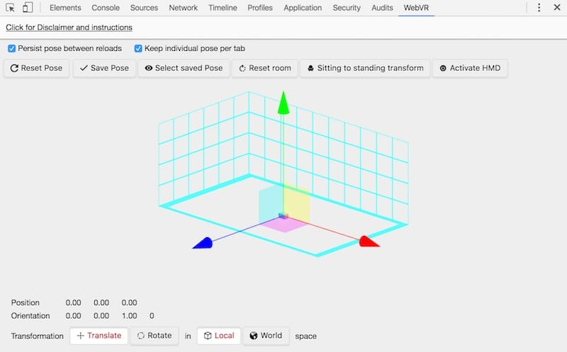

project_path: /web/fundamentals/_project.yaml
book_path: /web/fundamentals/_book.yaml
description: .

{# wf_updated_on: 2018-07-09 #}
{# wf_published_on: 2018-06-29 #}
{# wf_blink_components: Blink>WebVR #}

# Debugging {: .page-title }

## Install a WebVR Emulation Chrome DevTools Extension

Perhaps you find yourself not having a VR-capable device to test against. If that’s the case, help is at hand. Jaume Elias has created a [Chrome DevTools Extension which emulates a VR device](https://chrome.google.com/webstore/detail/webvr-api-emulation/gbdnpaebafagioggnhkacnaaahpiefil).

While it’s always preferable to test on real devices (especially for performance testing) this extension can help you quickly debug your apps.
