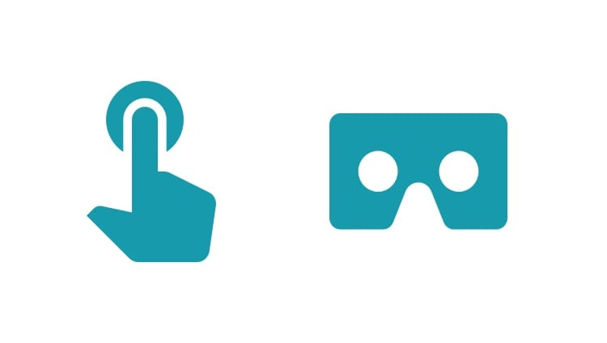

project_path: /web/fundamentals/_project.yaml
book_path: /web/fundamentals/_book.yaml
description: The immersive web: augmented and virtual reality.

{# wf_updated_on: 2018-06-22 #}
{# wf_published_on: 2018-06-29 #}
{# wf_blink_components: Blink>WebVR #}

# The immersive web {: .page-title }



  <iframe class="devsite-embedded-youtube-video" data-video-id="1t1gBVykneA"
          data-autohide="1" data-showinfo="0" frameborder="0" allowfullscreen>
  </iframe>

The immersive web is using JavaScript APIs with a VR headset or a VR-capable device such as a [Daydream headset](/ar/discover/supported-devices) to create a range of 3D experiences in your browser.

The immersive web includes a spectrum of experiences from complete reality to completely immersive, with various levels of AR in between.

## Support and Availability

Visit the [status page](/web/fundamentals/status.md) for details on support and availability.

## Creating WebVR Content

To make WebVR content, you'll need to use new APIs, with existing technologies like [WebGL](https://developer.mozilla.org/en-US/docs/Web/API/WebGL_API/Tutorial)
and [Web Audio](https://developer.mozilla.org/en-US/docs/Web/API/Web_Audio_API),
as well as accounting for different input types and headsets.

  <h3>Get Started with WebVR</h3>
  
  

    Make a flying start with WebVR by taking a WebGL scene and adding VR APIs. 
    <a href="./getting-started-with-webvr/">Learn More</a>
  

  <h3>Add Input to a WebVR Scene</h3>
  
  

    Interaction is a crucial part of providing an engaging and immersive experience. 
    <a href="./adding-input-to-a-webvr-scene">Get Started</a>
  

### More resources

There are some excellent WebVR resources beginning to appear around the web.

* TBD

## Keep track of your performance

TBD

## Embrace Progressive Enhancement

What if your users don’t have a Head Mounted Display (‘HMD’) or a
VR-capable device? The answer is progressive enhancement.

1. Assume the user is using traditional input, such as a keyboard, mouse, or
touchscreen with no access to a VR headset.
2. Adapt to changes in input and headset availability at runtime.

Thankfully the [WebVR API](https://immersive-web.github.io/webxr-reference/)
makes it possible to detect changes in the VR environment and adapt to changes in the inputs and viewing options in the user’s device.

By assuming a non-VR environment first you can maximize the reach of your
experiences, and ensure that you’re providing the best possible experience no
matter what setup your users have.

For more, read our guide on [adding input to a WebVR scene](./adding-input-to-a-webvr-scene).
