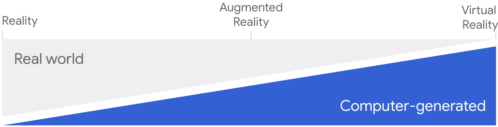

project_path: /web/fundamentals/_project.yaml
book_path: /web/fundamentals/_book.yaml
description: The immersive web: augmented and virtual reality.

{# wf_updated_on: 2018-07-16 #}
{# wf_published_on: 2018-06-29 #}
{# wf_blink_components: Blink>WebVR #}

# The immersive web {: .page-title }

  <iframe class="devsite-embedded-youtube-video" data-video-id="1t1gBVykneA"
          data-autohide="1" data-showinfo="0" frameborder="0" allowfullscreen>
  </iframe>

The immersive web means using JavaScript APIs with an <a href="https://developers.google.com/ar/discover/supported-devices">ARCore compatible device</a> to create a range of 3D experiences in your browser.

The immersive web includes a spectrum of experiences from complete reality to completely immersive, with various levels of augmented reality in between. To support this spectrum the [WebXR Device API](https://immersive-web.github.io/webxr-reference/webxr-device-api/) is designed such that a single code path is used regardless of the degree of immersion you want to create.

  

A few preliminaries:

<ul>
  <li><b><a href="status-requirments">Is the immersive web ready?</a></b> - Visit our status page for the latest cross-browser information about support and requirements for the immersive web.</li>
  <li><b><a href="related-technologies">Related technologies</a></b> - To create immersive content, you'll need to use new APIs with existing technologies like WebGL and Web Audio.</li>
</ul>

  <h3>Get Started with WebVR</h3>
  
  

    Make a flying start with the immersive web by taking a WebGL scene and adding WebXR APIs. 
    <a href="getting-started">Learn More</a>
  

  <h3>Add Input to a WebVR Scene</h3>
  
  

    The immersive web should be engaging as well as immersive. 
    <a href="add-input">Get Started</a>
  

  <h3>Keep track of performance</h3>
  
  

    Bad performance means users won't return to your site. Worse yet, it can even make them sick. 
    <a href="keep-track-of-performance">Learn More</a>
  

  <h3>Embrace progressive enhancement</h3>
  
  

    Without progressive enhancement users with older devices can't user your site. 
    <a href="embrace-progressive-enhancement">Get Started</a>
  

### More resources

There are some excellent WebVR resources beginning to appear around the web.

TBD
