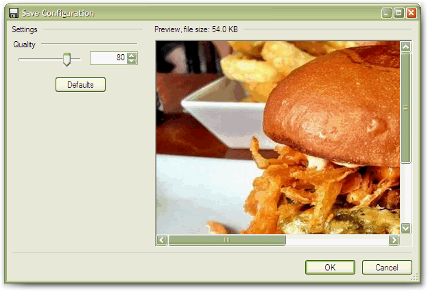
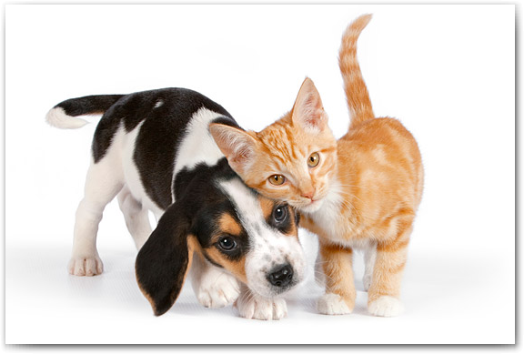
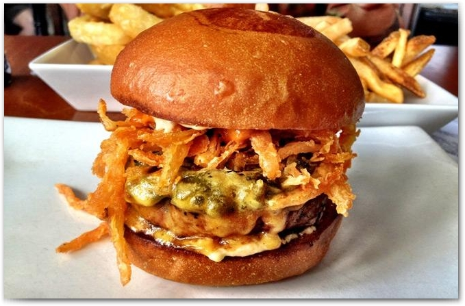
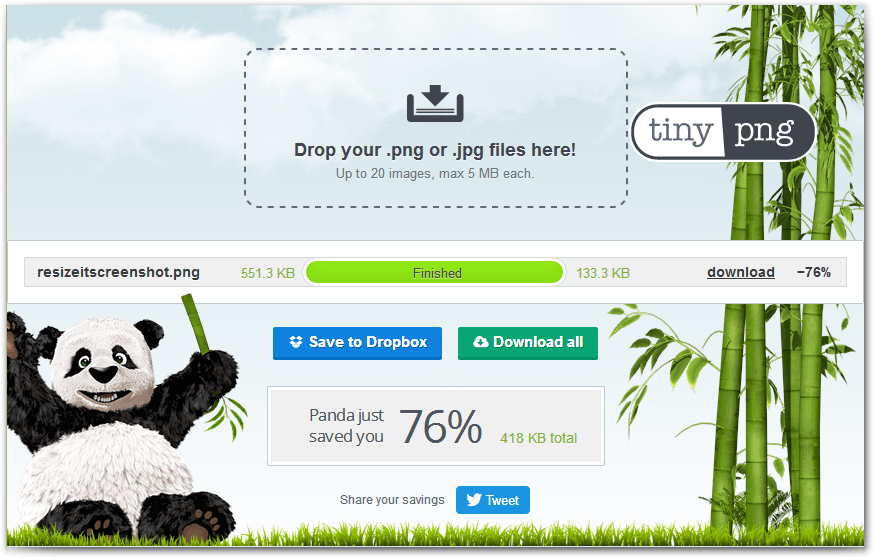
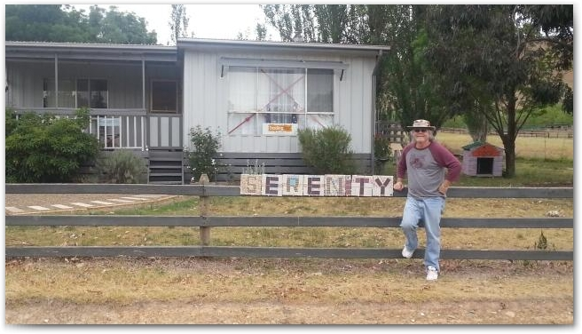
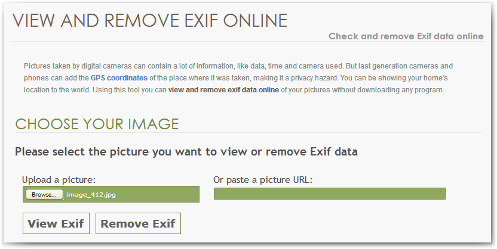
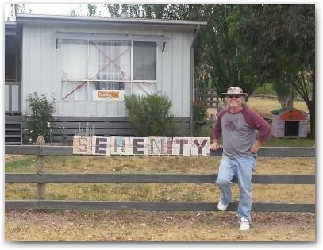

project_path: /web/fundamentals/_project.yaml
book_path: /web/fundamentals/_book.yaml

{# wf_updated_on: 2017-10-18 #}
{# wf_published_on: 2017-10-18 #}

# Graphical Content {: .page-title }



Web users are a visual bunch, and we rely on images to support web content. Like text, graphical content is a critical component in conveying information in a web page or app. All kinds of images, from charts and graphs to icons and arrows to mugshots and maps, provide instantaneous data and improve reader comprehension and retention. But unlike text, images require considerable time and bandwidth to download and render. Graphical content can easily account for 60%-85% of a typical website's total bandwidth (source: it depends on who you ask).

Clearly, one of the major ways to get a significant performance boost is to reduce the amount of time images take to load. Let's examine some ways to tackle this problem.

## Necessity

The first question to ask is whether you really need an image, and it's a question that apparently isn't asked enough. Far too many sites of all kinds put large, and mostly useless, images "above the fold". This slows down the page load and makes readers scroll halfway down the page before they even get to meaningful content. That's bad, bad design.

Yes, images can genuinely support text content or can just lend visual interest, but if an image doesn't add information or clarify meaning for the user, it's not contributing to the reader's experience and you should consider omitting it. The fastest image is one you don't have to download; every image you remove speeds up your page load time.

## Image Size

Of course, large images take longer to download and render than small ones, but the concept of "size" has some nuances.

### Browser-side Resizing

Often, large images are retrieved from the server and then resized in the browser with CSS. This might be for a perfectly logical reason -- such as using just one image for a thumbnail that expands on hover -- or it might just be careless coding. Whatever the reason, it wastes bandwidth.

For example, you might have a 1200 x 600 pixel image that you present at 60 x 30 (as a 5% thumbnail) and roll it up to full size on hover using a CSS transition. It works fine and looks great, but if the user never actually hovers over the thumbnail, then literally 95% of the time that image took to download was wasted. You may be better off taking the time to make separate, properly sized, thumbnails and use them in those locations, displaying the full sized images only if they're actually requested.

Of course, using separate images invokes a tradeoff in additional HTTP requests. It is worth testing to see which technique -- reducing the number of images or reducing the number of HTTP requests -- saves the most load time. You might also consider combining graphical resources as a balanced approach, as described in the next article, **HTTP Requests**.

But thumbnails aren't the only images that need physical resizing. All your images should be appropriately sized for their intended use and should not rely on the browser to resize them for rendering.

### Physical Resizing

Once you've determined the size that an image should really be, how do you get it to that size but still retain the quality and characteristics it needs? The first thing you need is a good image manipulation tool, of which there are many. Here are a few to consider.

#### ResizeIt

[https://itunes.apple.com/us/app/resizeit/id416280139](https://itunes.apple.com/us/app/resizeit/id416280139?mt=12)

This Mac-only desktop product lets you change the size of multiple images simultaneously, and can convert file formats at the same time. 

#### PicResize

[http://www.picresize.com/](http://www.picresize.com/)

One of several good browser-based tools that gives you lots of options for cropping, rotating, resizing, adding effects to, and converting images.

#### Gimp

[https://www.gimp.org/](https://www.gimp.org/)

This ever-popular cross-platform tool just gets better with age. Powerful and flexible, Gimp lets you perform a wide variety of image manipulation tasks including, of course, resizing.

This is just a smattering of available tools. We aren't here for a comparative review of image editors, although CrazyEgg has a comprehensive article here: 

[https://www.crazyegg.com/blog/image-editing-tools/](https://www.crazyegg.com/blog/image-editing-tools/)

The point is, there are other facets to improving image speed beyond raw size.

## Image File Considerations

The main file formats in use today are JPG/JPEG, GIF, and PNG. Historically, JPGs and GIFs account for the majority of web images, while PNGs are gaining ground in popularity. There is no one format that's best for everything all the time; each format has its own role, best practices, and misconceptions.

### File Types

It's frequently supposed that PNGs (a [lossless compression](https://en.wikipedia.org/wiki/Lossless_compression) format) yield a visual advantage over JPGs (a [lossy compression](https://en.wikipedia.org/wiki/Lossy_compression) format) for photographic images, but this is often not the case. For example, the two images below both look great; there is no obvious visual difference between them. The animals' eyes are clear, the fur is distinct, and the shadows are smooth.

*dog+cat.png -- 232k*

*dog+cat.jpg -- 42k*

But the PNG image is 232k, while the JPG is just 42k! That's an 81% improvement in download time with no visible loss in quality. Verdict: JPG FTW.

You may also want to experiment with Google's newer [WebP format](https://en.wikipedia.org/wiki/WebP). This format employs both lossy and lossless compression, transparency, and animation, providing smaller files with no visible quality loss than most other formats. However, as of this writing, browser support is limited (46% in the US, 73% globally); the format lacks support from major browsers such as Microsoft Edge, Mozilla Firefox, and Apple Safari (source: [caniuse.com](http://caniuse.com/#search=webp)).

As a rule of thumb, use PNGs for clip art, line drawings, or wherever you need transparency, JPGs for photographs, and GIFs when you need animation. When in doubt, do a simple but definitive test: save an image in multiple formats and compare!

### JPG Quality

Of course, we want our images to look as good as possible, within reason, so that means saving JPGs at 100% quality, right? Not necessarily. In most (which is to say nearly all) cases, you can reduce the JPG quality, and thus the file size, without suffering any visible quality difference.

Have a look at the following photograph-type JPGs, where the quality is progressively reduced, and note the file sizes. A quick calculation reveals that the size difference between the 100% quality image and the 25% quality image is 90%! But can you actually see the difference? Perhaps more importantly, even if you *can* see any difference, is it significant enough to warrant a larger file and thus a slower download?

*burger100.jpg -- 100%, 227k*

*burger80.jpg -- 80%, 60k*

*burger50.jpg -- 50%, 34k*

*burger25.jpg -- 25%, 20k*

The takeaway is obvious: definitely experiment with JPG quality to see how low you can go before seeing a difference, and use the smallest one that retains the photo's clarity. 

### Optimized PNGs and JPGs

As we noted, JPG is a lossy format, so we might reasonably expect that actual compression (not merely saving at a lower quality) could yield some useful results. But we might also expect that PNG, being a lossless format, could *not* be further compressed without quality degradation -- and we would be wrong.

PNGs (and JPGs) can be optimized by applying image compression, usually without suffering any quality loss. Remember the ResizeIt screenshot above? It's a PNG, and started out at 539k; here's the original version.

*ResizeIt screenshot, PNG, 539k* 

After compression, it's just 131k, but it still looks great.

*ResizeIt screenshot, compressed PNG, 131k*

That's a 76% savings using a lossless format with no visible quality loss! This test was done with TinyPng, a free online compression tool. 

[https://tinypng.com/](https://tinypng.com/)

You can see the 76% compression result in the screenshot below. 

*TinyPng*

And yes, TinyPng was used on the TinyPng screenshot itself, saving 57%.

Takeaway: Don't assume that because PNGs are lossless they can't be squashed down even further; they can. And TinyPng is of course not the only tool available. Here's a great rundown on a bunch of image compression products.

[http://enviragallery.com/9-best-free-image-optimization-tools-for-image-compression/](http://enviragallery.com/9-best-free-image-optimization-tools-for-image-compression/)

### Scrubbed Metadata

Metadata, or "data about data", exists in most images, whether they were taken with a camera, downloaded from a service, or captured off a monitor. Metadata, commonly in [EXIF format](https://en.wikipedia.org/wiki/Exif), may include (on a camera photo, for example) data about the camera/phone model, a date and time stamp, photo app settings, file format, height and width, geolocation coordinates, and more. An image editor might include metadata in its saved files such as author name, resolution, color space, copyright, and keywords. 

Naturally, the amount and type of data saved with an image is dependent on where, when, how, and by whom it was created... but it's there, and it takes time to download. For most website images, metadata is unimportant, so we would be wise to strip it out. As you've surely guessed, there are many ways to do this.

First, have a look at your preferred image editor; it might already have the capability to view and edit metadata. (Gimp does, for example.) If not, just use one of the tools available online, such as VerExif.

[http://www.verexif.com/en/](http://www.verexif.com/en/)

For example, this JPG picture (originally 1280 x 720, resized for presentation here) was taken with a mobile phone camera in Australia in 2015.

*bonniedoon.jpg, original, 363k*

It had quite a bit (38k!) of metadata, as you can see in the VerExif screenshot below. (Note that the geolocation data is empty, probably because the US-based phone had no service at that location.)

*VerExif*

VerExif easily removed the metadata and then saved the image. The size went down from 363k to 325k, a difference of 10.5%; certainly not as dramatic as physical size reduction or compression, but ten percent is nothing to sneeze at, especially if you have multiple photographs. 

Metadata removal tools are plentiful, and there's a good article about the whys and hows of Exif removal at MakeUseOf.

[http://www.makeuseof.com/tag/3-ways-to-remove-exif-metadata-from-photos-and-why-you-might-want-to/](http://www.makeuseof.com/tag/3-ways-to-remove-exif-metadata-from-photos-and-why-you-might-want-to/)

### Appropriate Cropping

Before moving on from images, let's talk about one last should-be-obvious-but-apparently-isn't factor that adversely affects file size: extraneous image content. One enormously effective technique to reduce file size for images of all kinds is simple cropping: omitting parts of the image that aren't important to information delivery.

Extra background and whitespace, unnecessary borders, and unintended objects clutter an image not just visually but physically, affecting the image size and its download efficiency.

You should be assertive but not brutal about cropping. For example, the photo of the hamburger above is wider than it needs to be to just show the burger, but the plate of fries in the background is important; it lends context to the photo, as well as visual interest. Yes, cropping it horizontally to omit the fries would reduce the file size but it would also damage the photo's effectiveness.

But the photo of the Australia traveler is, frankly, too large, both horizontally and vertically. It could be cropped to more effectively focus on the person, the sign on the fence, and the main part of the house, as shown below.

*bonniedoon.jpg, cropped, 115k*

Here, we started with the already-resized version starting at 220k, then cropped it, saving it to the version seen above at 115k. That's a 52% reduction, and the photo now focuses on the important parts (yes, the doghouse is important) at half the file size. All the required information is there, it's just more efficiently presented.

## Summary

While the techniques in this section are not all-inclusive, they represent a good set of processes you can use to reduce your image sizes, and thus their transmission speed. Graphical content size is a major area that is easy to address but that can give your site a significant speed boost in your quest for faster-loading pages.

You can find an excellent in-depth article about image optimization here:

[https://developers.google.com/web/fundamentals/performance/optimizing-content-efficiency/image-optimization](https://developers.google.com/web/fundamentals/performance/optimizing-content-efficiency/image-optimization)
