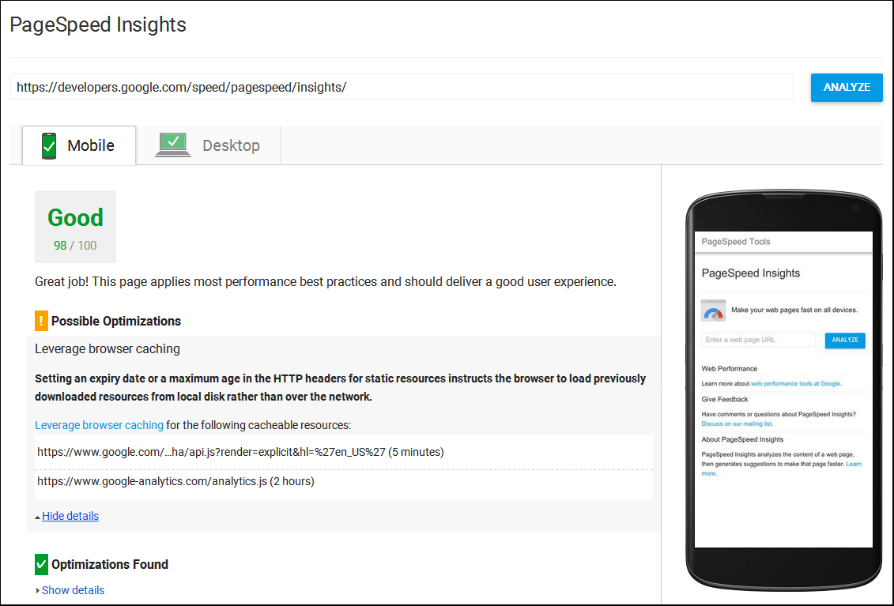

project_path: /web/fundamentals/_project.yaml
book_path: /web/fundamentals/_book.yaml

{# wf_updated_on: 2017-10-18 #}
{# wf_published_on: 2017-10-18 #}

# Measuring Performance {: .page-title }



Before setting out on what might be a long and arduous journey, we would be wise to first 
determine whether we even need to make the trip (spoiler alert: we do). The first step, then, 
in improving our pages' speed is to measure current performance and analyze where and how we 
can make positive changes.

Of course, loading speed isn't just *a thing*, it's actually *many things*. Multiple factors 
affect a page's load time, and we need a way to examine which ones we should address. Many 
tools are available for this purpose; here are some worth considering.

## Lighthouse

Quoting from its [Google WebDev page](http://tinyurl.com/y9fxgxhm), 
"Lighthouse is an open-source, automated tool for improving the quality of web pages. You 
can run it against any web page, public or requiring authentication. It has audits for 
performance, accessibility, progressive web apps, and more." 

[Lighthouse at the Chrome Webstore](https://chrome.google.com/webstore/detail/lighthouse/blipmdconlkpinefehnmjammfjpmpbjk)

Again, it can't be explained better than this: "You can run Lighthouse as a Chrome Extension, 
from the command line, or as a Node module. You give Lighthouse a URL to audit, it runs a 
series of audits against the page, and then it generates a report on how well the page did. 
From there, use the failing audits as indicators on how to improve the page. Each audit has 
a reference doc explaining why the audit is important, as well as how to fix it."

In fact, Lighthouse is now available directly in Chrome DevTools. From the Chrome vertical 
dots menu, choose `More Tools`, then `Developer Tools`, and then click the `Audits` tab. 
Choose which audits you want Lighthouse to perform, and click `Run audit`. Lighthouse 
provides one or more comprehensive reports that detail your page's performance characteristics.

## PageSpeed Insights

This Google tool performs a broad-spectrum page analysis and delivers both raw results and 
improvement suggestions. It provides separate reports for mobile and desktop devices.

[https://developers.google.com/speed/pagespeed/insights/](http://tinyurl.com/m65jex6)

To use it, enter a URL and click `Analyze`. The report's suggestions include brief 
explanations such as "Leverage browser caching", a list of specific resources to look at, 
and links to more detailed explanations, many of which we'll cover shortly. 

## Pingdom

This popular tool runs a full page test and returns a highly detailed, but quite readable, 
report; and it lets you choose a Pingdom site from which to run the test, from San Jose 
to Stockholm.

[https://tools.pingdom.com/](https://tools.pingdom.com/)

To use it, enter a URL, choose the test site location, and click `Start Test`. Pingdom's 
report includes an overall grade, a general summary, specific insights with individual 
letter grades and detailed resource references, any response codes returned, content size 
and requests by type and domain, and a spiffy file request timeline graph.

## WebPageTest

Similar to Pingdom, this site runs a series of tests on a URL and generates several reports. 
It not only lets you choose from among 50+ test sites, using a dropdown or a spiffy map 
interface, it also lets you specify a browser and even a mobile device so you can compare 
page performance in a variety of environments.

[https://www.webpagetest.org/](https://www.webpagetest.org/)

To use it, give it a URL, select your preferred settings, and click `Start Test`.

## GTmetrix

GT.net's interesting tool analyzes page load speed using both Pingdom and YSlow, and reports 
the results side by side, making comparative analysis easy for items like overall scores, 
load time, page size, and server requests. 

[https://gtmetrix.com/](https://gtmetrix.com/)

To use it, enter a URL and click `Analyze`. The tabbed report includes Pingdom and YSlow 
results; some data, such as the Waterfall graph and Timings chart, are only available to 
registered users (although signup is free). The extensive recommendation list includes 
dropdowns that offer specific component references, relative priority assignments, and 
informative "What's this mean?" callouts.

## Summary

These are but a few of the many tools available to help measure web page loading and 
performance speed, but they are among the most popular and useful. You should try to test 
your page with as many different tools as possible and compare the analyses for both common 
factors and unique outliers.

As you might expect, the scores and recommendations for a single URL will vary among test 
suites, because each uses its own rules and algorithms to analyze pages. But you will 
almost certainly find that a number of performance issues -- image size, HTTP requests, 
minification, zipping, caching, and more -- keep popping up. These potential speed gains 
are low-hanging fruit, issues that can easily be tackled with modest effort that pays off 
in significant performance wins.

Let's start with one of those wins.
