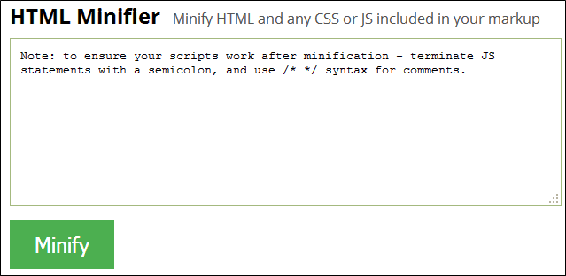

project_path: /web/fundamentals/_project.yaml
book_path: /web/fundamentals/_book.yaml

{# wf_updated_on: 2017-10-18 #}
{# wf_published_on: 2017-10-18 #}

# Text Content {: .page-title }




Text: letters and numbers, words and phrases, sentences and paragraphs. It's how we convey most of the meaning in a web page. Text content informs, describes, explains concepts and procedures to our readers (not just "visitors"). It is the very basis of web communication.

Text content on the web always has some structure -- even if only top-down, and some formatting -- even if only by default. It can also exhibit behavior, moving or changing, appearing or disappearing in response to a reader's action or the author's intent. But in and of itself, text content doesn't have these qualities and abilities; its structure, appearance, and behavior are implemented and affected by other text-based resources: HTML, CSS, and JavaScript code.

In a web page, every character of that content, structure, formatting, and behavior must be fetched from the server and downloaded to the browser, a decidedly non-trivial task. In this section we'll look at some effective methods for speeding up text content loading.

## Minified Code

One simple and effective method is *minification*, which is essentially compressing a text resource by removing its whitespace and unnecessary characters without changing its validity or functionality. It doesn't sound that useful, but it is. For example, this little function (part of a table-sorting script) initially contains 348 characters.

```
function sortables_init() {

    // Find all tables with class sortable and make them sortable

    if (!document.getElementsByTagName) return;

    tbls = document.getElementsByTagName("table");

    for (ti=0;ti<tbls.length;ti++) {

   	 thisTbl = tbls[ti];

   	 if (((' '+thisTbl.className+' ').indexOf("sortable") != -1) && (thisTbl.id)) {

   		 ts_makeSortable(thisTbl);

   	 }

    }

}
```

After minification, it looks like this, and only contains 257 characters. 

```
function sortables_init(){if(!document.getElementsByTagName)return;tbls=document.getElementsByTagName("table");for(ti=0;ti<tbls.length;ti++){thisTbl=tbls[ti];if(((''+thisTbl.className+'').indexOf("sortable")!=-1)&&(thisTbl.id)){ts_makeSortable(thisTbl)}}}
```

Sure, we can't read it now, but the browser still can. That's a 26% reduction in size and required download time; pretty significant, even for this small sample.

Looking at the bigger picture, the entire script block from which that snippet came is over 10k, but after minification it's down to 5,411 characters, a whopping 48% reduction.

HTML and CSS can be minified in the same way, so that you can achieve improved load times for both formatting- and behavior-related code.

Many online and desktop minification tools are available; here are some examples.

### Minifier

This online tool minifies JavaScript or CSS via copy and paste. Paste the code, choose the type, and click `Minify`.

[http://www.minifier.org/](http://www.minifier.org/)


### HTML Minifier

Here's an online tool that also handles HTML, and automatically identifies the code type(s).

[http://www.willpeavy.com/minifier/](http://www.willpeavy.com/minifier/)



### Kangax HTML Minifier

This online tool offers a broad array of output customization options for the minified code.

[https://kangax.github.io/html-minifier/](https://kangax.github.io/html-minifier/)


### NPM Packages

The NPMJS site also has various minification packages, for Grunt

[https://www.npmjs.com/package/grunt-html-minify](https://www.npmjs.com/package/grunt-html-minify)

and Gulp,

[https://www.npmjs.com/package/gulp-html-minifier](https://www.npmjs.com/package/gulp-html-minifier)

and a popular package 

[https://www.npmjs.com/package/html-minifier](https://www.npmjs.com/package/html-minifier)

that includes a useful chart comparing its compression results with other methods.

### Development vs. Deployment

Once you minify a chunk of code, you can't really read it any longer, let alone modify it, so always keep the unminified files handy and ship only the minified versions. That is, never replace the former with the latter -- although if it does happen by accident, a code beautifier or "unminifier" (e.g., [http://unminify.com/](http://unminify.com/)) might save the day.

Of course, chances are good that you do (or will) use a framework, IDE, or other structured environment as you write, rather than copy/pasting your code into a web app one file at a time. Most modern systems have built-in facilities for keeping development files separate from deployment during the build process, and are able to perform a variety of transformations, such as minification, along the way..

For example, a Gulp development-to-deployment task that includes HTML minification might look like this.

```
var gulp = require('gulp');

var htmlmin = require('gulp-html-minifier');

 

gulp.task('minify', function() {

  gulp.src('./src/*.html') //development location

    .pipe(htmlmin({collapseWhitespace: true}))

    .pipe(gulp.dest('./dist')) //deployment location

});
```

The execution command for that task would then be:

`gulp minify`

(Source: [npmjs](https://www.npmjs.com/package/gulp-html-minifier))

Note that the task pipes the HTML files from their original location to the deployment location, minifying them during the build. This not only prevents potentially irreversible modification of the source files, but avoids contaminating the production environment during later development and testing.

## Gzip Compression

So far we've talked about compression in terms of individual image and text files. But it would also be helpful if we could get our server to automatically compress entire file sets as well, and that's where Gzip comes in.

Gzip is an application (and its file format) for compressing and decompressing files. Like solo file compression, it reduces the time required to deliver a server response by reducing the size of the resource. It is available via the GNU Project site.

[https://www.gnu.org/software/gzip/](https://www.gnu.org/software/gzip/)

Gzip performs best on text resources, and can regularly achieve up to 70% compression (even higher for large files). However, Gzipping non-text resources, such as images, that have already been individually compressed generally provides no significant size reduction.

Unlike desktop or browser-based local compression, Gzip works at the server to identify and process certain file types that you specify. While all modern browsers support Gzip compression for HTTP requests, you must properly configure your server to deliver the compressed resource when it is requested. Different server types, of course, have different setup requirements. You configure the Apache server, for example -- which nearly half of all active websites currently use (source: [W3Techs](https://w3techs.com/technologies/details/ws-apache/all/all) and [NetCraft](https://news.netcraft.com/archives/2017/02/27/february-2017-web-server-survey.html)) -- via the .htaccess file, which would include something like this.

```
<IfModule deflate_module>
    # Enable compression for the following file types
    AddOutputFilterByType        	\
     DEFLATE                     	\
      application/javascript     	\
      text/css                   	\
      text/html                  	\
      text/javascript            	\
      text/plain                 	\
      text/xml
</IfModule>
```

BetterExplained has a very good article on the subject, including background information, examples, and caveats.

[https://betterexplained.com/articles/how-to-optimize-your-site-with-gzip-compression/](https://betterexplained.com/articles/how-to-optimize-your-site-with-gzip-compression/)

So, having enabled GZip on your server, how do you know whether it's actually serving compressed files? An easy way to find out is to check it at GIDNetwork's Gzip test site.

[http://www.gidnetwork.com/tools/gzip-test.php](http://www.gidnetwork.com/tools/gzip-test.php)

The report includes general information about site compression, an interesting "What if" chart that shows how much compression the site would gain at various Gzip compression levels, and the response headers and page source. 

Here, we ran the test on GIDNetwork's own root URL -- interestingly, it did not appear to be compressed.


Gzip can further compress already-compressed files, and that's a valid approach. In fact, to get the greatest compression ratio for text-based resources, first minify them individually prior to deployment and then compress them at delivery via a Gzip-enabled server.

## Reduce Library Use

Popular CSS and JavaScript libraries do their best to minify and compress their download files, but generally they're still pretty serious bandwidth consumers. jQuery, for example -- depending on the version and the compression algorithms applied -- might range from 28k to over 250k. If you need most of a given library's features, fine; but if you only need one or two specific things, you can save a lot of download time by replacing those features with single-use functions or CSS rules.

For example, a website might use jQuery's handy `slideToggle` feature to expand and collapse a div, like this.

`<a href="javascript:void(0)" onclick="$('#more').slideToggle()">More...</a>`

Yes, it works great and it's easy to code, but that's a lot of overhead for one text effect. You might consider swapping out that huge library for a simpler -- and far smaller -- single-purpose function, like this (source: [W3Schools](https://www.w3schools.com/howto/howto_js_toggle_hide_show.asp)).

```
function myFunction() {
  var x = document.getElementById('myDIV');
  if (x.style.display === 'none') {
  x.style.display = 'block';
  } else {
  x.style.display = 'none';
  }
}
```

You could even go with pure CSS using a transition, like this nifty 475-character solution (source: [CodePen/Paul O'Brien](https://codepen.io/paulobrien/pen/tpmAi)).

```
label {
    display:block;
    margin:20px 0 0;
    border-bottom:1px solid green;
}
label:hover { text-decoration:underline }
input {
    position:absolute;
    left:-999em
}
.hide {
    width:50%;
    border:1px solid #000;
    background:red;
    max-height:99em;
    opacity:1;
    height:auto;
    overflow:hidden;
    transition:opacity 1.5s linear, max-height 1.5s linear;
}
.hide p {
    padding:10px;
    margin:0
}
input[type=checkbox]:checked + div {
    opacity:0;
    max-height:0;
    border:none;
}
.follow{border-top:1px solid blue;margin:0}
```

The point is, if you don't need an entire 250k library, don't download it. Instead, find and use small, single-purpose routines that do only what you need. (And don't forget to minify them!)

## Prioritize Text Content

Web pages aren't necessarily top-down. Physical sequence -- the order in which elements originally appear in the DOM -- is frequently overridden by CSS positioning rules to place elements in specific locations on the page. This is a valid technique, but overuse can slow down page loading and rendering.

When possible, prioritize content using "above the fold" strategy; place more important items physically higher in the page to take advantage of the existing DOM order. This is particularly preferable for large blocks of text, and also helps reduce positioning-related CSS, all of which improves download time.

## Summary

While physically large items like images tend to get a lot of speed-improvement attention, text resources -- undoubtedly the primary content of most websites -- are often overlooked. Don't ignore text-based components, both visible and behind-the-scenes, as you look for ways to speed up your pages.
