project_path: /web/fundamentals/_project.yaml
book_path: /web/fundamentals/_book.yaml
description: A guide to designing web experiences for slow networks and offline.

{# wf_updated_on: 2017-07-24 #}
{# wf_published_on: 2016-11-10 #}

# Offline UX Considerations {: .page-title }



This article will take a look at multiple design considerations needed to create
a great experience on both slow networks and offline.

The quality of a network connection can be affected by a number of factors
such as:

* Poor coverage of a provider. 
* Extreme weather conditions.
* Power outages.
* Users travelling into “dead zones” such as buildings that block their
  network connections. 
* Travelling on a train and going through a tunnel.
* Internet connection is managed by a third party and time boxed when it
  will be active or inactive like in an airport or hotel.
* Cultural practises that require limited or no internet access at specific
  times or days.

Your goal is to provide a good experience that lessens the impact of changes
in connectivity. 

## What to show your users when they have a bad network connection?

The first question that must be asked is: what does success and failure of a
network connection look like? A successful connection is your app's normal
online experience. The failure of a connection however can be both the offline
state of your app as well how the app behaves when there is a laggy network.

When thinking about the success or failure of a network connection you need to
ask yourself these important UX questions:

* How long do you wait to determine success or failure of a connection? 
* What can you do while success or failure is being determined? 
* What should you do in the event of failure?
* How do you inform the user of the above?

### Inform users of their current state and change of state

Inform the user of both the actions they can still take when they have a network
failure and the current state of the application. For example, a notification
could say:

> “You seem to have a bad network connection. [Not to worry!] Messages will be
“sent when the network is restored.”

<figure class="attempt-left">
  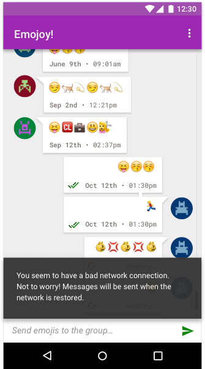
  <figcaption>
    Clearly inform the user when a change in state occurs as soon as possible.
  </figcaption>
</figure>
<figure class="attempt-right">
  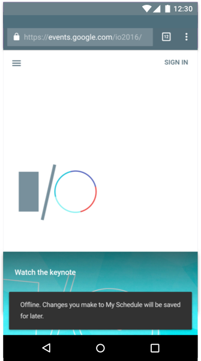
  <figcaption>
    The Google I/O app used a material design "toast" to let the user know when it was offline.
  </figcaption>
</figure>

### Network connection improves or is restored

How you deal with informing the user once their network connection has improved
will depend largely on your application. For apps that require update
information displayed as a priority such as a stock market app, auto-updating
and notifying the user as soon as possible is crucial.

It is recommended that you let the user user know that your web app 
has been updated "in the background" by using a visual cue such as a 
material design toast element. This involves detecting both the 
initial registration of your service worker and that there's been an 
update to the service worker-managed content. You can see a code 
example of this 
<a 
href="https://github.com/GoogleChrome/sw-precache/blob/master/demo/app/js/service-worker-registration.js#L29">function at work here</a>.

Once example of this would be 
<a href="https://www.chromestatus.com/features">
  www.chromestatus.com</a>which posts a note to the user when the app has been updated.

<figure >
  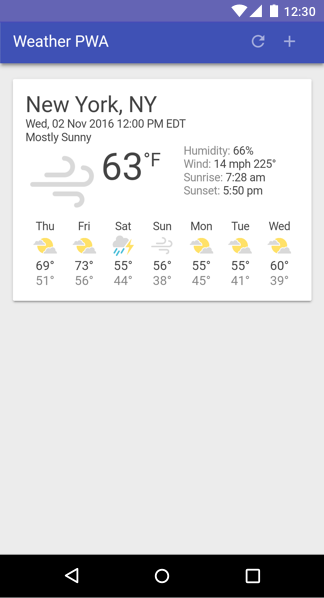
  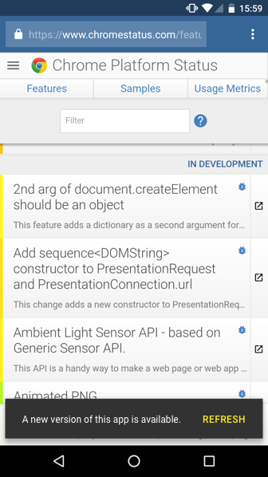

  <figcaption class="clearfix" style="clear:both;">

  Some apps, like the weather app, need to auto update as old data 
  is not of use to the user. Where Chrome Status lets the user know 
  when content has been updated via a material design toast element.
  </figcaption>
</figure>

You may also show the last time the app was updated at all times in a prominent
space. This would also be useful for a currency converter app, for example.

<figure>
  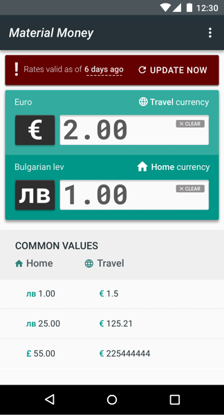
  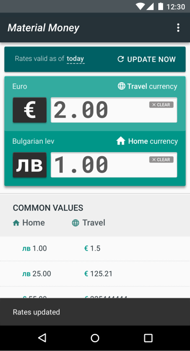
  <figcaption class="clearfix" style="clear:both;">
    Material Money shows the latest currency where possible and notifies the
    user when the app hasn’t been updated.
  </figcaption>
</figure>

Other applications such as a news app could show a simple notification informing
the user that there is newer content, with a tap-to-update function. The reason
for doing that is if a user is currently reading an article an auto-update would
refresh the page and they would lose where they were reading last.

<figure>
  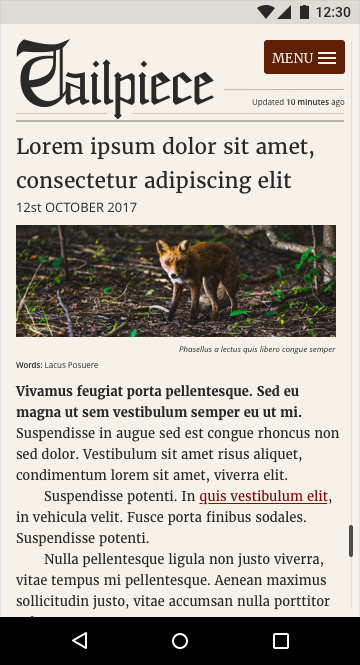
  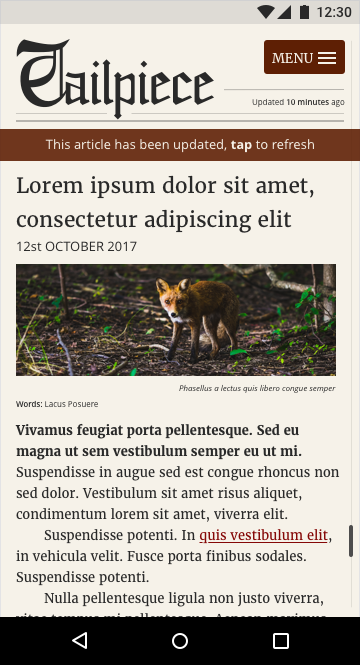
  <figcaption class="clearfix" style="clear:both;">
    Tailpiece, an online newspaper will auto download the latest news but
    allow the users to refresh manually so they do not lose their place in the article.
  </figcaption>
</figure>

### Contextual states and browse mode

Each bit of UI may have its own context and functionality that will change
depending on if it requires a successful connection. One example would be an
ecommerce site that can be browsed offline though the Buy button and pricing is
disabled until a connection has been reestablished.

Other forms of contextual states could include data. For example, the financial
application Robinhood allows users to buy stock and uses color and graphics to
notify the user when the market is open. The whole interface turns white and
then grays out when the market closes. When the value of stock increases or
decreases, each individual stock widget turns green or red depending on its
state.

### Educate the user so they understand what the offline model is

Offline is a new mental model for everyone. You need to educate your users about
what changes will occur when they don’t have a connection. Inform them of where
large data is saved and give them settings to change the default behavior. Make
sure you use multiple UI design components such as informative language, icons,
notifications, color and imagery to convey these ideas collectively rather than
relying on one design device, such as an icon on its own, to tell the whole
story.

## Providing an offline experience by default 

If your app doesn't require much data, then cache that data by default. Users
can become increasingly frustrated if they can only access their data with a
network connection. Try to make the experience as stable as possible. An
unstable connection will make your app feel untrustworthy, where an app that
lessens the impact of a network failure will feel magical to the user.

News sites could benefit from auto downloading and saving the latest news
content of the day so a user could read today's news without a connection,
perhaps downloading the text without the article images. Also adapt with the
user's behaviour so if the sports section is what they typically view, perhaps
make this the priority data that is downloaded.

<figure>
  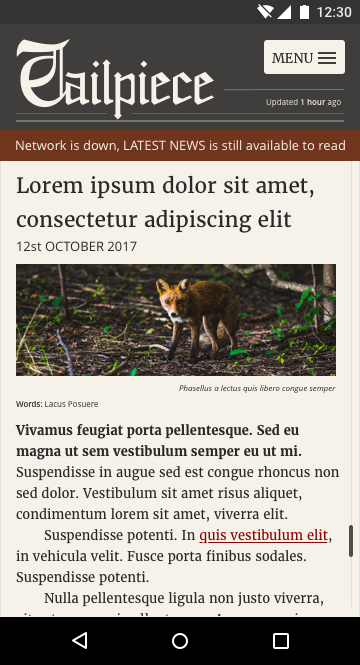
  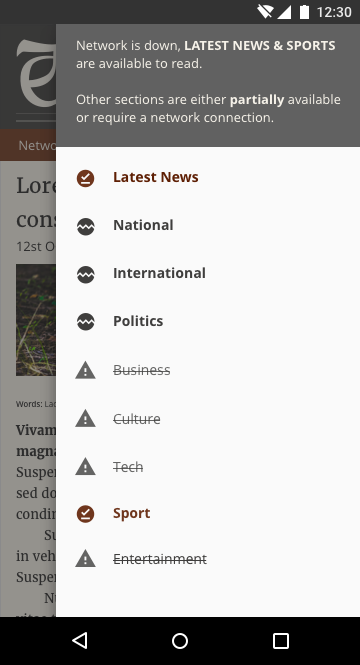
  <figcaption class="clearfix">
    If the device is offline Tailpiece will notify the user with a status
    message letting them know that they can still use the app.
  </figcaption>
</figure>

## Inform the user when the app is ready for offline consumption 

When a web app first loads you need to indicate to the user if it is ready
for offline use. Do this with a
[widget that provides brief feedback](https://material.google.com/components/snackbars-toasts.html "widget that provides brief feedback")
about an operation through a message at the bottom of the screen, 
for example when a section has been synced or a data file has downloaded.

Again think of the language you are using to make sure it is fit for your
audience. Ensure the messaging is given the same in all instances where it’s
used. The term offline is generally misunderstood by a non-techie audience so
use action based language that your audience can relate to.

<figure>
  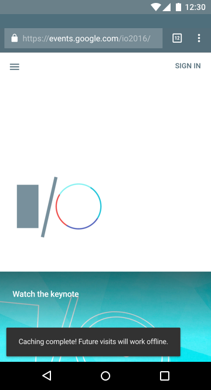
  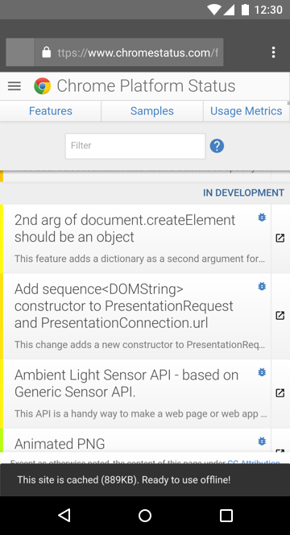
  <figcaption class="clearfix" style="clear:both;">
    Both the Google I/O 2016 app and Chrome Status site notify the user when
    the app is ready for offline use.
  </figcaption>
</figure>

### Make 'save for offline' an obvious part of the interface for data heavy apps

If an application uses large amounts of data, make sure that there is a switch
or pin to add an item for offline use rather than auto downloading, unless a
user has specifically asked for this behavior via a settings menu. Make sure
that the pin or download UI is not obscured by other UI elements and that the
feature is obvious to the user.

One example would be a music player that requires large data files. The user is
aware of the associated data cost, but is also aware that they may want to use
the player when they they are offline. Downloading music for later use requires
the user to plan ahead, so education about this may be required during
onboarding.

### Clarify what is accessible offline 

Be clear as to the option you are providing. You may need to show a tab or
setting that shows an “offline library”, so the user can easily see what they
have stored on their phone and what needs to be saved. Make sure the settings
are concise and be clear where the data will be stored and who has access to it.

### Show the actual cost of an action

Many users equate offline capability with 'downloading'. Users in countries
where network connections regularly fail or aren't available often share content
with other users, or save content for offline use when they have connectivity.

Users on data plans may avoid downloading large files for fear of cost, so you
may also want to display an associated cost so users can make an active
comparison for a specific file or task.  For example if the music app above
could detect if the user is on a data plan and show the file size so that users
can see the true cost of a file.

### Help prevent hacked experiences 

Often users hack an experience without realizing they are doing it. For example
before cloud sharing apps like Google Drive, it was common for users save large
files and attach them to emails so they could carry on editing from a different
device. It is important not to be pulled into their hacked experience but rather
look at what they are trying to achieve. In other words instead of thinking of
how you can make attaching a large attachment more user friendly, solve the
problem of sharing large files across multiple devices.

## Transferable experience from one device to another

When making an experience with a flaky network connection, seek for it to sync
correctly once the connection improves so that the experience is transferable.
For example, imagine a travel app losing a network connection mid-way through a
booking. When the connection is reestablished, the app syncs with the user's
account and then they can continue their booking on their desktop device. Not
being able to transfer experiences is incredibly jarring to users.

Inform the user of the current state of their data, for example if the app has
managed to sync or not. Educate them where possible but try not to overburden
them with messaging.

## Create inclusive design experiences 

When designing seek to be inclusive by providing meaningful design devices,
simple language, standard iconography, and meaningful imagery that will guide
the user to complete the action or task rather than hinder their progress.

### Let simple concise language be a guide

Good UX is not just about a well designed interface. It includes the flow a user
takes as well as the language used in the app. Avoid using tech jargon when
explaining the state of the app or individual UI components. Consider that the
phrase “app offline” might not convey to the user the current state of the app.

  <figure>
    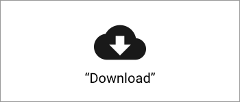
    <figcaption class="success">
      <b>DO</b>: Use language and imagery that describes the action.
     </figcaption>
  </figure>

  <figure>
    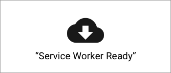
    <figcaption class="warning">
      <b>DON'T</b>: Avoid abstract terms that may not be accessible. 
     </figcaption>
  </figure>

### Use multiple design devices to create accessible user experiences

Use language, color and visual components to demonstrate a change of state or
current status. Solely using color to demonstrate state may not be noticed by
the user, and may be inaccessible to users who suffer from visual disabilities.
Also, the gut instinct for designers is to use grayed UI to represent offline,
but this can have a loaded meaning on the web. Grayed UI is also used to mean
that an element is disabled, such as input elements on a form. This can cause
confusion if you ONLY use color to depict state.

To prevent misunderstandings, express different states to the user in multiple
ways: for example with color, labels and UI components.

  <figure>
    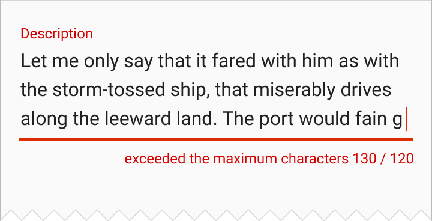
    <figcaption class="success">
      <b>DO</b>: Use a mixture of design elements to convey meaning
     </figcaption>
  </figure>

  <figure>
    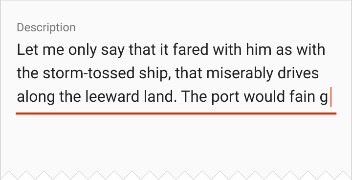
    <figcaption class="warning">
      <b>DON'T</b>: Only use color to describe what is happening.
     </figcaption>
  </figure>

### Use icons that convey meaning 

Make sure that information is conveyed correctly with meaningful text labels as
well as icons. Icons alone can be problematic, since the concept of offline on
the web is relatively new. Users may misunderstand icons used on their own. For
example, using a floppy disc for save makes sense to an older generation but
young users who have never seen a floppy disc may be confused by the metaphor.
Likewise, the 'hamburger' menu icon has been known to confuse users when
presented without a label.

When introducing an offline icon try to remain consistent with the industry
standard visual (if one exists) as well as providing a text label and
description. For example, saving for offline might be a typical download icon or
perhaps if the action involves syncing it could be a syncing icon. Some actions
may be interpreted as saving for offline rather than demonstrating a network's
status. Think of the action you are trying to convey rather than presenting the
user with an abstract concept. For example save or download data would be action
based.

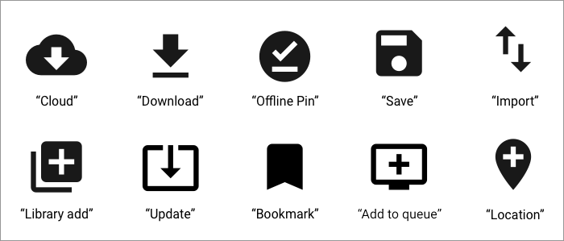

Offline can mean a number of things depending on the context, such as download, 
export, pin etc.. For more inspiration checkout the
[material design icon set](https://material.io/icons/ "material design icon set")

### Use skeleton layouts with other feedback mechanism 

A skeleton layout is essentially a wireframe version of your app that displays
while content is being loaded. This helps demonstrate to the user that content
is about to be loaded. Consider also using a preloader UI as well, with a text
label informing the user that the app is loading. One example would be to
pulsate the wireframe content giving the app the feeling  that it is alive and
loading. This reassures the user that something is happening and helps prevent
resubmissions or refreshes of your app.

<figure>
  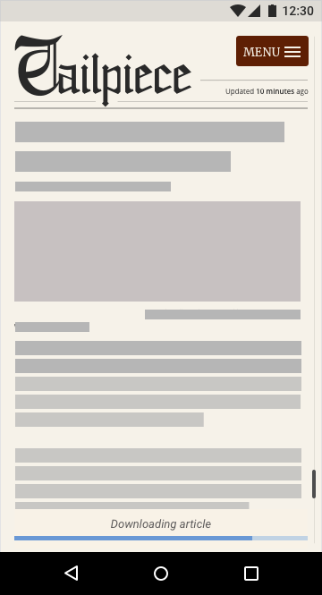
  
  <figcaption class="clearfix">
    Before and after of a skeleton layout.
  </figcaption>
</figure>

### Don’t block content

In some applications a user might trigger an action such as creating a new
document. Some apps will try to connect to a server in order to sync the new
document and to demonstrate this they display an intrusive loading modal dialog
that covers the entire screen. This may work fine if the user has a stable
network connection, but if the network is unstable they won’t be able to escape
from this action and the UI effectively blocks them from doing anything else.
Network requests that block content should be avoided. Allow the user to
continue to browse your app and queue tasks that will be performed and synced
once the connection has improved.

Demonstrate the state of an action by providing your users with feedback. For
example, if a user is editing a doc, consider changing the feedback design so it
is visibly different from when they are online but still shows that their file
was “saved” and will sync when they have a network connection. This will educate
the user about the different states available and reassure them that their task
or action has been stored. This has the added benefit of the user growing more
confident using your application.

## Designing for the next billion

In many regions, low end devices are commonplace, connectivity is unreliable
and, for many users, data is unaffordable. You will need to earn user trust by
being transparent and frugal with data. Think about ways to help users on poor
connections and simplify the interface to help speed up tasks. Always try to ask
users before downloading data-heavy content.

Offer low bandwidth options for users on laggy connections. So if the network
connection is slow provide small assets. Offer an option to choose high or low
quality assets.

## Conclusion

Education is key to this as users are unfamiliar with these concepts. Try to
create associations with things that are familiar, e.g downloading for later use
is the same as offlining data.

When designing for unstable network connections, use these: 

* Think how you design for the success, failure and instability of a
  network connection.
* Data may be expensive, so be considerate to the user.
* For most users globally, the tech environment is almost exclusively mobile.
* Low end devices are commonplace, with limited storage, memory and processing 
  power and, small displays and lower touchscreen quality. Make sure performance 
  is a part of your design process. 
* Allow users to browser your application when they are offline.
* Inform users of their current state and of changes in states.
* Try to provide offline by default if your app doesn't require much data.
* If the app is data-heavy, educate users about how they can download for
  offline use.
* Make experiences transferable between devices.
* Utilize language, icons, imagery, typography and color to express ideas to the 
  user collectively.
* Provide reassurance and feedback to help the user.
