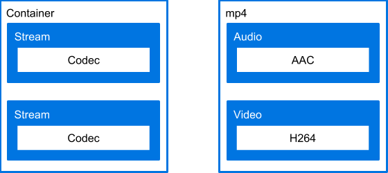

project_path: /web/_project.yaml
book_path: /web/fundamentals/_book.yaml
description: TBD.

{# wf_updated_on: 2017-06-16 #}
{# wf_published_on: 2017-06-16 #}

# Media File Manipulation {: .page-title }



Now that I've introduced you to applications that can be used for media file
manipulation, I'm going to take a raw video file off a camera and transform it
into an encrypted resource that you can play back using a video library such as
[Google's Shaka Player](https://shaka-player-demo.appspot.com/demo/). I'm
specifically going to show you how to format your video for mobile playback.

Objective: This article provides explanations of file manipulation concepts,
with command lines only to illustrate the concepts. There is a companion [cheat
sheet](cheatsheet) that shows more commands and is designed as a quick reference
for someone who knows the concepts.

To be more specific about the goals, the result of the procedures described here
will be media resources with the following characteristics:

+  Audio and video streams are split into separate files
+  Versions of the video file are in mp4 and webm format
+  Versions of the audio file are in m4a and webm format
+  A bitrate of 0.35 Megabits per second (Mbs)
+  Resolution of 1920 by 1080
+  Encrypted
+  Viewable on all major browsers using appropriate technologies

By 'appropriate technologies' I mean **DASH** and **HLS**, which are the two
primary means of providing video in HTML on the major browsers. What those terms
mean and how to produce for them is getting a little ahead of things. Before you
can even use those technologies, you need your media files in the correct
format, which is the focus of this article.

One final note, selection of the file formats, bitrate and resolution are not
arbitrary. I've selected these values for speedy playback on the mobile web.

If you want to play along at home, you'll need a raw video file off a camera,
preferably one that contains both audio and video. If you don't have one handy,
then here's
<a href="/web/fundamentals/media/videos/glocken.mov" download>ten seconds of an mov file</a>
that I took of the
[Rathaus-Glockenspiel](https://en.wikipedia.org/wiki/Rathaus-Glockenspiel)
in Munich's MarienPlatz. 

## How are media Files put together?

Before I start manipulating media files, I want to talk a bit about how media
files are put together. I think of them as being like an onion. The file that
you see in your operating system shell is a _container_, identified by a file
extension (mp4, webm, etc.). The container houses one or more _streams_ of up to
four types, specifically audio, video, captions, and data. Although containers
will typically contain only one stream of each type, some container types, webm
for example, allow multiple streams of the same type. Within the audio and video
streams, the actual data is compressed using a _codec_. As we'll see later, the
distinction between a container and a codec is import as files with the same
container can have their contents encoded with different codecs.

(If these terms are new
to you, I explain them in
[Media file characteristics](/web/fundamentals/media/manipulating/applications#media_file_characteristics).)

The image below illustrates this. On the left is the basic structure. On the
right are the specifics of that structure for an mp4. I'll explain file
manipulation by moving downward through these layers.

## Change the container

Let's start by changing the file container. You'll recall that we're starting
with a file that has an mov extension. I'm going to use ffmpeg to change the
container type from mov to mp4 and webm. In actual practice, you would likely
specify a codec at the same time. For this lesson, I'm letting ffmpeg use its
defaults.

    ffmpeg -i glocken.mov glocken.mp4

Creating a webm file is a bit more complicated. ffmpeg has no trouble converting
a mov file to a webm file that will play in Chrome and Firefox. For whatever
reason, the file created using ffmpeg's defaults doesn't quite conform to the
webm spec. (For the curious, it sets a `DisplayUnit` size that isn't defined by
the webm spec.) Fortunately, I can fix this using a video filter. Do so with the
`-vf` flag and the setsar filter.

    ffmpeg -i glocken.mov -vf setsar=1:1 glocken.webm

Webm takes quite a bit longer to create than mp4. This isn't surprising when
you look at the results. While mp4 compresses to about a quarter of the original
file's size, webm compresses to 1% of the original file's size.

    -rw-r--r--  1 jmedley  eng  12080306 May  9 14:34 glocken.mov
    -rw-r--r--  1 jmedley  eng  10407497 May  9 14:52 glocken.mp4
    -rw-r--r--  1 jmedley  eng    392263 May  9 14:49 glocken.webm

## Split the streams

When you package media resources, for HLS and DASH, you'll need to separate the
video and audio streams. Splitting the audio and video streams of a file is
often referred to as **demultiplexing** or **demuxing** for short. Professional
content creators often record audio and video to separate files to begin with.
If resources come from a consumer-grade device, audio and video will be in the
same file and you'll need to split them.

In the context of preparing media for the web, demuxing is basically a file
copying operation where I copy one of the streams to a new file. Using Shaka
Packager I might, for example, pull out the video stream.

    packager input=myvideo.mp4,stream=video,output=myvideo_video.mp4

Notice that the stream descriptor has an input, an output, and a stream type.
You might remember from [Application Primers](applications) that Shaka Packager
can take multiple stream descriptors. This means that Shaka Packager lets me
split the audio and video in a single command.

    packager \
      input=myvideo.mp4,stream=video,output=myvideo_video.mp4 \
      input=myvideo.mp4,stream=audio,output=myvideo_audio.m4a

A full discussion of audio and video formats is beyond the scope of this
article. One thing to note is that the audio stream of an mp4 file is the
[advanced audio coding]([https://en.wikipedia.org/wiki/Advanced_Audio_Coding)
format for which m4a is a common file extension.

Shaka Packager presents demuxing as though you're _extracting_ a stream into a
new file. It's a little different in ffmpeg, which presents as though you're
_stripping_ the stream you don't want. With ffmpeg, you need two operations.

    ffmpeg -i myvideo.webm -vcodec copy -an myvideo_video.webm
    ffmpeg -i myvideo.webm -acodec copy -vn myvideo_audio.webm

Just as with Shaka Packager, we have both an input and an output file. Another
difference from Shaka Packager is that the streams are identified with flags
that refer their codecs. The `-vcodec copy` and `-acodec copy` portions of the
command tell ffmpeg to copy the streams I want while the `-an` and `-vn` flags
strip the streams I don't want. The keyword copy means I'm moving the streams
without changing their codecs. 

A list of the
[demuxing commands](/web/fundamentals/media/manipulating/cheatsheet#demux_split_audio_and_video)
are provided on the cheat sheet.

## Change the codec

Continuing downward, we arrive at the codec. As stated earlier, a codec is _not_
the same thing as a container. Two files of the same container type could hold
data compressed using completely different codecs. The webm format for example
allows audio to be encoded using either [vorbis](https://en.wikipedia.org/wiki/Vorbis)
or [opus](https://en.wikipedia.org/wiki/Opus_(audio_format)). To change the
codec I need ffmpeg.

In the last section I demuxed the audio and video like this:

    ffmpeg -i myvideo.webm -vcodec copy -an myvideo_video.webm
    ffmpeg -i myvideo.webm -acodec copy -vn myvideo_audio.webm

If I need to change the audio and video codec, I would replace the `copy` keyword
with the name of a codec. For example, this command outputs an audio file
encoded with the aac codec.

    ffmpeg -i myvideo.mp4 -vn -c:a aac myvideo.m4a 

The [cheat sheet](/web/fundamentals/media/manipulating/cheatsheet#codec)
contains a short list of codecs used for DASH and HLS, and commands needed to
convert to them.

## File properties

I've unpeeled the onion. Yet if you compare what I've done to the list of stated
goals you'll see that I'm not quite done. Anong the remaining items are bitrate
and resolution. These properties correlate to the amount of data in a media
file. It probably goes without saying, but I'm going to say it anyway, that you
can always lower bitrate and resolution, but increasing them is a problem.
Without special software an algorithms quality is going to take a hit.

The first to changing bitrate and resultion is to [display the file
characteristics](/web/fundamentals/media/manipulating/cheatsheet#display_characteristics)
and verify that your source file has a higher bitrate or resultion than your
desired result.

### Bitrate

_Bitrate_ is the maximum number of bits used to encode one second of a stream.
The more bits used to encode a second of stream, the higher the fidelity.

Unsuprisingly, bitrates for the web are low. The table below compares web
bitrates with common home video formats. Values are given in megabits per second
(Mbs).

| Format | Bitrate |
| ------ | ------- |
| Blue-ray | 20Mbs |
| DVD | 6 Mbs |
| Desktop web video | 2 Mbs |
| 4G mobile video | 0.7 Mbs |
| 3G mobile video | 0.35 Mbs |
| 2G mobile video | ?? |

Which value should I use for video on my web pages? The short answer is at least
the top three. If you're serving video someplace like India, you'll want to
include 2G as well. For demonstration purposes, I'm going to target 3G.

In ffmpeg you set the bitrate with the (surprise!) bitrate (`-b`) flag.

    ffmpeg -i glocken.mov -b:v 350K -b:a 350K glocken.mp4

Notice that there are two bitrate flags, -b:a and -b:v. One is for audio and the
other is for video.

### Resolution

_Resolution_ is the amount of information in a single frame of video, given as

the number of logical pixels in each dimension. [Youtube
recommends](https://support.google.com/youtube/answer/6375112) the following
resolutions for video uploads, all in the 16:9 aspect ratio. There's nothing
specific to Youtube about this list. It's just a list of common 16:9 video
resolutions.

| Abbreviation | Dimensions |
| ------------ | ---------- |
| 2160p | 3840x2160 |
| 1440p | 2560x1440 |
| 1080p | 1920x1080 |
| 720p | 1280x720 |
| 480p | 854x480 |
| 360p | 640x360 |
| 240p | 426x240 |

Which one do I use? That depends on your application. For simple embedding you
may chose a single resolution. If you're preparing files for DASH or HLS, you
may chose one, several, or all. Fortunately, this is one of the simplest
transformations you'll make with ffmpeg.

    ffmpeg -i myvideo.webm -s 1920x1080 myvideo_1980x1020.webm

## Encryption

If you plan to enforce copyright on your media, you'll want to encrypt them. I'm
going to introduce two encryption methods. The first is
[Widevide](https://www.widevine.com/wv_drm.html), a proprietary encryption
method offered by Google. The second, also free, is the
[Clear Key encryption system](https://www.w3.org/TR/encrypted-media/#clear-key)
, which is supported by a W3C spec.

### Clear Key Encryption

[Clear Key](https://www.w3.org/TR/encrypted-media/#clear-key)
is a common key system defined in the Encrypted Media Extensions specification
that uses unencrypted keys to decrypt
[MPEG Common Encryption (CENC)](https://en.wikipedia.org/wiki/MPEG_Common_Encryption)
content. 

In practice this is a simple way to encrypt and decrypt content for playback on
the web. What's more, playback can be done with either DASH or HLS.  This
section will show you how to encrypt using clear key.

The first thing you need to do is generate a key. You can use whatever method
you want, but I'm going to use [OpenSSL](https://www.openssl.org/) to write
sixteen random hex digits to a file. This step is necessary when preparing
resources for both HLS and DASH.

    openssl rand -out media.key 16

Some versions of OpenSSL seem to create a file with white space and new line
characters. Make sure these are absent or removed from `media.key` before
proceeding.

Use Shaka Packager to do the actual encryption. Use the content of the
`media.key` file for both the `-key` and `-key-id` flags.

Note: Technically, the key ID is supposed to be either the first 8 OR the
first 16 hex digits of the key. Since packager requires the key to be 16
digits and does not allow a 32 digit key, both flags use the same value.

    packager \
      input=myvideo.mp4,stream=audio,output=glocka.m4a \
      input=myvideo.mp4,stream=video,output=glockv.mp4 \
      --enable_fixed_key_encryption --enable_fixed_key_decryption \
      -key INSERT_KEY_HERE -key_id INSERT_KEY_HERE

This example implies that I've typed or pasted the key into the command line
manually. There's no reason you can't get fancy.
 
    packager \
      input=myvideo.mp4,stream=audio,output=glocka.m4a \
      input=myvideo.mp4,stream=video,output=glockv.mp4 \
      --enable_fixed_key_encryption --enable_fixed_key_decryption \
      -key "$(< media.key)" -key_id "$(< media.key)"

### Widevine Encryption

Unless your company completes the Master License Agreement with
[Widevine]([http://www.widevine.com/contact.html](http://www.widevine.com/contact.html))
, this type of encryption can really only be used for testing. Since this is
covered without much explanation on the Shaka Packager README here it goes.

Everything in this command except the name of your files and the `--content_id`
flag should be copied exactly from the example. The `--content_id` is 16 or 32
random hex digits. Use the keys provided here instead of your own. (This is how
Widevine works.)
 
    packager \
      input=glocken.mp4,stream=video,output=enc_video.mp4 \
      input=glocken.mp4,stream=audio,output=enc_audio.m4a \
      --enable_widevine_encryption \
      --key_server_url "https://license.uat.widevine.com/cenc/getcontentkey/widevine_test" \
      --content_id "16_Rand_Hex_Chrs" --signer "widevine_test" \
      --aes_signing_key "1ae8ccd0e7985cc0b6203a55855a1034afc252980e970ca90e5202689f947ab9" \
      --aes_signing_iv "d58ce954203b7c9a9a9d467f59839249"

## Conclusion

This does not cover everything you could do to a media file before posting it to
the web, not by a longshot. To be fair, this subject is one deserving of its own
website. I'm hoping this introduction will give you enough to help you find your
own aswers to questions.
