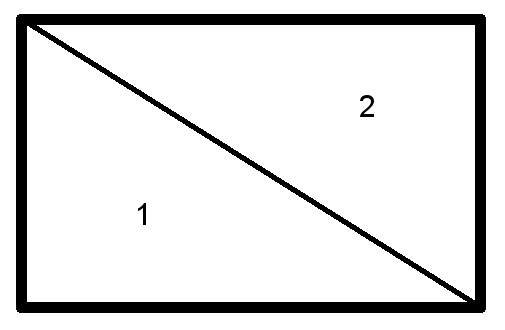

project_path: /web/fundamentals/_project.yaml
book_path: /web/fundamentals/_book.yaml
description: Many of today's most popular apps let you apply filters and effects to images or video. This article shows how to implement these features on the open web.

{# wf_updated_on: 2017-08-08 #}
{# wf_published_on: 2017-08-08 #}
{# wf_blink_components: Blink>WebGL, Blink>Canvas #}

# Real-Time Effects For Images and Video {: .page-title }



Many of today's most popular apps let you apply filters and effects to images or video. This article
shows how to implement these features on the open web.

The process is basically the same for videos and images, but I'll cover some important
video considerations at the end. Throughout the article you can assume that 'image' means 'image or
a single frame of a video'

## How to get at the pixel data for an image

There are 3 basic categories of image manipulation that are common:

- Pixel effects like contrast, brightness, warmth, sepia tone, saturation.
- Multi-pixel effects, called convolution filters, like sharpening, edge detection, blur.
- Whole image distortion, like cropping, skewing, stretching, lens effects, ripples.

All of these involve getting at the actual pixel data of the source image and then creating a new
image from it, and the only interface for doing that is a canvas.

The really important choice, then, is whether to do the processing on the CPU, with a 2D canvas, or
on the GPU, with WebGL.

Let's take a quick look at the differences between the two approaches.

### 2D canvas
This is definitely, by a long way, the simplest of the two options. First you draw the image on the
canvas.

    const source = document.getElementById('source-image');

    // Create the canvas and get a context
    const canvas = document.createElement('canvas');
    const context = canvas.getContext('2d');

    // Set the canvas to be the same size as the original image
    canvas.width = source.naturalWidth;
    canvas.height = source.naturalHeight;

    // Draw the image onto the top-left corner of the canvas
    context.drawImage(theOriginalImage, 0, 0);

Then you get an array of pixel values for the whole canvas.

    const imageData = context.getImageData(0, 0, canvas.width, canvas.height);
    const pixels = imageData.data;

At this point the `pixels` variable is a `Uint8ClampedArray` with a length of `width * height * 4`.
Every array element is one byte and every four elements in the array represents the color of one
pixel. Each of the four elements represents amount of red, green, blue, and alpha (transparency)
in that order. The pixels are ordered starting from the top-left corner and working left to right
and top to bottom.

<pre>
pixels[0] = red value for pixel 0
pixels[1] = green value for pixel 0
pixels[2] = blue value for pixel 0
pixels[3] = alpha value for pixel 0
pixels[4] = red value for pixel 1
pixels[5] = green value for pixel 1
pixels[6] = blue value for pixel 1
pixels[7] = alpha value for pixel 1
pixels[8] = red value for pixel 2
pixels[9] = green value for pixel 2
pixels[10] = blue value for pixel 2
pixels[11] = alpha value for pixel 2
pixels[12] = red value for pixel 3
...
</pre>

To find the index for any given pixel from its coordinates, there is a simple formula.

    const index = (x + y * imageWidth) * 4;
    const red = pixels[index];
    const green = pixels[index + 1];
    const blue = pixels[index + 2];
    const alpha = pixels[index + 3];

You can now read and write this data however you want, allowing you to apply any effects you can
think of. However, this array is a *copy* of the actual pixel data for the canvas. To write the
edited version back you need to use the `putImageData` method to write this back to the top-left
corner of the canvas

    context.putImageData(imageData, 0, 0);

### WebGL
WebGL is a big topic, certainly too big to do it justice in a single article. If you'd like to learn
more about WebGL, check out the [recommended reading](#recommended_reading) at the end of this
article.

However, here is a very brief introduction to what needs to be done in the case of manipulating a
single image.

One of the most important things to remember about WebGL is that it is **not** a 3D graphics API. In
fact, WebGL (and OpenGL) is good at exactly one thing - drawing triangles. In your application you
must describe what you *actually* want to draw in terms of triangles. In the case of a 2D
image, that's very simple, because a rectangle is two similar right-angled triangles, arranged so
that their hypotenuses are in the same place.

The basic process is:

- Send data to the GPU that describes the vertices (points) of the triangles.
- Send your source image to the GPU as a texture (image).
- Create a 'vertex shader'.
- Create a 'fragment shader'.
- Set some shader variables, called 'uniforms'.
- Run the shaders.

Let's go into detail. Start by allocating some memory on the graphics card called a vertex buffer.
You store data in it that describes each point of each triangle. You can also set some variables,
called uniforms, that are global values through both shaders.

A vertex shader uses data from the vertex buffer to calculate where on the screen to draw the three
points of each triangle.

Now the GPU knows which pixels within the canvas need to be drawn. The fragment shader is called
once per pixel, and needs to return the color that should be drawn to the screen. The fragment
shader can read information from one or more textures to determine the color.

When reading a texture in a fragment shader you specify which part of the image you want to read
using two floating-point coordinates between 0 (left or bottom) and 1 (right or top).

If you want to read the texture based on pixel coordinates then you need to pass the size of the
texture in pixels as a uniform vector so that you can do the conversion for each pixel.

**fragment shader**

    // ...

    varying vec2 pixelCoords;

    uniform vec2 textureSize;
    uniform sampler2D textureSampler;

    main() {
      vec2 textureCoords = pixelCoords / textureSize;
      vec4 textureColor = texture2D(textureSampler, textureCoords);
      gl_FragColor = textureColor;

      // ...
    }

Pretty much every kind of 2D image manipulation that you might want to do can be done in the
fragment shader, and all of the other WebGL parts can be abstracted away. You can see [the
abstraction layer](https://github.com/GoogleChromeLabs/snapshot/blob/master/src/filters/image-shader.ts) (in
TypeScript) that is being in used in one of our sample applications if you'd like to see an example.

### Which should I use?
For pretty much any professional quality image manipulation, you should use WebGL. There is no
getting away from the fact that this kind of work is the whole reason GPUs were invented. You can
process images an order of magnitude faster on the GPU, which is essential for any real-time
effects.

The way that graphics cards work means that every pixel can be calculated in it's own thread. Even
if you parallelize your code CPU-based code with `Worker`s, your GPU may have 100s of times as many
specialized cores as your CPU has general cores.

2D canvas is much simpler, so is great for prototyping and may be fine for one-off transformations.
However, there are plenty of abstractions around for WebGL that mean you can get the performance
boost without needing to learn the details.

Examples in this article are mostly for 2D canvas to make explanations easier, but the principles
should translate pretty easily to fragment shader code.

## Effect types

### Pixel effects
This is the simplest category to both understand and implement. All of these transformations take
the color value of a single pixel and pass it into a function that returns another color value.

There are many variations on these operations that are more or less complicated. Some will take into
account how the human brain processes visual information based on decades of research, and some will
be dead simple ideas that give an effect that's mostly reasonable.

For example, a brightness control can be implemented by simply taking the red, green and blue values
of the pixel and multiplying them by a brightness value. A brightness of 0 will make the image
entirely black. A value of 1 will leave the image unchanged. A value greater than 1 will make it
brighter.

For 2D canvas:

    const brightness = 1.1; // Make the image 10% brighter
    for (let i = 0; i < imageData.data.length; i += 4) {
      imageData.data[i] = imageData.data[i] * brightness;
      imageData.data[i + 1] = imageData.data[i + 1] * brightness;
      imageData.data[i + 2] = imageData.data[i + 2] * brightness;
    }

Note that the loop moves 4 bytes along at a time, but only changes three values - this is because
this particular transformation doesn't change the alpha value. Also remember that a
Uint8ClampedArray will round all values to integers, and clamp values to be between 0 and 255.

WebGL fragment shader:

    float brightness = 1.1;
    gl_FragColor = textureColor;
    gl_FragColor.rgb *= brightness;

Similarly, only the RGB part of the output color is multiplied for this particular transformation.

Some of these filters take extra information, such as the average luminance of the whole
image, but these are things that can be calculated once for the whole image.

One way of changing contrast, for example, can be to move each pixel towards  or away from some
'gray' value, for lower or higher contrast respectively. The gray value is commonly chosen to be a
gray color whose luminance is the median luminance of all pixels in the image.

You can calculate this value once when the image is loaded and then use it each time you need to
adjust the image effect.

### Multi-pixel
Some effects use the color of neighboring pixels when deciding the color of the current pixel.

This slightly changes how you do things in the 2D canvas case because you want to be able to read
the *original* colors of the image, and the previous example was updating the pixels in place.

This is easy enough, though. When you initially create your image data object you can make a copy
of the data.

    const originalPixels = new Uint8Array(imageData.data);

For the WebGL case you don't need to make any changes, since the shader does not write to the input
texture.

The most common category of multi-pixel effect is called a [convolution
filter](https://en.wikipedia.org/wiki/Kernel_(image_processing)#Convolution). A convolution filter
uses several pixels from the input image to calculate the color of each pixel in the input image.
The level of influence that each input pixel has on the output is called a *weight*.

The weights can be represented by a matrix, called a kernel, with the central value corresponding
to the current pixel. For example, this is the kernel for a 3x3 Gaussian blur.

    | 0  1  0 |
    | 1  4  1 |
    | 0  1  0 |

So let's say that you want to calculate the output color of the pixel at (23, 19). Take the 8
pixels surrounding (23, 19) as well as the pixel itself, and multiply the color values for each of
them by the corresponding weight.

    (22, 18) x 0    (23, 18) x 1    (24, 18) x 0
    (22, 19) x 1    (23, 19) x 4    (24, 19) x 1
    (22, 20) x 0    (23, 20) x 1    (24, 20) x 0

Sum them all together then divide the result by 8, which is the sum of the weights. You can see how
the result will be a pixel that is mostly the original, but with the nearby pixels bleeding in.

    const kernel = [[0, 1, 0],
                    [1, 4, 1],
                    [0, 1, 0]];

    for (let y = 0; y < imageHeight; y++) {
      for (let x = 0; x < imageWidth; x++) {
        let redTotal = 0;
        let greenTotal = 0;
        let blueTotal = 0;
        let weightTotal = 0;
        for (let i = -1; i <= 1; i++) {
          for (let j = -1; j <= 1; j++) {
            // Filter out pixels that are off the edge of the image
            if (x + i > 0 && x + i < imageWidth &&
                y + j > 0 && y + j < imageHeight) {
              const index = (x + i + (y + j) * imageWidth) * 4;
              const weight = kernel[i + 1][j + 1];
              redTotal += weight * originalPixels[index];
              greenTotal += weight * originalPixels[index + 1];
              blueTotal += weight * originalPixels[index + 2];
              weightTotal += weight;
            }
          }
        }

        const outputIndex = (x + y * imageWidth) * 4;
        imageData.data[outputIndex] = redTotal / weightTotal;
        imageData.data[outputIndex + 1] = greenTotal / weightTotal;
        imageData.data[outputIndex + 2] = blueTotal / weightTotal;
      }
    }

This gives the basic idea, but there are [guides out there](http://setosa.io/ev/image-kernels/) that
will go into much more detail, and list many other useful kernels.

### Whole image
Some whole image transformations are simple. In a 2D canvas, cropping and scaling is a simple case
of only drawing part of the source image onto the canvas.

    // Set the canvas to be a little smaller than the original image
    canvas.width = source.naturalWidth - 100;
    canvas.height = source.naturalHeight - 100;

    // Draw only part of the image onto the canvas
    const sx = 50; // The left-most part of the source image to copy
    const sy = 50; // The top-most part of the source image to copy
    const sw = source.naturalWidth - 100; // How wide the rectangle to copy is
    const sh = source.naturalHeight - 100; // How tall the rectangle to copy is

    const dx = 0; // The left-most part of the canvas to draw over
    const dy = 0; // The top-most part of the canvas to draw over
    const dw = canvas.width; // How wide the rectangle to draw over is
    const dh = canvas.height; // How tall the rectangle to draw over is

    context.drawImage(theOriginalImage,
        sx, sy, sw, sh,
        dx, dy, dw, dh);

Rotation and reflection are directly available in the 2D context. Before you draw the image into the
canvas, change the various transforms.

    // Move the canvas so that the center of the canvas is on the Y-axis
    context.translate(-canvas.width / 2, 0);

    // An X scale of -1 reflects the canvas in the Y-axis
    context.scale(-1, 1);

    // Rotate the canvas by 90°
    context.rotate(Math.PI / 2);

But more powerfully, many 2D transformations can be written as 2x3 matrices and applied to the
canvas with `setTransform()`. This example uses a matrix that combines a rotation and a translation.

    const matrix = [
        Math.cos(rot) * x1, (-Math.sin(rot)) * x2, tx,
        Math.sin(rot) * y1, Math.cos(rot) * y2,    ty,
    ];

    context.setTransform(
      matrix[0], matrix[1], matrix[2],
      matrix[3], matrix[4], matrix[5],
    );

More complicated effects like lens distortion or ripples involve applying some offset to each
destination coordinate to calculate the source pixel coordinate. For example, to have a horizontal
wave effect you could offset the source pixel x coordinate by some value based on the y coordinate.

    for (let y = 0; y < canvas.height; y++) {
      const xOffset = 20 * Math.sin(y * Math.PI / 20);
      for (let x = 0; x < canvas.width; x++) {
        // Clamp the source x between 0 and width
        const sx = Math.min(Math.max(0, x + xOffset), canvas.width);

        const destIndex = ((y * canvas.width) + x) * 4;
        const sourceIndex = ((y * canvas.width) + sx) * 4;

        imageData.data[destIndex] = originalPixels.data[sourceIndex];
        imageData.data[destIndex + 1] = originalPixels.data[sourceIndex + 1];
        imageData.data[destIndex + 2] = originalPixels.data[sourceIndex + 2];
      }
    }

## Video
Everything else in the article already works for video if you use a `video` element as the source
image.

Canvas 2D:

<pre class="prettyprint">
context.drawImage(<strong>video</strong>, 0, 0);
</pre>

WebGL:

<pre class="prettyprint">
gl.texImage2D(gl.TEXTURE_2D, 0, gl.RGBA, gl.RGBA, gl.UNSIGNED_BYTE, <strong>video</strong>);
</pre>

However, this will only use the *current* video frame. So if you wish to apply an effect to a
playing video you need to use `drawImage`/`texImage2D` on each frame to grab a new video frame and
process it on each browser animation frame.

    const draw = () => {
        requestAnimationFrame(draw);

        context.drawImage(video, 0, 0);

        // ...image processing goes here
    }

When working with video it becomes particularly important that your processing is fast. With a still
image a user might not notice a delay of 100ms between clicking a button and an effect being
applied. When animated, however, delays of only 16ms can cause visible jerkiness.

## Recommended reading
- [WebGL Fundamentals](https://webglfundamentals.org/): a site that teaches WebGL
- [Kernel (image processing)](https://en.wikipedia.org/wiki/Kernel_(image_processing)): Wikipedia
  page that explains convolution filters
- [Image Kernels Explained Visually](http://setosa.io/ev/image-kernels/): Descriptions of a few
  kernels with interactive demos.
- [Transformations](https://developer.mozilla.org/en-US/docs/Web/API/Canvas_API/Tutorial/Transformations):
  MDN article about 2D canvas transformations
