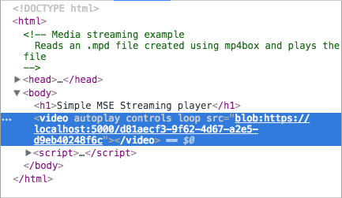

project_path: /web/fundamentals/_project.yaml
book_path: /web/fundamentals/_book.yaml
description: Media Source Extensions (MSE) is a JavaScript API that lets you build streams for playback from segments of audio or video.

{# wf_published_on: 2017-02-08 #}
{# wf_updated_on: 2017-07-14 #}
{# wf_blink_components: Internals>Media #}

# Media Source Extensions {: .page-title }




[Media Source Extensions (MSE)](https://www.w3.org/TR/media-source/)
is a JavaScript API that lets you build streams for playback from segments of
audio or video. Although not covered in this article, understanding MSE is
needed if you want to embed videos in your site that does such things as:

+  Adaptive streaming, which is another way of saying adapting to device
   capabilities and network conditions
+  Adaptive splicing, such as ad insertion
+  Time shifting
+  Control of performance and download size

<figure id="basic-mse" class="attempt-right">
  
  <figcaption><b>Figure 1</b>: Basic MSE data flow</figcaption>
</figure>

You can almost think of MSE as a chain. As illustrated in the figure, between
the downloaded file and the media elements are several layers.

+  An `<audio>` or `<video>` element to play the media.
+  A `MediaSource` instance with a `SourceBuffer` to feed the media element.
+  A `fetch()` or XHR call to retrieve media data in a `Response` object.
+  A call to `Response.arrayBuffer()` to feed `MediaSource.SourceBuffer`.

In practice, the chain looks like this:

    var vidElement = document.querySelector('video');
    
    if (window.MediaSource) {
      var mediaSource = new MediaSource();
      vidElement.src = URL.createObjectURL(mediaSource);
      mediaSource.addEventListener('sourceopen', sourceOpen);
    } else {
      console.log("The Media Source Extensions API is not supported.")
    }
    
    function sourceOpen(e) {
      URL.revokeObjectURL(vidElement.src);
      var mime = 'video/webm; codecs="opus, vp9"';
      var mediaSource = e.target;
      var sourceBuffer = mediaSource.addSourceBuffer(mime);
      var videoUrl = 'droid.webm';
      fetch(videoUrl)
        .then(function(response) {
          return response.arrayBuffer();
        })
        .then(function(arrayBuffer) {
          sourceBuffer.addEventListener('updateend', function(e) {
            if (!sourceBuffer.updating && mediaSource.readyState === 'open') {
              mediaSource.endOfStream();
            }
          });
          sourceBuffer.appendBuffer(arrayBuffer);
        });
    }

  
If you can sort things out from the explanations so far, feel free to stop
reading now. If you want a more detailed explanation, then please keep reading.
I'm going to walk through this chain by building a basic MSE example. Each of
the build steps will add code to the previous step. 

### A note about clarity

Will this article tell you everything you need to know about playing media on a
web page? No, it's only intended to help you understand more complicated code
you might find elsewhere. For the sake of clarity, this document simplifies and
excludes many things. We think we can get away with this because we also
recommend using a library such as [Google's Shaka Player](https://shaka-player-demo.appspot.com/demo/).
I will note throughout where I'm deliberately simplifying.

### A few things not covered

Here, in no particular order, are a few things I won't cover.

+  Playback controls. We get those for free by virtue of using the HTML5
   `<audio>` and `<video>` elements.
+  Error handling.

### For use in production environments

Here are some things I'd recommend in a production usage of MSE related APIs:

- Before making calls on these APIs, handle any error events or API
  exceptions, and check `HTMLMediaElement.readyState` and
  `MediaSource.readyState`. These values can change before associated events are
  delivered.
- Make sure previous `appendBuffer()` and `remove()` calls are not still in
  progress by checking the `SourceBuffer.updating` boolean value before
  updating the `SourceBuffer`'s `mode`, `timestampOffset`, `appendWindowStart`,
  `appendWindowEnd`, or calling `appendBuffer()` or `remove()` on the
  `SourceBuffer`.
- For all `SourceBuffer` instances added to your `MediaSource`, ensure none of
  their `updating` values are true before calling `MediaSource.endOfStream()`
  or updating the `MediaSource.duration`.
- If `MediaSource.readyState` value is `ended`, calls like `appendBuffer()` and
  `remove()`, or setting `SourceBuffer.mode` or `SourceBuffer.timestampOffset`
  will cause this value to transition to `open`. This means you should be
  prepared to handle multiple `sourceopen` events.
- When handling `HTMLMediaElement error` events, the contents of
  [`MediaError.message`](https://googlechrome.github.io/samples/media/error-message.html)
  can be useful to determine the root cause of the failure, especially for
  errors that are hard to reproduce in test environments.

## Attach a MediaSource instance to a media element

As with many things in web development these days, you start with feature
detection. Next, get a media element, either an `<audio>` or `<video>` element.
Finally create an instance of `MediaSource`. It gets turned into a URL and passed
to the media element's source attribute.

    var vidElement = document.querySelector('video');

    if (window.MediaSource) {
      var mediaSource = new MediaSource();
      vidElement.src = URL.createObjectURL(mediaSource);
      // Is the MediaSource instance ready?
    } else {
      console.log("The Media Source Extensions API is not supported.")
    }

Note: Each incomplete code example contains a comment that gives you a hint of
what I'll add in the next step. In the example above, this comment says, 'Is the
MediaSource instance ready?', which matches the title of the next section.

<figure id="src-as-blob">
  
  <figcaption><b>Figure 1</b>: A source attribute as a blob</figcaption>
</figure>

That a `MediaSource` object can be passed to a `src` attribute might seem a bit
odd. They're usually strings, but 
[they can also be blobs](https://www.w3.org/TR/FileAPI/#url).
If you inspect a page with embedded media and examine its media element, you'll
see what I mean.

### Is the MediaSource instance ready?

`URL.createObjectURL()` is itself synchronous; however, it processes the
attachment asynchronously. This causes a slight delay before you can do anything
with the `MediaSource` instance. Fortunately, there are ways to test for this.
The simplest way is with a `MediaSource` property called `readyState`. The
`readyState` property describes the relation between a `MediaSource` instance and
a media element. It can have one of the following values:

+  `closed` - The `MediaSource` instance is not attached to a media element. 
+  `open` - The `MediaSource` instance is attached to a media element and is
   ready to receive data or is receiving data.
+  `ended` - The `MediaSource` instance is attached to a media element and all of
   its data has been passed to that element.

Querying these options directly can negatively affect performance. Fortunately,
`MediaSource` also fires events when `readyState` changes, specifically
`sourceopen`, `sourceclosed`, `sourceended`. For the example I'm building, I'm
going to use the `sourceopen` event to tell me when to fetch and buffer the
video.

<pre class="prettyprint">
var vidElement = document.querySelector('video');

if (window.MediaSource) {
  var mediaSource = new MediaSource();
  vidElement.src = URL.createObjectURL(mediaSource);
  <strong>mediaSource.addEventListener('sourceopen', sourceOpen);</strong>
} else {
  console.log("The Media Source Extensions API is not supported.")
}

<strong>function sourceOpen(e) {
  URL.revokeObjectURL(vidElement.src);
  // Create a SourceBuffer and get the media file.
}</strong>
</pre>  

Notice that I've also called `revokeObjectURL()`. I know this seems premature,
but I can do this any time after the media element's `src` attribute is
connected to a `MediaSource` instance. Calling this method doesn't destroy any
objects. It _does_ allow the platform to handle garbage collection at an
appropriate time, which is why I'm calling it immediately.

## Create a SourceBuffer

Now it's time to create the `SourceBuffer`, which is the object that actually
does the work of shuttling data between media sources and media elements. A
`SourceBuffer` has to be specific to the type of media file you're loading.

In practice you can do this by calling `addSourceBuffer()` with the appropriate
value. Notice that in the example below the mime type string contains a mime
type and *two* codecs. This is a mime string for a video file, but it uses
separate codecs for the video and audio portions of the file.

Version 1 of the MSE spec allows user agents to differ on whether to require
both a mime type and a codec. Some user agents don't require, but do allow just
the mime type. Some user agents, Chrome for example, require a codec for mime
types that don't self-describe their codecs. Rather than trying to sort all this
out, it's better to just include both.

Note: For simplicity, the example only shows a single segment of media though in
practice, MSE only makes sense for scenarios with multiple segments.

<pre class="prettyprint">
var vidElement = document.querySelector('video');

if (window.MediaSource) {
  var mediaSource = new MediaSource();
  vidElement.src = URL.createObjectURL(mediaSource);
  mediaSource.addEventListener('sourceopen', sourceOpen);
} else {
  console.log("The Media Source Extensions API is not supported.")
}

function sourceOpen(e) {
  URL.revokeObjectURL(vidElement.src);
  <strong>var mime = 'video/webm; codecs="opus, vp9"';
  // e.target refers to the mediaSource instance.
  // Store it in a variable so it can be used in a closure.
  var mediaSource = e.target;
  var sourceBuffer = mediaSource.addSourceBuffer(mime);
  // Fetch and process the video.</strong>
}</pre>

## Get the media file

If you do an internet search for MSE examples, you'll find plenty that retrieve
media files using XHR. To be more cutting edge,
I'm going to use the [Fetch](https://developer.mozilla.org/en-US/docs/Web/API/GlobalFetch)
API and the [Promise](/web/fundamentals/getting-started/primers/promises) it
returns. If you're trying to do this in Safari, it won't work without a
`fetch()` polyfill.

Note: Just to help things fit on the screen, from here to the end I'm only going
to show part of the example we're building. If you want to see it in context,
[jump to the end](#the_final_version).

<pre class="prettyprint">
function sourceOpen(e) {
  URL.revokeObjectURL(vidElement.src);
  var mime = 'video/webm; codecs="opus, vp9"';  
  var mediaSource = e.target;  
  var sourceBuffer = mediaSource.addSourceBuffer(mime);  
  var videoUrl = 'droid.webm'; 
  <strong>fetch(videoUrl)
    .then(function(response) {
      // Process the response object.
    });</strong>
}</pre>

A production quality player would have the same file in multiple versions to
support different browsers. It could use separate files for audio and video to
allow audio to be selected based on language settings.

Real world code would also have multiple copies of media files at different
resolutions so that it could adapt to different device capabilities and network
conditions. Such an application is able to load and play videos in chunks either
using range requests or segments. This allows for adaption to network conditions
*while media are playing*. You may have heard the terms DASH or HLS, which are
two methods of accomplishing this. A full discussion of this topic is beyond the
scope of this introduction.

## Process the response object

The code looks almost done, but the media doesn't play. We need to get media
data from the `Response` object to the `SourceBuffer`.

The typical way to pass data from the response object to the `MediaSource`
instance is to get an `ArrayBuffer` from the response object and pass it to the
`SourceBuffer`. Start by calling `response.arrayBuffer()`, which returns a
promise to the buffer. In my code, I've passed this promise to a second `then()`
clause where I append it to the `SourceBuffer`.

<pre class="prettyprint">
function sourceOpen(e) {
  URL.revokeObjectURL(vidElement.src);
  var mime = 'video/webm; codecs="opus, vp9"';
  var mediaSource = e.target;
  var sourceBuffer = mediaSource.addSourceBuffer(mime);
  var videoUrl = 'droid.webm';
  fetch(videoUrl)
    .then(function(response) {
      <strong>return response.arrayBuffer();</strong>
    })
    <strong>.then(function(arrayBuffer) {
      sourceBuffer.appendBuffer(arrayBuffer);
    });</strong>
}</pre>

#### Call endOfStream() 

After all `ArrayBuffers` are appended, and no further media data is expected, call
`MediaSource.endOfStream()`.  This will change `MediaSource.readyState` to
`ended` and fire the `sourceended` event. 

<pre class="prettyprint">
function sourceOpen(e) {
  URL.revokeObjectURL(vidElement.src);
  var mime = 'video/webm; codecs="opus, vp9"';
  var mediaSource = e.target;
  var sourceBuffer = mediaSource.addSourceBuffer(mime);
  var videoUrl = 'droid.webm';
  fetch(videoUrl)
    .then(function(response) {
      return response.arrayBuffer();
    })
    .then(function(arrayBuffer) {
      <strong>sourceBuffer.addEventListener('updateend', function(e) {
        if (!sourceBuffer.updating && mediaSource.readyState === 'open') {
          mediaSource.endOfStream();
        }
      });</strong>
      sourceBuffer.appendBuffer(arrayBuffer);
    });
}</pre>

## The final version

Here's the complete code example. I hope you have learned something about Media
Source Extensions.

    var vidElement = document.querySelector('video');
    
    if (window.MediaSource) {
      var mediaSource = new MediaSource();
      vidElement.src = URL.createObjectURL(mediaSource);
      mediaSource.addEventListener('sourceopen', sourceOpen);
    } else {
      console.log("The Media Source Extensions API is not supported.")
    }
    
    function sourceOpen(e) {
      URL.revokeObjectURL(vidElement.src);
      var mime = 'video/webm; codecs="opus, vp9"';
      var mediaSource = e.target;
      var sourceBuffer = mediaSource.addSourceBuffer(mime);
      var videoUrl = 'droid.webm';
      fetch(videoUrl)
        .then(function(response) {
          return response.arrayBuffer();
        })
        .then(function(arrayBuffer) {
          sourceBuffer.addEventListener('updateend', function(e) {
            if (!sourceBuffer.updating && mediaSource.readyState === 'open') {
              mediaSource.endOfStream();
            }
          });
          sourceBuffer.appendBuffer(arrayBuffer);
        });
    }
