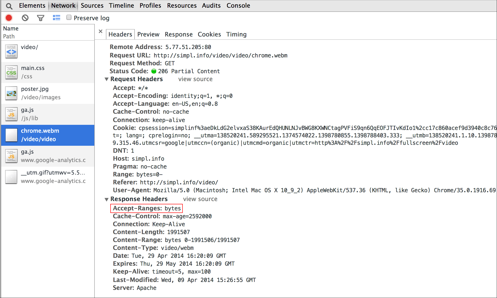
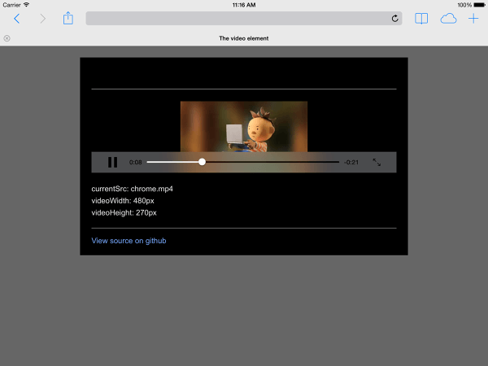
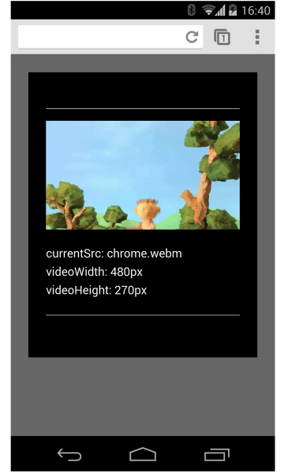

project_path: /web/fundamentals/_project.yaml
book_path: /web/fundamentals/_book.yaml
description: Learn about the simplest ways to add video to your site and ensure users get the best possible experience on any device.

{# wf_updated_on: 2018-09-20 #}
{# wf_published_on: 2014-04-15 #}
{# wf_blink_components: Blink>Media #}

# Video {: .page-title }



  <iframe class="devsite-embedded-youtube-video" data-video-id="j5fYOYrsocs"
          data-autohide="1" data-showinfo="0" frameborder="0" allowfullscreen>
  </iframe>

Users like videos; videos can be fun and informative. On mobile devices, videos
can be an easier way to consume information. But videos take bandwidth and they
don't always work the same across every platform. Users don't like waiting for
videos to load; they don't like it when they press play and nothing happens.
Read on to find the simplest way to add video to your site and ensure users get
the best possible experience on any device.

## Add a video

### TL;DR {: .hide-from-toc }
- Use the `video` element to load, decode, and play video on your site.
- Produce video in multiple formats to cover a range of mobile platforms.
- Size videos correctly; ensure they don't overflow their containers.
- Accessibility matters; add the `track` element as a child of the `video` element.

### Add the video element

Add the `video` element to load, decode, and play video in your site:

<video controls>
  <source src="https://storage.googleapis.com/webfundamentals-assets/videos/chrome.webm" type="video/webm">
  <source src="https://storage.googleapis.com/webfundamentals-assets/videos/chrome.mp4" type="video/mp4">
  
This browser does not support the video element.

</video>

    <video src="chrome.webm" type="video/webm">
        
Your browser does not support the video element.

    </video>

### Specify multiple file formats

Not all browsers support the same video formats. The `<source>` element lets
you specify multiple formats as a fallback in case the user's browser  doesn't
support one of them.

For example:

<pre class="prettyprint">

</pre>

[Try it](https://googlesamples.github.io/web-fundamentals/fundamentals/media/video-main.html){: target="_blank" .external }

When the browser parses the `<source>` tags, it uses the optional `type`
attribute to help decide which file to download and play. If the browser
supports `WebM`, it plays chrome.webm; if not, it checks whether it can play
MPEG-4 videos.

Check out [A Digital Media Primer for Geeks](//www.xiph.org/video/vid1.shtml) to
find out more about how video and audio work on the web.

This approach has several advantages over serving different HTML or server-side
scripting, especially on mobile:

* Developers can list formats in order of preference.
* Native client-side switching reduces latency; only one request is made to
  get content.
* Letting the browser choose a format is simpler, quicker, and potentially
  more reliable than using a server-side support database with user-agent detection.
* Specifying each file source's type improves network performance; the browser can select a
  video source without having to download part of the video to "sniff" the format.

All of these points are especially important in mobile contexts, where bandwidth
and latency are at a premium and the user's patience is likely to be limited.
Not including a type attribute can affect performance when there are
multiple sources with unsupported types.

Using your mobile browser developer tools, compare network activity
[with type attributes](https://googlesamples.github.io/web-fundamentals/fundamentals/media/video-main.html)
and [without type attributes](https://googlesamples.github.io/web-fundamentals/fundamentals/design-and-ux/responsive/notype.html).

Also check the response headers in your browser developer tools to
[ensure your server reports the right MIME type](//developer.mozilla.org/en/docs/Properly_Configuring_Server_MIME_Types);
otherwise video source type checks won't work.

### Specify start and end times

Save bandwidth and make your site feel more responsive: use the Media
Fragments API to add start and end times to the video element.

<video controls>
  <source src="https://storage.googleapis.com/webfundamentals-assets/videos/chrome.webm#t=5,10" type="video/webm">
  <source src="https://storage.googleapis.com/webfundamentals-assets/videos/chrome.mp4#t=5,10" type="video/mp4">
  
This browser does not support the video element.

</video>

To add a media fragment, you simply add `#t=[start_time][,end_time]` to the
media URL. For example, to play the video between seconds 5 through 10,
specify:

    <source src="video/chrome.webm#t=5,10" type="video/webm">

You can also use the Media Fragments API to deliver multiple views on the same
video&ndash;like cue points in a DVD&ndash;without having to encode and
serve multiple files.

Caution: Most platforms except iOS support the Media Fragments API. Also, make
sure that your server supports Range Requests. By default, most servers enable
Range Requests, but some hosting services may turn them off.

Using your browser developer tools, check for `Accept-Ranges: bytes` in the
response headers:

### Include a poster image

Add a poster attribute to the `video` element so that your users have an idea
of the content as soon as the element loads, without needing to download
video or start playback.

    <video poster="poster.jpg" ...>
      ...
    </video>

A poster can also be a fallback if the video `src` is broken or if none of the
video formats supplied are supported. The only downside to poster images is
an additional file request, which consumes some bandwidth and requires
rendering. For more information see [Image Optimization](/web/fundamentals/performance/optimizing-content-efficiency/image-optimization).

Here's a side-by-side comparison of videos without and with a poster
image&ndash;we've made the poster image grayscale to prove it's not the video:

  <figure>
    
    <figcaption>
      Android Chrome screenshot, portrait: no poster
     </figcaption>
  </figure>

  <figure>
    
    <figcaption>
      Android Chrome screenshot, portrait: with poster
     </figcaption>
  </figure>

## Provide alternatives for legacy platforms

Not all video formats are supported on all platforms. Check which formats
are supported on the major platforms and make sure your video works in each
of these.

### Check which formats are supported {: #check-formats }

Use `canPlayType()` to find out which video formats are supported. The method
takes a string argument consisting of a `mime-type` and optional codecs and
returns one of the following values:

<table class="responsive">
  <thead>
    <tr>
      <th colspan="2">Return value and Description</th>
    </tr>
  </thead>
  <tbody>
    <tr>
      <td data-th="Return value">(empty string)</td>
      <td data-th="Description">The container and/or codec isn't supported.</td>
    </tr>
    <tr>
      <td data-th="Return value"><code>maybe</code></td>
      <td data-th="Description">
        The container and codec(s) might be supported, but the browser
        will need to download some video to check.
      </td>
    </tr>
    <tr>
      <td data-th="Return value"><code>probably</code></td>
      <td data-th="Description">The format appears to be supported.
      </td>
    </tr>
  </tbody>
</table>

Here are some examples of `canPlayType()` arguments and return values when
run in Chrome:

<table class="responsive">
  <thead>
    <tr>
      <th colspan="2">Type and Response</th>
    </tr>
  </thead>
  <tbody>
    <tr>
      <td data-th="Type"><code>video/xyz</code></td>
      <td data-th="Response">(empty string)</td>
    </tr>
    <tr>
      <td data-th="Type"><code>video/xyz; codecs="avc1.42E01E, mp4a.40.2"</code></td>
      <td data-th="Response">(empty string)</td>
    </tr>
    <tr>
      <td data-th="Type"><code>video/xyz; codecs="nonsense, noise"</code></td>
      <td data-th="Response">(empty string)</td>
    </tr>
    <tr>
      <td data-th="Type"><code>video/mp4; codecs="avc1.42E01E, mp4a.40.2"</code></td>
      <td data-th="Response"><code>probably</code></td>
    </tr>
    <tr>
      <td data-th="Type"><code>video/webm</code></td>
      <td data-th="Response"><code>maybe</code></td>
    </tr>
    <tr>
      <td data-th="Type"><code>video/webm; codecs="vp8, vorbis"</code></td>
      <td data-th="Response"><code>probably</code></td>
    </tr>
  </tbody>
</table>

### Produce video in multiple formats

There are lots of tools to help save the same video in different formats:

* Desktop tools: [FFmpeg](//ffmpeg.org/)
* GUI applications: [Miro](http://www.mirovideoconverter.com/),
  [HandBrake](//handbrake.fr/), [VLC](//www.videolan.org/)
* Online encoding/transcoding services:
  [Zencoder](//en.wikipedia.org/wiki/Zencoder),
  [Amazon Elastic Encoder](//aws.amazon.com/elastictranscoder)

### Check which format was used

Want to know which video format was actually chosen by the browser?

In JavaScript, use the video's `currentSrc` property to return the source used.

## Size videos correctly

When it comes to keeping your users happy, file size is important.

### TL;DR {: .hide-from-toc }
- Don't serve videos with a larger frame size or higher quality than the platform can handle.
- Don't make your videos any longer than they need be.
- Long videos can cause hiccups with download and seeking; some browsers may
  have to wait until the video downloads before beginning playback.

### Check video size

The actual video frame size, as encoded, might be different from the video
element dimensions (just as an image might not be displayed using its actual
dimensions).

To check the encoded size of a video, use the video element `videoWidth`
and `videoHeight` properties. `width` and `height` return the dimensions of
the video element, which may have been sized using CSS or inline width and
height attributes.

### Ensure videos don't overflow containers

When video elements are too big for the viewport, they may overflow their
container, making it impossible for the user to see the content or use
the controls.

  <figure>
    
    <figcaption>
      Android Chrome screenshot, portrait: unstyled video element overflows viewport
    </figcaption>
  </figure>

  <figure>
    
    <figcaption>
      Android Chrome screenshot, landscape: unstyled video element overflows viewport
    </figcaption>
  </figure>

You can control video dimensions using JavaScript or CSS. JavaScript libraries
and plugins such as [FitVids](http://fitvidsjs.com/) make it possible to maintain
appropriate size and aspect ratio, even for Flash videos from YouTube and
other sources.

Use [CSS media queries](/web/fundamentals/design-and-ux/responsive/#css-media-queries)
to specify the size of elements depending on the viewport dimensions; `max-
width: 100%` is your friend.

For media content in iframes (such as YouTube videos), try a responsive approach
(like the one [proposed by John Surdakowski](http://avexdesigns.com/responsive-youtube-embed/)).

Caution: Don't force element sizing that results in an aspect ratio different
from the original video. Squashed or stretched looks bad.

**CSS:**

<pre class="prettyprint">

</pre>

**HTML:**

<pre class="prettyprint">

</pre>

[Try it](https://googlesamples.github.io/web-fundamentals/fundamentals/media/responsive_embed.html)

Compare the [responsive sample](https://googlesamples.github.io/web-fundamentals/fundamentals/media/responsive_embed.html)
to the [unresponsive version](https://googlesamples.github.io/web-fundamentals/fundamentals/design-and-ux/responsive/unyt.html).

## Customize the video player

Different platforms display video differently. Mobile solutions need to
consider device orientation. Use the Fullscreen API to control the fullscreen
view of video content.

### How device orientation works across devices

Device orientation isn't an issue for desktop monitors or laptops, but it's
hugely important when considering web page design for mobile and tablets.

Safari on iPhone does a good job of switching between portrait and landscape
orientation:

  <figure>
    
    <figcaption>Screenshot of video playing in Safari on iPhone, portrait</figcaption>
  </figure>

  <figure>
    
    <figcaption>Screenshot of video playing in Safari on iPhone, landscape</figcaption>
  </figure>

Device orientation on an iPad and Chrome on Android can be problematic.
For example, without any customization a video playing on an iPad in landscape
orientation looks like this:

Setting the video `width: 100%` or `max-width: 100%` with CSS can resolve
many device orientation layout problems. You may also want to consider
fullscreen alternatives.

## Inline or fullscreen display

Different platforms display video differently. Safari on an iPhone displays a
video element inline on a web page, but plays video back in fullscreen mode:

On Android, users can request request fullscreen mode by clicking the
fullscreen icon. But the default is to play video inline:

Safari on an iPad plays video inline:

### Control fullscreening of content

For platforms that do not force fullscreen video playback, the Fullscreen API
is [widely supported](http://caniuse.com/#feat=fullscreen). Use this API to control
fullscreening of content, or the page.

To full screen an element, like a video:

    elem.requestFullscreen();

To full screen the entire document:

    document.body.requestFullscreen();

You can also listen for fullscreen state changes:

    video.addEventListener("fullscreenchange", handler);

Or, check to see if the element is currently in fullscreen mode:

    console.log("In full screen mode: ", video.displayingFullscreen);

You can also use the CSS `:fullscreen` pseudo-class to change the way
elements are displayed in fullscreen mode.

<video autoplay muted loop class="attempt-right">
  <source src="https://storage.googleapis.com/webfundamentals-assets/videos/fullscreen.webm" type="video/webm">
  <source src="https://storage.googleapis.com/webfundamentals-assets/videos/fullscreen.mp4" type="video/mp4">
  
This browser does not support the video element.

</video>

On devices that support the Fullscreen API, consider using thumbnail
images as placeholders for video:

To see this in action, check out the
[demo](https://googlesamples.github.io/web-fundamentals/fundamentals/design-and-ux/responsive/fullscreen.html).

Dogfood: `requestFullscreen()` may be vendor prefixed and may require extra code
for full cross browser compatibility.

## Accessibility matters

Accessibility isn't a feature. Users who can't hear or see won't be able to
experience a video at all without captions or descriptions. The time it takes to
add these to your video is much less than the bad experience you're delivering
to users. Provide at least a base experience for all users.

### Include captions to improve accessibility

To make media more accessible on mobile, include captions or descriptions
using the track element.

### Add track element

It's very easy to add captions to your video&ndash;simply add a track
element as a child of the video element:

<pre class="prettyprint">

</pre>

[Try it](https://googlesamples.github.io/web-fundamentals/fundamentals/media/track.html)

The track element `src` attribute gives the location of the track file.

### Define captions in track file

A track file consists of timed "cues" in WebVTT format:

    WEBVTT

    00:00.000 --> 00:04.000
    Man sitting on a tree branch, using a laptop.

    00:05.000 --> 00:08.000
    The branch breaks, and he starts to fall.

    ...

## Quick Reference

### Video element attributes

For the complete list of video element attributes and their definitions, see
[the video element spec](//www.w3.org/TR/html5/embedded-content-0.html#the-video-element).

<table>
  <thead>
    <tr>
      <th>Attribute</th>
      <th>Description</th>
    </tr>
  </thead>
  <tbody>
    <tr>
      <td data-th="Attribute"><code>src</code></td>
      <td data-th="Description">Address (URL) of the video.</td>
    </tr>
    <tr>
      <td data-th="Attribute"><code>poster</code></td>
      <td data-th="Description">Address (URL) of an image file that the browser
      can show as soon as the video element is displayed without downloading
      video content.</td>
    </tr>
    <tr>
      <td data-th="Attribute"><code>preload</code></td>
      <td data-th="Description">Hints to the browser that preloading metadata
      (or some video) in advance of playback is worthwhile. Options are none, metadata,
      or auto (see <a href="#preload">Preload</a> section for details). </td>
    </tr>
    <tr>
      <td data-th="Attribute"><code>autoplay</code></td>
      <td data-th="Description">Start download and playback as soon as possible
      (see <a href="#autoplay">Autoplay</a> section for details).</td>
    </tr>
    <tr>
      <td data-th="Attribute"><code>loop</code></td>
      <td data-th="Description">Loop the video.</td>
    </tr>
    <tr>
      <td data-th="Attribute"><code>controls</code></td>
      <td data-th="Description">Show the default video controls (play, pause, etc.).</td>
    </tr>
  </tbody>
</table>

### Autoplay {: #autoplay }

On desktop, `autoplay` tells the browser to download and play the video
immediately. On mobile, don't assume `autoplay` will always work. See the [WebKit
blog](https://webkit.org/blog/6784/new-video-policies-for-ios/), for instance.

Even on platforms where autoplay is possible, you need to consider whether
it's a good idea to enable it:

* Data usage can be expensive.
* Causing media to download and playback to begin without asking first, can
  unexpectedly hog bandwidth and CPU, and thereby delay page rendering.
* Users may be in a context where playing video or audio is intrusive.

Autoplay behavior is configurable in the Android WebView via the
[WebSettings API](//developer.android.com/reference/android/webkit/WebSettings.html#setMediaPlaybackRequiresUserGesture(boolean)).
It defaults to true but a WebView app can choose to disable it.

### Preload {: #preload }

The `preload` attribute provides a hint to the browser as to how much
information or content to preload.

<table class="responsive">
  <thead>
    <tr>
      <th colspan="2">Value &amp; Description</th>
    </tr>
  </thead>
  <tbody>
    <tr>
      <td data-th="Value"><code>none</code></td>
      <td data-th="Description">The user may not even watch the video&ndash;don't
      preload anything.</td>
    </tr>
    <tr>
      <td data-th="Value"><code>metadata</code></td>
      <td data-th="Description">Metadata (duration, dimensions, text tracks) should be
      preloaded, but with minimal video.</td>
    </tr>
    <tr>
      <td data-th="Value"><code>auto</code></td>
      <td data-th="Description">Downloading the entire video right away is considered
      desirable.</td>
    </tr>
  </tbody>
</table>

The `preload` attribute has different effects on different platforms.
For example, Chrome buffers 25 seconds of video on desktop but none on iOS or
Android. This means that on mobile, there may be playback startup delays
that don't happen on desktop. See [Steve Souders'
blog](https://www.stevesouders.com/blog/2013/04/12/html5-video-preload/) for
full details.

### JavaScript

[The HTML5 Rocks Video article](//www.html5rocks.com/en/tutorials/video/basics/#toc-javascript)
does a great job of summarizing the JavaScript properties, methods, and events
that can be used to control video playback.

#### Properties

<table class="responsive">
  <thead>
    <tr>
    <th colspan="2">Property &amp; Description</th>
    </tr>
  </thead>
  <tbody>
    <tr>
      <td data-th="Property"><code>currentTime</code></td>
      <td data-th="Description">Get or set playback position in seconds.</td>
    </tr>
    <tr>
      <td data-th="Property"><code>volume</code></td>
      <td data-th="Description">Get or set current volume level for the video.</td>
    </tr>
    <tr>
      <td data-th="Property"><code>muted</code></td>
      <td data-th="Description">Get or set audio muting.</td>
    </tr>
    <tr>
      <td data-th="Property"><code>playbackRate</code></td>
      <td data-th="Description">Get or set playback rate; 1 is normal speed forward.</td>
    </tr>
    <tr>
      <td data-th="Property"><code>buffered</code></td>
      <td data-th="Description">Information about how much of the video has been buffered
      and is ready to play.</td>
    </tr>
    <tr>
      <td data-th="Property"><code>currentSrc</code></td>
      <td data-th="Description">The address of the video being played.</td>
    </tr>
    <tr>
      <td data-th="Property"><code>videoWidth</code></td>
      <td data-th="Description">Width of the video in pixels (which may be different
      from the video element width).</td>
    </tr>
    <tr>
      <td data-th="Property"><code>videoHeight</code></td>
      <td data-th="Description">Height of the video in pixels (which may be different
      from the video element height).</td>
    </tr>
  </tbody>
</table>

#### Methods

<table class="responsive">
  <thead>
    <tr>
    <th colspan="2">Method &amp; Description</th>
    </tr>
  </thead>
  <tbody>
    <tr>
      <td data-th="Method"><code>load()</code></td>
      <td data-th="Description">Load or reload a video source without initiating
      playback: for example, when the video src is changed using JavaScript.</td>
    </tr>
    <tr>
      <td data-th="Method"><code>play()</code></td>
      <td data-th="Description">Play the video from its current location.</td>
    </tr>
    <tr>
      <td data-th="Method"><code>pause()</code></td>
      <td data-th="Description">Pause the video at its current location.</td>
    </tr>
    <tr>
      <td data-th="Method"><code>canPlayType('format')</code></td>
      <td data-th="Description">Find out which formats are supported
      (see <a href="#check-formats"> Check which formats are supported</a>).</td>
    </tr>
  </tbody>
</table>

On mobile `play()` and `pause()` don't work unless called in response to user
action such as clicking a button: see the
[demo](https://googlesamples.github.io/web-fundamentals/fundamentals/design-and-ux/responsive/scripted.html).
(Likewise, you can't initiate playback for content such as embedded
YouTube videos.)

#### Events

These are only a subset of the media events that may be fired. Refer to
the [Media events](//developer.mozilla.org/docs/Web/Guide/Events/Media_events)
page on the Mozilla Developer Network for a complete listing.

<table class="responsive">
  <thead>
  <tr>
    <th colspan="2">Event &amp; Description</th>
    </tr>
  </thead>
  <tbody>
    <tr>
      <td data-th="Event"><code>canplaythrough</code></td>
      <td data-th="Description">Fired when enough data is available that the browser
      believes it can play the video completely without interruption.</td>
    </tr>
    <tr>
      <td data-th="Event"><code>ended</code></td>
      <td data-th="Description">Fired when video has finished playing.</td>
    </tr>
    <tr>
      <td data-th="Event"><code>error</code></td>
      <td data-th="Description">Fired if an error occurs (see
<a href="https://googlechrome.github.io/samples/media/error-message.html">demo</a>).</td>
    </tr>
    <tr>
      <td data-th="Event"><code>playing</code></td>
      <td data-th="Description">Fired when video starts playing for the first time, after
      being paused, or when restarting.</td>
    </tr>
    <tr>
      <td data-th="Event"><code>progress</code></td>
      <td data-th="Description">Fired periodically to indicate download progress.</td>
    </tr>
    <tr>
      <td data-th="Event"><code>waiting</code></td>
      <td data-th="Description">Fired when an action is delayed pending completion of
      another action.</td>
    </tr>
    <tr>
      <td data-th="Event"><code>loadedmetadata</code></td>
      <td data-th="Description">Fired when browser finishes loading metadata for video:
      duration, dimensions, and text tracks.</td>
    </tr>
  </tbody>
</table>

## Feedback {: #feedback }


