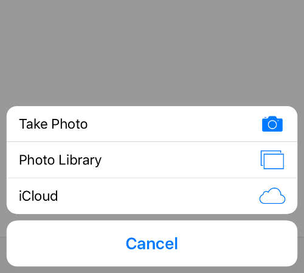
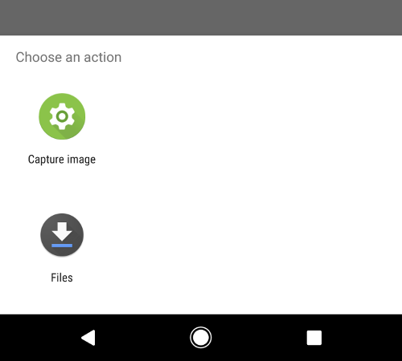

project_path: /web/_project.yaml
book_path: /web/fundamentals/_book.yaml
description: Most browsers can get access to the user's camera.

{# wf_updated_on: 2017-07-28 #}
{# wf_published_on: 2016-08-23 #}

# Capturing an Image from the User {: .page-title }




Many browsers now have the ability to access video and audio input from the
user. However, depending on the browser it might be a full dynamic and inline
experience, or it could be delegated to another app on the user's device. On top
of that, not every device even has a camera. So how can you create an experience
that uses a user generated image that works well everywhere?

## Start simple and progressively

The easiest thing to do is simply ask the user for a pre-recorded
file. There are a lot of good options here to give you a great progressive enhancement story.

### Ask for a URL
This is the best supported but least satisfying option - get the user to give you a URL, and then
use that. For just displaying the image this works everywhere - create an `img` element, set the
`src` and you're done.

It's more complicated than that, though, if you want to manipulate the image in any way. CORS will
prevent you from accessing the actual pixels unless the server sets the appropriate headers, and the
only practical way around that is to run a proxy server.

### File input
You can also use a simple file input element, including an `accept` filter that indicates we only
want image files.

    <input type="file" accept="image/*">

This method works on all platforms. On desktop it will prompt the user to
upload an image file from the file system. In Chrome and Safari on iOS and Android this method will
give the user a choice of which app to use to capture the image, including the option of taking a
photo directly with the camera or choosing an existing image file.

The data can then be attached to a `<form>` or manipulated with JavaScript by
listening for an `onchange` event on the input element and then reading
the `files` property of the event `target`.

    <input type="file" accept="image/*" id="camera">
    

The `files` property is a `FileList` object, which we'll talk more about later.

You can also optionally add the `capture` attribute to the element, which indicates to the browser
that you prefer getting an image from the camera.

    <input type="file" accept="image/*" capture>
    <input type="file" accept="image/*" capture="user">
    <input type="file" accept="image/*" capture="environment">

Adding the `capture` attribute without a value let's the browser decide which camera to use, while
the `"user"` and `"environment"` values tell the browser to prefer the front and rear cameras,
repectively.

Be aware, however, that on Android this means that
the user will no longer have the option of choosing an existing picture. The system camera app will
be started directly, instead.

### Drag and drop
If you are already adding in the ability to upload a file, there are a couple of easy ways that you
can make the user experience a little richer.

The first is to add a drop target to your page that allows the user to drag in a file from the
desktop or another application.

    
You can drag an image file here

    

Similar to the file input, you can get a `FileList` object from the `dataTransfer.files` property of
the `drop` event;

The `dragover` event handler let's us signal to the user what will happen if they drop the file they
are dragging onto the target.

Drag and drop has been around for a long time and is well supported by the major browsers.

### Paste from clipboard
The final way to get an existing image file is from the clipboard. The code for this is very simple,
but the user experience is a little harder to get right.

    <textarea id="target">Paste an image here</textarea>
    

(`e.clipboardData.files` is yet another FileList object.)

The tricky part with the clipboard API is that, for full cross-browser support, the target element
needs to be both selectable and editable. Both `<textarea>` and `<input type="text">` fit the bill
here, but are both also obviously designed for editing text.

It can be difficult to make this work smoothly if you don't want to user to also be able to input
text. Tricks like having a hidden input that gets selected when you click on some other element can
make maintaining accessibility harder.

### Handling a FileList object
Since most of the above methods produce a `FileList`, we should talk a little about what that is.

A `FileList` is similar to an `Array`. It has numeric keys and a `length` property, but it isn't
*actually* an array. There are no array methods, like `forEach` or `pop`, and it isn't iterable.
Even `Array.from(fileList)` doesn't work correctly. If you want to iterate over all of the files you
need to use a standard for loop.

The entries of the `FileList` are `File` objects. These are exactly the same as `Blob` objects
except that they have additional `name` and `lastModified` read-only properties.

    
    

This example finds the first file that has an image MIME type, but you could also handle multiple
images being selected/pasted/dropped at once.

Once you have access to the file you can do anything you want with it. For
example, you can:

- Draw it into a `<canvas>` element so that you can manipulate it
- Download it to the user's device
- Upload it to a server with `fetch` or `XMLHttpRequest`

## Access the camera interactively
Now that we've covered our bases, it's time to progressively enhance!

Modern browsers can get direct access to cameras, allowing us to build
experiences that are fully integrated with the web page, so the user need never
leave the browser.

### Acquire access to the camera

We can directly access a camera and microphone by using an API in the WebRTC
specification called `getUserMedia()`. This will prompt the user for
access to their connected microphones and cameras.

Support for `getUserMedia` is pretty good, but it isn't yet everywhere. In particular, it is not
available in Safari 10 or lower, which at the time of writing is still the latest stable version.
However, Apple have announced that it will be available in Safari 11.

It's very simple to detect support, however.

    const supported = 'mediaDevices' in navigator;

Warning: Direct access to the camera is a powerful feature. It requires consent
from the user, and your site MUST be on a secure origin (HTTPS).

When you call `getUserMedia`, you need to pass in an object that describes what kind of media you
want. These choices are called constraints.

There are a several possible constraints, covering things like whether you prefer a front- or
rear-facing camera, whether you want audio, and your preferred resolution for the stream.

To get data from the camera, however, we need just one constraint, and that is `video: true`.

If successful the API will return a `MediaStream` that contains data from
the camera, and we can then either attach it to a `<video>` element and play it
to show a real time preview, or attach it to a `<canvas>` to get a
snapshot.

    <video id="player" controls autoplay></video>
    

By itself, this isn't that useful. All we can do is take the video data and play
it back. If we want to get an image, we have to do a little extra work.

### Grab a snapshot
Our best supported option for getting an image is to draw a frame from the video to a canvas.

Unlike `Web Audio`, there isn't a
dedicated stream processing API for video on the web so we have to resort to
a tiny bit of hackery to capture a snapshot from the user's camera.

The process is as follows:

1. Create a canvas object that will hold the frame from the camera
2. Get access to the camera stream
3. Attach it to a video element
4. When you want to capture a precise frame, add the data from the video element
   to a canvas object using `drawImage()`.

Done.

    <video id="player" controls autoplay></video>
    <button id="capture">Capture</button>
    <canvas id="snapshot" width=320 height=240></canvas>
    

Once you have data from the camera stored in the canvas you can do many
things with it. You could:

- Upload it straight to the server
- Store it locally
- Apply funky effects to the image

## Tips

### Stop streaming from the camera when not needed

It is good practice to stop using the camera when you no longer need it.
Not only will this save battery and processing power, it will also give
users confidence in your application.

To stop access to the camera you can simply call `stop()` on each video track
for the stream returned by `getUserMedia()`.

<pre class="prettyprint">
&lt;video id="player" controls autoplay>&lt;/video>
&lt;button id="capture">Capture&lt;/button>
&lt;canvas id="snapshot" width=320 height=240>&lt;/canvas>
&lt;script>
  const player = document.getElementById('player');
  const canvas = document.getElementById('snapshot');
  const context = snapshot.getContext('2d');
  const captureButton = document.getElementById('capture');

  const constraints = {
    video: true,
  };

  <strong>const videoTracks;</strong>

  captureButton.addEventListener('click', function() {
    context.drawImage(player, 0, 0, canvas.width, canvas.height);

    <strong>// Stop all video streams.
    videoTracks.forEach(function(track) {track.stop()});</strong>
  });

  navigator.mediaDevices.getUserMedia(constraints)
    .then((stream) => {
      // Attach the video stream to the video element and autoplay.
      player.srcObject = stream;
      <strong>videoTracks = stream.getVideoTracks();</strong>
    });
&lt;/script>
</pre>

### Ask permission to use camera responsibly

If the user has not previously granted your site access to the camera then
the instant that you call `getUserMedia` the browser will prompt the user to
grant your site permission to the camera.

Users hate getting prompted for access to powerful devices on their machine
and they will frequently block the request, or they will ignore it if they don't
understand the context for which the prompt has been created. It is best
practice to only ask to access the camera when first needed. Once the user has
granted access they won't be asked again. However, if the user rejects access,
you can't get access again, unless they manually change camera permission
settings.

Warning: Asking for access to the camera on page load will result in most of
your users rejecting access to it.

## Compatibility

More information about mobile and desktop browser implementation:
- [srcObject](https://www.chromestatus.com/feature/5989005896187904)
- [navigator.mediaDevices.getUserMedia()](https://www.chromestatus.com/features/5755699816562688)

We also recommend using the [adapter.js](https://github.com/webrtc/adapter) shim to protect apps
from WebRTC spec changes and prefix differences.
