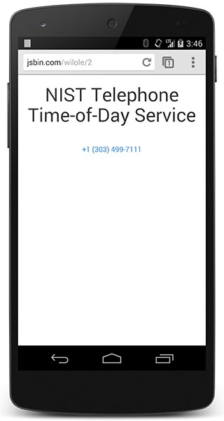

project_path: /web/fundamentals/_project.yaml
book_path: /web/fundamentals/_book.yaml
description: On devices with phone capabilities, make it easy for users to directly connect with you by simply tapping a phone number, more commonly known as click to call.

{# wf_updated_on: 2016-08-22 #}
{# wf_published_on: 2014-06-17 #}

# Click to Call {: .page-title }



On devices with phone capabilities, make it easy for users to directly connect
with you by simply tapping a phone number, more commonly known as click to call.

### TL;DR {: .hide-from-toc }

* Wrap all phone numbers in hyperlinks with the <code>tel:</code> schema.
* Always use the international dialing format.

## Link telephone numbers for click to call

While many modern mobile browsers automatically detect phone numbers 
and convert them to links, it’s a good idea to do this directly in your code.
By manually tagging each phone number, you can ensure that phone numbers are always
enabled for click to call and that they will be styled to match your site.

To mark a phone number as a link, use the `tel:` scheme.  The syntax is 
simple:

    NIST Telephone Time-of-Day Service 
    <a href="tel:+1-303-499-7111">+1 (303) 499-7111</a>

Your browser displays this syntax as follows:

NIST Telephone Time-of-Day Service <a href="tel:+1-303-499-7111">+1 (303) 499-7111</a>

  <figure>
    
    <figcaption>Click to call example</figcaption>
  </figure>

On most devices with telephone capabilities, the user receives a
confirmation before the number is dialed, to ensure that the user isn't being
tricked into calling an expensive long distance or premium phone number. 
When the device doesn’t support phone calls, users may be presented with a
menu allowing them to choose how the browser should handle the number.

Desktop browsers that don’t support voice calls open the default
telephony app on the computer; for example Google Voice or Microsoft
Communicator.

## Use the international dialing format

Always supply the phone number using the international dialing format: 
the plus sign (`+`), country code, area code, and number.  While not absolutely
necessary, it’s a good idea to separate each segment of the number with a
hyphen (`-`) for easier reading and better auto-detection.

Using a hyphenated international dialing format ensures that no matter where
the user is calling from, whether a few hundred meters away or thousands
of kilometers, their call will be connected.

## Disable auto-detection when necessary

Modern mobile browsers automatically detect phone numbers and enable
click to call. Mobile Safari automatically converts phone numbers to links
with the associated hyperlink styles. Chrome for Android automatically
detects phone numbers and allows users to click to call, but does not wrap
the phone numbers in hyperlinks or apply any special styles.

To prevent Mobile Safari from automatically detecting phone numbers, add the
following meta tag to the top of the page:

    <meta name="format-detection" content="telephone=no">

## Other click to call features

In addition to the `tel:` schema, some modern browsers also support the `sms:`
and `mms:` schemas, though support is not as consistent, and some
features like setting the message body don't always work. 
