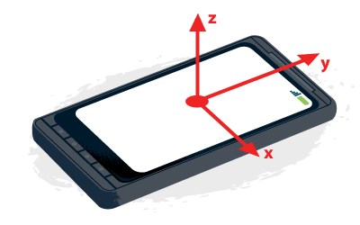
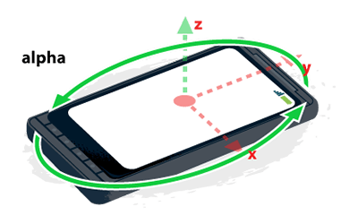
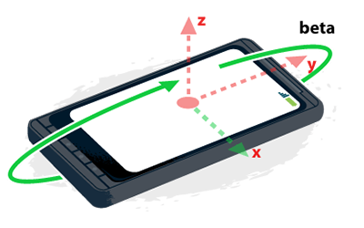
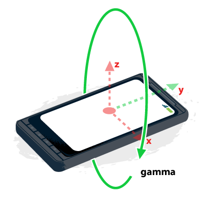

project_path: /web/fundamentals/_project.yaml
book_path: /web/fundamentals/_book.yaml
description: Device motion and orientation events provide access to the built-in accelerometer, gyroscope, and compass in mobile devices.

{# wf_updated_on: 2016-08-22 #}
{# wf_published_on: 2014-06-17 #}

# Device Orientation & Motion {: .page-title }



Device motion and orientation events provide access to the built-in
accelerometer, gyroscope, and compass in mobile devices.

These events can be used for many purposes; in gaming, for example, to control
the direction or action of a character. When used with geolocation, they can
help create more accurate turn-by-turn navigation or provide information about
a specific location.

Caution: Not all browsers use the same coordinate system, and they may report different values under identical situations. This has improved over time, but be sure to test your situation.

##TL;DR

* Detect which side of the device is up and how the device is rotating.
* Learn when and how to respond to motion and orientation events.

## Which end is up?

To use the data that the device orientation and motion events return,
it is important to understand the values provided.  

### Earth coordinate frame

The Earth coordinate frame, described by the values `X`, `Y`, and `Z`, is aligned
based on gravity and standard magnetic orientation.

<table class="responsive">
<tr><th colspan="2">Coordinate system</th></tr>
<tr>
  <td><code>X</code></td>
  <td>Represents the east-west direction (where east is positive).</td>
</tr>
<tr>
  <td><code>Y</code></td>
  <td>Represents the north-south direction (where north is positive).</td>
</tr>
<tr>
  <td><code>Z</code></td>
  <td>Represents the up-down direction, perpendicular to the ground
      (where up is positive).
  </td>
</tr>
</table>

### Device coordinate frame

  <figure id="fig1">
    
    <figcaption>
      Illustration of device coordinate frame
    </figcaption>
  </figure>

<!-- Special thanks to Sheppy (https://developer.mozilla.org/en-US/profiles/Sheppy)
  for his images which are in the public domain. -->

The device coordinate frame, described by the values `x`, `y`, and `z`, is aligned
based on the center of the device.

<table class="responsive">
<tr><th colspan="2">Coordinate system</th></tr>
<tr>
  <td><code>X</code></td>
  <td>In the plane of the screen, positive to the right.</td>
</tr>
<tr>
  <td><code>Y</code></td>
  <td>In the plane of the screen, positive towards the top.</td>
</tr>
<tr>
  <td><code>Z</code></td>
  <td>Perpendicular to the screen or keyboard, positive extending
    away.
  </td>
</tr>
</table>

On a phone or tablet, the orientation of the device is based on the typical
orientation of the screen. For phones and tablets, it is based on the device
being in portrait mode. For desktop or laptop computers, the orientation is
considered in relation to the keyboard.

### Rotation data

Rotation data is returned as a [Euler angle](https://en.wikipedia.org/wiki/Euler_angles),
representing the number of degrees of difference between the device coordinate
frame and the Earth coordinate frame.

#### Alpha

  <figure id="fig1">
    
    <figcaption>
      Illustration of alpha in the device coordinate frame
    </figcaption>
  </figure>

The rotation around the z axis. The `alpha` value is 0&deg; when the top of
the device is pointed directly north. As the device is rotated counter-clockwise,
the `alpha` value increases.

#### Beta

  <figure id="fig1">
    
    <figcaption>
      Illustration of beta in the device coordinate frame
    </figcaption>
  </figure>

The rotation around the x axis. The `beta` value is 0&deg; when the top and
bottom of the device are equidistant from the surface of the earth. The value
increases as the top of the device is tipped toward the surface of the earth.

#### Gamma

  <figure id="fig1">
    
    <figcaption>
      Illustration of gamma in the device coordinate frame
    </figcaption>
  </figure>

The rotation around the y axis. The `gamma` value is 0&deg; when the left and
right edges of the device are equidistant from the surface of the earth.  The value
increases as the right side is tipped towards the surface of the earth.

## Device orientation

The device orientation event returns rotation data,  which includes how much
the device is leaning front-to-back, side-to-side, and, if the phone or laptop
has a compass, the direction the device is facing.

Use sparingly.
Test for support.
Don't update the UI on every orientation event; instead, sync to `requestAnimationFrame`.

### When to use device orientation events

There are several uses for device orientation events. Examples include the following:

* Update a map as the user moves.
* Subtle UI tweaks, for example, adding parallax effects.
* Combined with geolocation, can be used for turn-by-turn navigation.

### Check for support and listen for events

To listen for `DeviceOrientationEvent`, first check to see if the browser supports the  events. Then, attach an event listener to the `window` object listening for `deviceorientation` events. 

    if (window.DeviceOrientationEvent) {
      window.addEventListener('deviceorientation', deviceOrientationHandler, false);
      document.getElementById("doeSupported").innerText = "Supported!";
    }

### Handle the device orientation events

The device orientation event fires when the device moves or changes 
orientation. It returns data about the difference between the device in 
its current position in relation to the 
[Earth coordinate frame](#earth-coordinate-frame).

The event typically returns three properties: [`alpha`](#alpha), 
[`beta`](#beta), and [`gamma`](#gamma). On Mobile Safari, an additional parameter
[`webkitCompassHeading`](https://developer.apple.com/library/ios/documentation/SafariDOMAdditions/Reference/DeviceOrientationEventClassRef/){: .external }
is returned with the compass heading.

## Device motion 

The device orientation event returns rotation data, which includes how much
the device is leaning front-to-back, side-to-side, and, if the phone or laptop
has a compass, the direction the device is facing.

Use device motion for when the current motion of the device is needed.
`rotationRate` is provided in &deg;/sec.
`acceleration` and `accelerationWithGravity` are provided in m/sec2.
Be aware of differences between browser implementations.

### When to use device motion events

There are several uses for device motion events. Examples include the following:

* Shake gesture to refresh data.
* In games, to cause characters to jump or move.
* For health and fitness apps.

### Check for support and listen for events

To listen for `DeviceMotionEvent`, first check to see if the events are
supported in the browser.  Then attach an event listener to the `window` 
object listening for `devicemotion` events. 

    if (window.DeviceMotionEvent) {
      window.addEventListener('devicemotion', deviceMotionHandler);
      setTimeout(stopJump, 3*1000);
    }

### Handle the device motion events

The device motion event fires on a regular interval and returns data about the
rotation (in &deg;/second) and acceleration (in m/second2)
of the device, at that moment in time. Some devices do not have the hardware
to exclude the effect of gravity.

The event returns four properties, 
[`accelerationIncludingGravity`](#device-coordinate-frame), 
[`acceleration`](#device-coordinate-frame), which excludes the effects of
gravity, [`rotationRate`](#rotation-data), and `interval`.

For example, let's take a look at a phone, lying on a flat table, with its
screen facing up.

<table>
  <thead>
    <tr>
      <th data-th="State">State</th>
      <th data-th="Rotation">Rotation</th>
      <th data-th="Acceleration (m/s2)">Acceleration (m/s2)</th>
      <th data-th="Acceleration with gravity (m/s2)">Acceleration with gravity (m/s2)</th>
    </tr>
  </thead>
  <tbody>
    <tr>
      <td data-th="State">Not moving</td>
      <td data-th="Rotation">[0, 0, 0]</td>
      <td data-th="Acceleration">[0, 0, 0]</td>
      <td data-th="Acceleration with gravity">[0, 0, 9.8]</td>
    </tr>
    <tr>
      <td data-th="State">Moving up towards the sky</td>
      <td data-th="Rotation">[0, 0, 0]</td>
      <td data-th="Acceleration">[0, 0, 5]</td>
      <td data-th="Acceleration with gravity">[0, 0, 14.81]</td>
    </tr>
    <tr>
      <td data-th="State">Moving only to the right</td>
      <td data-th="Rotation">[0, 0, 0]</td>
      <td data-th="Acceleration">[3, 0, 0]</td>
      <td data-th="Acceleration with gravity">[3, 0, 9.81]</td>
    </tr>
    <tr>
      <td data-th="State">Moving up and to the right</td>
      <td data-th="Rotation">[0, 0, 0]</td>
      <td data-th="Acceleration">[5, 0, 5]</td>
      <td data-th="Acceleration with gravity">[5, 0, 14.81]</td>
    </tr>
  </tbody>
</table>

Conversely, if the phone were held so the screen was perpendicular to the
ground, and was directly visible to the viewer:

<table>
  <thead>
    <tr>
      <th data-th="State">State</th>
      <th data-th="Rotation">Rotation</th>
      <th data-th="Acceleration (m/s2)">Acceleration (m/s2)</th>
      <th data-th="Acceleration with gravity (m/s2)">Acceleration with gravity (m/s2)</th>
    </tr>
  </thead>
  <tbody>
    <tr>
      <td data-th="State">Not moving</td>
      <td data-th="Rotation">[0, 0, 0]</td>
      <td data-th="Acceleration">[0, 0, 0]</td>
      <td data-th="Acceleration with gravity">[0, 9.81, 0]</td>
    </tr>
    <tr>
      <td data-th="State">Moving up towards the sky</td>
      <td data-th="Rotation">[0, 0, 0]</td>
      <td data-th="Acceleration">[0, 5, 0]</td>
      <td data-th="Acceleration with gravity">[0, 14.81, 0]</td>
    </tr>
    <tr>
      <td data-th="State">Moving only to the right</td>
      <td data-th="Rotation">[0, 0, 0]</td>
      <td data-th="Acceleration">[3, 0, 0]</td>
      <td data-th="Acceleration with gravity">[3, 9.81, 0]</td>
    </tr>
    <tr>
      <td data-th="State">Moving up and to the right</td>
      <td data-th="Rotation">[0, 0, 0]</td>
      <td data-th="Acceleration">[5, 5, 0]</td>
      <td data-th="Acceleration with gravity">[5, 14.81, 0]</td>
    </tr>
  </tbody>
</table>

### Sample: Calculating the maximum acceleration of an object

One way to use device motion events is to calculate the maximum acceleration
of an object. For example, what's the maximum acceleration of a person 
jumping?

    if (evt.acceleration.x > jumpMax.x) {
      jumpMax.x = evt.acceleration.x;
    }
    if (evt.acceleration.y > jumpMax.y) {
      jumpMax.y = evt.acceleration.y;
    }
    if (evt.acceleration.z > jumpMax.z) {
      jumpMax.z = evt.acceleration.z;
    }

After tapping the Go! button, the user is told to jump. During that time,
the page stores the maximum (and minimum) acceleration values, and after the
jump, tells the user their maximum acceleration.
