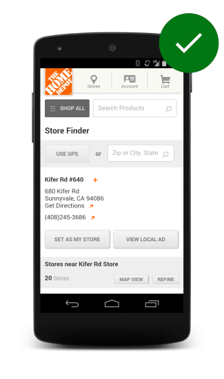
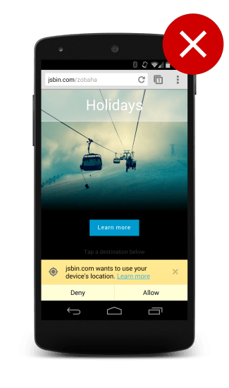
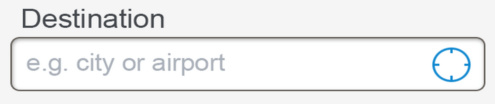
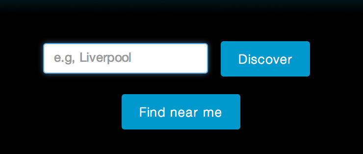
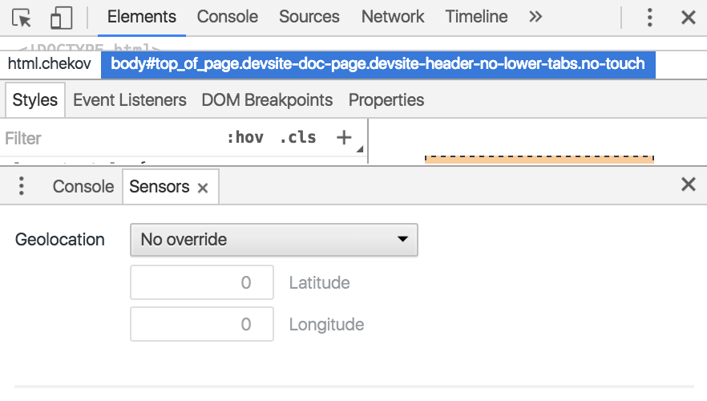

project_path: /web/fundamentals/_project.yaml
book_path: /web/fundamentals/_book.yaml
description: Most browsers and devices have access to the user's geographic location. Learn how to work with the user's location in your site and apps.

{# wf_updated_on: 2016-08-22 #}
{# wf_published_on: 2014-01-01 #}

# User Location {: .page-title }



The Geolocation API lets you discover, with the user's consent, the user's location. You can use this functionality for things like guiding a user to their destination and geo-tagging user-created content; for example, marking where a photo was taken.

The Geolocation API also lets you see where the user is and keep tabs on them as
they move around, always with the user's consent (and only while the page is open). This 
creates a lot of interesting use cases, such as integrating with backend systems to prepare an order for collection if the user is close by.

You need to be aware of many things when using the Geolocation API. This guide walks you through the common use cases and solutions.

Note: As of Chrome 50, the [Geolocation API only works on secure contexts (HTTPS)](/web/updates/2016/04/geolocation-on-secure-contexts-only). If your site is hosted on a non-secure origin (such as `HTTP`), any requests for the user's location **no longer** function.

### TL;DR {: .hide-from-toc }

* Use geolocation when it benefits the user.
* Ask for permission as a clear response to a user gesture. 
* Use feature detection in case a user's browser doesn't support geolocation.
* Don't just learn how to implement geolocation; learn the best way to use geolocation.
* Test geolocation with your site.

## When to use geolocation

*  Find where the user is closest to a specific physical location to tailor 
   the user experience.
*  Tailor information (such as news) to the user's location.
*  Show the position of a user on a map.
*  Tag data created inside your application with the user's location 
   (that is, geo-tag a picture).

## Ask permission responsibly

Recent user studies [have shown](http://static.googleusercontent.com/media/www.google.com/en/us/intl/ALL_ALL/think/multiscreen/pdf/multi-screen-moblie-whitepaper_research-studies.pdf)
that users are distrustful of sites that simply prompt the user to give away their
position on page load. So what are the best practices?

### Assume users will not give you their location

Many of your users won't want to give you their
location, so you need to adopt a defensive development style.

1.  Handle all errors out of the geolocation API so that you can adapt your
    site to this condition.
2.  Be clear and explicit about your need for the location.
3.  Use a fallback solution if needed.

### Use a fallback if geolocation is required

We recommend that your site or application not require
access to the user's current location. However, if your site or application
requires the user's current location, there are third-party solutions that allow you to obtain
a best guess of where the person currently is.

These solutions often work by looking at the user's IP address and mapping that
to the physical addresses registered with the RIPE database. These locations
are often not very accurate, normally giving you the position of the 
telecommunications hub or cell phone tower that is nearest to the user. In many
cases, they might not even be that accurate, especially if the user is on VPN
or some other proxy service.

### Always request access to location on a user gesture

Make sure that users understand why you’re asking for their location, and what
the benefit to them will be. Asking for it immediately on the homepage as 
the site loads results in a poor user experience.

  <figure>
    
    <figcaption class="success">
      <b>DO</b>: Always request access to location on a user gesture.
     </figcaption>
  </figure>

  <figure id="fig1">
    
    <figcaption class="warning">
      <b>DON'T</b>: Ask for it on the homepage, as the site loads; this results in a poor user experience.
    </figcaption>
  </figure>

Instead, give the user a clear call to action or an indication that
an operation will require access to their location. The user can then more easily associate the system prompt for access with the action
just initiated.

### Give a clear indication that an action will request their location

[In a study by the Google Ads team](http://static.googleusercontent.com/media/www.google.com/en/us/intl/ALL_ALL/think/multiscreen/pdf/multi-screen-moblie-whitepaper_research-studies.pdf),
when a user was asked to book a hotel room in Boston for an upcoming conference
on one particular hotels site, they were prompted to share their GPS location
immediately after tapping the "Find and Book" call to action on the homepage.

In some cases, the user became frustrated because they didn't understand why
they were being shown hotels in San Francisco when they wanted to book a room in
Boston.

A better experience is to make sure users understand why you’re asking
them for their location. Add a well-known signifier that is common across
devices, such as a range finder, or an explicit call to action such as 
“Find Near Me.”

  <figure>
    
    <figcaption>
      Use a range finder
     </figcaption>
  </figure>

  <figure id="fig1">
    
    <figcaption>
      A specific call to action to find near me  
    </figcaption>
  </figure>

### Gently nudge users to grant permission to their location

You don't have access to anything users are doing. You know
exactly when users disallow access to their locations but you don't know
when they grant you access; you only know you obtained access when results
appear.

It's good practice to "nudge" users into action if you need them to
complete the action.

We recommend: 

1.  Set up a timer that triggers after a short period; 5 seconds is a
    good value.
2.  If you get an error message, show a message to the user.
3.  If you get a positive response, disable the timer and process the results.
4.  If, after the timeout, you haven't gotten a positive response, show a
    notification to the user.
5.  If the response comes in later and the notification is still present,
    remove it from the screen.

    button.onclick = function() {
      var startPos;
      var nudge = document.getElementById("nudge");

      var showNudgeBanner = function() {
        nudge.style.display = "block";
      };

      var hideNudgeBanner = function() {
        nudge.style.display = "none";
      };

      var nudgeTimeoutId = setTimeout(showNudgeBanner, 5000);

      var geoSuccess = function(position) {
        hideNudgeBanner();
        // We have the location, don't display banner
        clearTimeout(nudgeTimeoutId); 

        // Do magic with location
        startPos = position;
        document.getElementById('startLat').innerHTML = startPos.coords.latitude;
        document.getElementById('startLon').innerHTML = startPos.coords.longitude;
      };
      var geoError = function(error) {
        switch(error.code) {
          case error.TIMEOUT:
            // The user didn't accept the callout
            showNudgeBanner();
            break;
        }
      };

      navigator.geolocation.getCurrentPosition(geoSuccess, geoError);
    };

## Browser support

The majority of browsers now support the Geolocation API but it's a
good practice to always check for support before you do anything.

You can easily check for compatibility by testing for the presence of the
geolocation object:

    // check for Geolocation support
    if (navigator.geolocation) {
      console.log('Geolocation is supported!');
    }
    else {
      console.log('Geolocation is not supported for this Browser/OS.');
    }

## Determining the user's current location

The Geolocation API offers a simple, "one-shot" method to obtain the user's
location: `getCurrentPosition()`. A call to this method asynchronously
reports on the user's current location.

    window.onload = function() {
      var startPos;
      var geoSuccess = function(position) {
        startPos = position;
        document.getElementById('startLat').innerHTML = startPos.coords.latitude;
        document.getElementById('startLon').innerHTML = startPos.coords.longitude;
      };
      navigator.geolocation.getCurrentPosition(geoSuccess);
    };

If this is the first time that an application on this domain has requested
permissions, the browser typically checks for user consent. Depending on
the browser, there may also be preferences to always allow&mdash;or disallow&mdash;permission lookups, in which case the confirmation process is bypassed.

Depending on the location device your browser is using, the position object
might actually contain a lot more than just latitude and longitude; for
example, it might include an altitude or a direction. You can't tell what
extra information that location system uses until it actually returns
the data.

## Watching the user's location

The Geolocation API allows you to obtain the user's location (with user
consent) with a single call to `getCurrentPosition()`.  

If you want to continually monitor the user's location, use the Geolocation
API method, `watchPosition()`. It operates in a similar way to
`getCurrentPosition()`, but it fires multiple times as the positioning
software:

1.  Gets a more accurate lock on the user.
2.  Determines that the user's position is changing.
 

    var watchId = navigator.geolocation.watchPosition(function(position) {
      document.getElementById('currentLat').innerHTML = position.coords.latitude;
      document.getElementById('currentLon').innerHTML = position.coords.longitude;
    });

### When to use geolocation to watch the user's location

*  You want to obtain a more precise lock on the user location.
*  Your application needs to update the user interface based on new location 
   information.
*  Your application needs to update business logic when the user enters a certain
   defined zone.

## Best practices when using geolocation

### Always clear up and conserve battery

Watching for changes to a geolocation is not a free operation. While
operating systems might be introducing platform features to let applications
hook in to the geo subsystem, you, as a web developer, have no idea what support
the user's device has for monitoring the user's location, and, while you're watching
a position, you are engaging the device in a lot of extra processing.

After you no longer need to track the user's position, call `clearWatch` to turn
off the geolocation systems.

###  Handle errors gracefully

Unfortunately, not all location lookups are successful. Perhaps a GPS could
not be located or the user has suddenly disabled location lookups. In the event of an
error, a second, optional argument to `getCurrentPosition()` is called so that you can notify the user inside the callback:

    window.onload = function() {
      var startPos;
      var geoSuccess = function(position) {
        startPos = position;
        document.getElementById('startLat').innerHTML = startPos.coords.latitude;
        document.getElementById('startLon').innerHTML = startPos.coords.longitude;
      };
      var geoError = function(error) {
        console.log('Error occurred. Error code: ' + error.code);
        // error.code can be:
        //   0: unknown error
        //   1: permission denied
        //   2: position unavailable (error response from location provider)
        //   3: timed out
      };
      navigator.geolocation.getCurrentPosition(geoSuccess, geoError);
    };

### Reduce the need to start geolocation hardware

For many use cases, you don't need the user's most up-to-date location;
you just need a rough estimate.

Use the `maximumAge` optional property to tell the browser to use a recently
obtained geolocation result. This not only returns more quickly if the user has
requested the data before, but it also prevents the browser from starting
its geolocation hardware interfaces such as Wifi triangulation or the GPS.

    window.onload = function() {
      var startPos;
      var geoOptions = {
        maximumAge: 5 * 60 * 1000,
      }

      var geoSuccess = function(position) {
        startPos = position;
        document.getElementById('startLat').innerHTML = startPos.coords.latitude;
        document.getElementById('startLon').innerHTML = startPos.coords.longitude;
      };
      var geoError = function(error) {
        console.log('Error occurred. Error code: ' + error.code);
        // error.code can be:
        //   0: unknown error
        //   1: permission denied
        //   2: position unavailable (error response from location provider)
        //   3: timed out
      };

      navigator.geolocation.getCurrentPosition(geoSuccess, geoError, geoOptions);
    };

### Don't keep the user waiting, set a timeout

Unless you set a timeout, your request for the current position might never return.

    window.onload = function() {
      var startPos;
      var geoOptions = {
         timeout: 10 * 1000
      }

      var geoSuccess = function(position) {
        startPos = position;
        document.getElementById('startLat').innerHTML = startPos.coords.latitude;
        document.getElementById('startLon').innerHTML = startPos.coords.longitude;
      };
      var geoError = function(error) {
        console.log('Error occurred. Error code: ' + error.code);
        // error.code can be:
        //   0: unknown error
        //   1: permission denied
        //   2: position unavailable (error response from location provider)
        //   3: timed out
      };

      navigator.geolocation.getCurrentPosition(geoSuccess, geoError, geoOptions);
    };

### Prefer a coarse location over a fine-grained location

If you want to find the nearest store to a user, it's unlikely that you need
1-meter precision. The API is designed to give a coarse 
location that returns as quickly as possible.

If you do need a high level of precision, it's possible to override the default setting
with the `enableHighAccuracy` option. Use this sparingly: it's slower
to resolve and uses more battery.

    window.onload = function() {
      var startPos;
      var geoOptions = {
        enableHighAccuracy: true
      }

      var geoSuccess = function(position) {
        startPos = position;
        document.getElementById('startLat').innerHTML = startPos.coords.latitude;
        document.getElementById('startLon').innerHTML = startPos.coords.longitude;
      };
      var geoError = function(error) {
        console.log('Error occurred. Error code: ' + error.code);
        // error.code can be:
        //   0: unknown error
        //   1: permission denied
        //   2: position unavailable (error response from location provider)
        //   3: timed out
      };

      navigator.geolocation.getCurrentPosition(geoSuccess, geoError, geoOptions);
    };

## Emulate geolocation with Chrome DevTools {: #devtools }

  <figure id="fig1">
    
  </figure>

Once you've got geolocation set up, you'll want to:

* Test out how your app works in different geolocations.
* Verify that your app degrades gracefully when geolocation is not available.

You can do both from Chrome DevTools.

[Open Chrome DevTools](/web/tools/chrome-devtools/#open) and then
[open the Console Drawer](/web/tools/chrome-devtools/console/#open_as_drawer).

[Open the Console Drawer menu](/web/tools/chrome-devtools/settings#drawer-tabs)
and click the **Sensors** option to show the Sensors Drawer.

From here you can override the location to a preset major city,
enter a custom location, or disable geolocation by setting the override
to **Location unavailable**.
