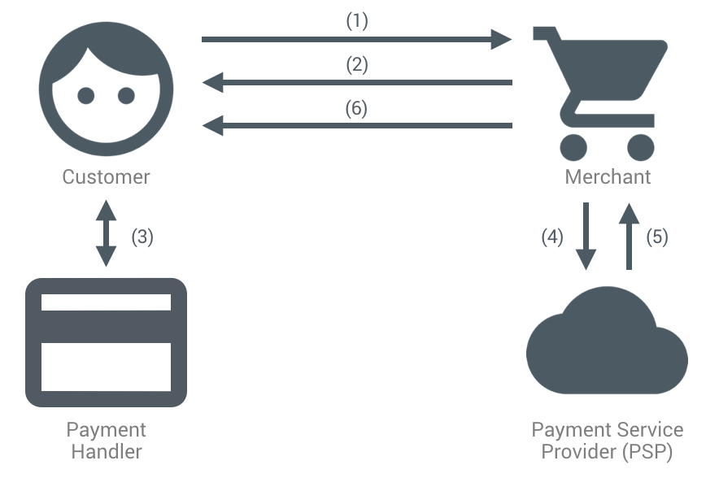

project_path: /web/fundamentals/_project.yaml
book_path: /web/fundamentals/_book.yaml
description: About the Ecosystem page for the W3C Payment APIs doc set.

{# wf_published_on: 2018-09-10 #}
{# wf_updated_on: 2018-09-20 #}
{# wf_blink_components: Blink>Payments #}

# How the payment ecosystem works {: .page-title }




Let's see how the new payment ecosystem works with W3C Payment APIs.

## The anatomy of W3C Payment APIs

_W3C Payment APIs_ comprises multiple web standards.

*   **Payment Request API:** The [Payment Request
    API](https://www.w3.org/TR/payment-request/) enables fast and easy checkouts
    through a native browser UI. It provides a consistent checkout flow while
    reducing the need for users to enter their shipping and payment information
    on every checkout. Learn how it works at high level at [How payment request
    api works](payments/basics/how-payment-request-api-works) or in detail at
    [Deep Dive into the Payment Request
    API](payments/merchant-guide/deep-dive-into-payment-request).
*   **Payment Handler API:** The [Payment Handler
    API](https://w3c.github.io/payment-handler/) opens up the ecosystem to
    payment providers by allowing their web-based payment applications to act as
    payment methods on merchant websites through the standard Payment Request
    API.
*   **Payment Method Identifiers:** The [Payment Method
    Identifiers](https://w3c.github.io/payment-method-id/) defines how strings
    (`basic-card`, `https://google.com/pay`, etc.) can be used to identify a
    payment method. Along with standardized payment method identifiers, it
    allows anyone to define their own payment method with URL-based payment
    method identifiers. Learn more at [Payment method
    basics](payments/basics/payment-method-basics).
*   **Payment Method Manifest:** The [Payment Method
    Manifest](https://w3c.github.io/payment-method-manifest/) defines the
    machine-readable manifest file, known as a payment method manifest,
    describing how a payment method participates in the payment ecosystem, and
    how such files are to be used.

## How the Payment Request Process Works

There are typically four participants in an online transaction.

<table>
  <tr>
   <td><strong>Players</strong>
   </td>
   <td><strong>Description</strong>
   </td>
   <td><strong>API usage</strong>
   </td>
  </tr>
  <tr>
   <td>Customers
   </td>
   <td>Users who go through a checkout flow to purchase item(s) online.
   </td>
   <td>N/A
   </td>
  </tr>
  <tr>
   <td>Merchants
   </td>
   <td>Businesses selling products on their website.
   </td>
   <td>Payment Request API
   </td>
  </tr>
  <tr>
   <td>Payment Service Providers (PSPs)
   </td>
   <td>Third-party companies that actually process payments, 
   which involves charging customers and crediting merchants. 
   Alternatively called payment gateways or payment processors.
   </td>
   <td>Payment Request API
   </td>
  </tr>
  <tr>
   <td>Payment Handlers
   </td>
   <td>Third-party companies which provide applications that typically 
   store customers' payment credentials and on their authorization 
   provide them to merchants to process a transaction.
   </td>
   <td>Payment Handler API
   </td>
  </tr>
</table>

The typical sequence of events in processing a credit card payment on the web 
looks like this:

1.  The Customer visits a merchant's website, adds items to a shopping cart, 
and starts the checkout flow.
1.  The Merchant needs the customer's payment credentials to process the 
transaction. They present a payment request UI to the customer using 
**the Payment Request API**. The UI lists various methods of payment specified 
by **the Payment Method Identifiers**. The payment methods can include credit 
card numbers saved to the browser, or third party payment apps like Google Pay, 
Samsung Pay, etc. The Merchant can optionally request the customer's shipping 
address and contact information.
1.  If the customer chooses a payment method like Google Pay, Chrome launches 
either a platform-native payment app or a web-based payment app using 
**the Payment Handler API**. This step is completely up to the payment handler's 
implementation, based on **the Payment Method Manifest**. After the customer 
authorizes the payment, the payment app returns a token (payment credential) 
to the Payment Request API, which relays it to the merchant site.
1.  The merchant site sends the payment credential to a PSP to process the 
payment and initiate funds transfer. Usually, verifying the payment on the 
server side is also required.
1.  The PSP processes the payment, securely requesting a funds transfer from 
the customer's bank or credit card issuer to the merchant, and then returns a 
success or failure result to the merchant website.
1.  The merchant website notifies the customer of the success or failure of the 
transaction and displays the next step, e.g., shipping the purchased item.

## Caveat: PSP Reliance

If you are a merchant and want to accept credit card payments, PSPs are an 
important link in the payment processing chain. Implementing the Payment Request 
API does not obviate the need for a PSP.

Merchants usually rely on a third-party PSP to perform payment processing for 
convenience and expense reasons. This is primarily because most PSPs maintain 
compliance with 
[PCI DSS](https://en.wikipedia.org/wiki/Payment_Card_Industry_Data_Security_Standard), 
an information security standard that regulates the safety of cardholder data.

Because achieving and maintaining strict PCI DSS compliance is expensive and 
difficult, most merchants find that relying on a compliant PSP avoids going 
through the certification process themselves. Some large and financially robust 
companies, however, obtain their own PCI DSS certification specifically to avoid 
such third-party reliance.

It's especially important when you are using `basic-card` payment method which 
returns a non-tokenized credit card number as a payment credential. Handling one 
with JavaScript requires 
[PCI SAQ A-EP](https://www.pcisecuritystandards.org/documents/PCI-DSS-v3_2-SAQ-A_EP.pdf) 
compliance.

Thus, delegating payment processing to a PCI DSS-compliant PSP both simplifies 
the merchant site's requirements and ensures payment information integrity for 
the customer.

If you want to use the Payment Request API but don't have bandwidth to be compliant 
with PCI SAQ A-EP, some PSPs provide an SDK that uses the Payment Request API.

### List of supporting payment gateways

*   [Stripe](https://stripe.com/docs/stripe-js/elements/payment-request-button)
*   [Braintree](https://developers.braintreepayments.com/guides/payment-request/overview)

Note: Send [pull requests](https://github.com/google/WebFundamentals/pulls) to
us if your payment gateway provides an SDK that involves the Payment Request API
but is not listed here.

## Next Up

Learn about the Payment Request API's fields and methods in [How the Payment Request API 
Works](/web/fundamentals/payments/basics/how-payment-request-api-works).

## Feedback {: #feedback }


