project_path: /web/fundamentals/_project.yaml
book_path: /web/fundamentals/_book.yaml
description: How to implement and take full advantage of the Payment Request API.

{# wf_published_on: 2017-04-21 #}
{# wf_updated_on: 2017-09-07 #}

# Deep Dive into the Payment Request API {: .page-title }



<style>
.attempt-center {
  text-align: center;
  margin: 0 auto;
  padding: 16px;
  box-size: border-box;
}
</style>

<div class="attempt-center">
  <figure>
    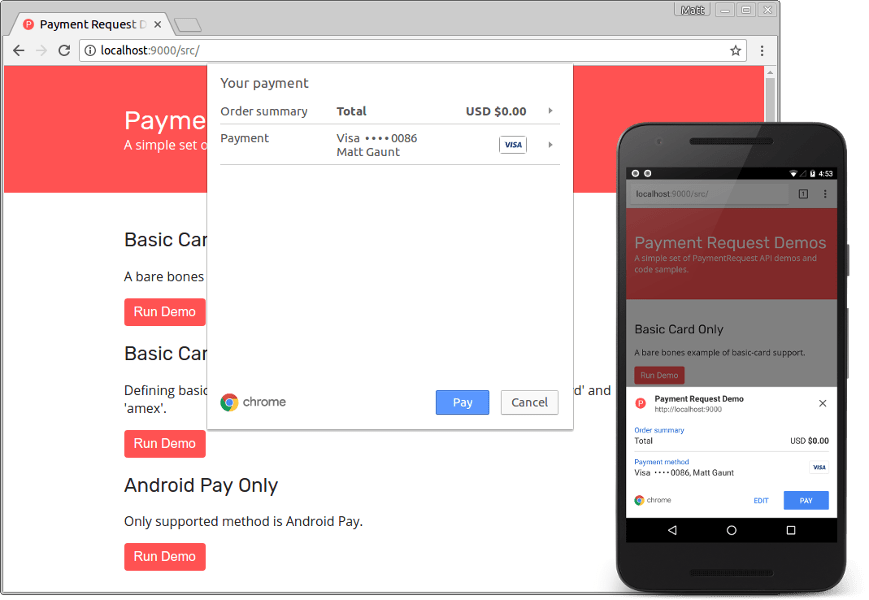
    <figcaption>
      Payment request UI on desktop and mobile Chrome.
    </figcaption>
  </figure>
</div>

In this guide we'll explore the ins and outs of the Payment Request API, looking
at how our input affects the payment request UI, how we can request information
from the user (like name and phone number), and how the final payment and user
information is passed to your site.

If you are unsure of what the Payment Request API is or why it's useful, check
out the [introduction
article](/web/fundamentals/payments/).

One thing to keep in the back of your mind when working with the Payment Request
API is that the API manages the UI but performs no arithmetic; it will simply
display whatever input you pass to it. Throughout the examples we'll discuss
what this means for the developer and user.

Dogfood: <code>PaymentRequest</code> is still in development. While we think
it's stable enough to implement, it may continue to change. We'll <a
href="/web/updates/2017/01/payment-request-updates">keep this page updated</a>
to always reflect the current status of the API. Meanwhile, to protect yourself
from API changes that may be backwards incompatible, we're offering <a
href="#paymentrequest_shim">a shim</a> that
can be embedded on your site. The shim will paper over any API differences for
two major Chrome versions.

## Feature Detect

Payment Request has been available since Chrome 53 for Android and has been
enabled by default since Chrome 61 on desktop. Before we start covering how to
use Payment Request, we should feature detect to ensure it's available and
fallback to a traditional checkout page in browsers that don't support it.

The feature detect is simply:

```
if(window.PaymentRequest) {  
  // Use Payment Request API  
} else {  
  // Fallback to traditional checkout  
  window.location.href = '/checkout/traditional';  
}
```

Note: Payment Request is only available on sites served over HTTPS.

## PaymentRequest Constructor

Once you are ready to collect payment details from the user, you'll need to
construct a new PaymentRequest object.

```
const supportedPaymentMethods = [  
  {  
    supportedMethods: ['basic-card'],  
  }  
];  
const paymentDetails = {  
  total: {
    label: 'Total',  
    amount:{  
      currency: 'USD',  
      value: 0  
    }  
  }
};  
// Options isn't required.  
const options = {};

new PaymentRequest(  
  supportedPaymentMethods,  
  paymentDetails,  
  options  
);
```

The constructor takes three arguments. The [first
argument](#defining_supported_payment_methods) defines which forms of payment you can
accept; for example, you may only accept 'visa' and 'mastercard'. The
[paymentDetails](#defining_payment_details) argument defines the total and display
items. The [optional third argument](#defining_options_optional42) is an object
used to request additional information from the user; for example, you can
request the payer's name, email address, and phone number.

All of these options affect the UI presented to the user as well as the amount
of information the browser will need to collect from them.

Constructing a new `PaymentRequest` object can be done at any point in your app.
Nothing will be shown to the user until you call its `show()` method.

```
const request = new PaymentRequest(  
  supportedPaymentMethods,  
  paymentDetails,  
  options  
);

// Call when you wish to show the UI to the user.  
request.show()  
.then(...).catch(...);
```

Let's start by looking at the arguments we can pass into the `PaymentRequest`
constructor, starting with the supported payment methods.

### Defining Supported Payment Methods

The Payment Request API is designed to support credit and debit card payments
as well as third party payment methods (such as Android Pay).

You must supply an array of objects indicating your supported payment methods
where each payment method must include a  `supportedMethods` parameter that
identifies the payment method. Each object can contain an optional data object.

```
const supportedPaymentMethods = [  
  {  
    supportedMethods: ['name-of-payment-method'],  
    data: {  
      // Optional data for this payment method  
    }  
  }  
];

new PaymentRequest(supportedPaymentMethods, paymentDetails, options);
```

First we'll look at how to define support for credit and debit cards, followed
by a brief look at supporting Android Pay.

### Payment Method: 'basic-card'

To support credit and debit cards, we need to change the `supportedMethods`
parameter to contain 'basic-card', like so:

```
const creditCardPaymentMethod = {  
  supportedMethods: ['basic-card'],  
};  

const supportedPaymentMethods = [creditCardPaymentMethod];

new PaymentRequest(supportedPaymentMethods, paymentDetails, options);
```

If the user has no cards set up they'll be prompted to add details, otherwise
an existing card will be selected for them.

<div class="attempt-center">
  <figure>
    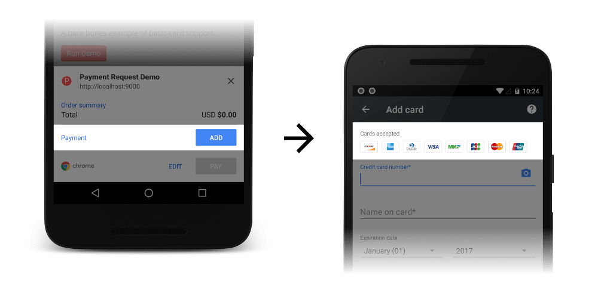
    <figcaption>
      Example of basic-card support in the Payment Request API.
    </figcaption>
  </figure>
</div>

At the time of writing, Chrome supports 'amex', 'diners', 'discover', 'jcb',
'maestro', 'mastercard', 'unionpay', 'mir', and 'visa', which you can see listed
across the top of the UI.

To restrict the supported cards, we can add the optional data parameter and
define `supportedNetworks`. The following code restricts the accepted cards to
visa, mastercard and amex.

```
const creditCardPaymentMethod = {  
  supportedMethods: ['basic-card'],  
  data: {  
    supportedNetworks: ['visa', 'mastercard', 'amex'],  
  },  
};
```

The payment request UI will restrict the accepted cards and the user will be
prevented from selecting other cards:

<div class="attempt-center">
  <figure>
    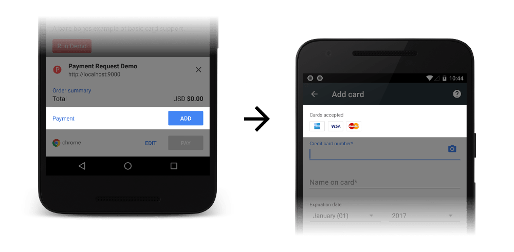
    <figcaption>
      Example of reduced the list of supported cards in the Payment Request API.
    </figcaption>
  </figure>
</div>

In the screenshot above, the user must add a payment. If browsers have this
information readily available, they have the option of pre-selecting an
appropriate payment for the user. This means that the wider your card support,
the higher the odds are of the browser being able to pre-populate these details,
speeding up the checkout flow. For example, if I had a card saved in Chrome, the
UI would start with a suitable card already selected:

<div class="attempt-center">
  <figure>
    
    <figcaption>
      Cards will be preselected if available.
    </figcaption>
  </figure>
</div>

The `supportedTypes` parameter tells Chrome which types of cards to
filter out, i.e. if a merchant defined `supportedTypes` as `['credit', 'debit']`,
Chrome would strip out any 'prepaid' cards the user has. 

This means that `supportedTypes` **does not guarantee** that the final card
you receive will be a supported type. The user can enter details for a new card,
which could be an unsupported type, and the Payment Request API will allow this.
The `supportedTypes` option is **just** for filtering out existing cards.
Merchants still need to check the card type on their backend.

Chrome version 61 added support for the `supportedTypes` option. In older versions of Chrome
you would receive the following console warning:

`Cannot yet distinguish credit, debit, and prepaid cards.`

It's safe to use this option. The only difference is that some cards wouldn't be filtered
automatically for the user.

```
const creditCardPaymentMethod = {  
  supportedMethods: ['basic-card'],  
  data: {  
    supportedNetworks: ['visa', 'mastercard', 'amex'],  
    supportedTypes: ['credit', 'debit'],  
  },  
};
```

#### Payment Method: Multiple Payment Methods

In the above example for basic cards, we created an object
`creditCardPaymentMethod` and we passed that into an array before giving it to the
`PaymentRequest` constructor.

```
const creditCardPaymentMethod = {  
  supportedMethods: ['basic-card'],  
};

const supportedPaymentMethods = [creditCardPaymentMethod];  

new PaymentRequest(supportedPaymentMethods, paymentDetails, options);
```

The reason for putting `creditCardPaymentMethod` into an array is to cater for
scenarios where a merchant supports multiple payment methods. For example, let's
say there was a payment processor called "BobPay" and you (the merchant)
accepted payments through BobPay as well as credit cards. You'd define the
supported payment methods like so:

```
const creditCardPaymentMethod = {  
  supportedMethods: ['basic-card'],  
};

const bobPayPaymentMethod = {  
  supportedMethods: ["https://example.com/bobpay"],  
  data: {  
    merchantIdentifier: "XXXX",  
    bobPaySpecificField: true  
  }  
};  

const supportedPaymentMethods = [  
  creditCardPaymentMethod,  
  bobPayPaymentMethod  
];  

new PaymentRequest(supportedPaymentMethods, paymentDetails, order);
```

If the browser can support the BobPay payment method it will offer it to the
user alongside credit cards.

An example of using a third party payment processor like this can be
shown with Android Pay, which is supported on Chrome for Android.

```
const androidPayPaymentMethod = {  
  supportedMethods: ['https://android.com/pay'],  
  data: {  
    merchantName: 'Android Pay Demo',  
    merchantId: '00000000000000000000',  
    environment: 'TEST',  
    allowedCardNetworks: ['AMEX', 'DISCOVER', 'MASTERCARD', 'VISA'],  
    paymentMethodTokenizationParameters: {  
      tokenizationType: 'GATEWAY_TOKEN',  
      parameters: {  
        'gateway': 'stripe',  
        'stripe:publishableKey': 'xx_demo_xxxxxxxxxxxxxxxxxxxxxxxx',  
        'stripe:version': '2016-07-06',  
      },  
    },  
  },  
};
```

<div class="attempt-center">
  <figure>
    
    <figcaption>
      Android Pay example in payment request UI.
    </figcaption>
  </figure>
</div>

We won't go into details of how to add Android Pay in this article, [we have a
section dedicated to that here](/web/fundamentals/payments/android-pay).

#### Edge Cases

There are some edge cases to be aware of when defining your supported payment
methods.

**Unsupported Payment Methods**  
If you try to call `show()` on a `PaymentRequest` object and there are no supported
payment methods, the returned promise will reject immediately with the following
error:

`DOMException: The payment method is not supported`

This shouldn't be a problem if you include 'basic-card' as a supported payment
method. If, however, you only support a third party payment method, like Android
Pay, there is a strong chance that it won't be supported by a browser that
supports the Payment Request API.

**Third Party Payment Method Skipping the Payment Request UI**  
In the screenshot above you can see "Android Pay" as the pre-selected payment
option. This has occurred because the example supports both Android Pay and basic
cards. If you define Android Pay as your **only** payment method and the browser
supports it, the browser can (and Chrome does, at the time of writing) skip the
payment request UI altogether after the `show()` method is called. Users will be
taken straight to the Android Pay app to complete the payment.

### Defining Payment Details

The second argument we need to pass to the `PaymentRequest` constructor is the
payment details object. This object contains the total for the order and an
optional array of display items (i.e. a high level breakdown of the total).

#### Transaction Details: Total

The contents of the `total` parameter should contain a `label` parameter and an
`amount` parameter consisting of a `currency` and `value`. A basic example would be:

```
const paymentDetails = {  
  total: {  
    label: 'Total',  
    amount: {  
      currency: 'USD',  
      value: '0',  
    },  
  },  
};

new PaymentRequest(supportedPaymentMethods, paymentDetails, options);
```

This controls the "order summary" section of the UI:

<div class="attempt-center">
  <figure>
    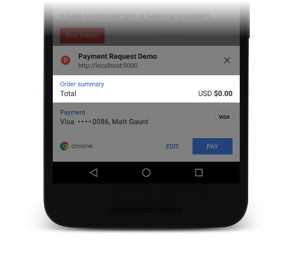
    <figcaption>
      How the total parameter affects the UI.
    </figcaption>
  </figure>
</div>

The `total` parameter is the only *required* piece of information in the payment
details object.

The `label` can be any piece of text you like, the `currency` must be a string
currency code following the [ISO 4217
standard](https://www.iso.org/iso-4217-currency-codes.html), and the `value` is
the amount for the order.

To give another example, we can define the total as:

```
const paymentDetails = {  
  total: {  
    label: 'Purchase Amount',  
    amount: {  
      currency: 'GBP',  
      value: '24.99',  
    },  
  },  
};
```

This produces the following order summary:

<div class="attempt-center">
  <figure>
    
    <figcaption>
      Another example of how the total parameter affects the UI.
    </figcaption>
  </figure>
</div>

#### Transaction Details: Display Items

Display items can used to provide a high level breakdown of the total. This
would typically include subtotal, tax, deductions, and shipping cost.

The format of the display items should be an array of items following the same
structure as the total (i.e., a `label` and an `amount` with `currency` and `value`).

```
const allDisplayItems = [  
  {  
    label: 'Subtotal',  
    amount: {  
      currency: 'USD',  
      value: 10,  
    },  
  }, {  
    label: 'Discount (10%)',  
    amount: {  
      currency: 'USD',  
      value: -1,  
    },  
  }, {  
    label: 'Tax',  
    amount: {  
      currency: 'USD',  
      value: 0.68,  
    },  
  },  
];

const paymentDetails = {  
  total: {  
    label: 'Total',  
    amount: {  
      currency: 'USD',  
      value: 0,  
    },  
  },  
  displayItems: allDisplayItems,  
};
```

If we provided the above example, we'd get the following UI.

<div class="attempt-center">
  <figure>
    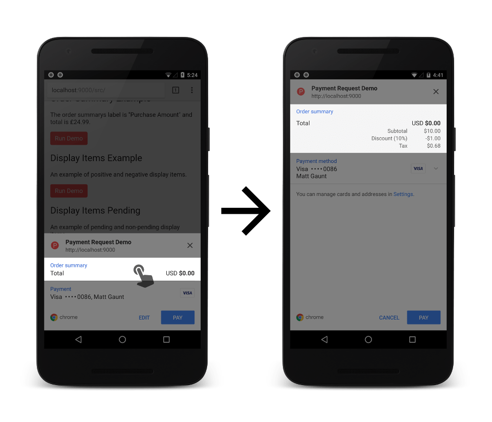
    <figcaption>
      Displaying the items from the payment details object.
    </figcaption>
  </figure>
</div>

The order of the items in the `displayItems` array will dictate their display
order in the UI.

Please bear in mind that `displayItems` are not designed to display a long list of
items. You should use this for high level entries instead of an itemized list,
for example subtotal, discount, tax and shipping cost.

<div class="warning">
It's worth repeating that the the <code>PaymentRequest</code> API does not perform any
arithmetic. If you look at the above example, all the items values do not add up
to the total. This is because we've set the total to have a value of zero.
<strong>It is the responsibility of your web app to calculate the correct total.</strong>
</div>

#### Transaction Details: Display Items - Pending

If you have values that aren't final because they require additional
information, you can use the `pending` parameter.

An example use case for this is marking tax as a pending value until the user
has selected a shipping option, which may adjust the total and tax amounts.

In the following example, I've set pending to true on the tax entry:

```
const transactionDisplayItems = [  
  {  
    label: 'Total cost of goods',  
    amount: {  
      currency: 'USD',  
      value: 10,  
    },  
  }, {  
    label: 'Tax',  
    pending: true,  
    amount: {  
      currency: 'USD',  
      value: 0.75,  
    },  
  },  
];
```

Which will be given a slightly different text color in Chrome as a result:

<div class="attempt-center">
  <figure>
    
    <figcaption>
      Demonstration of a display item being marked as pending.
    </figcaption>
  </figure>
</div>

#### Edge Cases

There are some minor edge cases with the `paymentDetails` argument where you can
stress the UI and incorrectly define the object resulting in an error.

**Long Total Label**  
Be wary of the length of the labels. Browsers have
control of how they are displayed. At the time of writing, Chrome doesn't
truncate the total label at all, but does truncate display item labels.

<div class="attempt-center">
  <figure>
    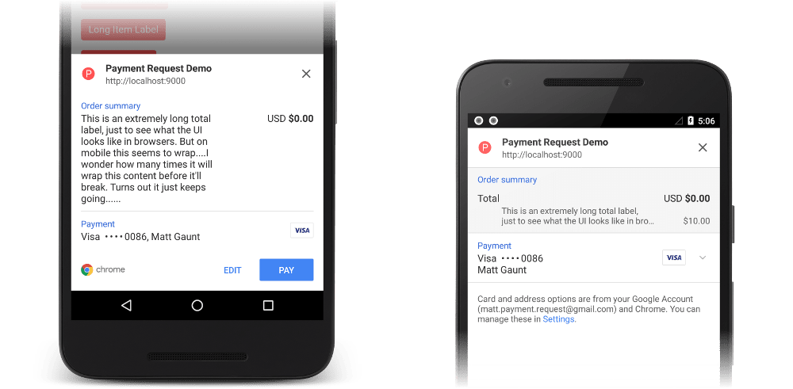
    <figcaption>
      Long labels may result in a bad UI for users.
    </figcaption>
  </figure>
</div>

**No Total**
The `total` parameter is a required field; if you fail to include it, you'll
receive the following the error:

`TypeError: Failed to construct 'PaymentRequest': Must specify total`

**Failing to include Label, Amount, Currency or Value**  
If you exclude a `label`, `amount`, `currency`, or `value` from the `total` or one of the
`displayItems`, you'll receive one of the following errors:

```
// No label  
'PaymentRequest': required member label is undefined.

// No amount  
'PaymentRequest': required member amount is undefined.

// No currency  
'PaymentRequest': required member currency is undefined.

// No Value  
'PaymentRequest': required member value is undefined.
```

If you hit any of these errors, please check the format of the `total` and
`displayItems`.

**Negative Total (i.e., Refunds)**  
The Payment Request API** does not support negative totals**; if you attempt to
show a total with a negative value you'll receive this error:

`'PaymentRequest': Total amount value should be non-negative`

**Invalid Currency**  
The currency code must be three uppercase characters; passing in anything else
will throw an error.

`'PaymentRequest': '...' is not a valid ISO 4217 currency code, should be 3 upper case letters [A-Z]`

You can pass in any three characters and it will be treated as a valid currency
code.The reason for this is that it allows support for future currencies. For
example, Bitcoin can be supported with its currency code 'XBT'.

The currency code is always displayed in Chrome at the time of writing, but only
known currencies will include the currency character with amounts; otherwise only
the currency code is shown. Compare the screenshots below for 'USD' and 'XBT'.

<div class="attempt-center">
  <figure>
    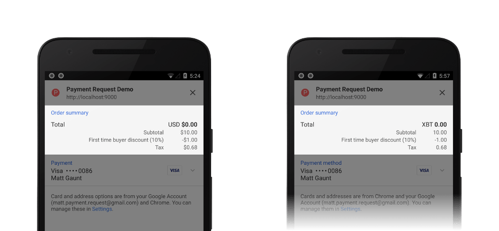
    <figcaption>
      Comparison of USD and XBT currencies on the payment request UI.
    </figcaption>
  </figure>
</div>

**Multiple Currencies**  
At the time of writing, Chrome does not support multiple currencies and
unfortunately the error it throws does not make it clear that mixing currencies
is not supported.

`DOMException: Request cancelled`

You can [follow changes to this issue
here](https://bugs.chromium.org/p/chromium/issues/detail?id=709296&q=component%3ABlink%3EPayments%20&colspec=ID%20Pri%20M%20Stars%20ReleaseBlock%20Component%20Status%20Owner%20Summary%20OS%20Modified).

**Formatting Currency**  
You can define the `value` parameter as a string, but it must only contain
numbers with no more than one decimal point;
otherwise you'll receive the following error:

`'PaymentRequest': '...' is not a valid amount format`

For example, "1,000.00" is invalid because of the comma, whereas "1000.00" is
valid.

**Right to Left Languages**  
You can use right-to-left languages for the labels and they will be displayed
accordingly. The rest of the browser's text will be determined by the user's
browser / system settings.

### Defining Options (Optional*)

The third argument to the `PaymentRequest` constructor is the optional `options`
object.

This object should be used to define any additional information you require from
the user including the payer's name, email, and phone number. Only ask for what
you need, asking for more details will result in a longer checkout flow for the
user.

If you require this information you just need to pass in the following options
object:

```
const options = {  
  requestPayerName: true,  
  requestPayerPhone: true,  
  requestPayerEmail: true,  
};
```

By default, all of these values are `false`, but returning `true` for any of them
will result in an extra step in the UI.

<div class="attempt-center">
  <figure>
    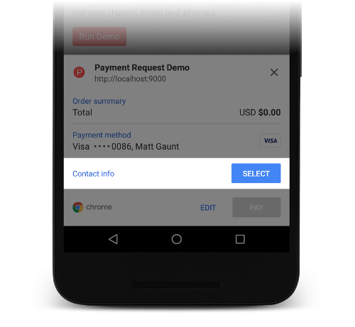
    <figcaption>
      Payment request UI requesting additional information from the user.
    </figcaption>
  </figure>
</div>

If the browser has these details available for the user, they'll be
pre-populated.

<div class="attempt-center">
  <figure>
    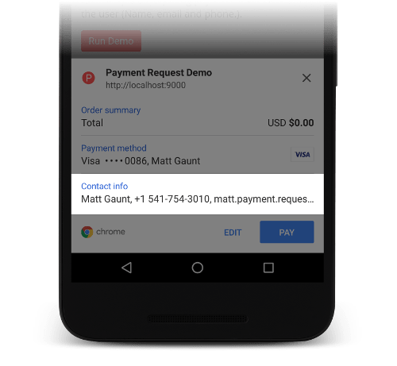
    <figcaption>
      Pre-populated user information.
    </figcaption>
  </figure>
</div>

The options object is also used to configure shipping, but we'll look at
shipping in much more detail later on as it touches many parts of the API.

#### Edge Cases

The only edge case to note here is that if you define any of the parameters
(`requestPayerName`, `requestPayerPhone` or `requestPayerEmail`) with a non-boolean
value it will use the usual JavaScript [truthy](https://developer.mozilla.org/en-US/docs/Glossary/Truthy) /
[falsy](https://developer.mozilla.org/en-US/docs/Glossary/Falsy) value (i.e., null,
undefined, 0 will be treated as false and 'string value', {}, [] will be treated
as true).

## Responding to PaymentRequest.show()

After calling `show()` the payment request UI will be displayed to the user. Users
will either close the UI or fill in the required fields and select 'Pay', at
which point your app will need to "complete" the transaction.

You'll know if the user has successfully filled in the details as the promise
returned by `show()` will resolve; if there was an issue or the user closed the UI the
promise will reject.

```
paymentRequest.show()  
.then((paymentResponse) => {  
  // The user filled in the required fields and completed the flow
  // Get the details from `paymentResponse` and complete the transaction.
  return paymentResponse.complete();  
})  
.catch((err) => {  
  // The API threw an error or the user closed the UI  
});
```

Once the user has filled in the payment request UI, your web app will receive a
`PaymentResponse` object in the `show()` promise.

It's this `paymentResponse` object that contains the user's payment information that you'll
submit to your payment processor.

### Accessing Details from the PaymentResponse

The `PaymentResponse` object contains the following parameters:

<table>
<tr>
<th>methodName</th>
<td>This is the payment method selected by the user.
This will be one of the values passed into the `supportedMethods` objects ("basic-card" for example).</td>
</tr>
<tr>
<th>details</th>
<td>This is an object containing the payment details. The contents of this object will depend on the selected payment method. In the next paragraph we'll look at the contents of a basic card.</td>
</tr>
<tr>
<th>payerName</th>
<td>This will be null unless you set `requestPayerName` to true in the options object, in which case this will be a string of the payer's name. </td>
</tr>
<tr>
<th>payerPhone</th>
<td>This will be null unless you set `requestPayerPhone` to true in the options object, in which case this will be a string of the payer's phone number.</td>
</tr>
<tr>
<th>payerEmail</th>
<td>This will be null unless you set `requestPayerEmail` to true in the options object, in which case this will be a string of the payer's email address.</td>
</tr>
<tr>
<th>* Shipping Info</th>
<td>We will cover this in the shipping section.</td>
</tr>
</table>

The details object is only standardized for the basic-card payment method. For
third party payment methods, like Android Pay, the details object's content will
be documented by the payment method.

For 'basic-card' payments, the details object will contain the `billingAddress`,
`cardNumber`, `cardSecurityCode`, `cardholderName`, `expiryMonth`, and `expiryYear`.

Once you have these details from the `PaymentResponse`, you need to process the
payment and "complete" the transaction by calling the `paymentResponse.complete()`
method.

### Completing the Transaction

After the promise from `show()` has resolved, the payment request UI will display a
loading UI to the user. You can either leave this spinner visible while you
process the payment details or you can close the UI immediately and validate the
payment details in your own UI.

<div class="attempt-center">
  <figure>
    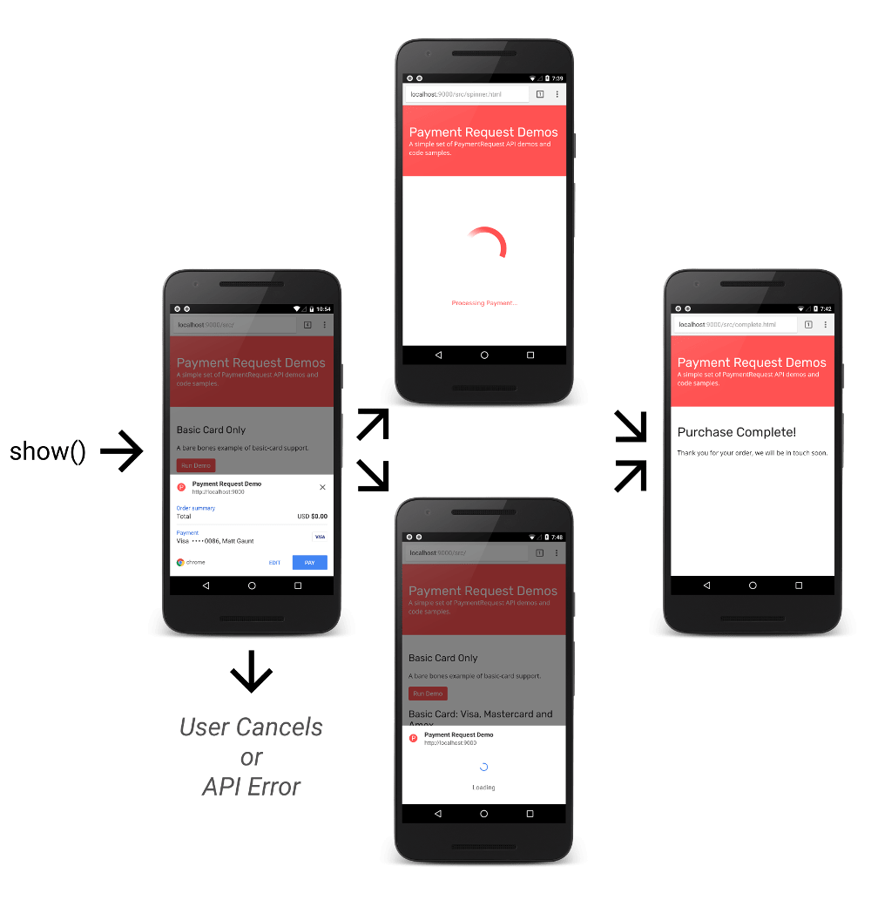
    <figcaption>
      Possible flows after the show() promise has resolved.
    </figcaption>
  </figure>
</div>

If you wanted to close the payment request UI immediately, you would call the
`PaymentResponse.complete()` method.

```
paymentRequest.show()  
.then((paymentResponse) => {  
  // Close the payment request UI.  
  return paymentResponse.complete()  
  .then(() => {  
    // TODO: Get the payment details from paymentResponse object.  
    // TODO: Process payment  
  });  
})  
.catch((err) => {  
  console.error('Payment Request API error: ', err);  
});
```

This will close the payment request UI and you can do whatever you want to
process the user's payment information. Calling the `complete()` method without
any arguments like this, is equivalent to calling
`paymentResponse.complete('unknown')`. You are telling the browser to
not treat the payment as a success or failure and to show no UI or animations to
suggest otherwise to the user.

If you wanted to process the payment while the payment request UI is showing a
spinner you'd delay the call to `complete()`. Let's assume we have a method called
`validatePaymentWithBackend()` that will check the details with our backend and
return a promise resolving to a boolean (true if the payment was successful,
false otherwise). We'd keep the spinner up and call `complete()` after this method has
resolved, like so:

```
paymentRequest.show()  
.then((paymentResponse) => {  
  return validatePaymentWithBackend(paymentResponse)  
  .then((success) => {  
    if (success) {  
      return paymentResponse.complete('success');  
    } else {  
      return paymentResponse.complete('fail');  
    }  
  });  
})  
.catch((err) => {  
  // The API threw an error or the user closed the UI  
});
```

In this example we are using the 'success' and 'fail' strings to highlight to
the browser the states of the transaction. If you include these strings the
browser may show a visual indication to the user suggesting a positive or
negative outcome.  

At the time of writing, Chrome will just hide the UI on success but will show
an error dialog to the user if you call with `complete('fail')` .

<div class="attempt-center">
  <figure>
    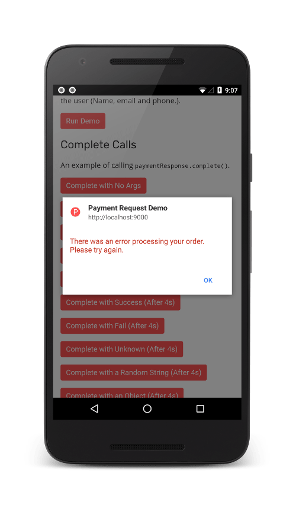
    <figcaption>
      Example of the error dialog shown when calling complete with fail input.
    </figcaption>
  </figure>
</div>

### Edge Cases

**Completing with a Diff String**  
One possible gotcha with the `complete()`` method is that if you pass in a string
that is not defined by the spec (i.e., the string is not 'unknown', 'success,'
or 'fail'), the promise returned by complete() will reject and the
payment request UI **will not close** ([this behavior will hopefully change
soon](https://www.google.com/url?q=http://crbug.com/712240&sa=D&ust=1492454346433000&usg=AFQjCNHUMRnlee4WgrbErEhA0VQOC_Sl-g)).
The error in the rejected promise will be:

`Failed to execute 'complete' on 'PaymentResponse': The provided value '...' is not a valid enum value of type PaymentComplete.`

**Not Calling Complete**  
If you fail to call complete() in a timely manner, it will time out and the UI
will be closed. The browser will show a message to the user highlighting there
was an issue.

## Shipping in Payment Request API

When you are selling physical goods you'll need to collect shipping information
from your users.

In this section we'll look at how you can request shipping information from the
user, define the type of shipping, and react to changes to the shipping address
and shipping option from the user.  

### Request Shipping Details

To start off with, you'll need to request shipping information from the user,
which is achieved by setting `requestShipping` to `true` in the `options` object.

```
const options = {  
  requestShipping: true,  
};
```

This will ask the user for their shipping address:

<div class="attempt-center">
  <figure>
    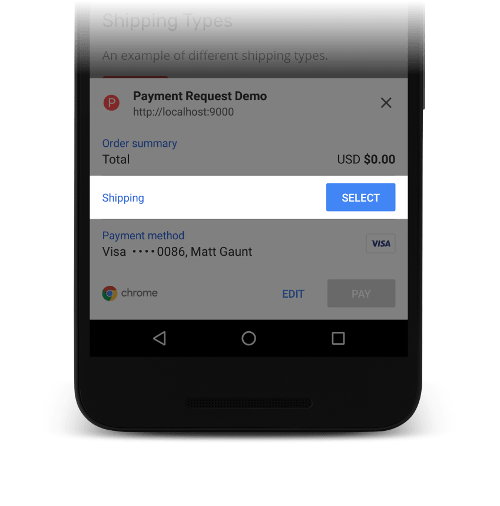
    <figcaption>
      Request shipping information from the user.
    </figcaption>
  </figure>
</div>

By default the Payment Request API will set a shippingType to 'shipping'. This is
why the title on the highlighted row above is "Shipping".

#### Changing the Shipping Type

There are situations where the term "Shipping" isn't appropriate given the
current context, even though an address is required from the user. For example,
a food delivery service needs a **delivery address** and a laundry service may
need a **pickup address**.

To serve these use cases, you can define a `shippingType` of "shipping", "delivery",
or "pickup" to change the UI's title to "Shipping", "Delivery" and "Pickup".

<div class="attempt-center">
  <figure>
    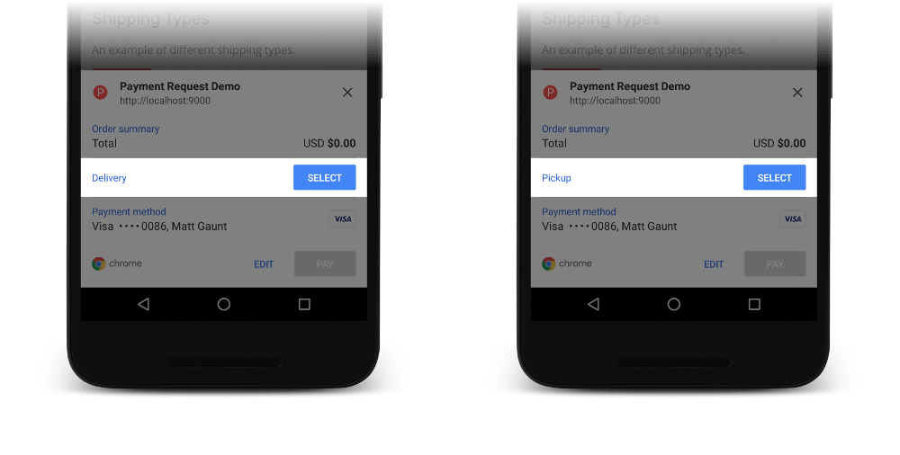
    <figcaption>
      Examples of delivery and pickup shipping labels.
    </figcaption>
  </figure>
</div>

[The spec defines these types fairly
well](https://www.w3.org/TR/payment-request/#dom-paymentshippingtype) if you
need further clarification.

There is a small lifecycle that the user will go through when selecting a
shipping address.

<div class="attempt-center">
  <figure>
    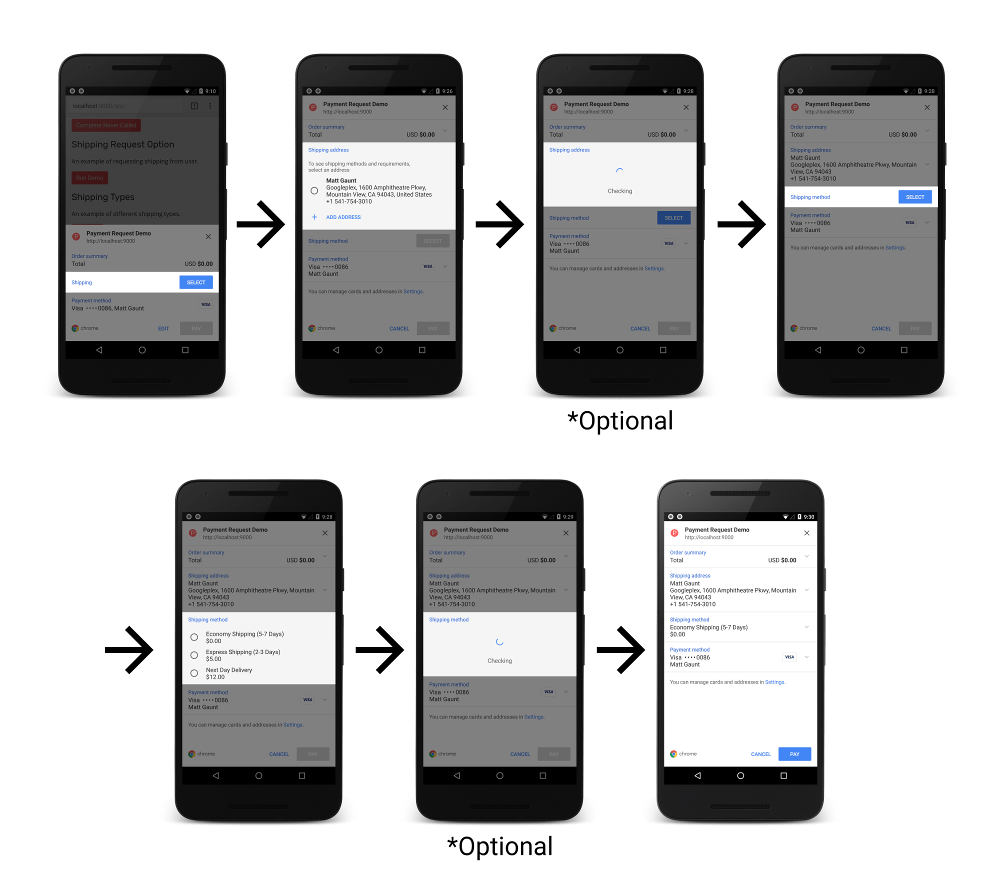
    <figcaption>
      Lifecycle of shipping address selection.
    </figcaption>
  </figure>
</div>

The flow is:

1. The user selects the address input.
1. The user picks a predefined address or adds a new one.
1. Your app has the opportunity of validating the address details and defining
   shipping options based on the selection.
1. The shipping options field will be enabled.
1. The user will be given the options you've defined.
1. Your app will have the option to validate the selection.
1. The user will be able to continue with the rest of the flow.

We'll start by looking at the `shppingAddressChange` event which is dispatched as the
user selects a new address.

### Handling Shipping Address Changes

If you've requested shipping information from the user, a `shippingAddressChange`
event will be dispatched whenever the user changes the shipping address. This
gives you an opportunity to check that the address meets any requirements you
might have (e.g. you may not ship to specific countries) and it provides an
opportunity to determine what the available shipping options are.

<div class="warning">
At the time of writing, you are required to add a <code>shippingaddresschange</code>
 event listener in Chrome (although this behavior is likely to change to be optional).
</div>

You can listen for the event like so:

```
const paymentRequest = new PaymentRequest(  
    supportedPaymentMethods, paymentDetails, options);

paymentRequest.addEventListener('shippingaddresschange', (event) => {  
  // TODO: Handle the event  
});

paymentRequest.show()  
.then(...)
.catch(...)
```
We are simply adding the event listener to our `PaymentRequest` instance before
calling `show()`. When this event is triggered, the common pattern will be to
check the user's selected address and then provide the available shipping
options.

#### Retrieving the shippingAddress

When a `shippingAddressChange` event has been dispatched, the selected address
will be added to the current `PaymentRequest` instance under the `shippingAddress`
parameter.

To give an example, we can print the shipping address to the console like so:

```
const paymentRequest = new PaymentRequest(...);
paymentRequest.addEventListener('shippingaddresschange', (event) => {  
  console.log(paymentRequest.shippingAddress);  
  ...
});
```

_Alternatively_, you can use `event.target` to access the `PaymentRequest` instance.

```
const paymentRequest = new PaymentRequest(...);
paymentRequest.addEventListener('shippingaddresschange', (event) => {  
    const prInstance = event.target;      
    console.log(prInstance.shippingAddress);  
    ...
});
```

In the console we'd see this:

<div class="attempt-center">
  <figure>
    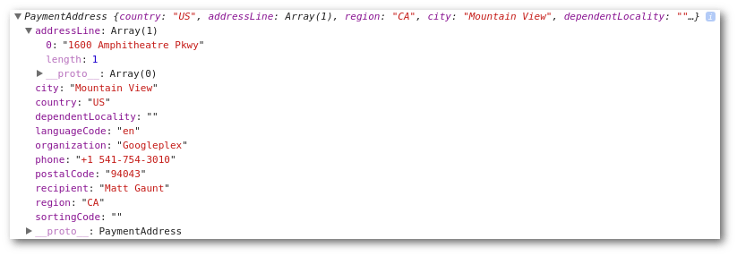
    <figcaption>
      The details we can retrieve from the shipping address parameter.
    </figcaption>
  </figure>
</div>

The `shippingAddress` will have the following *readonly* parameters:

<table>
<tr>
<th>recipient</th>
<td><p><i>String</i></p>
This is the name of the recipient or contact person. This member may, under certain circumstances, contain multiline information. For example, it might contain "care of" information.</td>
</tr>
<tr>
<th>organization</th>
<td><p><i>String</i></p>
This is the organization, firm, company, or institution at this address.</td>
</tr>
<tr>
<th>addressLine</th>
<td><p><i>Array of string</i></p>
This is the most specific part of the address. It can include, for example, a street name, a house number, apartment number, a rural delivery route, descriptive instructions, or a post office box number.</td>
</tr>
<tr>
<th>city</th>
<td><p><i>String</i></p>
This is the city/town portion of the address.</td>
</tr>
<tr>
<th>region</th>
<td><p><i>String</i></p>
This is the top level administrative subdivision of the country. For example, this can be a state, a province, an oblast, or a prefecture.</td>
</tr>
<tr>
<th>country</th>
<td><p><i>String</i></p>
This is the [CLDR] (Common Locale Data Repository) region code. For example, US, GB, CN, or JP.</td>
</tr>
<tr>
<th>postalCode</th>
<td><p><i>String</i></p>
This is the postal code or ZIP code, also known as PIN code in India.</td>
</tr>
<tr>
<th>phone</th>
<td><p><i>String</i></p>
This is the phone number of the recipient or contact person.</td>
</tr>
<tr>
<th>languageCode</th>
<td><p><i>String</i></p>
This is the BCP-47 language code for the address. It's used to determine the field separators and the order of fields when formatting the address for display.</td>
</tr>
<tr>
<th>sortingCode</th>
<td><p><i>String</i></p>
This is the sorting code as used in, for example, France.</td>
</tr>
<tr>
<th>dependentLocality</th>
<td><p><i>String</i></p>
This is the dependent locality or sublocality within a city. For example, used for neighborhoods, boroughs, districts, or UK dependent localities.</td>
</tr>
</table>

This should be everything you need to get the user's selected shipping address
but it does raise the question, how do you tell the Payment Request API what the
available shipping options are?

#### Defining the Available Shipping Options

The event object you'll receive in the `shippingaddresschange` event is a
`PaymentRequestUpdateEvent` which has a method `updateWith()`. You must call this
method with a `paymentDetails` object (i.e. an object with a `total` and
optional `displayItems`) or call it with a `Promise` that resolves to a `paymentDetails`
object.

The important difference when passing in a `paymentDetails` object to `event.updateWith()`
compared to passing it to the constructor, is that we **must**
include `shippingOptions`, which will be the array of objects defining what
the user can select.

For a simple example, we can call `event.updateWith()` with payment details of
a `total` and an empty array for `shippingOptions`:

```
paymentRequest.addEventListener('shippingaddresschange', (event) => {  
  const paymentDetails = {  
    total: {  
      label: 'Total',  
      amount: {  
        currency: 'USD',  
        value: 10,  
      },  
    },  
    shippingOptions: [],  
  };  
  event.updateWith(paymentDetails);  
});
```

Returning no shipping options tells the browser that the
selected shipping address is not suitable or supported by your site, so browsers
will display an error to the user:

<div class="attempt-center">
  <figure>
    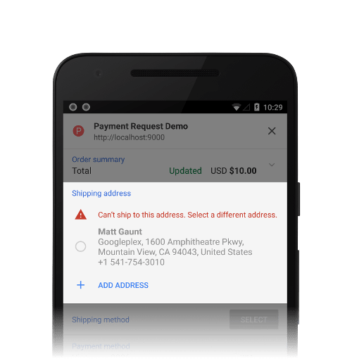
    <figcaption>
      Returning no shipping options displays an error to users.
    </figcaption>
  </figure>
</div>

This happens because the API expects at least one shipping option to be
available for the user to select. Before we look at how to actually define the
shipping options, it's worth covering how you can customize the error message.

##### Customizing the Shipping Options Error

If you can't ship to a user's selected address, you should provide a meaningful
message to them. Adding an `error` parameter to the
transaction details you return to `event.updateWith()` will achieve this.

For example, we can set a custom message with:

```
paymentRequest.addEventListener('shippingaddresschange', (event) => {  
  const paymentDetails = {  
    total: {  
      label: 'Total',  
      amount: {  
        currency: 'USD',  
        value: 10,  
      },  
    },  
    error: 'This is an example error message 🎉',  
    shippingOptions: [],  
  };  
  event.updateWith(paymentDetails);  
});
```

Which will display to the user as:

<div class="attempt-center">
  <figure>
    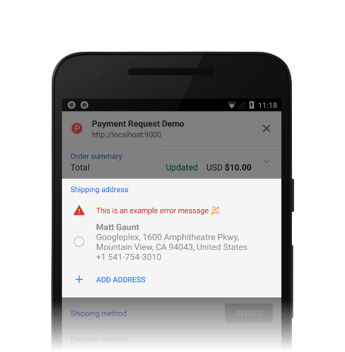
    <figcaption>
      Example of a custom error when returning no shipping options.
    </figcaption>
  </figure>
</div>

##### Defining Shipping Options

Where there are available shipping options, you can define the available options
by setting the `shippingOptions` to an array of objects containing an `id`, `label`,
and `amount` with `currency` and `value`, like so:

```
paymentRequest.addEventListener('shippingaddresschange', (event) => {  
  const paymentRequest = event.target;  
  console.log(paymentRequest.shippingAddress);

  event.updateWith({  
    total: {  
      label: 'Total',  
      amount: {  
        currency: 'USD',  
        value: '0',  
      },  
    },  
    shippingOptions: [  
      {  
        id: 'economy',  
        label: 'Economy Shipping (5-7 Days)',  
        amount: {  
          currency: 'USD',  
          value: '0',  
        },  
      }, {  
        id: 'express',  
        label: 'Express Shipping (2-3 Days)',  
        amount: {  
          currency: 'USD',  
          value: '5',  
        },  
      }, {  
        id: 'next-day',  
        label: 'Next Day Delivery',  
        amount: {  
          currency: 'USD',  
          value: '12',  
        },  
      },  
    ],  
  });  
});
```

This will give the user a set of options to select under the "Shipping Method"
title.

<div class="attempt-center">
  <figure>
    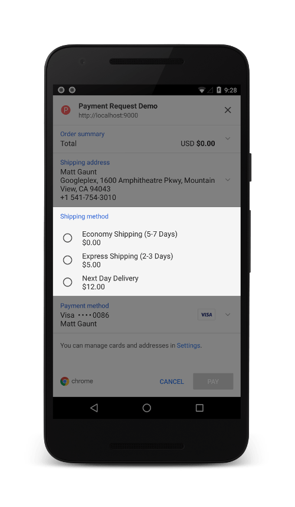
    <figcaption>
      How shipping options are displayed to the user.
    </figcaption>
  </figure>
</div>

In the above examples, we are calling `event.updateWith()` directly with our
`paymentDetails` containing the `total` and `shippingOptions`. If we do this, the
user will not see a loading spinner and can continue with the rest of the
checkout flow.

If you need time to retrieve available shipping options from your backend, you
can pass a `Promise` to `event.updateWith()`. In the following example we are making an
API call and setting the shipping options based on the response:

```
paymentRequest.addEventListener('shippingaddresschange', (event) => {  
  const paymentRequest = event.target;  
  console.log(paymentRequest.shippingAddress);

  const shippingAddrCheckPromise = fetch('/api/get-shipping-opts/', {  
    method: 'POST',  
    credentials: 'include',  
     headers: {  
       'Content-Type': 'application/json'  
     },  
    body: JSON.stringify(paymentRequest.shippingAddress),  
  })  
  .then((response) => {  
    return response.json();  
  })  
  .then((responseData) => {  
    return {  
      total: {  
        label: 'Total',  
        amount: {  
          currency: 'USD',  
          value: '0',  
        },  
      },  
      shippingOptions: responseData.shippingOptions,  
    };  
  });

  event.updateWith(shippingAddrCheckPromise);  
});
```

While the network request is being made, the user will see a spinner:

<div class="attempt-center">
  <figure>
    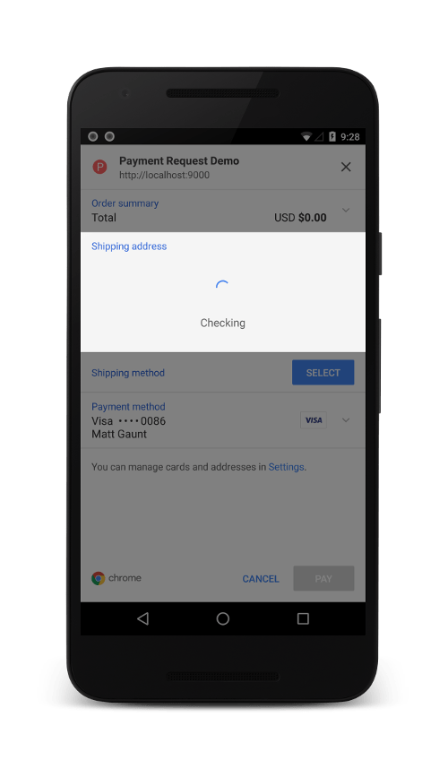
    <figcaption>
      A spinner is shown if you return a Promise to event.updateWith().
    </figcaption>
  </figure>
</div>

#### Edge Cases

**Never Calling updateWith() or Long Promise**  
If you fail to call `event.updateWith()` or pass it a promise that fails to
resolve in a timely manner, the UI will close itself and the show promise will
reject with the following error:

`DOMException: Timed out as the page didn't resolve the promise from change event`

**Using an Invalid Shipping Type**  
If you set the `shippingType` to an invalid value (i.e., something other than
'shipping', 'delivery' or 'pickup'), you'll receive the following error:

`The provided value '...' is not a valid enum value of type PaymentShippingType.`

**Shipping Options with a Non-Unique ID**  
If the returned shipping options do not have unique IDs
the Payment Request API will treat this as though the address is invalid. In
other words, it's the equivalent of setting the `shippingOptions` to an empty
array, which shows the "Can't ship to this address. Select a different address."
message.

**Missing Information from a Shipping Option**  
If any of the shipping options are missing a required parameter then the
promise returned by `show()` will reject with an error highlighting the missing
parameter. Please note that it does not highlight where the value is missing
(i.e., the error message may be referring to a problem in the `total`,
`displayItems`, or `shippingOptions` parameters).

```
// Shipping option missing an id parameter  
DOMException: required member id is undefined.

// Shipping option missing a label parameter  
DOMException: required member label is undefined.

// Shipping option missing an amount parameter  
DOMException: required member amount is undefined.

// Shipping option missing an amount.currency parameter  
DOMException: required member currency is undefined.

// Shipping option missing an amount.value parameter  
DOMException: required member value is undefined.
```

### Handling Shipping Options Changes

Just as you can listen for changes to the shipping address, you can listen for
changes to the selected shipping option. The tasks to perform here are to mark
the shipping option as `selected` if it's valid and update the total and
display items.

We add a listener for `shippingoptionchange` events to our `PaymentRequest`
instance same as `shippingaddresschange`.

```
paymentRequest.addEventListener('shippingoptionchange', (event) => {  
  // TODO: Select a shipping option,  update total and display items.  
});
```

<div class="warning">
At the time of writing, you are required to add a <code>shippingoptionchange</code>
 event listener in Chrome (although this behavior is likely to change to be optional).
</div>

In many ways this event is similar to the `shippingaddresschange` event.

* It expects a `paymentDetails` object with a `total`, `displayItems`, and
  `shippingoptions` to be passed into `event.updateWith()` (or a Promise that
  resolves to this object).
* Updating with an empty array for `shippingoptions` is treated as an error and treats
  the address as unsupported.
* Updating with an empty array for `shippingoptions` and adding a string to an `error`
  parameter will display the custom error message to the user.

**The one thing you must do** is mark the selected shipping option as `selected`. To
do this we'll take the following steps:

1. Get the `PaymentRequest` object from the event.
1. Get the selected shipping option from the `PaymentRequest` object.
1. Set `selected` to true on this shipping option before calling
   `event.updateWith()`.

```
paymentRequest.addEventListener('shippingoptionchange', (event) => {  
  // Step 1: Get the payment request object.  
  const prInstance = event.target;

  // Step 2: Get the ID of the selected shipping option.  
  const selectedId = prInstance.shippingOption;

  // Step 3: Mark selected option  
  globalShippingOptions.forEach((option) => {  
    option.selected = option.id === selectedId;  
  });

  // TODO: Update total and display items, including pending states.

  event.updateWith({  
    total: {  
      label: 'Total',  
      amount: {  
        currency: 'USD',  
        value: '0',  
      },  
    },  
    shippingOptions: globalShippingOptions,  
  });  
});
```

Doing this will update the UI as the user selects a new shipping option. If you
return a promise to `updateWith()`, the user will also be presented with a spinner
until it resolves.

<div class="attempt-center">
  <figure>
    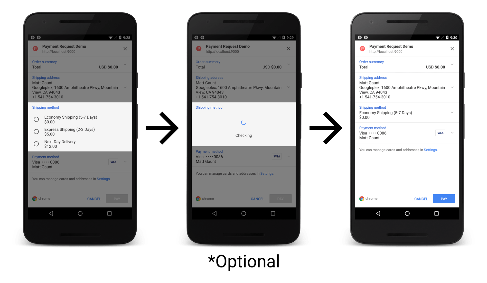
    <figcaption>
      The lifecycle of shipping option selection.
    </figcaption>
  </figure>
</div>

#### Edge Cases

All of the edge cases from the `shippingaddresschange` event apply to
`shippingoptionschange` event. There are a few additional edge cases to be
aware of.

**Failing to Mark an Option as Selected**  
One footgun to be aware of is that if you fail to mark a shipping option
as `selected`, you will end up in a scenario where the user will be stuck in a
loop without any reason as to why they can't select an option. They can go
through the flow to select a shipping option, the event is triggered and if
nothing is marked as selected, they'll be taken back to the payment request UI
and have to select a shipping method again.

**Selecting Multiple Options**  
If you set the selected parameter to `true` on *multiple shipping options*, the last
entry will be selected.

### Variants to Above Flow

In the above flow, we took the user through the following steps:

1. The user selects an address.
1. The app validates the address / provides some shipping options.
1. The user selects a shipping option.
1. The app updates the total and display items.
1. The user completes the transaction.

You can shorten this flow for the user by specifying data at
different stages. In this section we'll see what we can change.

#### Defining Shipping Options Up Front

In the `PaymentRequest` constructor, we can define `shippingOptions` as part of the
initial `paymentDetails` object (i.e. we don't have to wait until a
`shippingaddresschange` event):

```
const paymentDetails = {  
  total: {  
    label: 'Total',  
    amount: {  
      currency: 'USD',  
      value: '0',  
    },  
  },  
  shippingOptions: [  
    {  
      id: 'economy',  
      label: 'Economy Shipping (5-7 Days)',  
      amount: {  
        currency: 'USD',  
        value: '0',  
      },  
    },  
  ],  
};  
new PaymentRequest(paymentMethods, paymentDetails, options);
```

If we do this, there is no difference to the flow we discussed before. The user
will still need to select an address and then shipping options. **However**, if you
mark one of the shipping options as selected in this initial object, the
browser may pre-select an address. For example, if we construct our
payment request UI with the following input (Note the `selected` parameter):

```
const paymentDetails = {  
  total: {  
    label: 'Total',  
    amount: {  
      currency: 'USD',  
      value: '0',  
    },  
  },  
  shippingOptions: [  
    {  
      id: 'economy',  
      label: 'Economy Shipping (5-7 Days)',  
      selected: true,  
      amount: {  
        currency: 'USD',  
        value: '0',  
      },  
    },  
  ],  
};  
new PaymentRequest(paymentMethods, paymentDetails, options);
```

The user will be presented with a UI where an address and shipping has been selected.

<div class="attempt-center">
  <figure>
    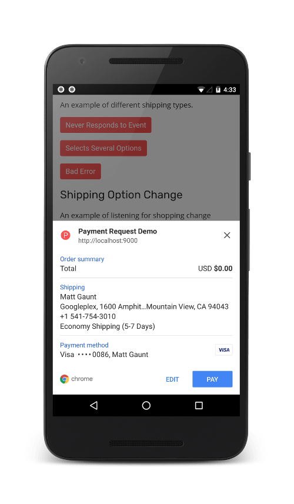
    <figcaption>
      An example of preselecting a shipping option in the PaymentRequest constructor.
    </figcaption>
  </figure>
</div>

This has the advantage that the user can click the 'Pay' button immediately and
complete the transaction with one click. The downside is that you won't receive
a `shippingaddresschange` event, meaning that you can't validate the address
details.

<div class="key-point">
Only select a shipping option in the constructor like this <strong>if you are
extremely confident</strong> that the selected option won't need to change
based on the user's address (e.g. you offer worldwide free shipping).
</div>

#### Select a Shipping Option in shippingaddresschange

In the `shippingaddresschange` event we saw that whichever shipping options we
passed to `event.updateWith()` would be made available to the user.  

Setting one of the options' `selected` parameter to true will select that option,
allowing the user to progress through the checkout flow quicker. This is perfect
if you know the most common shipping option.

```
paymentRequest.addEventListener('shippingaddresschange', (event) => {  
  const paymentRequest = event.target;  
  console.log(paymentRequest.shippingAddress);

  event.updateWith({  
    total: {  
      label: 'Total',  
      amount: {  
        currency: 'USD',  
        value: '0',  
      },  
    },  
    shippingOptions: [  
      {  
        id: 'economy',  
        label: 'Economy Shipping (5-7 Days)',  
        selected: true,  
        amount: {  
          currency: 'USD',  
          value: '0',  
        },  
      }, {  
        id: 'express',  
        label: 'Express Shipping (2-3 Days)',  
        amount: {  
          currency: 'USD',  
          value: '5',  
        },  
      }, {  
        id: 'next-day',  
        label: 'Next Day Delivery',  
        amount: {  
          currency: 'USD',  
          value: '12',  
        },  
      },  
    ],  
  });  
});
```

## Abort a Transaction

The `abort()` method can be used when the shopping session has timed out or an item in the
cart sells out during the transaction and you need to close the payment request UI.

For a simple example:

```
paymentRequest.show()  
.catch((err) => {  
  console.error('PaymentRequest error: ', err);  
});

setTimeout(() => {  
  paymentRequest.abort()  
  .then(() => {  
    // Successfully aborted payment request  
    // TODO: Display message to user.  
  })  
  .catch((err) => {  
    // Unable to abort payment request  
    console.log('abort() Error: ', err);  
  });  
}, 4000);
```

In the above example, if we leave the payment request dialog visible, the `show()`
promise will reject with the following error:

`DOMException: The user aborted a request.`

The promise returned by `abort()` allows you to detect whether the abort was
successful or not. An example of where it might fail is if the user cancels
the payment request UI or completes the transaction before you call `abort()`,
although it can fail to abort when the developer is in the middle of entering
details.

## The Payment Request UI

One aspect of the UI hasn't been discussed. How is the top section of the
payment request UI is constructed?

<div class="attempt-center">
  <figure>
    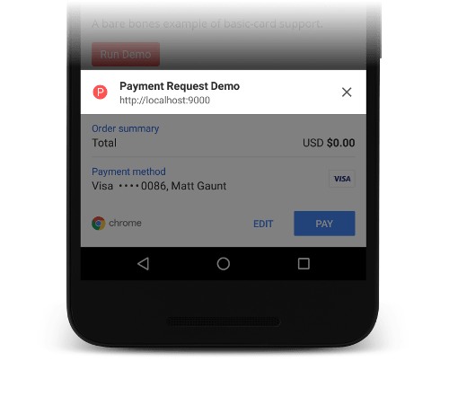
    <figcaption>
      The generated piece of the payment request UI.
    </figcaption>
  </figure>
</div>

This UI is a combination of information readily available from the page.

The icon on the left is the most appropriately sized icon the browser can
find.

You can define multiple icon sizes in the head of your document like so:

```
<link rel="icon" href="images/icon-512x512.png" sizes="512x512" type="image/png">
```

The text in bold, "Payment Request Demo", is taken from the title of the current
page (i.e., `<title>Payment Request Demo</title>`).

The URL that is displayed is the current origin.

## Check Payment Method Availability

Before calling `paymentRequest.show()` you might want to know if the user already
has an available payment method set-up (i.e. will the payment request UI have a
preselected payment method or not).

The `canMakePayment()` method tells you whether the user has a payment method that
fulfils the current `PaymentRequest`'s supported payment methods.

```
const paymentRequest = new PaymentRequest(  
    supportedPaymentMethods, transactionDetails, options);

// If canMakePayment() isn't available, default to assume the method is supported.
const canMakePaymentPromise = Promise.resolve(true);  

// Feature detect canMakePayment()
if (request.canMakePayment) {  
  canMakePaymentPromise = paymentRequest.canMakePayment();  
}

canMakePaymentPromise.then((result) => {  
  if (!result) {  
    // The user does not have a supported payment method.  
    // TODO: Redirect to traditional checkout flow.  
    return;  
  }

  // TODO: The user has a payment - call show().  
})  
.catch((err) => {  
  // TODO: Either fallback to traditional checkout or call show().  
});
```

#### Edge Cases

Querying `canMakePayment()` with different payment methods will 
result in a quota error:

`DOMException: Query quota exceeded`

The reason this error is thrown is to block attempts to fingerprint the user.

At the time of writing, Chrome will reset the quota after 30 minutes or when
it's restarted.

## PaymentRequest Shim

To mitigate the pains of catching up with this living standard API, we strongly
recommend you add [this shim](https://github.com/GoogleChrome/payment-request-shim)
to the `<head>` of your page. This shim will be updated as the API changes and will
do its best to keep your code working for at least 2 major releases of Chrome.

We also provide a [PaymentRequest wrapper for Apple Pay JS](https://github.com/GoogleChrome/appr-wrapper).
