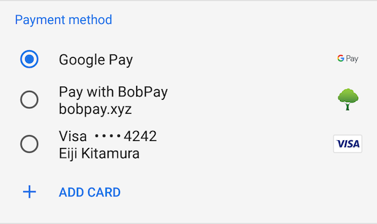

project_path: /web/fundamentals/_project.yaml
book_path: /web/fundamentals/_book.yaml
description: Payment Methods page for the W3C Payment APIs doc set.

{# wf_published_on: 2018-08-11 #}
{# wf_updated_on: 2018-09-10 #}
{# wf_blink_components: Blink>Payments #}

# Payment Method Basics {: .page-title }




## Payment Methods

The Payment Request API makes it easy for a browser to pass payment credentials,
such as credit card details, to a merchant. The API can also accept payments
through apps that process payments in nearly any way they wish: e-money, bank
transfers, bitcoin, etc.

In the Payment Request API, _payment methods_ are processes that can be invoked
to process a payment, and can be thought of somewhat like "plugins" for the
Payment Request API. Each payment method consists of a required payment method
identifier and an optional detail parameter.

In the following example we declare two payment methods: one that can process
Visa, Mastercard, and JCB cards via `basic-card`; and an Android app called BobPay
built to integrate with the Payment Request API via the URL
`https://bobpay.xyz/pay`.

```javascript
const methodData = [{
 supportedMethods: 'basic-card',
 data: {
   supportedNetworks: ['visa', 'master', 'jcb']
 }
}, {
 supportedMethods: 'https://google.com/pay',
 data: {
   ...
 }
}, {
 supportedMethods: 'https://bobpay.xyz/pay'
}];
```

When the Payment Request UI is displayed to a customer during checkout, they see
a subset of the payment methods specified by the merchant. The subset displayed
to the user consists of all the payment methods available to the user on this
device. The customer can select one of the methods to use for payment, as shown
here. 



## Standardized vs. URL-based Payment Methods

There are two types of payment method identifiers: *standardized* and
*URL-based*.

### Standardized

Standardized payment methods are those that are literally standardized in their
respective W3C specifications, meaning that all parameters required to fill the
`data` property are defined in the specs.

You may already be familiar with [the basic-card
method](https://www.w3.org/TR/payment-method-basic-card/). At this time, August
2018, it is the only officially-standardized payment method, and is supported by
most browsers that implement the Payment Request API. However, because it
returns raw, untokenized card information, it is safe to say that `basic-card`
is not the future of web payments.

There is a [registry of standardized payment
methods](https://w3c.github.io/payment-method-id/#registry) in the spec, but
there are other standardization candidates under active discussion. 

*   [Basic Credit Transfer
    Payment](http://w3c.github.io/webpayments-methods-credit-transfer-direct-debit/)
    (basic-credit-transfer): A payment method to transfer money between bank
    accounts.
*   [Tokenized Card
    Payment](https://w3c.github.io/webpayments/proposals/interledger-payment-method.html)
    (tokenized-card): A payment method that provides a token representing a card
    instead of a raw card number.
*   [Interledger Payment
    Method](https://w3c.github.io/webpayments/proposals/interledger-payment-method.html)
    (interledger): A payment method that transfers money using [the interledger
    protocol](https://interledger.org/).
*   [Basic SEPAmail
    Payment](https://w3c.github.io/webpayments/proposals/sepamail) (sepamail): A
    payment method that supports payment by SEPAmail Applications such as RUBIS,
    GEMME, or JADE.

In the example below, `basic-card` is specified as the `supportedMethods` value
and requires that the `data` value be supplied, containing a list of the
supported card providers and card types.

```javascript
supportedMethods: 'basic-card',
data: {
  supportedNetworks: ['visa', 'master', 'jcb'],
  supportedTypes: ['credit', 'debit', 'prepaid']
}
```

### URL-based

URL-based payment methods are those that anyone can define independently,
without reliance on W3C standardization. Proprietary payment methods such as
Google Pay, Apple Pay, Samsung Pay are good examples. These payment methods are
specified using a unique URL identifier such as `https://google.com/pay` or
`https://www.alipay.com/webpay`.

The URLs represent a payment method and are usually associated with a particular
payment app, but it is not necessarily a one-to-one relationship. It's possible
for one payment method to be supported by multiple payment apps, or for one
payment app to support multiple payment methods.

For example, a third-party payment app might support both the basic-card method
as well as a specific `https://bobpay.xyz` method.

Unlike standardized payment methods, URL-based payment methods have no registry.
Anyone can develop and provide their own payment apps that support a payment
method. This allows the W3C Payment APIs concept to inherently scale into quite 
a large payment ecosystem.

In the example below, Google Pay is invoked via its URL; any information to be
passed to the payment method can be supplied in the optional `data` value.

```javascript
supportedMethods: 'https://google.com/pay',
data: {
  ...
}
```

URL-based payment methods other than Google Pay include Apple Pay and Samsung
Pay. If you want to learn more about them, including their `data` property
details, check out the links below.

*   [Google Pay](/pay/api/web/)
*   [Apple Pay](https://developer.apple.com/documentation/apple_pay_on_the_web)
*   [Samsung Pay](https://developer.samsung.com/internet/android/web-payments-guide)
