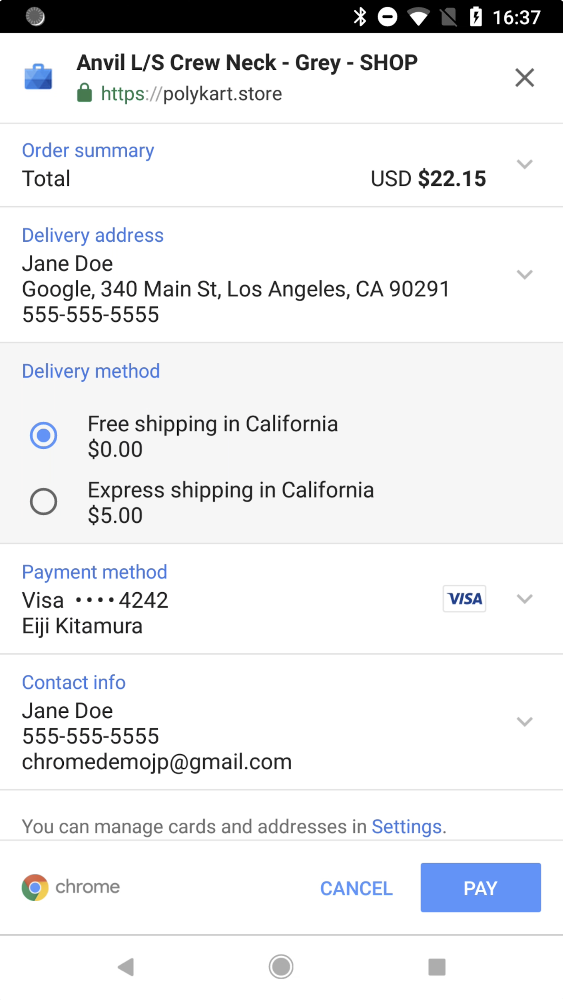
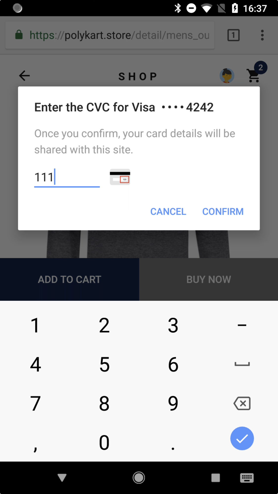

project_path: /web/fundamentals/_project.yaml
book_path: /web/fundamentals/_book.yaml
description: Overview page to the Web Payments doc set.

{# wf_published_on: 2018-08-11 #}
{# wf_updated_on: 2018-08-13 #}
{# wf_blink_components: Blink>Payments #}

# Overview {: .page-title }




## Introduction

Web Payments is an emerging web standard being developed by the W3C to simplify online payments and enable a broader set of players to participate easily in the payments ecosystem on the web. The standards are flexible; they work with various types of payment systems and are not tied to any specific browser, payment method, or payment service provider. This flexibility enables development simplicity, deployment consistency, and future compatibility with emerging payment technologies.

**For consumers**, they simplify checkout flow, by making it a few taps instead of typing small characters many times on a virtual keyboard.

**For merchants**, they make it easier to implement with a variety of payment options already filtered for the customer.

**For payment handlers**, they allow bringing any type of payment methods to the web with relatively easy integration.

**For payment service providers**, they bring new payment methods and enhance the ability of businesses to serve more customers with a better developer experience and more secure solutions.

Web Payments is:

*   **Standard and Open:** Web Payments is an open source payment standard for the web platform for the first time in history. It is available for any players to implement.
*   **Easy and Consistent**: Web Payments make checkout easy for the user, by reusing stored payments and address information and removing the need for the user to fill in checkout forms. Since the UI is implemented by the browser natively, users see a familiar and consistent checkout experience on any website that implements the standard.
*   **Secure and Flexible:** Web Payments provide industry-leading payment technology to the web, and can easily integrate a secure payment solution.

## A Closer Look

The Payment Request UI on Chrome is flexible and can display a variety of appropriate elements, such as the following.

<table>
  <tr>
   <td>It can display the list of items in the user's shopping cart, shipping addresses, payment methods and contact info.
   </td>
   <td>
   </td>
  </tr>
  <tr>
   <td>It can display available payment methods (called <em>payment apps)</em> from third parties. Google Pay, for example, is a payment app.
   </td>
   <td>
   </td>
  </tr>
  <tr>
   <td>It can request a shipping address; if the user has previously stored addresses in Autofill, they are displayed and the user can choose one  with a single tap.
   </td>
   <td>
   </td>
  </tr>
  <tr>
   <td>It can display shipping options; for example, a user might choose between free shipping that takes a few days and faster shipping that incurs a fee.
   </td>
   <td>
   </td>
  </tr>
  <tr>
   <td>It can request the payer's contact information, such as name, email address, and phone number -- all of which may also be available from Autofill.
   </td>
   <td>
   </td>
  </tr>
  <tr>
   <td>Finally, it can ask the user to authorize payment in the payment method-specific UI and complete the purchase, as in this basic-card example.
   </td>
   <td>
   </td>
  </tr>
</table>

## Next Up

Learn about the basics of Web Payments, including how the web payment ecosystem works and the anatomy of payment apps in [How the Payment Ecosystem Works](https://drive.google.com/a/google.com/open?id=1PwPi_TD3G-kQyz31nW-1A4A5kvoCy7UCz6grk1TMaE8).

