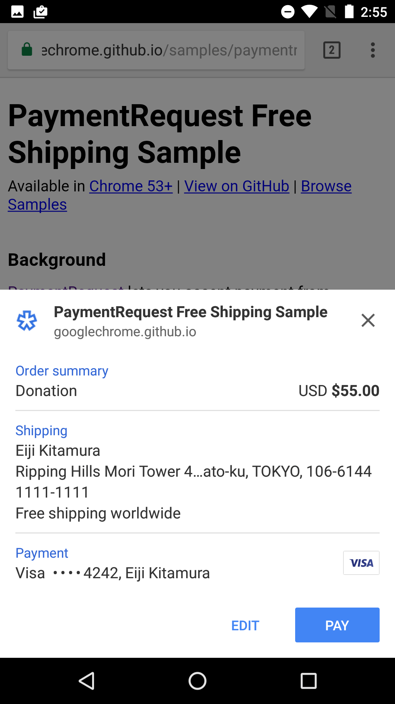

project_path: /web/fundamentals/_project.yaml
book_path: /web/fundamentals/_book.yaml
description: Payment Request API is for fast, easy payments on the web.

{# wf_published_on: 2016-07-25 #}
{# wf_updated_on: 2017-06-16 #}

# Introducing the Payment Request API {: .page-title }





Buying goods online is a convenient but often frustrating experience,
particularly on mobile devices. Although mobile traffic continues to increase,
mobile conversions account for only about a third of all completed purchases. In
other words, users abandon mobile purchases twice as often as desktop purchases.
Why?

*Why users abandon mobile purchase forms*

Online purchase forms are user-intensive, difficult to use, slow to load and
refresh, and require multiple steps to complete. This is because two primary
components of online payments&mdash;security and convenience&mdash;often work at
cross-purposes; more of one typically means less of the other.

Most of the problems that lead to abandonment can be directly traced to purchase
forms. Each app or site has its own data entry and validation process, and users
often find they must enter the same information at every app's purchase point.
Also, application developers struggle to create purchase flows that support
multiple unique payment methods; even small differences in payment method
requirements can complicate the form completion and submission process.

Any system that improves or solves one or more of those problems is a welcome
change. We started solving the problem already with
[Autofill](/web/updates/2015/06/checkout-faster-with-autofill), but now we'd
like to talk about a more comprehensive solution.

## Introducing the Payment Request API {: #introducing }

The Payment Request API is a [W3C standard](https://www.w3.org/TR/payment-request/)
candidate that is meant to *eliminate checkout forms*.
It vastly improves user workflow during the purchase process, providing a more
consistent user experience and enabling web merchants to easily leverage
different payment methods.

The Payment Request API is designed to be vendor-agnostic, meaning it does not
require use of a particular payment system. It's not a new payment method,
nor does it integrate directly with payment processors; rather, it is a conduit
from the user's payment and shipping information to merchants, with the following
goals:

* Let the browser act as intermediary among merchants, users, and payment
  methods
* Standardize the payment communication flow as much as possible
* Seamlessly support different secure payment methods
* Work on any browser, device, or platform&mdash;mobile or otherwise

The Payment Request API is an open and cross-browser standard that replaces
traditional checkout flows by allowing merchants to request and accept any
payment in a single API call. The API allows the web page to exchange information
with the user agent while the user is providing input, before approving or denying
a payment request.

Best of all, with the browser acting as an intermediary, all the information
necessary for a fast checkout can be stored in the browser, so users can just
confirm and pay, all with a single click.

### Payment transaction process {: #transaction-process }
Using the Payment Request API, the transaction process is made as seamless as
possible for both users and merchants.

*The payment transaction process*

The process begins when the merchant site creates a new `PaymentRequest` and
passes to the browser all the information required to make the purchase: the
amount to be charged, what currency they expect payment in, and what payment
methods are accepted by the site. The browser determines compatibility between
the accepted payment methods for the site and the methods the user has installed
on the target device.

  <figure>
    
    <figcaption>Payment Request Interface</figcaption>
  </figure>

The browser then presents the payments UI to the user, who selects a payment
method and authorizes the transaction. A payment method can be as
straightforward as a credit card that is already stored by the browser, or as
esoteric as third-party application written specifically to deliver payments to
the site (this functionality is coming soon). After the user authorizes the
transaction, all the necessary payment details are sent directly back to the
site. For example, for a credit card payment, the site will get back a card
number, a cardholder name, an expiration date, and a CVC.

Payment Request can also be extended to return additional information, such as
shipping addresses and options, payer email, and payer phone. This allows you to
get all the information you need to finalize a payment without ever showing the
user a checkout form.

The beauty of the new process is threefold: from the user's perspective, all the
previously tedious interaction&mdash;request, authorization, payment, and
result&mdash;now takes place in a single step; from the website's perspective,
it requires only a single JavaScript API call; from the payment method's
perspective, there is no process change whatsoever.

To start getting to grips with API itself, view our [deep dive here](/web/fundamentals/payments/deep-dive-into-payment-request).

