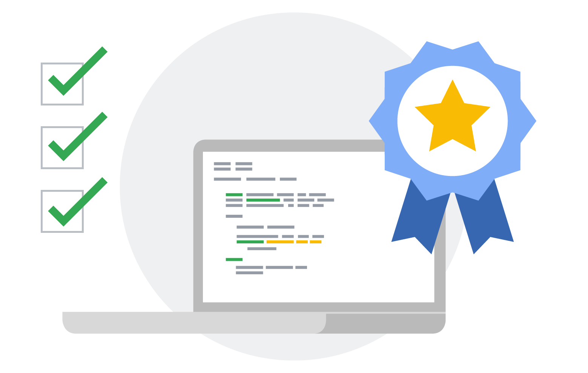
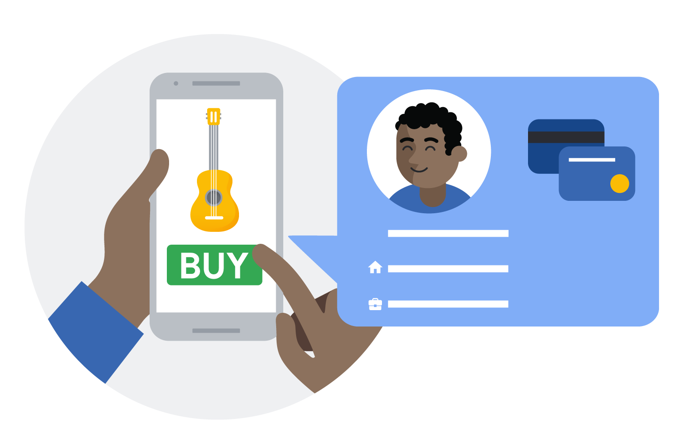
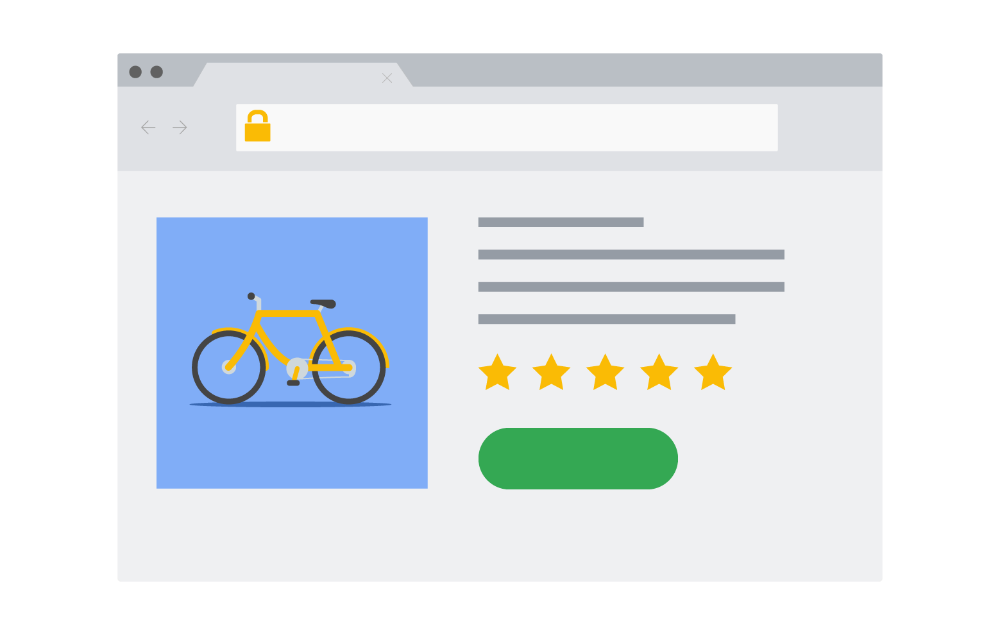

project_path: /web/fundamentals/_project.yaml
book_path: /web/fundamentals/_book.yaml
description: Learn the concept of the Web Payments and how it works at a high level.

{# wf_published_on: 2018-09-10 #}
{# wf_updated_on: 2019-07-27 #}
{# wf_blink_components: Blink>Payments #}
{# wf_featured_image: /web/fundamentals/payments/images/webpayments.png #}

# Web Payments Overview {: .page-title }





  <iframe class="devsite-embedded-youtube-video" data-video-id="colCcgKoLUM"
          data-autohide="1" data-showinfo="0" frameborder="0" allowfullscreen>
  </iframe>

## Introduction

Web Payments is an emerging web standard being developed by the W3C to
simplify online payments and enable a broader set of players to participate
easily in the payments ecosystem on the web. The standards are flexible; they
work with various types of payment systems and are intended to work on any
browser on any device, payment method, or payment service provider. This
flexibility enables development simplicity, deployment consistency, and future
compatibility with emerging payment technologies.

Benefits of Web Payments:

**For consumers**, they simplify checkout flow, by making it a few taps instead
of typing small characters many times on a virtual keyboard.

**For merchants**, they make it easier to implement with a variety of payment
options already filtered for the customer.

**For payment handlers**, they allow bringing any type of payment methods to the
web with relatively easy integration.

**For payment service providers**, they bring new payment methods and enhance
the ability of businesses to serve more customers with a better developer
experience and more secure solutions.

## 3 principles

<section style="display:flex;background-color:#f7f7f7;padding-bottom:32px;">
  

    
  

  

    <h3>Standard and Open</h3>
    Web Payments are an open payment standard for the web platform for the first time
    in history. They are available for any players to implement.

</section>
<section style="display:flex;padding-bottom:32px;">
  

    <h3>Easy and Consistent</h3>
    Web Payments make checkout easy for the user, by reusing stored 
payments and address information and removing the need for the user to fill in checkout forms. 
Since the UI is implemented by the browser natively, users see a familiar and consistent checkout 
experience on any website that makes use of the standard.

  

    
  

</section>
<section style="display:flex;background-color:#f7f7f7;padding-bottom:32px;">
  

    
  

  

    <h3>Secure and Flexible</h3>
    Web Payments provide industry-leading payment technology to the 
web, and can easily integrate a secure payment solution.

</section>

## Next Up

This document aims at developers who are working for payment industries,
especially at merchants, payment service providers and payment handlers.

**All developers** should start with reading through the ["Basics"
section](/web/fundamentals/payments/basics/how-payment-ecosystem-works).

**Merchants without PCI-DSS compliance** should then consult with their payment
service provider to see if they have support for the Payment Request API. If they
don't, consider forwarding this document and ask them to support the W3C Payment
APIs. [UX
considerations](/web/fundamentals/payments/merchant-guide/payment-request-ux-considerations)
of the "Merchant Guide" should be also helpful.

**Merchants or payment service providers with PCI-DSS compliance** should
proceed to the ["Merchants
Guide"](/web/fundamentals/payments/merchant-guide/deep-dive-into-payment-request)
and learn the Payment Request API in details.

**Payment handlers** should proceed to the "Payment Apps Developer Guide" section.
Depending on your technology set, consider implementing either the [Android payment
app](/web/fundamentals/payments/payment-apps-developer-guide/android-payment-apps)
or the [web-based payment
app](/web/fundamentals/payments/payment-apps-developer-guide/web-payment-apps)
by reading through the respective section.

## Feedback {: #feedback }


