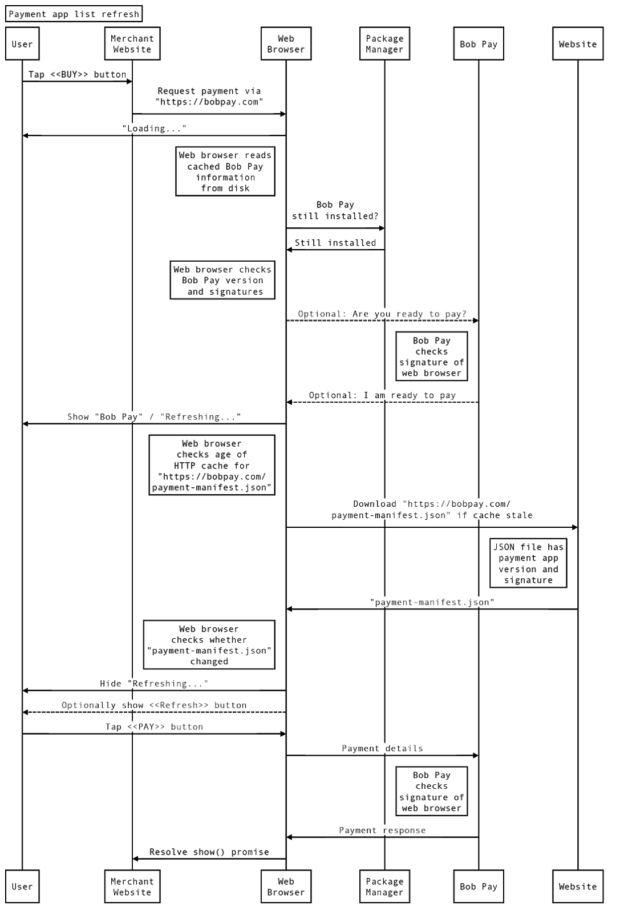
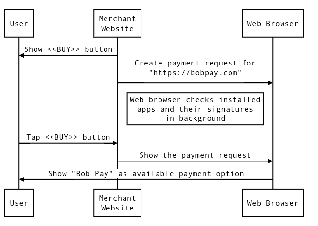

project_path: /web/fundamentals/_project.yaml
book_path: /web/fundamentals/_book.yaml
description: Web Payments allows any Android payment apps to act as a payment handler for the Payment Request API. Learn how to do it.

{# wf_published_on: 2018-09-10 #}
{# wf_updated_on: 2019-05-31 #}
{# wf_blink_components: Blink>Payments #}

# Android payment apps developer guide {: .page-title }



## Introduction

The [Payment Request API](https://www.w3.org/TR/payment-request/) brought to the
web a native browser-based interface that allows users to enter required
purchase information easier than ever before. The API can also invoke payment
apps that provide [various kinds of payment
methods](/web/fundamentals/payments/basics/payment-method-basics) such as
e-money, cryptocurrency, bank transfers, and more.

You may implement a native Android app or convert an existing Android app in
order to process such payment methods. This document describes a basic method
for any Android payment app to work with any Android web browser through
[Android
intents](https://developer.android.com/reference/android/content/Intent).

## Requirements

-   **Browser permissions:** A payment app must know where the money is going.
    Therefore, the payment app should be able to control which browsers are
    allowed to call it.
-   **Website permissions:** A payment app should be able to control which
    websites are allowed to invoke it. Therefore, a browser should pass the
    origin and certificate of the calling website to the payment app.
-   **Payment app permissions:** If a merchant specifies that they accept a
    certain payment app, then the merchant needs to know that an impersonator
    app cannot steal a user’s credentials. Therefore, a payment app should be
    able to control which apps can respond to its payment method identifier. For
    example, `https://bobpay.com` may allow only the Bob Pay native Android app
    to send payments, while `http://www.alice.com/web-pay` may allow payments
    from any payment app.
-   **Loose integration:**  Web browsers should not be compiling against payment
    app SDKs, and payment apps should not be compiling against web browser SDKs.
-   **Performance:** The integration should be fast even in a worst case
    scenario, such as a device with 512MB of RAM and a cold start for both the
    browser and the payment app.
-   **Install awareness:** If a user installs or uninstalls a payment app, a web
    browser should be aware of this change. Even if a web browser is installed
    after a payment app, the browser should be able to use the pre-installed
    payment app for web payments.

## Finding a valid payment app

<figure>
  
  <figcaption>Finding a valid payment app process</figcaption>
</figure>

When a merchant requests payment via `https://bobpay.com` method, the web
browser queries the Package Manager for any app that can respond to
`https://bobpay.com` intent. Checking locally-installed apps first reduces the
number of server requests for `payment-manifest.json` file. If a compatible app
is found, then the browser downloads the HEAD of `https://bobpay.com`, and then
downloads the JSON manifest file pointed to by the HTTP header link with the
`rel="payment-method-manifest"` attribute. The HTTP header might look like this:

```
Link: <payment-manifest.json>; rel="payment-method-manifest"
```

Next, the browser downloads the manifest,
`https://bobpay.com/payment-manifest.json`, which contains pointers to the
default applications of that payment method. The payment method manifest might
include:

```
{"default_applications": ["https://bobpay.com/bobpay-app.json"]}
```

Note: The origin of `default_applications` must be the same origin as the
payment method manifest URL.

The browser then downloads `https://bobpay.com/bobpay-app.json` and verifies the
installed app against the version and signatures in it. The requirements for
this verification are that all downloads must be over HTTPS, HTTP response codes
must be 200, and HTTP redirects are not followed.

<figure>
  
  <figcaption>Caching payment apps process</figcaption>
</figure>

After the browser has been used for one or more web payments, it has a cache of
locally-installed payment apps. The cache allows faster display of the payment
UI on subsequent visits. When a user taps the merchant website's "Buy" button,
the browser shows the cached list of apps and refreshes the list of payment
apps in the background.

Protecting the cache from malware is outside the scope of this project, but is
an important consideration. If the user's device is infected with malware that
can read and write other apps' data directories the malware could, for example,
read the user's credit card numbers, addresses, and passwords from disk. See
[https://developer.android.com/guide/topics/data/data-storage.html](https://developer.android.com/guide/topics/data/data-storage.html)
for more information.

### Preloading a payment request

<figure>
  
  <figcaption>Preloading a payment request process</figcaption>
</figure>

A web browser queries installed payment apps when the JavaScript PaymentRequest
object is constructed. To save time, a website can create a `PaymentRequest`
object when showing the "Buy" button, but not call `PaymentRequest.show()` until
the user taps the button. This allows a faster UI response.


## Messages

Browsers and payment apps pass data to each other via Intent extras, which are
key-value string pairs.

### Optional: “Is ready to pay”

<figure>
  
  <figcaption>"Is ready to pay" process</figcaption>
</figure>

If the payment app has a service with the `IS_READY_TO_PAY` Android intent
handler, then the browser can check with the payment app before showing it as an
option for payment.

#### “Is ready to pay” parameters

-   `ArrayList<String> methodNames` - The names of the methods being queried.
    The elements are the keys in
    [`methodData`](https://w3c.github.io/payment-request/#paymentrequest-interface)
    dictionary.
-   `Bundle[String] methodData` - A mapping from each
    [`methodName`](https://w3c.github.io/payment-request/#paymentrequest-interface)
    to the output of
    `JSON.stringify(`[`methodData[methodName].data`](https://w3c.github.io/payment-request/#paymentrequest-interface)`)`.
-   `String topLevelOrigin` - The schemeless origin of the top-level browsing
    context. For example, `https://mystore.com/checkout` will be passed as
    `mystore.com`.
-   `Parcelable[] topLevelCertificateChain` - The certificate chain of the
    top-level browsing context. Null for localhost and file on disk, which are
    both secure contexts without SSL certificates. The certificate chain is
    necessary because a payment app might have different trust requirements for
    websites.
-   `String paymentRequestOrigin` - The schemeless origin of the iframe browsing
    context that invoked the `new PaymentRequest(methodData, details, options)`
    constructor. If the constructor was invoked from the top-level context, then
    the value of this parameter equals the value of `topLevelOrigin` parameter.

Not all browsers can determine the values for all parameters, so the payment app
should check for existence of the parameters before attempting to access them.

These parameters are sent to the payment app using intent extras.

```java
Bundle extras = new Bundle();
extras.putString("key", "value");
intent.putExtras(extras);
```

The certificate chain is serialized as follows.

```java
Parcelable[] certificateChain;
Bundle certficate = new Bundle();
certificate.putByteArray("certificate", certificateByteArray[i]);
certificateChain[i] = certificate;
extras.putParcelableArray("certificateChain", certificateChain);
```

#### “Is ready to pay” response

- `boolean readyToPay` - Whether the payment app is ready to pay.

The response is sent back via the `handleIsReadyToPay(isReadyToPay)` method.

```java
callback.handleIsReadyToPay(true);
```

### Payment

<figure>
  
  <figcaption>Payment process</figcaption>
</figure>


A web browser invokes the payment app via an Android intent with payment request
information in the intent parameters. The payment app responds with `methodName`
and  `details`, which are payment app specific and are opaque to the browser.
The browser converts the `details` string into a JavaScript object for merchant
website via JSON deserialization, but does not enforce any validity beyond that.
The browser does not modify the `details`; that parameter's value goes directly
to the merchant website.

#### Payment parameters

-   `ArrayList<String> methodNames` - The names of the methods being used. The
    elements are the keys in the
    [`methodData`](https://w3c.github.io/payment-request/#paymentrequest-interface)
    dictionary, and indicate the methods that the payment app supports.
-   `Bundle[String] methodData` - A mapping from each `methodName` to the
    output of
    `JSON.stringify(`[`methodData[methodName].data`](https://w3c.github.io/payment-request/#paymentrequest-interface)`)`.
-   `String merchantName` - The contents of the `<title>` HTML tag of the top-level
    browsing context on the checkout web page.
-   `String topLevelOrigin` - The schemeless origin of the top-level browsing
    context. For example, `https://mystore.com/checkout` is passed as
    `mystore.com`.
-   `Parcelable[] topLevelCertificateChain` - The certificate chain of the
    top-level browsing context. Null for localhost and files on disk, which are
    both secure contexts without SSL certificates. Each `Parcelable` is a
    `Bundle` with a `certificate` key and a byte array value.
-   `String paymentRequestOrigin` - The schemeless origin of the iframe browsing
    context that invoked the `new PaymentRequest(methodData, details, options)`
    constructor. If the constructor was invoked from top-level context, then the
    value of this parameter equals the value of `topLevelOrigin` parameter.
-   `String total` - The output of
    `JSON.stringify(`[`details.total.amount`](https://w3c.github.io/payment-request/#dom-paymentdetailsinit-total)`)`.
-   `String modifiers` - The output of
    `JSON.stringify(`[`details.modifiers`](https://w3c.github.io/payment-request/#dom-paymentdetailsbase-modifiers)`)`,
    where `details.modifiers` contain only `supportedMethods` and `total`.
-   `String paymentRequestId` - The
    [`PaymentRequest.id`](https://w3c.github.io/payment-request/#id-attribute)
    field that “push-payment” apps should associate with transaction state.
    Merchant websites will use this field to query the “push-payment” apps for
    the state of transaction out of band.

Not all browsers can determine the values for all parameters. Therefore, the
payment app should check for existence of the parameters before attempting to
access them.

These parameters are sent to the payment app using intent extras.

```java
Bundle extras = new Bundle();
extras.putString("key", "value");
intent.putExtras(extras);
```

If the browser determines that the certificate is invalid, then
`PaymentRequest.show()` should not invoke payment apps. Even if the user
bypasses the browser’s interstitial warning about the site, the Payment Request
API is still available for manual data entry but not for quick and painless
payments. Therefore, only a valid certificate chain will be sent to the payment
app, after the browser has resolved it to its root.

#### Payment response

-   `int success` - The activity result of either `RESULT_OK` or
    `RESULT_CANCELED`, depending on whether the payment app was able to complete
    its part of the transaction successfully. For example, `success` can be
    `RESULT_CANCELED` if the user fails to enter the correct PIN code for their
    account in the payment app.
-   `String methodName` - The name of the method being used.
-   `String details` - A JSON string containing information necessary for the
    merchant website to complete the transaction. If success is `true`, then
    `details` must be constructed in such a way that `JSON.parse(details)` will
    succeed.

The response is sent back via `Activity.setResult()` method.

```java
Intent result = new Intent();
Bundle extras = new Bundle();
extras.putString("key", "value");
result.putExtras(extras);
setResult(RESULT_OK, result); // Change to RESULT_CANCELED on failure.
finish(); // Close the payment activity.
```

If the payment app returns `RESULT_CANCELED`, then the browser may let the user
choose a different payment app. The merchant website does not observe this, so
there’s no need for detailed error codes to be sent from the payment app to the
merchant website.

## Algorithms

This section describes in detail the steps of algorithms that determine the list
of possible Android payment apps on the user device.

### Basic process

1. The merchant website provides a list of payment methods in the
   `PaymentRequest` constructor.
2. The browser finds the locally installed Android payment apps that claim
   support for the given payment methods.
3. The browser downloads and validates the payment method manifests and the web
   app manifests for the default applications of the payment method manifests.
4. The browser shows the apps that match the information in these web app
   manifests.
5. The browser checks for `*` in the `supported_origins` of the payment method
   manifests. If found, the browser shows all matching apps.
6. The browser downloads and validates the default payment method manifests and
   the default web app manifests for the installed Android payment apps.
7. The browser shows the apps that match the information in these web app
   manifests.


See authoritative specification in [Ingesting payment method
manifests](https://w3c.github.io/payment-method-manifest/#ingest).

### Find payment apps

This algorithm queries locally installed Android apps for possible payment apps.
It runs when
[`PaymentRequest.canMakePayment()`](https://w3c.github.io/payment-request/#dom-paymentrequest-canmakepayment)
or
[`PaymentRequest.show()`](https://w3c.github.io/payment-request/#dom-paymentrequest-show)
is called.

1.  Let `apps` be an empty list of payment apps.
2.  If
    [`PaymentMethodData.supportedMethods`](https://w3c.github.io/payment-request/#dom-paymentmethoddata-supportedmethods)
    contains the string `"basic-card"`, then query all apps that can respond to
    `org.chromium.intent.action.PAY` action and have `"basic-card"` in
    `<meta-data>`. Add these apps to the `apps` list.
3.  Let `urlPaymentMethods` be the subset of
    [`PaymentMethodData.supportedMethods`](https://w3c.github.io/payment-request/#dom-paymentmethoddata-supportedmethods)
    that are valid, absolute URLs with HTTPS scheme.
4.  Query all apps that can respond to the `org.chromium.intent.action.PAY`
    action with any of the `urlPaymentMethods` in `<meta-data>`. Add these apps
    to the `apps` list.
5.  Remove all apps from the `apps `list that have an empty label.

        ResolveInfo app; // Needs to be assigned.
        boolean isLabelEmpty = !TextUtils.isEmpty(app.loadLabel(
                getContext().getPackageManager()));

6.  Return the `urlPaymentMethods` and `apps` lists.


### Download payment method manifests

See the authoritative specification at [Fetching payment method
manifests](https://w3c.github.io/payment-method-manifest/#fetch-pmm).

### Validate payment method manifest

See the authoritative specification at [Validating and parsing payment method
manifests](https://w3c.github.io/payment-method-manifest/#validate-and-parse).

### Download web app manifest {: #download-web-app-manifest }

See the authoritative specification at [Fetching web app
manifests](https://w3c.github.io/payment-method-manifest/#fetch-wam).

### Validate web app manifest {: #validate-web-app-manifest }

The algorithm operates on the contents downloaded in the [Download web app
manifest](#download-web-app-manifest)
algorithm and returns `true` for a valid manifest. Here’s an example of the file
to be parsed.

```json
{
  "related_applications": [{
    "platform": "play",
    "id": "com.bobpay.app",
    "min_version": "1",
    "fingerprints": [{
      "type": "sha256_cert",
      "value": "92:5A:39:05:C5:B9:EA:BC:71:48:5F:F2"
    }]
  }]
}
```

1.  Let `manifest` be the output of JSON-parsing the downloaded manifest data,
    which was decoded as UTF-8.
2.  If JSON-parsing fails, then return `false`.
3.  If `manifest` is not a dictionary, then return `false`.
4.  If `manifest` does not have `"related_applications"` member that is a
    non-empty list of dictionaries with at least one `"platform": "play"`, then
    return `false`.
5.  For every dictionary in `"related_applications"` with `"platform": "play"`:
    1. If `"id"` is absent, is not a string, or is an empty string, return
       `false`.
    2. If `"min_version"` is absent, is not a string, or cannot be parsed into
       an integer, then return `false`.
    3. If `"fingerprints"` is absent, or is not a list, or is an empty list,
       return `false`.
    4. For every item in the `"fingerprints"`:
        1. If the `"type"` is not `"sha256_cert"`, then return `false`.
        2. If the `"value"` is not a string of 32 colon-separated, upper-case
           hex digits, return `false`.
6. Return `true`.

### Validate payment apps against web app manifests

This algorithm returns true if a payment app is allowed to handle payment
method, according to a web app manifest.

1.  Let `app` be an Android payment app for a `paymentMethodUrl` with a list of
    downloaded and validated `relatedApplications` (`"related_applications"`
    with `"platform": "play"` from [validate web app
    manifest](#validate-web-app-manifest) algorithm).
2.  For each section in `relatedApplications`, if each of the following
    conditions is met, return `true`:
    1. `"id"` equals `app` package name.
    2. `"min_version"` is greater than or equal to `app` version.
    3. The sorted list of the values in `"fingerprints"` equals the sorted list of
       the SHA256 hash of the certificates of the `app`.
3.  Return `false`.

## Manifests

See authoritative specification in [Manifest
format](https://w3c.github.io/payment-method-manifest/#format).

The manifests are machine readable files that reside on a server owned by the
payment app developer. The locations of these files are derived from the payment
method names. For example, if the payment method is called `https://bobpay.com`,
then the payment method manifest may be located at
`https://bobpay.com/payment-method-manifest.json` and a corresponding web app
manifest may be located at `https://bobpay.com/bobpay-app.json`. These files
describe the Android apps that are allowed to handle payments for the given
payment method.

Here is an example payment method manifest that would be found at
`https://bobpay.com/payment-method-manifest.json`.

```json
{"default_applications": ["https://bobpay.com/bobpay-app.json"]}
```

An example web app manifest that would be found at
`https://bobpay.com/bobpay-app.json`:

```json
{
  "related_applications": [{
    "platform": "play",
    "id": "com.bobpay.app",
    "min_version": "1",
    "fingerprints": [{
      "type": "sha256_cert",
      "value": "92:5A:39:05:C5:B9:EA:BC:71:48:5F:F2"
    }],
    "url": "https://play.google.com/store/apps/details?id=com.bobpay.app"
  }]
}
```

This fingerprint format is inspired by [Digital Asset
Links](/digital-asset-links/v1/getting-started). The file format is an extension
of [Web App Manifest](https://developer.mozilla.org/en-US/docs/Web/Manifest),
and allows for multiple payment apps, multiple versions of the same app, and
multiple operating systems. The Android operating system has had support for
Digital Asset Links since Marshmallow, but web browsers also need to support
older versions of Android, so the built-in functionality found in the operating
system is not useful.

All of the fingerprints in `"fingerprints"` should match all of the fingerprints
in an installed app. To enable multiple versions of the same app with different
fingerprints, list each version separately under `"related_applications"`.

The `"min_version"` parameter is the minimum version of the payment app that can
be used.

To allow unrestricted use of a payment method identifier, specify
`"supported_origins": "*"` in the payment method manifest.

The `"id"`, `"min_version"`, and `"fingerprints"` values are required. The "id"
value should be non-empty.  The `"fingerprints"` list must be non-empty, and
each dictionary in the list must have both `"type"` and `"value"`. The order of
the items in `"fingerprints"` is not important. Only the `"sha256_cert"`
fingerprint type is supported.

The values of `"fingerprints"` can be computed as follows.

```java
PackageInfo packageInfo = ...
MessageDigest md = MessageDigest.getInstance("SHA-256")
md.update(packageInfo.signatures[i].toByteArray();
byte[] digest = md.digest();
StringBuilder builder = new StringBuilder(digest.length * 3);
Formatter formatter = new Formatter(builder);
for (byte b : digest) {
    formatter.format(":%02X", b);
}
// Cut off the first ":".
return builder.substring(1);
```

## AndroidManifest.xml

Add this in `AndroidManifest.xml` for the payment app.

```xml
<manifest  package="com.bobpay.app">
    <service android:name=".IsReadyToPayService"
             android:enabled="true"
             android:exported="true">
	    <intent-filter>
            <action android:name="org.chromium.intent.action.IS_READY_TO_PAY"  />
        </intent-filter>
    </service>
    <activity android:name=".PaymentActivity"
              android:exported="true">
    <intent-filter>
        <action android:name="org.chromium.intent.action.PAY" />
    </intent-filter>
        <meta-data android:name="org.chromium.default_payment_method_name"
	               android:value="https://bobpay.com/put/optional/path/here" />
	</activity>
</manifest>
```

Recall that the `"IS_READY_TO_PAY"` service is optional. If there’s no such
intent handler in the payment app, then the web browser assumes that the app can
always make payments.

The activity with the `"PAY"` intent filter should have a `<meta-data>` tag that
identifies the default payment method name for the app.

There should be at most one activity that handles
`"org.chromium.intent.action.PAY"` and at most one service that handles
`"org.chromium.intent.action.IS_READY_TO_PAY"`. These are invoked regardless of
the payment method.

To support multiple payment methods, add a `<meta-data>` tag with a
`<string-array>` resource.

```xml
<manifest  package="com.bobpay.app">
    <service  android:name=".IsReadyToPayService"
              android:enabled="true"
              android:exported="true">
        <intent-filter>
            <action  android:name="org.chromium.intent.action.IS_READY_TO_PAY" />
        </intent-filter>
    </service>
    <activity  android:name=".PaymentActivity"
               android:exported="true">
        <intent-filter>
            <action  android:name="org.chromium.intent.action.PAY" />
        </intent-filter>
        <meta-data android:name="org.chromium.default_payment_method_name"
                   android:value="https://bobpay.com/put/optional/path/here" />
        <meta-data android:name="org.chromium.payment_method_names"
                   android:resource="@array/my_payment_method_names" />
    </activity>
</manifest>
```

All prefixes are `"org.chromium"`, because the W3C is not involved in Chromium’s
Android-specific APIs.

The `resource` must be a list of strings, each of which must be a valid,
absolute URL with an HTTPS scheme as shown here.

```xml
<?xml version="1.0" encoding="utf-8"?>
<resources>
    <string-array  name="my_payment_method_names">
        <item>https://alicepay.com/put/optional/path/here</item>
        <item>https://evepay.com/put/optional/path/here</item>
    </string-array>
</resources>
```

Note: To avoid instability issues with older versions (<62) of Chrome, do not
duplicate the default payment method name in the `<string-array>`.

## `“basic-card”`

Any payment app can support [`"basic-card"` payment
method](https://w3c.github.io/payment-method-basic-card/). This payment method
does not require a payment app manifest. Chrome does not perform signature
verification of a payment app that supports only `"basic-card"`. To enable
support for this payment method, add the following to the `AndroidManifest.xml`
file of the payment app.

```xml
<manifest  package="com.bobpay.app">
    <service android:name=".IsReadyToPayService"
             android:enabled="true"
             android:exported="true">
        <intent-filter>
            <action android:name="org.chromium.intent.action.IS_READY_TO_PAY"  />
        </intent-filter>
    </service>
    <activity android:name=".PaymentActivity"
              android:exported="true">
        <intent-filter>
            <action android:name="org.chromium.intent.action.PAY"  />
        </intent-filter>
        <meta-data android:name="org.chromium.default_payment_method_name"
                   android:value="basic-card" />
    </activity>
</manifest>
```

Alternatively, `"basic-card"` can be one of the multiple supported payment
methods through the use of a `<resources>` file.

## Services

Querying `IS_READY_TO_PAY` is a one-time communication that takes place without
invoking the payment app’s user interface.
[Messenger](https://developer.android.com/reference/android/os/Messenger.html)
fits this paradigm well, but `Messenger.sendingUid` is available only in newer
versions of Android, and the alternative call `Binder.getCallingUid()` is not
reliable in Messenger. The solution is to use an [Android Interface Definition
Language (AIDL)](https://developer.android.com/guide/components/aidl.html).

```java
package org.chromium;

interface  IsReadyToPayServiceCallback {
    oneway  void  handleIsReadyToPay(boolean isReadyToPay);
}
```

Save this in `org/chromium/IsReadyToPayServiceCallback.aidl` in your project.
The callback is used to enable asynchronous querying.

```java
package org.chromium;

import  org.chromium.IsReadyToPayServiceCallback;

interface  IsReadyToPayService {
    oneway  void  isReadyToPay(IsReadyToPayServiceCallback callback);
}
```

Save this in `org/chromium/IsReadyToPayService.aidl` in your project. The
[`oneway`](https://developer.android.com/guide/components/aidl.html) keyword is
necessary to avoid blocking on the call. If querying takes more than 400 ms, the
call times out and behaves as if `callback.handleIsReadyToPay(false);` is
called. Responding to the `"IS_READY_TO_PAY"` intent works as follows.

```java
import  org.chromium.IsReadyToPayService;
import  org.chromium.IsReadyToPayServiceCallback;

public  class  IsReadyToPayServiceImpl  extends Service {
    private final IsReadyToPayService.Stub mBinder =
        new IsReadyToPayService.Stub() {
            @Override
            public void isReadyToPay(IsReadyToPayServiceCallback callback) {
                // Check permission here.
                callback.handleIsReadyToPay(true);
            }
        });

    @Override
    public IBinder onBind(Intent intent) {
        return mBinder;
    }
}
```

## Permissions

### `IS_READY_TO_PAY` intent

The permission check can be accomplished by checking `Binder.getCallingUid()`.
The `onBind()` method in a `Service` is called only once during the lifetime of
the `Service`. If multiple apps connect to the `Service` while it’s alive, they
will all get the same instance. This means that multiple apps may be talking to
same instance of the payment app’s `IsReadyToPayService`. Therefore, permission
check must happen inside of `isReadyToPay()` call.

```java
PackageManager pm = getPackageManager();
Signature[] callerSignatures = pm.getPackageInfo(
    pm.getNameForUid(Binder.getCallingUid()),
    PackageManager.GET_SIGNATURES).signatures;
```

### PAY intent

Android intents do not receive a `Message`. Therefore, there’s no `sendingUid`
to get the name of the package. A payment app should use
`Activity.getCallingActivity().getPackageName()` for signature verification in
the `"PAY"` intent .

```java
Signature[] callerSignatures = getPackageManager().getPackageInfo(
        getCallingActivity().getPackageName(),
        PackageManager.GET_SIGNATURES).signatures;
```

Beware that `getCallingActivity()` is not guaranteed to return an object. Check
for null before using its result.

## Summary
It makes good sense that native Android payment app support should be available
in Android web browsers, because browsers cannot be expected to support every
possible payment app SDK. Thus the method described here allows any Android
payment app to work with any Android web browser, giving users more flexibility
in making payments.

## Feedback {: #feedback }


