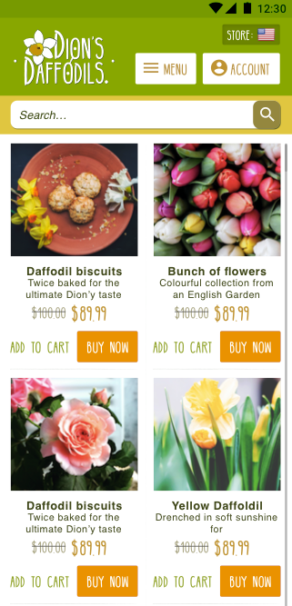

project_path: /web/fundamentals/_project.yaml
book_path: /web/fundamentals/_book.yaml

{# wf_updated_on: 2017-08-04 #}
{# wf_published_on: 2017-06-28 #}
{# wf_blink_components: Blink>Payments #}

# Payment Request UX considerations {: .page-title }


The 
[Payment Request API](/web/fundamentals/payments/) 
was fundamentally built for users, helping
them get through burdensome checkout flows on mobile efficiently,
while providing merchants with a higher conversion rate.

In a study conducted by Google, we found that <strong>65.9% of users
stopped partway through purchase on mobile devices</strong>. Of those
asked in the study as to why they abandoned the purchase, the most
common responses ranged from the form being difficult to read,
difficult to understand or was way too long.

To solve these challenges the Payment Request API creates a simpler
flow. 
The API will pre-populate payment details for the user allowing
users to buy items with a simple tap or click.

One way to think about the Payment Request API is that it is
essentially a way for a browser to manage a user's payment methods,
making it easier to make payments on the web.

## The two view states 
In the Chrome UI, the Payment Request API has
two states: the <em>'receipt'</em> view and the edit view. The
<em>'receipt'</em> view (shown at left, below) partially obscuring the
merchant's site. This allows the user to take a quick glance at their
payment details. Then there is the edit view (shown at right, below),
which expands full screen and allows the user to edit each section.
Once the user taps or clicks a call to action from the
<em>'receipt'</em> view they will enter the edit mode and will be
forced to continue there.

  <figure>
    
  </figure>

  <figure>
    
  </figure>

## Basic checkout flow

In this example a user navigates to a site, selects an item and goes
through the payment request checkout flow. Once a user clicks buy, the
browser takes over. If the user has previously entered details such as
their preferred payment method, these will appear as the defaults.
Otherwise the user can add these. Depending on your particular use
case you can have defaults auto selected or force the user to fill
them in.

<video controls autoplay loop muted poster="images/basic-intro-poster.png">
  <source src="videos/basic-intro.webm" type="video/webm; codecs=vp8">
  <source src="videos/basic-intro.mp4" type="video/mp4; codecs=h264">
</video>

### Checkout guidance

Don't block checkout by requiring signup. One of the core benefits of 
having users already signed in is that you already have payment methods 
stored for them. Since Payment Request provides easy access to the users 
payment details, including email and
phone number, you can simply request these details and avoid requiring
users to sign in.

### Gracefully handle the UX flow 

Chrome handles some aspects of the processing, cancellation, and 
success but as a best practice, you
should signal to the user what the status of their checkout is. For
example:

* By Informing the user if their payment has been aborted.

* Prepare the user for the checkout process by providing UI that 
will tell them that you will be asking for payments. 

* Keep the user informed of progress and state of the checkout is 
by using steppers. 

* Signaling to the user that payment was complete and successful.

  <figure>
    
    <figcaption>Make sure error messages are clear.</figcaption>
  </figure>

  <figure>
    
    <figcaption>This stepper shows the progress from Cart to Address 
    	& Payment to Confirm.</figcaption>
  </figure>

## What is customisable 
Some of the UI is customisable with some exceptions such as the 
colour of button and their respective text labels.

Note: This example is for the Chrome browser. Other browsers 
may contain different UI elements as well, or even labels for 
buttons such as ‘Pay’ and ‘Cancel’.

Another consideration is that devices come in many sizes, so 
space maybe at a premium, so keep the labels short and focused 
on brand recognition. 

  <figure>
    
  </figure>

1. The icon is taken from the favicon. Favicon is hi-res and 
	recognizable for the store. For best practice, provide multiple 
	icons at different sizes to allow the browser to pick the most 
	appropriate size. You can [learn more here](/web/fundamentals/payments/deep-dive-into-payment-request). 

2. This is taken from the <code>&#60;title&#62;</code> tag. 
	This is your strongest chance to provide a human-readable 
	indication of what the user is buying and who they're 
	buying from.

3. This is the domain/URL.

4. This text label can be modified via the Payments 
	Request API.

5. The price and currency is taken from the total.

6. You can select a heading from a preset list: Shipping, 
	Pickup OR Delivery.

## General UX advice 

### Eliminate user steps

Try to limit the amount of work it takes for a user to 
make a purchase. A simple UI with clear text labels will 
give the users a perceived increase in speed. For example 
using a <em>"Buy Now"</em> button allows the user to make 
a simple one tap purchase without forcing them to create 
an account or populate a shopping cart. The faster a user 
can checkout, the more satisfied they become. This means 
the chance of them completing the process greatly 
increases and as does the chance of repeat business. 
Allowing users to purchase an item with a <em>"Buy now"</em> 
or <em>"Express Checkout"</em> button (versus <em>"Adding 
to cart"</em>), will improve their perceived speed, 
thereby making your checkout a success. 

  <figure>
    
    <figcaption>
    	Add <em>‘Buy now’</em> buttons where possible to 
    	create quick checkout experience
	</figcaption>
  </figure>

### UI affordance 
Users in the real world often wrap up their mobile 
devices with sleeves or bumpers. Think of ergonomics 
and considerations - bumpers can prevent users from 
hitting the touch targets if they are too close to 
the screen giving them the impression that they are 
tapping buttons when they are not therefore presenting 
the illusion that the site and app is slower than 
it actually is. 

#### Touch targets
Make sure the touch targets extend beyond the visual 
bounds of an element. For example, a `24 x 24` pixel 
icon should have a `48 x 48` pixel touch target. .

A `48 x 48 px` touch target is roughly 9mm and the 
recommended target is between 7-10mm. You may start 
using the image’s own dimensions as the target target 
if the image is larger than `48 x 48 px`.  It may be 
appropriate to use even larger touch targets to 
accommodate users with special needs such as those 
with motor disability skills.

  <figure>
    
    <figcaption>
    	By giving a minimum of 48px touch target you 
    	can help users tap or click smaller UI elements.  
	</figcaption>
  </figure>

### User feedback mechanisms
As well as providing confirmation to users that a 
purchase was successful, provide feedback to reassure 
them of the status of their experience. One example of 
feedback is a 
["Snackbar" UI](https://material.io/guidelines/components/snackbars-toasts.html), 
that appears once an action is 
completed. The average reader can read and comprehend 
between 200-400 words per minute. Depending on the 
length of the string make sure you leave the UI on 
screen for long enough for the user to read, 
roughly 3 seconds for five word sentence.

<video class="attempt-left" controls autoplay loop muted 
poster="images/basic-intro-poster.png">
  <source src="videos/components_snackbar.webm" 
  type="video/webm; codecs=vp8">
  <source src="videos/components_snackbar.mp4" 
  type="video/mp4; codecs=h264">
</video>

### Performance 
In a different study conducted at Google, we found 
70% of users dropped from a checkout due to the first 
dialogs not rendering fast enough. Make sure you test 
for poor network conditions in order to improve your 
checkout flow by using [lighthouse](/web/tools/lighthouse) 
and [DevTools](/web/tools/chrome-devtools/network-performance/) 
network emulation. 

### Language 
Improved language in the call to action buttons help users 
understand what actions were being taken in the flow. It is 
important that they are consistent in the checkout flow. 
Make sure you use the labels that make the most sense. 

  <figure>
    
  </figure>

  <figure>
    
  </figure>

Depending on the context the label <em>"Pickup"</em> may be more 
appropriate than the label <em>"Delivery"</em>.

### Provide fall back options to the user
Don't block a purchase on Payment Request. If isn’t 
supported by the browser, or fails, seamlessly 
fallback to the default checkout rather than an 
error message when the Payment Request API is not available. 

It is a good idea to create a user flow of all 
of the possible ways a user can get to the checkout forms. 
Common entry points that you need to design for;

* The user is immediately directed to checkout.

* The user starts at the home page, views their cart, 
and is directed to checkout.
* The user starts at the home page, looks at an item, 
and is directed to buy now.
* The user starts at the home page, clicks to add an 
item to their cart, and is directed to checkout.
* The user starts at the item and is directed to the checkout.

  <figure>
    
  <figcaption>
	This is an illustrative example of the above, 
	different paths a user takes when checking out
  </figcaption>
  </figure>

## Example flows 
### Guest checkout
In this example we allow the user to checkout, then 
email them an ID code and receipt. Alternatively 
you can offer a button that calls `window.print();` 
and gives the user a PDF.

<video controls autoplay loop muted poster="images/basic-intro-poster.png">
  <source src="videos/basic-intro.webm" type="video/webm; codecs=vp8">
  <source src="videos/basic-intro.mp4" type="video/mp4; codecs=h264">
</video>

### Buy now UI
In this example every item has a "Buy now". When a user taps or 
clicks "Buy now" they begin the checkout process, first by 
asking for specific delivery dates and a custom message. 
The next step in the process launches the Payment Request 
API which is followed by a confirmation page. 

  <figure>
    
    <figcaption>
    	Add <em>"Buy now"</em> buttons where possible to 
    	create quick checkout experience
	</figcaption>
  </figure>

### Delivery 
Although it is technically possible to auto-select the user's 
default address it is best practice to allow the user to 
select their preferred address themselves. This will allow
the merchant verify that the address is correct and 
deliverable. By allowing the user to change the address, 
you can update and alter the shipping options. For example 
if the user is local you can offer local shipping rates, 
but if the user selects an international address, you can 
alter the shipping options for international rates.

By auto selecting the address you can create needless 
friction. For example, if the default address is somewhere 
you cannot deliver or ship to, it will only be picked up 
once the user has triggered the actual pay action. 
Avoid creating a jarring experience at all costs as this 
can cause a user to abandon the purchase altogether. 

### Shipping options
Give the user delivery options according to actual dates. 
Contextual data such as the date will give the user 
context and further reassurance of when their items 
will be delivered.

  <figure>
    
    <figcaption>
    	Give dates to help a user plan and customize 
    	their experience.
	</figcaption>
  </figure>

### Adding additional information 
There are many use cases where the merchant may require 
the user to add additional information before or after 
the transaction. Such as loyalty cards numbers or 
discount coupons. 

### Gift cards
Gift cards do not work directly with the Payment 
Request API so we recommend adding a field that allows
the user to enter their card code beforehand. Once they 
add the gift card if there is still more to pay you can 
launch the Payment Request API. The illustration below
demonstrates this flow. 

  <figure>
    
  </figure>

## Customizing the Payment Request API flow

### Before calling Payment request API
The Payment Request API doesn’t deal with vouchers and 
loyalty codes directly. Instead, give the user the 
ability to add any codes or loyalty card schemes before 
you launch the Payment Request API. In practice, this 
will mean that when a user first clicks <em>"Buy now"</em>, 
they will be taken to a checkout page where they can 
add a coupon or loyalty card number first. 
Below is an example of this.

  <figure>
    
    <figcaption>
    	In this example <a href="https://woocommerce.paymentrequest.show/">
    	WooCommerce</a> the user adds any coupon code before they 
    	complete the transaction. (The <a 
    	href="https://woocommerce.paymentrequest.show/">
    	demo website</a> works only with a fake credit 
    	card number "4242 4242 4242 4242.")
	</figcaption>
  </figure>

If a merchant's legal team requires a legal text box such as 
a Terms of Service (TOS) to be displayed during the checkout 
process we recommend that this appears before the Payment 
Request API flow begins. Ideally you would want to minimize 
the steps and actions taken by the user by keeping the TOS 
next to the buy button or a link. However there are some 
cases where this is not possible, so one solution is after 
the user clicks the "Buy Now" button, provide an additional 
step in the processes asking for acceptance of the TOS. 
The next step is to launch the PR Payment Request flow.

### Midway through the Payment Request 
You can offer extra UI elements after the payment options 
have been selected. So instead of showing the API's default 
spinner, you can show your own, such as in the next example. 
Then once you have processed the payment details, you can 
offer up any UI you choose. 

So in this visual example: 
* The user taps "Buy now" and the merchant calls 
the function show();

* Then the merchant either processes the payment with 
the Payment Request API OR their own UI.  

* If all conditions are met the merchant serves up a 
confirmation page. 

You can learn more about this [technique here](/web/fundamentals/payments/deep-dive-into-payment-request#completing_the_transaction)

  <figure>
    
  </figure>

### After payment / purchase has been processed.
There may be occasions where the merchant give 
the user the opportunity to add non-standard information 
from the user such as delivery instructions or perhaps 
some feedback on the shopping experience. This can not be 
done directly within the Payment Request API, however 
it is possible to show a UI element such as a `textfield` 
if the payment has been successful.

  <figure>
    
  </figure>

Code example: 

	request.show()
	.then(function(paymentResponse) {
	    // Process payment here.
	    // Close the UI:
	    paymentResponse.complete('success').then(function() {
	        // Request additional shipping address details.
	        const additionalDetailsContainer = document.getElementById('additional-details-container');
	        additionalDetailsContainer.style.display = 'block';
	        additionalDetailsContainer.focus();
	    }).catch(function(error) {
	        // Handle error.
	    });
	})
	.catch(function(error) {
	    // Handle error.
	});

You can find code for more unique use cases 
[here](https://github.com/w3c/payment-request-info/wiki/
CodeExamples#show-additional-user-interface-after-successful-payment).

## Existing users 
For existing customers you can still use the Payment 
Request API, but you may need to adjust the experience 
and present new UI to your existing signed-in customers. 
For example you may introduce the Payment Request API with 
an "Express pay" button, a "Pay with new card" button 
or a "Ship to new address" button. 

The goal is to show that the user can quickly buy things on 
the merchant's site without any fuss. The Payment Request 
API is quick and efficient but existing users will need some 
education with this new payment flow so focus on introducing 
the new UX patterns with text labels and UI that express 
speed and efficiency. 

## Code demos and browser support
You can experiment with the various features and UX patterns 
with this [demo](https://paymentrequest.show/demo/). 
Payment Request API is currently supported by;

* Chrome 53 and above on Android 
* Chrome 61 and above on Desktop & iOS
* Edge 15 and above on Desktop

You can track the latest status for all other browsers here 
on [caniuse.com](https://caniuse.com/#search=payments).

## Stickersheet

To create your own flows, you can download the Payment Request API sticker sheet from [our Github Repo](https://goo.gl/daxhRa). 

