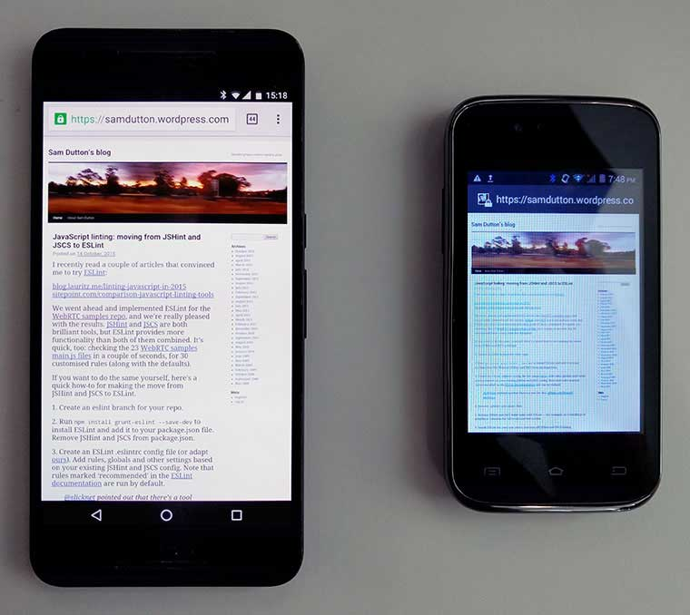

project_path: /web/fundamentals/_project.yaml
book_path: /web/fundamentals/_book.yaml
description: Before gathering performance metrics for a site audit, there are several checks you can do to identify easy fixes and areas for focus. Some of these checks are relatively subjective, but can identify problems that affect perceived performance.

{# wf_updated_on: 2018-08-03 #}
{# wf_published_on: 2018-08-03 #}
{# wf_blink_components: N/A #}

# Prework {: .page-title }



Before gathering performance metrics for a site audit, there are several checks you can do to
identify easy fixes and areas for focus.

## Sanity check: architecture and code

[Pay down technical debt!](http://wiki.c2.com/?TechnicalDebt){: .external}

Wherever possible fix simple bugs and remove unneeded assets and code <strong>before</strong>
measuring performance — but make sure to keep a before-and-after record of problems and fixes. These
improvements can still be a part of your audit work.

**Site architecture and assets**  Can anything easily be removed from the code repo and from the
site, such as unused legacy pages, content or other assets? Check for orphaned pages, redundant
templates, unused images and [unused code and
libraries](/web/updates/2017/04/devtools-release-notes#coverage).

**Runtime errors**  Check for errors reported in the browser console. There shouldn't be any :).

**Linting**  Are there errors in your HTML, CSS or JavaScript code? Building linting into your
workflow can help maintain code quality and avoid regressions. We recommend
[HTMLHint](http://htmlhint.com/){: .external}, [StyleLint](https://stylelint.io){: .external} and
[ESLint](http://eslint.org/){: .external}, which can be used as code editor plugins, or run from
the command line within workflow processes and continuous integration tools such as
[Travis](https://travis-ci.org/).

**Broken links and images**  There are many tools to test for broken links at build time and
runtime, including Chrome Extensions
([this one](https://chrome.google.com/webstore/detail/check-my-links/ojkcdipcgfaekbeaelaapakgnjflfglf){: .external}
is good) and Node tools such as
[Broken Link Checker](https://github.com/stevenvachon/broken-link-checker){: .external}.

**Plugins**  Plugins such as Flash and Silverlight can be a security risk, support for them
[has been deprecated](https://blog.chromium.org/2014/11/the-final-countdown-for-npapi.html){: .external},
and they don't work on mobile. [Use Lighthouse to check for
plugins](/web/tools/lighthouse/audits/plugins).

## Test with a variety of devices and contexts

Nothing beats getting real people to test your site with real devices, multiple browsers and
different connectivity contexts.

Some of these checks are relatively subjective, but they can identify problems that affect perceived
performance. Broken links, for example, waste time and feel 'unresponsive'. Illegible text is slow
to read.

**Cross-device testing**  Try different viewport and window sizes. Use at least one mobile and
one desktop device. If possible, try your site on a low-spec mobile device with a small screen. Is
the text readable? Are any images broken? Can you zoom? Are touch targets large enough? Is it slow?
Are any features unresponsive? Screenshot or video the results.

**Cross-platform testing**  What platforms do you target? You need to test on the browsers and
operating systems your users use now and in the future.

**Connectivity**  [Test on multiple target
network types](/web/fundamentals/performance/poor-connectivity/#testing): connected, wifi and
cellular. You can use browser tools to [emulate a variety of network
conditions](/web/tools/chrome-devtools/network-performance/network-conditions).

**Devices**  Make sure to try out your site on the same devices as your users. The following
photo shows the same page on two different phones.

<figure>    </figure>

On the larger screen, text is small but readable. On the smaller screen the browser renders the
layout correctly, but the text is unreadable, even when zoomed in. The display is blurry and has a
'color cast' — white doesn't look white — making content less legible.

Simple findings such as this can be far more important than obscure performance data!

## Try out UI and UX

**Accessibility, usability and readability**  To ensure that your site's content and
functionality are accessible to everyone, you need to understand the diversity of your users.
[Lighthouse](/web/tools/lighthouse/) and other tools test for specific
accessibility problems, but nothing beats real-world testing. Try reading, navigating and entering
data in a variety of scenarios: for example, outdoors in sunlight or on a train. Ask a range of
friends, family and colleagues to try out your site. Try consuming content via a screen reader such
as [VoiceOver](https://www.youtube.com/watch?v=5R-6WvAihms&list=PLNYkxOF6rcICWx0C9LVWWVqvHlYJyqw7g&index=6){: .external}
on Mac or
[NVDA](https://www.youtube.com/watch?v=Jao3s_CwdRU&list=PLNYkxOF6rcICWx0C9LVWWVqvHlYJyqw7g&index=4){: .external}
on Windows.

You can find out more about implementing and reviewing accessibility in the [Udacity course on
Accessibility](/web/fundamentals/accessibility/) and the Web
Fundamentals article [How To Do an Accessibility
Review](/web/fundamentals/accessibility/how-to-review).

Keep a record of your accessibility audit. Chances are that you'll be able to make simple
improvements that are good for all your users.

**Fundamental UI and UX problems**  Interactions that don't work how they should, overflowing
elements on smaller windows and viewports, too-small tap targets, unreadable content, janky
scrolling... Open multiple pages on the site, try out navigation and all core functionality. Keep a
record.

**Images, audio and video**  Test for overflowing content, [incorrect aspect ratio](https://chrome.google.com/webstore/detail/image-checker/bacnicogfgpigmmenfiplfiofpkocpii){: .external},
poor cropping, and quality problems.

**Subjective UI tests** 
These may not all be relevant, but simple changes can make refactoring easier:

* Is 'What can I do here? immediately clear when you open the site?
* Are you drawn to consume content and follow links?
* Are there visual hierarchies or pathways — or does everything have the same visual weight?
* Is the layout cluttered?
* Are there too many fonts?
* Are there images or other content that could be removed?
* Content design is as important as interface design. Is the text and image content on your site
appropriate for mobile and desktop contexts? Can anything be eliminated?
[Write for mobile](/web/fundamentals/design-and-ui/responsive/content).
