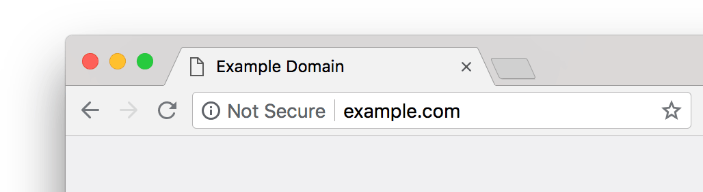
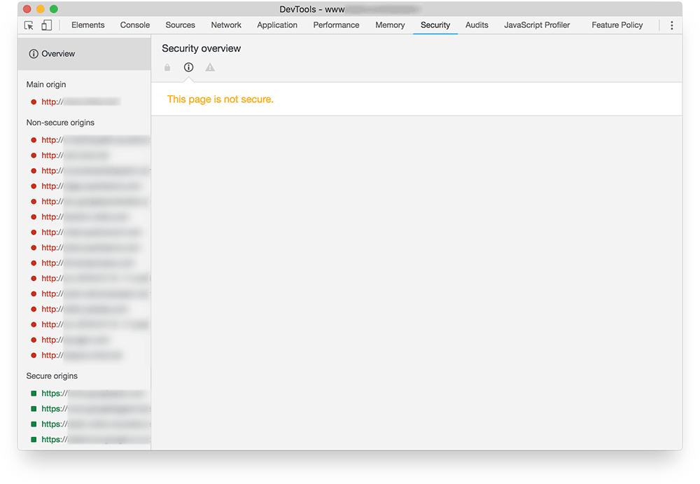

project_path: /web/fundamentals/_project.yaml
book_path: /web/fundamentals/_book.yaml
description: You won't be able to build a PWA without HTTPS. Serving your site over HTTPS is fundamental for security, and many APIs won't work without it. If you need to justify implementation costs, find out why HTTPS matters.

{# wf_updated_on: 2018-08-03 #}
{# wf_published_on: 2018-08-03 #}
{# wf_blink_components: N/A #}

# Check site security {: .page-title }



You won't be able to build a PWA without HTTPS.

Serving your site over HTTPS is fundamental for security, and many APIs won't work without it. If
you need to justify implementation costs, find out [why HTTPS
matters](/web/fundamentals/security/encrypt-in-transit/why-https).

If a site uses HTTP for any assets, users will be warned in the URL bar. Chrome displays a warning
like the following.

<figure>
  
  <figcaption><em>From Chrome 68, the address bar warns if not all assets use HTTPS</em></figcaption>
</figure>

HTTPS should be implemented everywhere — not just, for example, on login or checkout pages. Any
insecure page or asset can be a vector for attack, making your site a liability for your users and
your business.

Site security is easy to check with [Chrome DevTools Security
panel](/web/tools/chrome-devtools/security). Keep a record of any
problems.

The site in the following example is not secure, since some assets are served over HTTP.

<figure>
  
<figcaption><em>Chrome DevTools Security panel</em></figcaption> </figure>  
