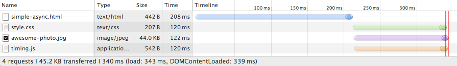
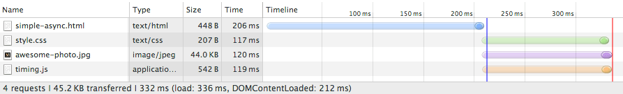
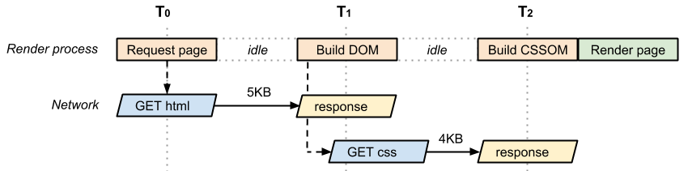
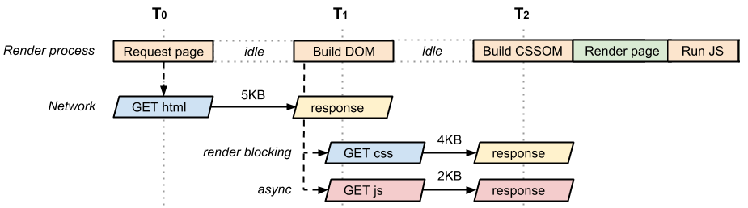
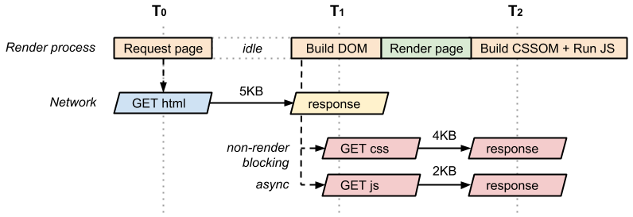

project_path: /web/fundamentals/_project.yaml
book_path: /web/fundamentals/_book.yaml
description: Learn to identify and resolve critical rendering path performance bottlenecks.

{# wf_updated_on: 2017-07-24 #}
{# wf_published_on: 2014-03-31 #}

# Analyzing Critical Rendering Path Performance {: .page-title }



Identifying and resolving critical rendering path performance bottlenecks 
requires good knowledge of the common pitfalls. Let's take a hands-on tour 
and extract common performance patterns that will help you optimize your 
pages.

Optimizing the critical rendering path allows the browser to paint the page as quickly as possible: faster pages translate into higher engagement, more pages viewed, and [improved conversion](https://www.google.com/think/multiscreen/success.html). To minimize the amount of time a visitor spends viewing a blank screen, we need to optimize which resources are loaded and in which order.

To help illustrate this process, let's start with the simplest possible case and incrementally build up our page to include additional resources, styles, and application logic. In the process, we'll optimize each case; we'll also see where things can go wrong.

So far we've focused exclusively on what happens in the browser after the resource (CSS, JS, or HTML file) is available to process. We've ignored the time it takes to fetch the resource either from cache or from the network. We'll assume the following:

* A network roundtrip (propagation latency) to the server costs 100ms.
* Server response time is 100ms for the HTML document and 10ms for all other files.

## The hello world experience

<pre class="prettyprint">

</pre>

[Try it](https://googlesamples.github.io/web-fundamentals/fundamentals/performance/critical-rendering-path/basic_dom_nostyle.html){: target="_blank" .external }

We'll start with basic HTML markup and a single image; no CSS or JavaScript. Let's open up our Network timeline in Chrome DevTools and inspect the resulting resource waterfall:

Note: Although this doc uses DevTools to illustrate CRP concepts, DevTools is
currently not well-suited for CRP analysis. See [What about
DevTools?](measure-crp#devtools) for more information.

As expected, the HTML file took approximately 200ms to download. Note that the transparent portion of the blue line represents the length of time that the browser waits on the network without receiving any response bytes whereas the solid portion shows the time to finish the download after the first response bytes have been received. The HTML download is tiny (<4K), so all we need is a single roundtrip to fetch the full file. As a result, the HTML document takes approximately 200ms to fetch, with half the time spent waiting on the network and the other half waiting on the server response.

When the HTML content becomes available, the browser parses the bytes, converts them into tokens, and builds the DOM tree. Notice that DevTools conveniently reports the time for the DOMContentLoaded event at the bottom (216ms), which also corresponds to the blue vertical line. The gap between the end of the HTML download and the blue vertical line (DOMContentLoaded) is the time it takes the browser to build the DOM tree&mdash;in this case, just a few milliseconds.

Notice that our "awesome photo" did not block the `domContentLoaded` event. Turns out, we can construct the render tree and even paint the page without waiting for each asset on the page: **not all resources are critical to deliver the fast first paint**. In fact, when we talk about the critical rendering path we are typically talking about the HTML markup, CSS, and JavaScript. Images do not block the initial render of the page&mdash;although we should also try to get the images painted as soon as possible.

That said, the `load` event (also known as `onload`), is blocked on the image: DevTools reports the `onload` event at 335ms. Recall that the `onload` event marks the point at which **all resources** that the page requires have been downloaded and processed; at this point, the loading spinner can stop spinning in the browser (the red vertical line in the waterfall).

## Adding JavaScript and CSS into the mix

Our "Hello World experience" page seems simple but a lot goes on under the hood. In practice we'll need more than just the HTML: chances are, we'll have a CSS stylesheet and one or more scripts to add some interactivity to our page. Let's add both to the mix and see what happens:

<pre class="prettyprint">

</pre>

[Try it](https://googlesamples.github.io/web-fundamentals/fundamentals/performance/critical-rendering-path/measure_crp_timing.html){: target="_blank" .external }

_Before adding JavaScript and CSS:_

_With JavaScript and CSS:_

Adding external CSS and JavaScript files adds two extra requests to our waterfall, all of which the browser dispatches at about the same time. However, **note that there is now a much smaller timing difference between the `domContentLoaded` and `onload` events.**

What happened?

* Unlike our plain HTML example, we also need to fetch and parse the CSS file to construct the CSSOM, and we need both the DOM and CSSOM to build the render tree.
* Because the page also contains a parser blocking JavaScript file, the `domContentLoaded` event is blocked until the CSS file is downloaded and parsed: because the JavaScript might query the CSSOM, we must block the CSS file until it downloads before we can execute JavaScript.

**What if we replace our external script with an inline script?** Even if the script is inlined directly into the page, the browser can't execute it until the CSSOM is constructed. In short, inlined JavaScript is also parser blocking.

That said, despite blocking on CSS, does inlining the script make the page render faster? Let's try it and see what happens.

_External JavaScript:_

_Inlined JavaScript:_

We are making one less request, but both our `onload` and `domContentLoaded` times are effectively the same. Why? Well, we know that it doesn't matter if the JavaScript is inlined or external, because as soon as the browser hits the script tag it blocks and waits until the CSSOM is constructed. Further, in our first example, the browser downloads both CSS and JavaScript in parallel and they finish downloading at about the same time. In this instance, inlining the JavaScript code doesn't help us much. But there are several strategies that can make our page render faster.

First, recall that all inline scripts are parser blocking, but for external scripts we can add the "async" keyword to unblock the parser. Let's undo our inlining and give that a try:

<pre class="prettyprint">

</pre>

[Try it](https://googlesamples.github.io/web-fundamentals/fundamentals/performance/critical-rendering-path/measure_crp_async.html){: target="_blank" .external }

_Parser-blocking (external) JavaScript:_

_Async (external) JavaScript:_

Much better! The `domContentLoaded` event fires shortly after the HTML is parsed; the browser knows not to block on JavaScript and since there are no other parser blocking scripts the CSSOM construction can also proceed in parallel.

Alternatively, we could have inlined both the CSS and JavaScript:

<pre class="prettyprint">

</pre>

[Try it](https://googlesamples.github.io/web-fundamentals/fundamentals/performance/critical-rendering-path/measure_crp_inlined.html){: target="_blank" .external }

Notice that the `domContentLoaded` time is effectively the same as in the previous example; instead of marking our JavaScript as async, we've inlined both the CSS and JS into the page itself. This makes our HTML page much larger, but the upside is that the browser doesn't have to wait to fetch any external resources; everything is right there in the page.

As you can see, even with a very simple page, optimizing the critical rendering path is a non-trivial exercise: we need to understand the dependency graph between different resources, we need to identify which resources are "critical," and we must choose among different strategies for how to include those resources on the page. There is no one solution to this problem; each page is different. You need to follow a similar process on your own to figure out the optimal strategy.

That said, let's see if we can step back and identify some general performance patterns.

## Performance patterns

The simplest possible page consists of just the HTML markup; no CSS, no JavaScript, or other types of resources. To render this page the browser has to initiate the request, wait for the HTML document to arrive, parse it, build the DOM, and then finally render it on the screen:

<pre class="prettyprint">

</pre>

[Try it](https://googlesamples.github.io/web-fundamentals/fundamentals/performance/critical-rendering-path/basic_dom_nostyle.html){: target="_blank" .external }

**The time between T0 and T1 captures the network and server processing times.** In the best case (if the HTML file is small), just one network roundtrip fetches the entire document. Due to how the TCP transports protocols work, larger files may require more roundtrips. **As a result, in the best case the above page has a one roundtrip (minimum) critical rendering path.**

Now, let's consider the same page but with an external CSS file:

<pre class="prettyprint">

</pre>

[Try it](https://googlesamples.github.io/web-fundamentals/fundamentals/performance/critical-rendering-path/analysis_with_css.html){: target="_blank" .external }

Once again, we incur a network roundtrip to fetch the HTML document, and then the retrieved markup tells us that we also need the CSS file; this means that the browser has to go back to the server and get the CSS before it can render the page on the screen. **As a result, this page incurs a minimum of two roundtrips before it can be displayed.** Once again, the CSS file may take multiple roundtrips, hence the emphasis on "minimum".

Let's define the vocabulary we use to describe the critical rendering path:

* **Critical Resource:** Resource that could block initial rendering of the page.
* **Critical Path Length:** Number of roundtrips, or the total time required to fetch all of the critical resources.
* **Critical Bytes:** Total number of bytes required to get to first render of the page, which is the sum of the transfer filesizes of all critical resources.
Our first example, with a single HTML page, contained a single critical resource (the HTML document); the critical path length was also equal to one network roundtrip (assuming file was small), and the total critical bytes was just the transfer size of the HTML document itself.

Now let's compare that to the critical path characteristics of the HTML + CSS example above:

* **2** critical resources
* **2** or more roundtrips for the minimum critical path length
* **9** KB of critical bytes

We need both the HTML and CSS to construct the render tree. As a result, both HTML and CSS are critical resources: the CSS is fetched only after the browser gets the HTML document, hence the critical path length is at minimum two roundtrips. Both resources add up to a total of 9KB of critical bytes.

Now let's add an extra JavaScript file into the mix.

<pre class="prettyprint">

</pre>

[Try it](https://googlesamples.github.io/web-fundamentals/fundamentals/performance/critical-rendering-path/analysis_with_css_js.html){: target="_blank" .external }

We added `app.js`, which is both an external JavaScript asset on the page and a parser blocking (that is, critical) resource. Worse, in order to execute the JavaScript file we have to block and wait for CSSOM; recall that JavaScript can query the CSSOM and hence the browser pauses until `style.css` is downloaded and CSSOM is constructed.

That said, in practice if we look at this page's "network waterfall," you'll see that both the CSS and JavaScript requests are initiated at about the same time; the browser gets the HTML, discovers both resources, and initiates both requests. As a result, the above page has the following critical path characteristics:

* **3** critical resources
* **2** or more roundtrips for the minimum critical path length
* **11** KB of critical bytes

We now have three critical resources that add up to 11KB of critical bytes, but our critical path length is still two roundtrips because we can transfer the CSS and JavaScript in parallel. **Figuring out the characteristics of your critical rendering path means being able to identify the critical resources and also understanding how the browser will schedule their fetches.** Let's continue with our example.

After chatting with our site developers, we realize that the JavaScript we included on our page doesn't need to be blocking; we have some analytics and other code in there that doesn't need to block the rendering of our page. With that knowledge, we can add the "async" attribute to the script tag to unblock the parser:

<pre class="prettyprint">

</pre>

[Try it](https://googlesamples.github.io/web-fundamentals/fundamentals/performance/critical-rendering-path/analysis_with_css_js_async.html){: target="_blank" .external }

An asynchronous script has several advantages:

* The script is no longer parser blocking and is not part of the critical rendering path.
* Because there are no other critical scripts, the CSS doesn't need to block the `domContentLoaded` event.
* The sooner the `domContentLoaded` event fires, the sooner other application logic can begin executing.

As a result, our optimized page is now back to two critical resources (HTML and CSS), with a minimum critical path length of two roundtrips, and a total of 9KB of critical bytes.

Finally, if the CSS stylesheet were only needed for print, how would that look?

<pre class="prettyprint">

</pre>

[Try it](https://googlesamples.github.io/web-fundamentals/fundamentals/performance/critical-rendering-path/analysis_with_css_nb_js_async.html){: target="_blank" .external }

Because the style.css resource is only used for print, the browser doesn't need to block on it to render the page. Hence, as soon as DOM construction is complete, the browser has enough information to render the page. As a result, this page has only a single critical resource (the HTML document), and the minimum critical rendering path length is one roundtrip.

<a href="optimizing-critical-rendering-path" class="gc-analytics-event"
    data-category="CRP" data-label="Next / Optimizing CRP">
  <button>Next Up: Optimizing the Critical Rendering Path</button>
</a>
