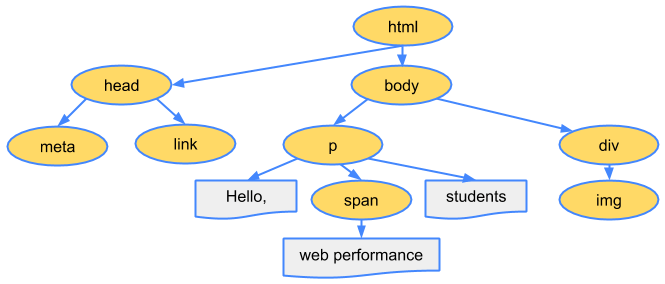
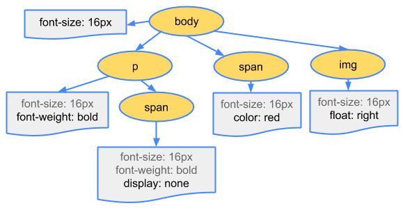
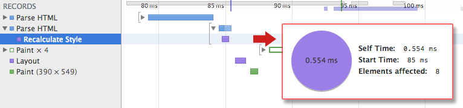

project_path: /web/fundamentals/_project.yaml
book_path: /web/fundamentals/_book.yaml
description: Learn how the browser constructs the DOM and CSSOM trees.

{# wf_updated_on: 2014-09-11 #}
{# wf_published_on: 2014-03-31 #}

# Constructing the Object Model {: .page-title }



Before the browser can render the page, it needs to construct the DOM and CSSOM trees. As a result, we need to ensure that we deliver both the HTML and CSS to the browser as quickly as possible.

### TL;DR {: .hide-from-toc }
- Bytes → characters → tokens → nodes → object model.
- HTML markup is transformed into a Document Object Model (DOM); CSS markup is transformed into a CSS Object Model (CSSOM).
- DOM and CSSOM are independent data structures.
- Chrome DevTools Timeline allows us to capture and inspect the construction and processing costs of DOM and CSSOM.

## Document Object Model (DOM)

<pre class="prettyprint">

</pre>

[Try it](https://googlesamples.github.io/web-fundamentals/fundamentals/performance/critical-rendering-path/basic_dom.html){: target="_blank" .external }

Let’s start with the simplest possible case: a plain HTML page with some text and a single image. How does the browser process this page?

1. **Conversion:** The browser reads the raw bytes of HTML off the disk or network, and translates them to individual characters based on specified encoding of the file (for example, UTF-8).
1. **Tokenizing:** The browser converts strings of characters into distinct tokens&mdash;as specified by the [W3C HTML5 standard](http://www.w3.org/TR/html5/){: .external }; for example, "&lt;html&gt;", "&lt;body&gt;"&mdash;and other strings within angle brackets. Each token has a special meaning and its own set of rules.
1. **Lexing:** The emitted tokens are converted into "objects," which define their properties and rules.
1. **DOM construction:** Finally, because the HTML markup defines relationships between different tags (some tags are contained within other tags) the created objects are linked in a tree data structure that also captures the parent-child relationships defined in the original markup: the _HTML_ object is a parent of the _body_ object, the _body_ is a parent of the _paragraph_ object, and so on.

**The final output of this entire process is the Document Object Model (DOM) of our simple page, which the browser uses for all further processing of the page.**

Every time the browser processes HTML markup, it goes through all of the steps above: convert bytes to characters, identify tokens, convert tokens to nodes, and build the DOM tree. This entire process can take some time, especially if we have a large amount of HTML to process.

Note: We're assuming that you have basic familiarity with Chrome DevTools - that is, you know how to capture a network waterfall or record a timeline. If you need a quick refresher, check out the <a href='/web/tools/chrome-devtools/'>Chrome DevTools documentation</a>; if you're new to DevTools, we recommend that you take the Codeschool <a href='http://discover-devtools.codeschool.com/'>Discover DevTools</a> course.

If you open up Chrome DevTools and record a timeline while the page is loaded, you can see the actual time taken to perform this step&mdash;in the example above, it took us ~5ms to convert a chunk of HTML into a DOM tree. For a larger page, this process could take significantly longer. When creating smooth animations, this can easily become a bottleneck if the browser has to process large amounts of HTML.

The DOM tree captures the properties and relationships of the document markup, but it doesn't tell us how the element will look when rendered. That’s the responsibility of the CSSOM.

## CSS Object Model (CSSOM)

While the browser was constructing the DOM of our simple page, it encountered a link tag in the head section of the document referencing an external CSS stylesheet: style.css. Anticipating that it needs this resource to render the page, it immediately dispatches a request for this resource, which comes back with the following content:

<pre class="prettyprint">

</pre>

We could have declared our styles directly within the HTML markup (inline), but keeping our CSS independent of HTML allows us to treat content and design as separate concerns: designers can work on CSS, developers can focus on HTML, and so on.

As with HTML, we need to convert the received CSS rules into something that the browser can understand and work with. Hence, we repeat the HTML process, but for CSS instead of HTML:

The CSS bytes are converted into characters, then tokens, then nodes, and finally they are linked into a tree structure known as the "CSS Object Model" (CSSOM):

Why does the CSSOM have a tree structure? When computing the final set of styles for any object on the page, the browser starts with the most general rule applicable to that node (for example, if it is a child of a body element, then all body styles apply) and then recursively refines the computed styles by applying more specific rules; that is, the rules "cascade down."

To make it more concrete, consider the CSSOM tree above. Any text contained within the _span_ tag that is placed within the body element, has a font size of 16 pixels and has red text&mdash;the font-size directive cascades down from the body to the span. However, if a span tag is child of a paragraph (p) tag, then its contents are not displayed.

Also, note that the above tree is not the complete CSSOM tree and only shows the styles we decided to override in our stylesheet. Every browser provides a default set of styles also known as "user agent styles"&mdash;that’s what we see when we don’t provide any of our own&mdash;and our styles simply override these defaults (for example, [default IE styles](http://www.iecss.com/){: .external }).

To find out how long the CSS processing takes you can record a timeline in DevTools and look for "Recalculate Style" event: unlike DOM parsing, the timeline doesn’t show a separate "Parse CSS" entry, and instead captures parsing and CSSOM tree construction, plus the recursive calculation of computed styles under this one event.

Our trivial stylesheet takes ~0.6ms to process and affects eight elements on the page&mdash;not much, but once again, not free. However, where did the eight elements come from? The CSSOM and DOM are independent data structures! Turns out, the browser is hiding an important step. Next, lets talk about the [render tree](/web/fundamentals/performance/critical-rendering-path/render-tree-construction) that links the DOM and CSSOM together.

<a href="render-tree-construction" class="gc-analytics-event"
    data-category="CRP" data-label="Next / Render-Tree Construction">
  <button>Next Up: Render-Tree Construction, Layout, and Paint</button>
</a>
