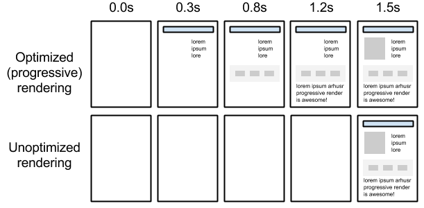

project_path: /web/fundamentals/_project.yaml
book_path: /web/fundamentals/_book.yaml
description: Optimizing the critical rendering path refers to prioritizing the display of content that relates to the current user action.

{# wf_updated_on: 2015-10-05 #}
{# wf_published_on: 2014-03-31 #}

# Critical Rendering Path {: .page-title }



_Optimizing the critical rendering path_ refers to prioritizing the display of
content that relates to the current user action.

Delivering a fast web experience requires a lot of work by the browser. Most of
this work is hidden from us as web developers: we write the markup, and a nice
looking page comes out on the screen. But how exactly does the browser go from
consuming our HTML, CSS, and JavaScript to rendered pixels on the screen?

Optimizing for performance is all about understanding what happens in these
intermediate steps between receiving the HTML, CSS, and JavaScript bytes and
the required processing to turn them into rendered pixels - that's
the **critical rendering path**.

By optimizing the critical rendering path we can significantly improve the
time to first render of our pages. Further, understanding the critical
rendering path also serves as a foundation for building well-performing
interactive applications. The interactive updates process is the same, just done in a continuous loop and ideally at 60 frames per second! But first, an overview of how the browser displays a simple page.

<a href="constructing-the-object-model" class="gc-analytics-event"
    data-category="CRP" data-label="Next / Constructing the Object Model">
  <button>Next Up: Constructing the Object Model</button>
</a>


