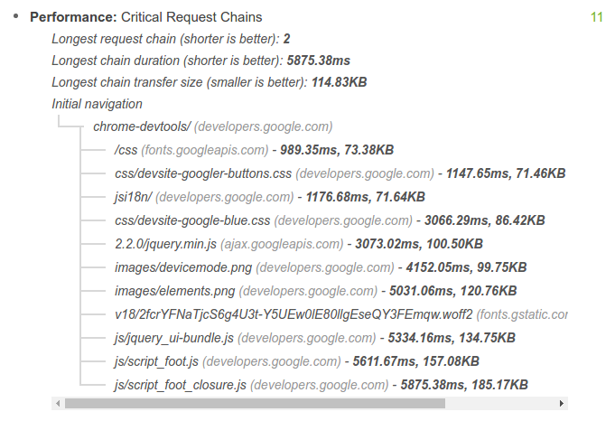
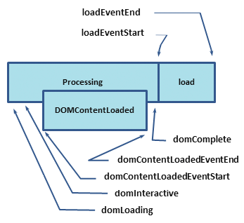

project_path: /web/fundamentals/_project.yaml
book_path: /web/fundamentals/_book.yaml
description: Learn to measure the critical rendering path.

{# wf_updated_on: 2014-09-17 #}
{# wf_published_on: 2014-03-31 #}

# Measuring the Critical Rendering Path {: .page-title }



The foundation of every solid performance strategy is good measurement and
instrumentation. You can't optimize what you can't measure. This doc
explains different approaches for measuring CRP performance.

* The Lighthouse approach runs a series of automated tests against a page,
  and then generates a report on the page's CRP performance. This approach
  provides a quick and easy high-level overview of CRP performance of a
  particular page loaded in your browser, allowing you to rapidly test,
  iterate, and improve its performance.
* The Navigation Timing API approach captures [Real User
  Monitoring (RUM)](https://en.wikipedia.org/wiki/Real_user_monitoring)
  metrics. As the name implies, these metrics are captured from real user
  interactions with your site and provide an accurate view into
  real-world CRP performance, as experienced by your users across a variety
  of devices and network conditions.

In general, a good approach is to use Lighthouse to identify obvious CRP
optimization opportunities, and then to instrument your code with the
Navigation Timing API to monitor how your app performs out in the wild.

## Auditing a page with Lighthouse {: #lighthouse }

Lighthouse is a web app auditing tool that runs a series of tests against a
given page, and then displays the page's results in a consolidated report. You
can run Lighthouse as a Chrome Extension or NPM module, which is
useful for integrating Lighthouse with continuous integration systems.

See [Auditing Web Apps With Lighthouse](/web/tools/lighthouse/) to get started.

When you run Lighthouse as a Chrome Extension, your page's CRP results look
like the screenshot below.

See [Critical Request Chains][crc] for more information on this audit's
results.

[crc]: /web/tools/lighthouse/audits/critical-request-chains

## Instrumenting your code with the Navigation Timing API {: #navigation-timing }

The combination of the Navigation Timing API and other browser events emitted
as the page loads allows you to capture and record the real-world CRP
performance of any page.

Each of the labels in the above diagram corresponds to a high resolution timestamp that the browser tracks for each and every page it loads. In fact, in this specific case we're only showing a fraction of all the different timestamps &mdash; for now we're skipping all network related timestamps, but we'll come back to them in a future lesson.

So, what do these timestamps mean?

* `domLoading`: this is the starting timestamp of the entire process, the
  browser is about to start parsing the first received bytes of the HTML
  document.
* `domInteractive`: marks the point when the browser has finished parsing all
  of the HTML and DOM construction is complete.
* `domContentLoaded`: marks the point when both the DOM is ready and there are no stylesheets that are blocking JavaScript execution - meaning we can now (potentially) construct the render tree.
    * Many JavaScript frameworks wait for this event before they start executing their own logic. For this reason the browser captures the `EventStart` and `EventEnd` timestamps to allow us to track how long this execution took.
* `domComplete`: as the name implies, all of the processing is complete and
  all of the resources on the page (images, etc.) have finished downloading -
  in other words, the loading spinner has stopped spinning.
* `loadEvent`: as a final step in every page load the browser fires an
  `onload` event which can trigger additional application logic.

The HTML specification dictates specific conditions for each and every event: when it should be fired, which conditions should be met, and so on. For our purposes, we'll focus on a few key milestones related to the critical rendering path:

* `domInteractive` marks when DOM is ready.
* `domContentLoaded` typically marks when [both the DOM and CSSOM are ready](http://calendar.perfplanet.com/2012/deciphering-the-critical-rendering-path/).
    * If there is no parser blocking JavaScript then `DOMContentLoaded` will fire immediately after `domInteractive`.
* `domComplete` marks when the page and all of its subresources are ready.

<pre class="prettyprint">

</pre>

[Try it](https://googlesamples.github.io/web-fundamentals/fundamentals/performance/critical-rendering-path/measure_crp.html){: target="_blank" .external }

The above example may seem a little daunting on first sight, but in reality it is actually pretty simple. The Navigation Timing API captures all the relevant timestamps and our code simply waits for the `onload` event to fire &mdash; recall that `onload` event fires after `domInteractive`, `domContentLoaded` and `domComplete` &mdash; and computes the difference between the various timestamps.

All said and done, we now have some specific milestones to track and a simple function to output these measurements. Note that instead of printing these metrics on the page you can also modify the code to send these metrics to an analytics server ([Google Analytics does this automatically](https://support.google.com/analytics/answer/1205784)), which is a great way to keep tabs on performance of your pages and identify candidate pages that can benefit from some optimization work.

## What about DevTools? {: #devtools }

Although these docs sometimes use the Chrome DevTools Network panel to
illustrate CRP concepts, DevTools is currently not well-suited for CRP
measurements because it does not have a built-in mechanism for isolating
critical resources. Run a [Lighthouse](#lighthouse) audit to help
identify such resources.

<a href="analyzing-crp" class="gc-analytics-event"
    data-category="CRP" data-label="Next / Analyzing CRP">
  <button>Next Up: Analyzing Critical Rendering Path Performance</button>
</a>
