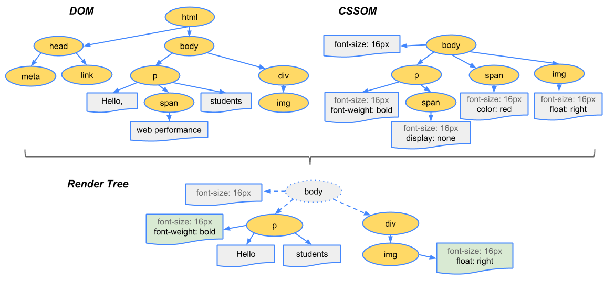
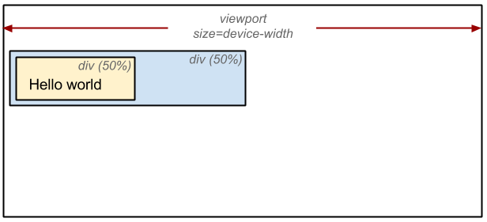
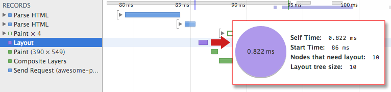

project_path: /web/fundamentals/_project.yaml
book_path: /web/fundamentals/_book.yaml
description: TODO

{# wf_updated_on: 2015-08-20 #}
{# wf_published_on: 2014-03-31 #}

# Render-tree Construction, Layout, and Paint {: .page-title }



The CSSOM and DOM trees are combined into a render tree, which is then used 
to compute the layout of each visible element and serves as an input to the 
paint process that renders the pixels to screen. Optimizing each of these 
steps is critical to achieving optimal rendering performance.

In the previous section on constructing the object model, we built the DOM and
the CSSOM trees based on the HTML and CSS input. However, both of these are
independent objects that capture different aspects of the document: one
describes the content, and the other describes the style rules that need to be
applied to the document. How do we merge the two and get the browser to render
pixels on the screen?

### TL;DR {: .hide-from-toc }
- The DOM and CSSOM trees are combined to form the render tree.
- Render tree contains only the nodes required to render the page.
- Layout computes the exact position and size of each object.
- The last step is paint, which takes in the final render tree and renders the pixels to the screen.

First, the browser combines the DOM and CSSOM into a "render tree," which captures all the visible DOM content on the page and all the CSSOM style information for each node.

To construct the render tree, the browser roughly does the following:

1. Starting at the root of the DOM tree, traverse each visible node.

    * Some nodes are not visible (for example, script tags, meta tags, and so on), and are omitted since they are not reflected in the rendered output.
    * Some nodes are hidden via CSS and are also omitted from the render tree; for example, the span node---in the example above---is missing from the render tree because we have an explicit rule that sets the "display: none" property on it.

1. For each visible node, find the appropriate matching CSSOM rules and apply them.
1. Emit visible nodes with content and their computed styles.

Note: As a brief aside, note that `visibility: hidden` is different from `display: none`. The former makes the element invisible, but the element still occupies space in the layout (that is, it's rendered as an empty box), whereas the latter (`display: none`) removes the element entirely from the render tree such that the element is invisible and is not part of the layout.

The final output is a render that contains both the content and style information of all the visible content on the screen.  **With the render tree in place, we can proceed to the "layout" stage.**

Up to this point we've calculated which nodes should be visible and their computed styles, but we have not calculated their exact position and size within the [viewport](/web/fundamentals/design-and-ux/responsive/#set-the-viewport) of the device---that's the "layout" stage, also known as "reflow."

To figure out the exact size and position of each object on the page, the browser begins at the root of the render tree and traverses it. Let's consider a simple, hands-on example:

<pre class="prettyprint">

</pre>

[Try it](https://googlesamples.github.io/web-fundamentals/fundamentals/performance/critical-rendering-path/nested.html){: target="_blank" .external }

The body of the above page contains two nested div's: the first (parent) div sets the display size of the node to 50% of the viewport width, and the second div---contained by the parent---sets its width to be 50% of its parent; that is, 25% of the viewport width.

The output of the layout process is a "box model," which precisely captures the exact position and size of each element within the viewport: all of the relative measurements are converted to absolute pixels on the screen.

Finally, now that we know which nodes are visible, and their computed styles and geometry, we can pass this information to the final stage, which converts each node in the render tree to actual pixels on the screen. This step is often referred to as "painting" or "rasterizing."

This can take some time because the browser has to do quite a bit of work. However, Chrome DevTools can provide some insight into all three of the stages described above. Let's examine the layout stage for our original "hello world" example:

* The "Layout" event captures the render tree construction, position, and size calculation in the Timeline.
* When layout is complete, the browser issues "Paint Setup" and "Paint" events, which convert the render tree to pixels on the screen.

The time required to perform render tree construction, layout and paint varies based on the size of the document, the applied styles, and the device it is running on: the larger the document, the more work the browser has; the more complicated the styles, the more time taken for painting also (for example, a solid color is "cheap" to paint, while a drop shadow is "expensive" to compute and render).

The page is finally visible in the viewport:

Here's a quick recap of the browser's steps:

1. Process HTML markup and build the DOM tree.
1. Process CSS markup and build the CSSOM tree.
1. Combine the DOM and CSSOM into a render tree.
1. Run layout on the render tree to compute geometry of each node.
1. Paint the individual nodes to the screen.

Our demo page may look simple, but it requires quite a bit of work. If either the DOM or CSSOM were modified, you would have to repeat the process in order to figure out which pixels would need to be re-rendered on the screen.

**_Optimizing the critical rendering path_ is the process of minimizing the total amount of time spent performing steps 1 through 5 in the above sequence.** Doing so renders content to the screen as quickly as possible and also reduces the amount of time between screen updates after the initial render; that is, achieve higher refresh rates for interactive content.

<a href="render-blocking-css" class="gc-analytics-event"
    data-category="CRP" data-label="Next / Render-Blocking CSS">
  <button>Next Up: Render-Blocking CSS</button>
</a>
