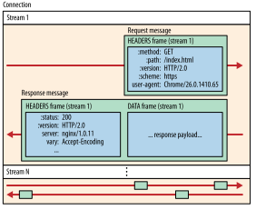
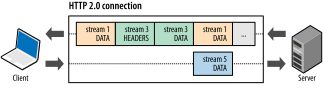
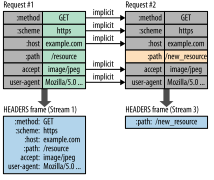

project_path: /web/fundamentals/_project.yaml
book_path: /web/fundamentals/_book.yaml
description: HTTP/2 (or h2) is a binary protocol that brings push, multiplexing streams and frame control to the web.

{# wf_updated_on: 2017-07-24 #}
{# wf_published_on: 2016-09-29 #}
{# wf_blink_components: Blink>Network,Internals>Network>HTTP2 #}

# Introduction to HTTP/2 {: .page-title }




Note: The following content is an excerpt from [High Performance Browser
Networking](http://shop.oreilly.com/product/0636920028048.do) (O'Reilly, Ilya
Grigorik). For full version and related content, see
[hpbn.co](https://hpbn.co/){: .external }.

HTTP/2 will make our applications faster, simpler, and more robust — a rare
combination — by allowing us to undo many of the HTTP/1.1 workarounds previously
done within our applications and address these concerns within the transport
layer itself. Even better, it also opens up a number of entirely new
opportunities to optimize our applications and improve performance!

The primary goals for HTTP/2 are to reduce latency by enabling full request and
response multiplexing, minimize protocol overhead via efficient compression of
HTTP header fields, and add support for request prioritization and server push.
To implement these requirements, there is a large supporting cast of other
protocol enhancements, such as new flow control, error handling, and upgrade
mechanisms, but these are the most important features that every web developer
should understand and leverage in their applications.

HTTP/2 does not modify the application semantics of HTTP in any way. All the
core concepts, such as HTTP methods, status codes, URIs, and header fields,
remain in place. Instead, HTTP/2 modifies how the data is formatted (framed) and
transported between the client and server, both of which manage the entire
process, and hides all the complexity from our applications within the new
framing layer. As a result, all existing applications can be delivered without
modification.

*Why not HTTP/1.2?*

To achieve the performance goals set by the HTTP Working Group, HTTP/2
introduces a new binary framing layer that is not backward compatible with
previous HTTP/1.x servers and clients—hence the major protocol version increment
to HTTP/2.

That said, unless you are implementing a web server (or a custom client) by
working with raw TCP sockets, then you won’t see any difference: all the new,
low-level framing is performed by the client and server on your behalf. The only
observable differences will be improved performance and availability of new
capabilities like request prioritization, flow control, and server push.

## A brief history of SPDY and HTTP/2

SPDY was an experimental protocol, developed at Google and announced in
mid 2009, whose primary goal was to try to reduce the load latency of web pages
by addressing some of the well-known performance limitations of HTTP/1.1.
Specifically, the outlined project goals were set as follows:

* Target a 50% reduction in page load time (PLT).
* Avoid the need for any changes to content by website authors.
* Minimize deployment complexity, and avoid changes in network infrastructure.
* Develop this new protocol in partnership with the open-source community.
* Gather real performance data to (in)validate the experimental protocol.

Note: To achieve the 50% PLT improvement, SPDY aimed to make more efficient use
of the underlying TCP connection by introducing a new binary framing layer to
enable request and response multiplexing, prioritization, and header
compression; see
[Latency as a Performance Bottleneck](https://hpbn.co/primer-on-web-performance/#latency-as-a-performance-bottleneck){: .external}.

Not long after the initial announcement, Mike Belshe and Roberto Peon, both
software engineers at Google, shared their first results, documentation, and
source code for the experimental implementation of the new SPDY protocol:

> So far we have only tested SPDY in lab conditions. The initial results are
> very encouraging: when we download the top 25 websites over simulated home
> network connections, we see a significant improvement in performance—pages
> loaded up to 55% faster.
> [*(Chromium Blog)*](https://blog.chromium.org/2009/11/2x-faster-web.html)

Fast-forward to 2012 and the new experimental protocol was supported in Chrome,
Firefox, and Opera, and a rapidly growing number of sites, both large (for example,
Google, Twitter, Facebook) and small, were deploying SPDY within their
infrastructure. In effect, SPDY was on track to become a de facto standard
through growing industry adoption.

Observing this trend, the HTTP Working Group (HTTP-WG) kicked off a new
effort to take the lessons learned from SPDY, build and improve on them, and
deliver an official "HTTP/2" standard. A new charter was drafted, an open call
for HTTP/2 proposals was made, and after a lot of discussion within the working
group, the SPDY specification was adopted as a starting point for the new HTTP/2
protocol.

Over the next few years SPDY and HTTP/2 continued to coevolve in parallel,
with SPDY acting as an experimental branch that was used to test new features
and proposals for the HTTP/2 standard. What looks good on paper may not work in
practice, and vice versa, and SPDY offered a route to test and evaluate each
proposal before its inclusion in the HTTP/2 standard. In the end, this process
spanned three years and resulted in a over a dozen intermediate drafts:

* March 2012: Call for proposals for HTTP/2
* November 2012: First draft of HTTP/2 (based on SPDY)
* August 2014: HTTP/2 draft-17 and HPACK draft-12 are published
* August 2014: Working Group last call for HTTP/2
* February 2015: IESG approved HTTP/2 and HPACK drafts
* May 2015: RFC 7540 (HTTP/2) and RFC 7541 (HPACK) are published

In early 2015 the IESG reviewed and approved the new HTTP/2 standard for
publication. Shortly after that, the Google Chrome team announced their schedule
to deprecate SPDY and NPN extension for TLS:

> HTTP/2's primary changes from HTTP/1.1 focus on improved performance. Some key
> features such as multiplexing, header compression, prioritization and protocol
> negotiation evolved from work done in an earlier open, but non-standard
> protocol named SPDY. Chrome has supported SPDY since Chrome 6, but since most
> of the benefits are present in HTTP/2, it’s time to say goodbye. We plan to
> remove support for SPDY in early 2016, and to also remove support for the TLS
> extension named NPN in favor of ALPN in Chrome at the same time. Server
> developers are strongly encouraged to move to HTTP/2 and ALPN.
>
> We’re happy to have contributed to the open standards process that led to
> HTTP/2, and hope to see wide adoption given the broad industry engagement on
> standardization and implementation. [*(Chromium
> Blog)*](https://blog.chromium.org/2015/02/hello-http2-goodbye-spdy.html)

The coevolution of SPDY and HTTP/2 enabled server, browser, and site developers
to gain real-world experience with the new protocol as it was being developed.
As a result, the HTTP/2 standard is one of the best and most extensively tested
standards right out of the gate. By the time HTTP/2 was approved by the IESG,
there were dozens of thoroughly tested and production-ready client and server
implementations. In fact, just weeks after the final protocol was approved, many
users were already enjoying its benefits as several popular browsers (and many
sites) deployed full HTTP/2 support.

## Design and technical goals

Earlier versions of the HTTP protocol were intentionally designed for simplicity
of implementation: HTTP/0.9 was a one-line protocol to bootstrap the World Wide
Web; HTTP/1.0 documented the popular extensions to HTTP/0.9 in an informational
standard; HTTP/1.1 introduced an official IETF standard; see
[Brief History of HTTP](https://hpbn.co/brief-history-of-http/){: .external}.
As such, HTTP/0.9-1.x delivered exactly what it set out to do: HTTP is one of
the most widely adopted application protocols on the Internet.

Unfortunately, implementation simplicity also came at a cost of application
performance: HTTP/1.x clients need to use multiple connections to achieve
concurrency and reduce latency; HTTP/1.x does not compress request and response
headers, causing unnecessary network traffic; HTTP/1.x does not allow effective
resource prioritization, resulting in poor use of the underlying TCP connection;
and so on.

These limitations were not fatal, but as the web applications continued to grow
in their scope, complexity, and importance in our everyday lives, they imposed a
growing burden on both the developers and users of the web, which is the exact
gap that HTTP/2 was designed to address:

> HTTP/2 enables a more efficient use of network resources and a reduced
> perception of latency by introducing header field compression and allowing
> multiple concurrent exchanges on the same connection… Specifically, it allows
> interleaving of request and response messages on the same connection and uses
> an efficient coding for HTTP header fields. It also allows prioritization of
> requests, letting more important requests complete more quickly, further
> improving performance.
>
> The resulting protocol is more friendly to the network, because fewer TCP
> connections can be used in comparison to HTTP/1.x. This means less competition
> with other flows, and longer-lived connections, which in turn leads to better
> utilization of available network capacity. Finally, HTTP/2 also enables more
> efficient processing of messages through use of binary message framing.
> [*(Hypertext Transfer Protocol version 2, Draft
> 17)*](https://tools.ietf.org/html/draft-ietf-httpbis-http2-17)

It is important to note that HTTP/2 is extending, not replacing, the previous
HTTP standards. The application semantics of HTTP are the same, and no changes
were made to the offered functionality or core concepts such as HTTP methods,
status codes, URIs, and header fields. These changes were explicitly out of scope
for the HTTP/2 effort. That said, while the high-level API remains the same, it
is important to understand how the low-level changes address the performance
limitations of the previous protocols. Let’s take a brief tour of the binary
framing layer and its features.

## Binary framing layer

At the core of all performance enhancements of HTTP/2 is the new binary framing
layer, which dictates how the HTTP messages are encapsulated and transferred
between the client and server.

The "layer" refers to a design choice to introduce a new optimized encoding
mechanism between the socket interface and the higher HTTP API exposed to our
applications: the HTTP semantics, such as verbs, methods, and headers, are
unaffected, but the way they are encoded while in transit is different.
Unlike the newline delimited plaintext HTTP/1.x protocol, all HTTP/2
communication is split into smaller messages and frames, each of which is
encoded in binary format.

As a result, both client and server must use the new binary encoding mechanism
to understand each other: an HTTP/1.x client won’t understand an HTTP/2 only
server, and vice versa. Thankfully, our applications remain blissfully unaware
of all these changes, as the client and server perform all the necessary framing
work on our behalf.

## Streams, messages, and frames

The introduction of the new binary framing mechanism changes how the data is
exchanged between the client and server. To describe this process, let’s
familiarize ourselves with the HTTP/2 terminology:

* *Stream*: A bidirectional flow of bytes within an established connection,
  which may carry one or more messages.
* *Message*: A complete sequence of frames that map to a logical request or response message.
* *Frame*: The smallest unit of communication in HTTP/2, each containing a frame header, which
  at a minimum identifies the stream to which the frame belongs.

The relation of these terms can be summarized as follows:

* All communication is performed over a single TCP connection that can carry any number of
  bidirectional streams.
* Each stream has a unique identifier and optional priority information that is used to carry
  bidirectional messages.
* Each message is a logical HTTP message, such as a request, or response, which consists of
  one or more frames.
* The frame is the smallest unit of communication that carries a specific type of data—e.g.,
  HTTP headers, message payload, and so on. Frames from different streams may be interleaved
  and then reassembled via the embedded stream identifier in the header of each frame.

In short, HTTP/2 breaks down the HTTP protocol communication into an exchange of
binary-encoded frames, which are then mapped to messages that belong to a
particular stream, all of which are multiplexed within a single TCP
connection. This is the foundation that enables all other features and
performance optimizations provided by the HTTP/2 protocol.

## Request and response multiplexing

With HTTP/1.x, if the client wants to make multiple parallel requests to improve
performance, then multiple TCP connections must be used (see
[Using Multiple TCP Connections](https://hpbn.co/http1x/#using-multiple-tcp-connections)
). This behavior is a direct consequence of the HTTP/1.x delivery model, which
ensures that only one response can be delivered at a time (response queuing) per
connection. Worse, this also results in head-of-line blocking and inefficient
use of the underlying TCP connection.

The new binary framing layer in HTTP/2 removes these limitations, and enables
full request and response multiplexing, by allowing the client and server to
break down an HTTP message into independent frames, interleave them, and then
reassemble them on the other end.

The snapshot captures multiple streams in flight within the same connection. The
client is transmitting a `DATA` frame (stream 5) to the server, while the server
is transmitting an interleaved sequence of frames to the client for streams 1
and 3. As a result, there are three parallel streams in flight.

The ability to break down an HTTP message into independent frames, interleave
them, and then reassemble them on the other end is the single most important
enhancement of HTTP/2. In fact, it introduces a ripple effect of numerous
performance benefits across the entire stack of all web technologies, enabling
us to:

* Interleave multiple requests in parallel without blocking on any one.
* Interleave multiple responses in parallel without blocking on any one.
* Use a single connection to deliver multiple requests and responses in parallel.
* Remove unnecessary HTTP/1.x workarounds (see
  [Optimizing for HTTP/1.x](https://hpbn.co/optimizing-application-delivery/#optimizing-for-http1x),
  such as concatenated files, image sprites, and domain sharding.
* Deliver lower page load times by eliminating unnecessary latency and improving
  utilization of available network capacity.
* *And much more…*

The new binary framing layer in HTTP/2 resolves the head-of-line blocking
problem found in HTTP/1.x and eliminates the need for multiple connections to
enable parallel processing and delivery of requests and responses. As a result,
this makes our applications faster, simpler, and cheaper to deploy.

## Stream prioritization

Once an HTTP message can be split into many individual frames, and we allow for
frames from multiple streams to be multiplexed, the order in which the frames
are interleaved and delivered both by the client and server becomes a critical
performance consideration. To facilitate this, the HTTP/2 standard allows each
stream to have an associated weight and dependency:

* Each stream may be assigned an integer weight between 1 and 256.
* Each stream may be given an explicit dependency on another stream.

The combination of stream dependencies and weights allows the client to
construct and communicate a "prioritization tree" that expresses how it would
prefer to receive responses. In turn, the server can use this information to
prioritize stream processing by controlling the allocation of CPU, memory, and
other resources, and once the response data is available, allocation of
bandwidth to ensure optimal delivery of high-priority responses to the client.

A stream dependency within HTTP/2 is declared by referencing the unique
identifier of another stream as its parent; if the identifier is omitted the
stream is said to be dependent on the "root stream". Declaring a stream
dependency indicates that, if possible, the parent stream should be allocated
resources ahead of its dependencies. In other words, "Please process and deliver
response D before response C".

Streams that share the same parent (in other words, sibling streams) should be allocated
resources in proportion to their weight. For example, if stream A has a weight
of 12 and its one sibling B has a weight of 4, then to determine the proportion
of the resources that each of these streams should receive:

1. Sum all the weights: `4 + 12 = 16`
1. Divide each stream weight by the total weight: `A = 12/16, B = 4/16`

Thus, stream A should receive three-quarters and stream B should receive one-
quarter of available resources; stream B should receive one-third of the
resources allocated to stream A. Let’s work through a few more hands-on examples
in the image above. From left to right:

1. Neither stream A nor B specifies a parent dependency and are said to be dependent
   on the implicit "root stream"; A has a weight of 12, and B has a weight of 4.
   Thus, based on proportional weights: stream B should receive one-third of the
   resources allocated to stream A.
1. Stream D is dependent on the root stream; C is dependent on D. Thus, D should
   receive full allocation of resources ahead of C. The weights are inconsequential
   because C’s dependency communicates a stronger preference.
1. Stream D should receive full allocation of resources ahead of C; C should receive
   full allocation of resources ahead of A and B; stream B should receive one-third of
   the resources allocated to stream A.
1. Stream D should receive full allocation of resources ahead of E and C; E and C
   should receive equal allocation ahead of A and B; A and B should receive proportional
   allocation based on their weights.

As the above examples illustrate, the combination of stream dependencies and
weights provides an expressive language for resource prioritization, which is a
critical feature for improving browsing performance where we have many resource
types with different dependencies and weights. Even better, the HTTP/2 protocol
also allows the client to update these preferences at any point, which enables
further optimizations in the browser. In other words, we can change dependencies
and reallocate weights in response to user interaction and other signals.

Note: Stream dependencies and weights express a transport preference, not a
requirement, and as such do not guarantee a particular processing or
transmission order. That is, the client cannot force the server to process the
stream in a particular order using stream prioritization. While this may seem
counterintuitive, it is in fact the desired behavior. We do not want to block
the server from making progress on a lower priority resource if a higher
priority resource is blocked.

## One connection per origin

With the new binary framing mechanism in place, HTTP/2 no longer needs multiple
TCP connections to multiplex streams in parallel; each stream is split into many
frames, which can be interleaved and prioritized. As a result, all HTTP/2
connections are persistent, and only one connection per origin is required,
which offers numerous performance benefits.

> For both SPDY and HTTP/2 the killer feature is arbitrary multiplexing on a
> single well congestion controlled channel. It amazes me how important this is
> and how well it works. One great metric around that which I enjoy is the
> fraction of connections created that carry just a single HTTP transaction (and
> thus make that transaction bear all the overhead). For HTTP/1 74% of our
> active connections carry just a single transaction—persistent connections just
> aren’t as helpful as we all want. But in HTTP/2 that number plummets to 25%.
> That’s a huge win for overhead reduction. [*(HTTP/2 is Live in Firefox, Patrick
> McManus)*](http://bitsup.blogspot.co.uk/2015/02/http2-is-live-in-firefox.html)

Most HTTP transfers are short and bursty, whereas TCP is optimized for long-
lived, bulk data transfers. By reusing the same connection, HTTP/2 is able to
both make more efficient use of each TCP connection, and also significantly
reduce the overall protocol overhead. Further, the use of fewer connections
reduces the memory and processing footprint along the full connection path
(in other words, client, intermediaries, and origin servers). This reduces the overall
operational costs and improves network utilization and capacity. As a result,
the move to HTTP/2 should not only reduce network latency, but also help
improve throughput and reduce the operational costs.

Note: Reduced number of connections is a particularly important feature for
improving performance of HTTPS deployments: this translates to fewer expensive
TLS handshakes, better session reuse, and an overall reduction in required
client and server resources.

## Flow control

Flow control is a mechanism to prevent the sender from overwhelming the receiver
with data it may not want or be able to process: the receiver may be busy, under
heavy load, or may only be willing to allocate a fixed amount of resources for a
particular stream. For example, the client may have requested a large video
stream with high priority, but the user has paused the video and the client now
wants to pause or throttle its delivery from the server to avoid fetching and
buffering unnecessary data. Alternatively, a proxy server may have fast
downstream and slow upstream connections and similarly wants to regulate how
quickly the downstream delivers data to match the speed of upstream to control
its resource usage; and so on.

Do the above requirements remind you of TCP flow control? They should, as the
problem is effectively identical (see
[Flow Control](https://hpbn.co/building-blocks-of-tcp/#flow-control)). However,
because the HTTP/2 streams are multiplexed within a single TCP connection, TCP
flow control is both not granular enough, and does not provide the necessary
application-level APIs to regulate the delivery of individual streams. To
address this, HTTP/2 provides a set of simple building blocks that allow the
client and server to implement their own stream- and connection-level flow
control:

* Flow control is directional. Each receiver may choose to set any window size
  that it desires for each stream and the entire connection.
* Flow control is credit-based. Each receiver advertises its initial connection
  and stream flow control window (in bytes), which is reduced whenever the
  sender emits a `DATA` frame and incremented via a `WINDOW_UPDATE` frame sent
  by the receiver.
* Flow control cannot be disabled. When the HTTP/2 connection is established the
  client and server exchange `SETTINGS` frames, which set the flow control window
  sizes in both directions. The default value of the flow control window is set
  to 65,535 bytes, but the receiver can set a large maximum window size
  (`2^31-1` bytes) and maintain it by sending a `WINDOW_UPDATE` frame whenever any
  data is received.
* Flow control is hop-by-hop, not end-to-end. That is, an intermediary can use it
  to control resource use and implement resource allocation mechanisms based on
  own criteria and heuristics.

HTTP/2 does not specify any particular algorithm for implementing flow control.
Instead, it provides the simple building blocks and defers the implementation to
the client and server, which can use it to implement custom strategies to
regulate resource use and allocation, as well as implement new delivery
capabilities that may help improve both the real and perceived performance (see
[Speed, Performance, and Human Perception](https://hpbn.co/primer-on-web-performance/#speed-performance-and-human-perception))
of our web applications.

For example, application-layer flow control allows the browser to fetch only a
part of a particular resource, put the fetch on hold by reducing the stream flow
control window down to zero, and then resume it later. In other words, it allows
the browser to fetch a preview or first scan of an image, display it and allow
other high priority fetches to proceed, and resume the fetch once more critical
resources have finished loading.

## Server push

Another powerful new feature of HTTP/2 is the ability of the server to send
multiple responses for a single client request. That is, in addition to the
response to the original request, the server can push additional resources to
the client (Figure 12-5), without the client having to request each one
explicitly.

Note: HTTP/2 breaks away from the strict request-response semantics and enables
one-to-many and server-initiated push workflows that open up a world of new
interaction possibilities both within and outside the browser. This is an
enabling feature that will have important long-term consequences both for how we
think about the protocol, and where and how it is used.

Why would we need such a mechanism in a browser? A typical web application
consists of dozens of resources, all of which are discovered by the client by
examining the document provided by the server. As a result, why not eliminate
the extra latency and let the server push the associated resources ahead of
time? The server already knows which resources the client will require; that’s
server push.

In fact, if you have ever inlined a CSS, JavaScript, or any other asset via a
data URI (see [Resource Inlining](https://hpbn.co/http1x/#resource-inlining)),
then you already have hands-on experience with server push. By manually inlining
the resource into the document, we are, in effect, pushing that resource to the
client, without waiting for the client to request it. With HTTP/2 we can achieve
the same results, but with additional performance benefits. Push resources can be:

* Cached by the client
* Reused across different pages
* Multiplexed alongside other resources
* Prioritized by the server
* Declined by the client

### PUSH_PROMISE 101

All server push streams are initiated via `PUSH_PROMISE` frames, which signal the
server’s intent to push the described resources to the client and need to be
delivered ahead of the response data that requests the pushed resources. This
delivery order is critical: the client needs to know which resources the server
intends to push to avoid creating duplicate requests for these
resources. The simplest strategy to satisfy this requirement is to send all
`PUSH_PROMISE` frames, which contain just the HTTP headers of the promised
resource, ahead of the parent’s response (in other words, `DATA` frames).

Once the client receives a `PUSH_PROMISE` frame it has the option to decline the
stream (via a `RST_STREAM` frame) if it wants to. (This might occur for example
because the resource is already in cache.) This is an important improvement over
HTTP/1.x. By contrast, the use of resource inlining, which is a popular
"optimization" for HTTP/1.x, is equivalent to a "forced push": the client cannot
opt-out, cancel it, or process the inlined resource individually.

With HTTP/2 the client remains in full control of how server push is used. The
client can limit the number of concurrently pushed streams; adjust the initial
flow control window to control how much data is pushed when the stream is first
opened; or disable server push entirely. These preferences are communicated via
the `SETTINGS` frames at the beginning of the HTTP/2 connection and may be updated
at any time.

Each pushed resource is a stream that, unlike an inlined resource, allows it to
be individually multiplexed, prioritized, and processed by the client. The only
security restriction, as enforced by the browser, is that pushed resources must
obey the same-origin policy: the server must be authoritative for the provided
content.

## Header compression

Each HTTP transfer carries a set of headers that describe the transferred
resource and its properties. In HTTP/1.x, this metadata is always sent as plain
text and adds anywhere from 500–800 bytes of overhead per transfer, and
sometimes kilobytes more if HTTP cookies are being used. (See
[Measuring and Controlling Protocol Overhead](https://hpbn.co/http1x/#measuring-and-controlling-protocol-overhead)
.) To reduce this overhead and improve performance, HTTP/2 compresses request
and response header metadata using the HPACK compression format that uses two
simple but powerful techniques:

1. It allows the transmitted header fields to be encoded via a static Huffman
   code, which reduces their individual transfer size.
1. It requires that both the client and server maintain and update an indexed
   list of previously seen header fields (in other words, it establishes a shared
   compression context), which is then used as a reference to efficiently encode
   previously transmitted values.

Huffman coding allows the individual values to be compressed when transferred,
and the indexed list of previously transferred values allows us to encode
duplicate values by transferring index values that can be used to efficiently
look up and reconstruct the full header keys and values.

As one further optimization, the HPACK compression context consists of a static
and dynamic table: the static table is defined in the specification and
provides a list of common HTTP header fields that all connections are likely to
use (e.g., valid header names); the dynamic table is initially empty and is
updated based on exchanged values within a particular connection. As a result,
the size of each request is reduced by using static Huffman coding for values
that haven’t been seen before, and substitution of indexes for values that are
already present in the static or dynamic tables on each side.

Note: The definitions of the request and response header fields in HTTP/2 remains
unchanged, with a few minor exceptions: all header field names are lowercase,
and the request line is now split into individual `:method`, `:scheme`, 
`:authority`, and `:path` pseudo-header fields.

### Security and performance of HPACK

Early versions of HTTP/2 and SPDY used zlib, with a custom dictionary, to
compress all HTTP headers. This delivered an 85% to 88% reduction in the size
of the transferred header data, and a significant improvement in page load time
latency:

> On the lower-bandwidth DSL link, in which the upload link is only 375 Kbps,
> request header compression in particular, led to significant page load time
> improvements for certain sites (in other words, those that issued large number of
> resource requests). We found a reduction of 45–1142 ms in page load time
> simply due to header compression. [*(SPDY whitepaper,
> chromium.org)*](https://www.chromium.org/spdy/spdy-whitepaper)

However, in the summer of 2012, a "CRIME" security attack was published against
TLS and SPDY compression algorithms, which could result in session hijacking. As
a result, the zlib compression algorithm was replaced by HPACK, which was
specifically designed to: address the discovered security issues, be efficient
and simple to implement correctly, and of course, enable good compression of
HTTP header metadata.

For full details of the HPACK compression algorithm, see
[IETF HPACK - Header Compression for HTTP/2](https://tools.ietf.org/html/draft-ietf-httpbis-header-compression).

## Further reading:

* [“HTTP/2”](https://hpbn.co/http2/){: .external }
    – The full article by Ilya Grigorik
* [“Setting up HTTP/2”](https://surma.link/things/h2setup/){: .external }
    – How to set up HTTP/2 in different backends by Surma
* [“HTTP/2 is here,
let’s optimize!”](https://docs.google.com/presentation/d/1r7QXGYOLCh4fcUq0jDdDwKJWNqWK1o4xMtYpKZCJYjM/edit#slide=id.p19)
    – Presentation by Ilya Grigorik from Velocity 2015
* [“Rules of Thumb for HTTP/2 Push”](https://docs.google.com/document/d/1K0NykTXBbbbTlv60t5MyJvXjqKGsCVNYHyLEXIxYMv0/edit)
    – An analysis by Tom Bergan, Simon Pelchat and Michael Buettner on when and how to use push.
