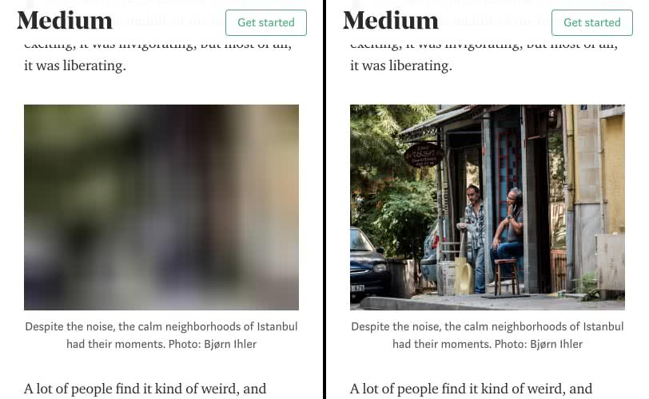

project_path: /web/fundamentals/_project.yaml
book_path: /web/fundamentals/_book.yaml
description: If your site has a ton of images and video, but you don't want to cut down on any of it, lazy loading might be just the technique you need to improve initial page load time and lower per-page payload.

{# wf_updated_on: 2018-04-04 #}
{# wf_published_on: 2018-04-04 #}
{# wf_blink_components: Blink>PerformanceAPIs,Blink>JavaScript>Runtime,Blink>Input #}

# Lazy Loading Images and Video {: .page-title }



The portion of
[images](http://beta.httparchive.org/reports/state-of-images?start=earliest&end=latest)
and [video](http://beta.httparchive.org/reports/page-weight#bytesVideo) in the
typical payload of a website can be significant. Unfortunately, project
stakeholders may be unwilling to cut any media resources from their existing
applications. Such impasses are frustrating, especially when all parties
involved want to improve site performance, but can't agree on how to get there.
Fortunately, lazy loading is a solution that lowers initial page payload _and_
load time, but doesn't skimp on content.

## What is lazy loading?

Lazy loading is technique that defers loading of non-critical resources at page
load time. Instead, these non-critical resources are loaded at the moment of
need. Where images are concerned, "non-critical" is often synonymous with
"off-screen". If you've used Lighthouse and examined some opportunities for
improvement, you may have seen some guidance in this realm in the form of the
[Offscreen Images
audit](/web/tools/lighthouse/audits/offscreen-images):

<figure>
  
  <figcaption><b>Figure 1</b>. One of Lighthouse's performance audits is to
identify off screen images, which are candidates for lazy loading.</figcaption>
</figure>

You've probably already seen lazy loading in action, and it goes something like
this:

- You arrive at a page, and begin to scroll as you read content.
- At some point, you scroll a placeholder image into the viewport.
- The placeholder image is suddenly replaced by the final image.

An example of image lazy loading can be found on the popular publishing platform
[Medium](https://medium.com/), which loads lightweight placeholder images at
page load, and replaces them with lazily-loaded images as they're scrolled into
the viewport.

<figure>
  
  <figcaption><b>Figure 2</b>. An example of image lazy loading in action. A
placeholder image is loaded at page load (left), and when scrolled into the
viewport, the final image loads at the time of need.</figcaption>
</figure>

If you're unfamiliar with lazy loading, you might be wondering just how useful
the technique is, and what its benefits are. Read on to find out!

## Why lazy load images or video instead of just _loading_ them?

Because it's possible you're loading stuff the user may never see. This is
problematic for a couple reasons:

- It wastes data. On unmetered connections, this isn't the worst thing that could
happen (although you could be using that precious bandwidth for downloading
other resources that are indeed going to be seen by the user). On limited data
plans, however, loading stuff the user never sees could effectively be a waste
of their money.
- It wastes processing time, battery, and other system resources. After a media
resource is downloaded, the browser must decode it and render its content in the
viewport.

When we lazy load images and video, we reduce initial page load time, initial
page weight, and system resource usage, all of which have positive impacts on
performance. In this guide, we'll cover some techniques and offer guidance for
lazy loading images and video, as well as [a short list of some commonly used
libraries](/web/fundamentals/performance/lazy-loading-guidance/images-and-video/#lazy_loading_libraries).

## Lazy loading images

Image lazy loading mechanisms are simple in theory, but the details are actually
a bit finicky. Plus there are a couple of distinct use cases that can both
benefit from lazy loading. Let's first start with lazy loading inline images in
HTML.

### Inline images

The most common lazy loading candidates are images as used in `` elements.
When we lazy load `` elements, we use JavaScript to check if they're in the
viewport. If they are, their `src` (and sometimes `srcset`) attributes are
populated with URLs to the desired image content.

#### Using intersection observer

If you've written lazy loading code before, you may have accomplished your task
by using event handlers such as `scroll` or `resize`. While this approach is the
most compatible across browsers, modern browsers offer a more performant and
efficient way to do the work of checking element visibility via [the
intersection observer API](/web/updates/2016/04/intersectionobserver).

Note: Intersection observer is not supported in all browsers. If compatibility
across browsers is crucial, be sure to read [the next
section](#using_event_handlers_the_most_compatible_way), which shows you how to
lazy load images using less performant (but more compatible!) scroll and resize
event handlers.

Intersection observer is easier to use and read than code relying on various
event handlers, because developers only need to register an observer to watch
elements rather than writing tedious element visibility detection code. All
that's left to do for the developer is to decide what to do when an element is
visible. Let's assume this basic markup pattern for our lazily loaded ``
elements:

```html

```

There are three relevant pieces of this markup we should focus on:

1. The `class` attribute, which is what we'll select the element with in
JavaScript.
2. The `src` attribute, which references a placeholder image that will appear when
the page first loads.
3. The `data-src` and `data-srcset` attributes, which are placeholder attributes
containing the URL for the image we'll load once the element is in the viewport.

Now let's see how we can use intersection observer in JavaScript to lazy load
images using this markup pattern:

```javascript
document.addEventListener("DOMContentLoaded", function() {
  var lazyImages = [].slice.call(document.querySelectorAll("img.lazy"));

  if ("IntersectionObserver" in window) {
    let lazyImageObserver = new IntersectionObserver(function(entries, observer) {
      entries.forEach(function(entry) {
        if (entry.isIntersecting) {
          let lazyImage = entry.target;
          lazyImage.src = lazyImage.dataset.src;
          lazyImage.srcset = lazyImage.dataset.srcset;
          lazyImage.classList.remove("lazy");
          lazyImageObserver.unobserve(lazyImage);
        }
      });
    });

    lazyImages.forEach(function(lazyImage) {
      lazyImageObserver.observe(lazyImage);
    });
  } else {
    // Possibly fall back to a more compatible method here
  }
});
```

On the document's `DOMContentLoaded` event, this script queries the DOM for all
`` elements with a class of `lazy`. If intersection observer is available,
we create a new observer that runs a callback when `img.lazy` elements enter the
viewport. Check out [this CodePen
example](https://codepen.io/malchata/pen/YeMyrQ) to see this code in action.

Note: This code makes use of an intersection observer method named
`isIntersecting`, which is unavailable in Edge 15's intersection observer
implementation. As such, the lazy loading code above (and other similar code
snippets) will fail. Consult [this GitHub
issue](https://github.com/w3c/IntersectionObserver/issues/211) for guidance on a
more complete feature detection conditional.

The drawback of intersection observer, however, is that while [it has good
support amongst browsers](https://caniuse.com/#feat=intersectionobserver), it's
not universal. [You'll need to
polyfill](https://github.com/w3c/IntersectionObserver/tree/master/polyfill)
browsers that don't support it, or as the above code suggests, detect if it's
available and subsequently fall back to older, more compatible methods.

#### Using event handlers (the most compatible way)

While you _should_ use intersection observer for lazy loading, your application
requirements may be such that browser compatibility is critical. [You _can_
polyfill intersection observer
support](https://github.com/w3c/IntersectionObserver/tree/master/polyfill) (and
this would be easiest), but you could also fall back to code using
[`scroll`](https://developer.mozilla.org/en-US/docs/Web/Events/scroll),
[`resize`](https://developer.mozilla.org/en-US/docs/Web/Events/resize), and
possibly
[`orientationchange`](https://developer.mozilla.org/en-US/docs/Web/Events/orientationchange)
event handlers in concert with
[`getBoundingClientRect`](https://developer.mozilla.org/en-US/docs/Web/API/Element/getBoundingClientRect)
to determine whether an element is in the viewport.

Assuming the same markup pattern from before, the following JavaScript provides
the lazy loading functionality:

```javascript
document.addEventListener("DOMContentLoaded", function() {
  let lazyImages = [].slice.call(document.querySelectorAll("img.lazy"));
  let active = false;

  const lazyLoad = function() {
    if (active === false) {
      active = true;

      setTimeout(function() {
        lazyImages.forEach(function(lazyImage) {
          if ((lazyImage.getBoundingClientRect().top <= window.innerHeight && lazyImage.getBoundingClientRect().bottom >= 0) && getComputedStyle(lazyImage).display !== "none") {
            lazyImage.src = lazyImage.dataset.src;
            lazyImage.srcset = lazyImage.dataset.srcset;
            lazyImage.classList.remove("lazy");

            lazyImages = lazyImages.filter(function(image) {
              return image !== lazyImage;
            });

            if (lazyImages.length === 0) {
              document.removeEventListener("scroll", lazyLoad);
              window.removeEventListener("resize", lazyLoad);
              window.removeEventListener("orientationchange", lazyLoad);
            }
          }
        });

        active = false;
      }, 200);
    }
  };

  document.addEventListener("scroll", lazyLoad);
  window.addEventListener("resize", lazyLoad);
  window.addEventListener("orientationchange", lazyLoad);
});
```

This code uses `getBoundingClientRect` in a `scroll` event handler to check if
any of `img.lazy` elements are in the viewport. A `setTimeout` call is used to
delay processing, and an `active` variable contains the processing state which
is used to throttle function calls. As images are lazy loaded, they're removed
from the elements array. When the elements array reaches a `length` of `0`, the
scroll event handler code is removed. See this code in action in [this CodePen
example](https://codepen.io/malchata/pen/mXoZGx).

While this code works in pretty much any browser, it has potential performance
issues in that repetitive `setTimeout` calls can be wasteful, even if the code
within them is throttled. In this example, a check is being run every 200
milliseconds on document scroll or window resize regardless of whether there's
an image in the viewport or not. Plus, the tedious work of tracking how many
elements are left to lazy load and unbinding the scroll event handler are left
to the developer.

Simply put: Use intersection observer wherever possible, and fall back to event
handlers if the widest possible compatibility is a critical application
requirement.

### Images in CSS

While `` tags are the most common way of using images on web pages, images
can also be invoked via the CSS
[`background-image`](https://developer.mozilla.org/en-US/docs/Web/CSS/background-image)
property (and other properties). Unlike `` elements which load regardless
of their visibility, image loading behavior in CSS is done with more
speculation. When [the document and CSS object
models](/web/fundamentals/performance/critical-rendering-path/constructing-the-object-model)
and [render
tree](/web/fundamentals/performance/critical-rendering-path/render-tree-construction)
are built, the browser examines how CSS is applied to a document before
requesting external resources. If the browser has determined a CSS rule
involving an external resource doesn't apply to the document as it's currently
constructed, the browser doesn't request it.

This speculative behavior can be used to defer the loading of images in CSS by
using JavaScript to determine when an element is within the viewport, and
subsequently applying a class to that element that applies styling invoking a
background image. This causes the image to be downloaded at the time of need
instead of at initial load. For example, let's take an element that contains a
large hero background image:

```html
<div class="lazy-background">
  <h1>Here's a hero heading to get your attention!</h1>
  <p>Here's hero copy to convince you to buy a thing!</p>
  <a href="/buy-a-thing">Buy a thing!</a>
</div>
```

The `div.lazy-background` element would normally contain the hero background
image invoked by some CSS. In this lazy loading example, however, we can isolate
the `div.lazy-background` element's `background-image` property via a `visible`
class that we'll add to the element when it's in the viewport:

```css
.lazy-background {
  background-image: url("hero-placeholder.jpg"); /* Placeholder image */
}

.lazy-background.visible {
  background-image: url("hero.jpg"); /* The final image */
}
```

From here, we'll use JavaScript to check if the element is in the viewport (with
intersection observer!), and add the `visible` class to the
`div.lazy-background` element at that time, which loads the image:

```javascript
document.addEventListener("DOMContentLoaded", function() {
  var lazyBackgrounds = [].slice.call(document.querySelectorAll(".lazy-background"));

  if ("IntersectionObserver" in window) {
    let lazyBackgroundObserver = new IntersectionObserver(function(entries, observer) {
      entries.forEach(function(entry) {
        if (entry.isIntersecting) {
          entry.target.classList.add("visible");
          lazyBackgroundObserver.unobserve(entry.target);
        }
      });
    });

    lazyBackgrounds.forEach(function(lazyBackground) {
      lazyBackgroundObserver.observe(lazyBackground);
    });
  }
});
```

As indicated earlier, you'll want to make sure you provide a fallback or a
polyfill for intersection observer since not all browsers currently support it.
Check out [this CodePen demo](https://codepen.io/malchata/pen/wyLMpR) to see
this code in action.

## Lazy loading video

As with image elements, we can also lazy load video. When we load video in
normal circumstances, we do so using the `<video>` element (although [an
alternate method using
``](https://calendar.perfplanet.com/2017/animated-gif-without-the-gif/) has
emerged with limited implementation). _How_ we lazy load `<video>` depends on the
use case, though. Let's discuss a couple of scenarios that each require a
different solution.

### For video that doesn't autoplay

For videos where playback is initiated by the user (i.e., videos that _don't_
autoplay), specifying the [`preload`
attribute](https://developer.mozilla.org/en-US/docs/Web/HTML/Element/video#attr-preload)
on the `<video>` element may be desirable:

```html
<video controls preload="none" poster="one-does-not-simply-placeholder.jpg">
  <source src="one-does-not-simply.webm" type="video/webm">
  <source src="one-does-not-simply.mp4" type="video/mp4">
</video>
```

Here, we use a `preload` attribute with a value of `none` to prevent browsers
from preloading _any_ video data. To occupy the space, we use the `poster`
attribute to give the `<video>` element a placeholder. The reason for this is
that default behaviors for loading video can vary from browser to browser:

- In Chrome, the default for `preload` used to be `auto`, but as of Chrome 64, it now
defaults to `metadata`. Even so, on the desktop version of Chrome, a portion of
the video may be preloaded using the `Content-Range` header. Firefox, Edge and
Internet Explorer 11 behave similarly.
- As with Chrome on desktop, 11.0 desktop versions of Safari will preload a range
of the video. In version 11.2 (currently Safari's Tech Preview version), only
the video metadata is preloaded. [In Safari on iOS, videos are never
preloaded](https://developer.apple.com/library/content/documentation/AudioVideo/Conceptual/Using_HTML5_Audio_Video/AudioandVideoTagBasics/AudioandVideoTagBasics.html#//apple_ref/doc/uid/TP40009523-CH2-SW9).
- When [Data Saver mode](https://support.google.com/chrome/answer/2392284) is
enabled, `preload` defaults to `none`.

Because browser default behaviors with regard to `preload` are not set in stone,
being explicit is probably your best bet. In this cases where the user initiates
playback, using `preload="none"` is the easiest way to defer loading of video on
all platforms. The `preload` attribute isn't the only way to defer the loading
of video content. [_Fast Playback with Video
Preload_](/web/fundamentals/media/fast-playback-with-video-preload) may give you
some ideas and insight into working with video playback in JavaScript.

Unfortunately, it doesn't prove useful when we want to use video in place of
animated GIFs, which we'll cover next.

### For video acting as an animated GIF replacement

While animated GIFs enjoy wide use, they're subpar to video equivalents in a
number of ways, particularly in output file size. Animated GIFs can stretch into
the range of several megabytes of data. Videos of similar visual quality tend to
be far smaller.

Using the `<video>` element as a replacement for animated GIF is not as
straightforward as the `` element. Inherent in animated GIFs are these
three behaviors:

1. They play automatically when loaded.
2. They loop continuously ([though that's not always the
case](https://davidwalsh.name/prevent-gif-loop)).
3. They don't have an audio track.

Achieving this with the `<video>` element looks something like this:

```html
<video autoplay muted loop playsinline>
  <source src="one-does-not-simply.webm" type="video/webm">
  <source src="one-does-not-simply.mp4" type="video/mp4">
</video>
```

The `autoplay`, `muted`, and `loop` attributes are self-explanatory.
[`playsinline` is necessary for autoplaying to occur in
iOS](https://webkit.org/blog/6784/new-video-policies-for-ios/). Now we have a
serviceable video-as-GIF replacement that works across platforms. But how to go
about lazy loading it? [Chrome will lazy load video for
you](https://www.google.com/url?q=https://developers.google.com/web/updates/2017/03/chrome-58-media-updates%23offscreen&sa=D&ust=1521096956530000&usg=AFQjCNHPv7wM_yxmkOWKA0sZ-MXYKUdUXg),
but you can't count on all browsers to provide this optimized behavior.
Depending on your audience and application requirements, you may need to take
matters into your own hands. To start, modify your `<video>` markup accordingly:

```html
<video autoplay muted loop playsinline width="610" height="254" poster="one-does-not-simply.jpg">
  <source data-src="one-does-not-simply.webm" type="video/webm">
  <source data-src="one-does-not-simply.mp4" type="video/mp4">
</video>
```

You'll notice the addition of the [`poster`
attribute](https://developer.mozilla.org/en-US/docs/Web/HTML/Element/video#attr-poster),
which lets you specify a placeholder to occupy the `<video>` element's space
until the video is lazy loaded. As with our `` lazy loading examples from
before, we stash the video URL in the `data-src` attribute on each `<source>`
element. From there, we'll use some JavaScript similar to the earlier
intersection observer-based image lazy loading examples:

```javascript
document.addEventListener("DOMContentLoaded", function() {
  var lazyVideos = [].slice.call(document.querySelectorAll("video.lazy"));

  if ("IntersectionObserver" in window) {
    var lazyVideoObserver = new IntersectionObserver(function(entries, observer) {
      entries.forEach(function(video) {
        if (video.isIntersecting) {
          for (var source in video.target.children) {
            var videoSource = video.target.children[source];
            if (typeof videoSource.tagName === "string" && videoSource.tagName === "SOURCE") {
              videoSource.src = videoSource.dataset.src;
            }
          }

          video.target.load();
          video.target.classList.remove("lazy");
          lazyVideoObserver.unobserve(video.target);
        }
      });
    });

    lazyVideos.forEach(function(lazyVideo) {
      lazyVideoObserver.observe(lazyVideo);
    });
  }
});
```

When we lazy load a `<video>` element, we need to iterate through all of the child
`<source>` elements and flip their `data-src` attributes to `src` attributes. Once
we've done that, we need to trigger loading of the video by calling the
element's `load` method, after which the media will begin playing automatically
per the `autoplay` attribute.

Using this method, we have a video solution that emulates animated GIF behavior,
but doesn't incur the same intensive data usage as animated GIFs do, and we get
to lazy load that content.

## Lazy loading libraries

If you're not so concerned about _how_ lazy loading works under the hood and just
want to pick a library and go (and there's no shame in that!), there's plenty of
options to choose from. Many libraries use a markup pattern similar to the ones
demonstrated in this guide. Here are some lazy loading libraries you may find
useful:

- [lazysizes](https://github.com/aFarkas/lazysizes) is a full-featured lazy
loading library that lazy loads images and iframes. The pattern it uses is quite
similar to the code examples shown here in that it automatically binds to a
`lazyload` class on `` elements, and requires you to specify image URLs in
`data-src` and/or `data-srcset` attributes, the contents of which are swapped
into `src` and/or `srcset` attributes, respectively. It uses intersection
observer (which you can polyfill), and can be extended with [a number of
plugins](https://github.com/aFarkas/lazysizes#available-plugins-in-this-repo) to
do things like lazy load video.
- [lozad.js](https://github.com/ApoorvSaxena/lozad.js) is a super lightweight
option that uses intersection observer only. As such, it's highly performant,
but will need to be polyfilled before you can use it on older browsers.
- [blazy](https://github.com/dinbror/blazy) is another such option that bills
itself as a lightweight lazy loader (weighing in at 1.4 KB). As with lazysizes,
it doesn't need any third party utilities to load, and works for IE7+.
Unfortunately, it doesn't use intersection observer.
- [yall.js](https://github.com/malchata/yall.js) is a library I wrote that uses
IntersectionObserver and falls back to event handlers. It's compatible with IE11
and major browsers.
- If you're seeking a React-specific lazy loading library, you might consider
[react-lazyload](https://github.com/jasonslyvia/react-lazyload). While it
doesn't use intersection observer, it _does_ provide a familiar method of lazy
loading images for those accustomed to developing applications with React.

Each of these lazy loading libraries is well documented, with plenty of markup
patterns for your various lazy loading endeavors. If you're not one to tinker,
grab a library and go. It will take the least amount of effort.

## What can go wrong

While lazy loading images and video have positive and measurable performance
benefits, it's not a task to be taken lightly. If you get it wrong, there could
be unintended consequences. As such, it's important to keep the following
concerns in mind:

### Mind the fold

It may be tempting to lazy load every single media resource on the page with
JavaScript, but you need to resist this temptation. Anything resting above the
fold shouldn't be lazy loaded. Such resources should be considered critical
assets, and thus should be loaded normally.

The primary argument for loading critical media resources the usual way in lieu
of lazy loading is that lazy loading delays the loading of those resources until
after the DOM is interactive when scripts have finished loading and begin
execution. For images below the fold, this is fine, but it would be faster to
load critical resources above the fold with a standard `` element.

Of course, where the fold lies is not so clear these days when websites are
viewed on so many screens of varying sizes. What lies above the fold on a laptop
may well lie _below_ it on mobile devices. There's no bulletproof advice for
addressing this optimally in every situation. You'll need to conduct an
inventory of your page's critical assets, and load those images in typical
fashion.

Additionally, you may not want to be so strict about the fold line as the
threshold for triggering lazy loading. It may be more ideal for your purposes to
establish a buffer zone some distance below the fold so that images begin
loading well before the user scrolls them into the viewport. For example, The
intersection observer API allows you to specify a `rootMargin` property in an
options object when you create a new `IntersectionObserver` instance. This
effectively gives elements a buffer, which triggers lazy loading behavior before
the element is in the viewport:

```javascript
let lazyImageObserver = new IntersectionObserver(function(entries, observer) {
  // Lazy loading image code goes here
}, {
  rootMargin: "0px 0px 256px 0px"
});
```

If the value for `rootMargin` looks similar to values you'd specify for a CSS
`margin` property, that's because it is! In this case, we're broadening the
bottom margin of the observing element (the browser viewport by default, but
this can be changed to a specific element using the `root` property) by 256
pixels. That means the callback function will execute when an image element is
within 256 pixels of the viewport, meaning that the image will begin to load
before the user actually sees it.

To achieve this same effect using scroll event handling code, simply adjust your
`getBoundingClientRect` check to include a buffer, and you'll get the same
effect in browsers that don't support intersection observer.

### Layout shifting and placeholders

Lazy loading media can cause shifting in the layout if placeholders aren't used.
These changes can be disorienting for users and trigger expensive DOM layout
operations that consume system resources and contribute to jank. At a minimum,
consider using a solid color placeholder occupying the same dimensions as the
target image, or techniques such as
[LQIP](http://www.guypo.com/introducing-lqip-low-quality-image-placeholders/) or
[SQIP](https://github.com/technopagan/sqip) that hint at the content of a media
item before it loads.

For `` tags, `src` should initially point to a placeholder until that
attribute is updated with the final image URL. Use the `poster` attribute in a
`<video>` element to point to a placeholder image. Additionally, use `width` and
`height` attributes on both `` and `<video>` tags. This ensures that
transitioning from placeholders to final images won't change the rendered size
of the element as media loads.

### Image decoding delays

Loading large images in JavaScript and dropping them into the DOM can tie up the
main thread, causing the user interface to be unresponsive for a short period of
time while decoding occurs. [Asynchronously decoding images using the `decode`
method](https://medium.com/dailyjs/image-loading-with-image-decode-b03652e7d2d2)
prior to inserting them into the DOM can cut down on this sort of jank, but
beware: It's not available everywhere yet, and it adds complexity to lazy
loading logic. If you want to use it, you'll need to check for it. Below shows
how you might use `Image.decode()` with a fallback:

```javascript
var newImage = new Image();
newImage.src = "my-awesome-image.jpg";

if ("decode" in newImage) {
  // Fancy decoding logic
  newImage.decode().then(function() {
    imageContainer.appendChild(newImage);
  });
} else {
  // Regular image load
  imageContainer.appendChild(newImage);
}
```

Check out [this CodePen link](https://codepen.io/malchata/pen/WzeZGW) to see
code similar to this example in action. If most of your images are fairly small,
this may not do much for you, but it can certainly help cut down on jank when
lazy loading large images and inserting them into the DOM.

### When stuff doesn't load

Sometimes media resources will fail to load for one reason or another and errors
occur. When might this happen? It depends, but here's one hypothetical scenario
for you: You have an HTML caching policy for a short period of time (e.g., five
minutes), and the user visits the site _or_ a user has a left a stale tab open for
a long period of time (e.g., several hours) and comes back to read your content.
At some point in this process, a redeployment occurs. During this deployment, an
image resource's name changes due to hash-based versioning, or is removed
altogether. By the time the user lazy loads the image, the resource is
unavailable, and thus fails.

While these are relatively rare occurrences, it may behoove you to have a backup
plan if lazy loading fails. For images, such a solution may look something like
this:

```javascript
var newImage = new Image();
newImage.src = "my-awesome-image.jpg";

newImage.onerror = function(){
  // Decide what to do on error
};
newImage.onload = function(){
  // Load the image
};
```

What you decide to do in the event of an error depends on your application. For
example, you could replace the image placeholder area with a button that allows
the user to attempt to load the image again, or simply display an error message
in the image placeholder area.

Other scenarios could arise as well. Whatever you do, it's never a bad idea to
signal to the user when an error has occurred, and possibly give them an action
to take if something goes awry.

### JavaScript availability

It shouldn't be assumed that JavaScript is always available. If you're going to
lazy load images, consider offering `<noscript>` markup that will show images in
case JavaScript is unavailable. The simplest possible fallback example involves
using `<noscript>` elements to serve images if JavaScript is turned off:

```html
<!-- An image that eventually gets lazy loaded by JavaScript -->

<!-- An image that is shown if JavaScript is turned off -->
<noscript>
  
</noscript>
```

If JavaScript is turned off, users will see _both_ the placeholder image and the
image contained with the `<noscript>` elements. To get around this, we can place
a class of `no-js` on the `<html>` tag like so:

```html
<html class="no-js">
```

Then we place one line of inline script in the `<head>` before any style sheets
are requested via `<link>` tags that removes the `no-js` class from the `<html>`
element if JavaScript is on:

```html
<script>document.documentElement.classList.remove("no-js");</script>
```

Finally, we can use some CSS to simply hide elements with a class of lazy when
JavaScript is unavailable like so:

```css
.no-js .lazy {
  display: none;
}
```

This doesn't prevent placeholder images from loading, but the outcome is more
desirable. People with JavaScript turned off get something more than placeholder
images, which is better than placeholders and no meaningful image content at
all.

## Conclusion

Used with care, lazy loading images and video can seriously lower the initial
load time and page payloads on your site. Users won't incur unnecessary network
activity and processing costs of media resources they may never see, but they
can still view those resources if they want.

As far as performance improvement techniques go, lazy loading is reasonably
uncontroversial. If you have a lot of inline imagery in your site, it's a
perfectly fine way to cut down on unnecessary downloads. Your site's users and
project stakeholders will appreciate it!
