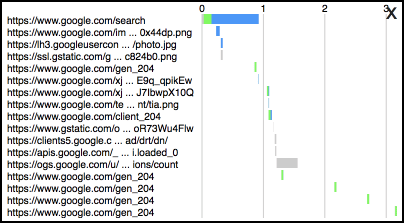
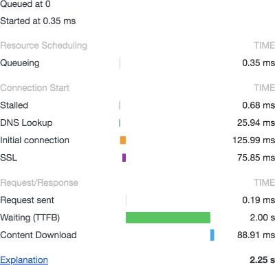
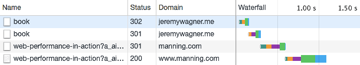

project_path: /web/fundamentals/_project.yaml
book_path: /web/fundamentals/_book.yaml
description: When we measure loading performance, we often do so using testing tools that only describe performance from the perspective of the tester. If we want to measure loading performance from the user's perspective, we must rely on the Navigation and Resource Timing APIs.

{# wf_updated_on: 2018-06-11 #}
{# wf_published_on: 2018-06-08 #}
{# wf_blink_components: Blink>PerformanceAPIs,Blink>PerformanceAPIs>NavigationTiming,Blink>PerformanceAPIs>ResourceTiming #}

# Assessing Loading Performance in Real Life with Navigation and Resource Timing {: .page-title }



Chances are good you've opened your browser's dev tools at some point, [used the
network panel](/web/tools/chrome-devtools/network-performance/) (or perhaps even
[Lighthouse](/web/tools/lighthouse/)) to assess performance, and discovered
opportunities for improvement. Then you've refactored code, improved
performance, watched metrics improve, and congratulated yourself. A job well
done!

Only you're _not_ done, because a problem still remains: The tests you've
performed are
[_synthetic_](/web/fundamentals/performance/speed-tools/#lab_data). They don't
tell you how your site is performing for [real users in the
field](/web/fundamentals/performance/speed-tools/#field_data).

It's not that synthetic testing is _bad_, it's that it's only a part of a much
larger picture of loading performance. No matter how many synthetic testing
tools you use, they'll only ever provide data from a single perspective: From
whatever device and network connection the test was run. Sure, the improvements
you make based on synthetic test recommendations will help all your users, but
to _which degree_ is something you won't understand as long as synthetic testing
remains your only performance measurement strategy.

This is where Real User Monitoring (RUM) comes in. RUM relies on JavaScript APIs
in the browser to gather statistics on how sites perform for _real users_. Two
specific APIs measure how fast documents and resources load for users by
capturing [high-resolution
timings](/web/updates/2012/08/When-milliseconds-are-not-enough-performance-now)
which measure various phases of resource loading. These are the Network and
Resource Timing APIs, and this guide will help you make sense of the data they
provide.

## Easy APIs to help you understand network requests in the browser

Navigation and Resource Timing overlap significantly with one another, yet they
each collect metrics for different things:

- [**Navigation Timing**](https://w3c.github.io/navigation-timing/) collects
performance metrics for HTML documents.
- [**Resource Timing**](https://w3c.github.io/resource-timing/) collects
performance metrics for document-dependent resources. Stuff like style sheets,
scripts, images, _et cetera_.

If you don't know anything about either API, you might be tempted to brush them
off as too complex or unnecessary. The truth is, it's easy to _get_ data from
these APIs, and that data is _critical_ for measuring loading performance for
actual users. The _hard_ part is making sense of the data they provide, but
we'll cover all that soon enough. For now, let's experiment a little in the
console.

Navigation and Resource Timing (as well as other related APIs) store
_performance entries_ in a _performance entry buffer_. In simpler terms, that
just means they store performance metrics for pages and resources into a list
accessible by JavaScript. Those methods exist in the `window.performance`
namespace, and they help us query this list in different ways. For now, though,
let's keep it simple and stick with the [`getEntriesByType`
method](https://developer.mozilla.org/en-US/docs/Web/API/Performance/getEntriesByType).
To start, load any page in your browser, open the console, and enter either (or
both) of these commands:

```javascript
// Get Navigation Timing entries:
performance.getEntriesByType("navigation");

// Get Resource Timing entries:
performance.getEntriesByType("resource");
```

`getEntriesByType` accepts a string describing the type of entries you want. To
get Navigation Timing entries, use `"navigation"`. For Resource Timing entries,
use `"resource"`. After you run this, you'll see an array with an object of
performance timings for the current page that looks something like this:

```javascript
{
  "connectEnd": 152.20000001136214,
  "connectStart": 85.00000007916242,
  "decodedBodySize": 1270,
  "domComplete": 377.90000007953495,
  "domContentLoadedEventEnd": 236.4000000525266,
  "domContentLoadedEventStart": 236.4000000525266,
  "domInteractive": 236.2999999895692,
  "domainLookupEnd": 85.00000007916242,
  "domainLookupStart": 64.4000000320375,
  "duration": 377.90000007953495,
  "encodedBodySize": 606,
  "entryType": "navigation",
  "fetchStart": 61.600000015459955,
  "initiatorType": "navigation",
  "loadEventEnd": 377.90000007953495,
  "loadEventStart": 377.90000007953495,
  "name": "https://example.com/",
  "nextHopProtocol": "h2",
  "redirectCount": 0,
  "redirectEnd": 0,
  "redirectStart": 0,
  "requestStart": 152.50000008381903,
  "responseEnd": 197.80000008177012,
  "responseStart": 170.00000004190952,
  "secureConnectionStart": 105.80000001937151,
  "startTime": 0,
  "transferSize": 789,
  "type": "navigate",
  "unloadEventEnd": 0,
  "unloadEventStart": 0,
  "workerStart": 0
}
```

The density of this information can be overwhelming, but just remember one
thing: Any time you've seen a waterfall chart, you're looking at a visual
representation of the data these APIs provide! In fact, it's possible to
generate your own visuals with this data. Good examples of this are scripts like
[Waterfall](https://github.com/andydavies/waterfall) by [Andy
Davies](https://twitter.com/AndyDavies) or
[Performance-Bookmarklet](https://github.com/micmro/performance-bookmarklet) by
[Michael Mrowetz](https://twitter.com/micmro).

<figure>
  
  <figcaption><b>Figure 1</b>. The Waterfall bookmarklet showing timings for a
page and its resources.</figcaption>
</figure>

Navigation and Resource Timing are APIs that help you measure how long stuff
takes to load. Because these APIs are a part of JavaScript, you can use them to
gather vital performance statistics from users when they visit your page. That's
powerful stuff!

## The life and timings of a network request

When you gather timings for page navigations and resource downloads, you're
playing the role of an archaeologist in the sense that you're reconstructing the
fleeting life of a network request after the fact. Sometimes it helps to
visualize a concept, and where network requests are concerned, there's no better
visualization tool than your browser's dev tools.

<figure>
  
  <figcaption><b>Figure 2</b>. How a network request is visualized in the network
panel of Chrome’s developer tools.</figcaption>
</figure>

As you can see, this request has all the fun stuff you'd expect: DNS lookup,
connection, TLS negotiation, and so on. Let's take a look together at the
important (and not so important) bits in Navigation and Resource Timing, and
demonstrate which properties and metrics can help you measure activity vital to
application performance! Let's dig in!

Note: This guide is a bit opinionated on which metrics are most important. If
you want an unopinionated bird's eye view of both APIs and the exact order
metrics appear in, [this Timing processing model
diagram](https://www.w3.org/TR/navigation-timing-2/#processing-model) is super
helpful.

### DNS lookup

When a user requests a URL, the Domain Name System (DNS) is queried to translate
a domain to an IP address. Depending any number of factors (notably DNS caches),
this process can take significant time. Or perhaps not, but maybe it's something
you want to measure anyway. Navigation and Resource Timing both expose two
DNS-related metrics:

- `domainLookupStart` marks when a DNS lookup starts.
- `domainLookupEnd` marks when a DNS lookup ends.

Quite simple, really! When a network request phase is this linear, measuring its
duration is as easy as subtracting the start metric from the end metric:

```javascript
// Measuring DNS lookup time
var pageNav = performance.getEntriesByType("navigation")[0];
var dnsTime = pageNav.domainLookupEnd - pageNav.domainLookupStart;
```

Now for some bad news: You can't _always_ rely on some metrics to be populated.
Some properties in both APIs will be `0` under certain conditions. For example,
both `domainLookupStart` and `domainLookupEnd` (and others) can be `0` for a
resource served by a third party if that host doesn't set a proper
[`Timing-Allow-Origin`](https://developer.mozilla.org/en-US/docs/Web/HTTP/Headers/Timing-Allow-Origin)
response header. We won't get into the weeds on this just yet, but [we'll talk
about it later on](#cross-origins_and_the_timing-allow-origin_header). For now,
let's move on.

### Connection negotiation

When a connection to a server is made, latency occurs as the client and server
sort things out prior to sending resources to the client. If HTTPS is used
([which is increasingly
common](https://httparchive.org/reports/state-of-the-web#pctHttps)), this
process also includes TLS negotiation time. The connection phase consists of
three metrics:

- `connectStart` marks when the client opens a connection to the server.
- `secureConnectionStart` marks when the client begins TLS negotiation.
- `connectEnd` marks when connection negotiation ends (including TLS time).

These are _almost_ as simple as DNS metrics, but `secureConnectionStart` changes
things up. You may ask "why isn't there a `secureConnectionEnd` property?" The
answer is that TLS negotiation ends at the same time as `connectEnd`. In cases
where HTTPS isn't used (or [an HTTP connection
persists](https://en.wikipedia.org/wiki/HTTP_persistent_connection)), this value
will be `0`, so you'll need to perform appropriate checks rather than assuming
it will always be populated:

```javascript
// Quantifying total connection time
var pageNav = performance.getEntriesByType("navigation")[0];
var connectionTime = pageNav.connectEnd - pageNav.connectStart;
var tlsTime = 0; // <-- Assume 0 by default

// Did any TLS stuff happen?
if (pageNav.secureConnectionStart > 0) {
  // Awesome! Calculate it!
  tlsTime = pageNav.connectEnd - pageNav.secureConnectionStart;
}
```

After a domain's IP is looked up and a connection is established, the _real_ fun
starts.

### Requests and responses

When we think of what affects page speed, we're considering two factors:

- **Extrinsic factors:** This is stuff like connection latency and bandwidth.
They're (mostly) out of our control as developers.
- **Intrinsic factors:** These are things we have more control over, such as
server and client side architecture, and resource size.

Both types of factors affect request and response speed. Metrics related to this
process are arguably most important of all, as they tell a story of how long
each resource took to arrive. Both Navigation and Resource Timing describe
requests and responses with these metrics:

- `fetchStart` marks when the browser starts to fetch a resource. This is distinct
from a request in that it doesn't mark when the browser makes a network request
for a resource, but rather when it begins checking caches (e.g., HTTP and
service worker caches) to see if a network request is even necessary.
- `workerStart` marks when a request is being fetched from a [service
worker](/web/fundamentals/primers/service-workers/) within a [`fetch` event
handler](https://developer.mozilla.org/en-US/docs/Web/API/FetchEvent) (if
applicable). This will be always be `0` if a service worker isn't installed for
the current page.
- `requestStart` is when the browser issues the network request.
- `responseStart` is when the first byte of the response arrives.
- `responseEnd` is when the last byte of the response arrives.

You can use these metrics to measure many aspects of loading performance. For
example, you could measure resource download time while keeping cache seek times
in mind:

```javascript
// Cache seek plus response time
var pageNav = performance.getEntriesByType("navigation")[0];
var fetchTime = pageNav.responseEnd - pageNav.fetchStart;

// Service worker time plus response time
var workerTime = 0;

if (pageNav.workerStart > 0) {
  workerTime = pageNav.responseEnd - pageNav.workerStart;
}
```

You can also measure a bunch of other useful stuff as the code below
demonstrates:

```javascript
// Request plus response time (network only)
var totalTime = pageNav.responseEnd - pageNav.requestStart;

// Response time only (download)
var downloadTime = pageNav.responseEnd - pageNav.responseStart;

// Time to First Byte (TTFB)
var ttfb = pageNav.responseStart - pageNav.requestStart;
```

### The other stuff

Now that we've covered the most important metrics provided by Navigation and
Resource Timing, let's briefly look at some of their less consequential metrics.

#### Document unloading

Unloading is when the browser does some housekeeping prior to loading a new
page. This isn't a big deal in typical circumstances, but it _could_ be worth
quantifying if you have code (especially from third parties) running in a
[`unload` event
handler](https://developer.mozilla.org/en-US/docs/Web/Events/unload) that holds
up the next page from rendering. If that describes your situation, you'll want
to pay attention to the
[`unloadEventStart`](https://developer.mozilla.org/en-US/docs/Web/API/PerformanceNavigationTiming/unloadEventStart)
and
[`unloadEventEnd`](https://developer.mozilla.org/en-US/docs/Web/API/PerformanceNavigationTiming/unloadEventEnd)
metrics.

Note: Unload metrics are exclusive to Navigation Timing.

#### Redirects

OK, page redirects aren't _totally_ inconsequential, but they might not be
something you run into very often. Still, redirects add latency to requests, so
measuring them may be worth the effort.

<figure>
  
  <figcaption><b>Figure 3</b>. A redirect chain shown in Chrome’s developer
tools.</figcaption>
</figure>

If you're concerned about redirects, both APIs provide the
[`redirectStart`](https://developer.mozilla.org/en-US/docs/Web/API/PerformanceResourceTiming/redirectStart)
and
[`redirectEnd`](https://developer.mozilla.org/en-US/docs/Web/API/PerformanceResourceTiming/redirectEnd)
metrics, which makes measuring redirect time a trivial task.

#### Document processing

When HTML documents load, the browser takes time to process them. Navigation
Timing exposes metrics to measure this, but they aren't usually consequential
unless _perhaps_ you're serving huge documents. If you're interested in document
processing metrics, they're
[`domInteractive`](https://developer.mozilla.org/en-US/docs/Web/API/PerformanceNavigationTiming/domInteractive),
[`domContentLoadedEventStart`](https://developer.mozilla.org/en-US/docs/Web/API/PerformanceNavigationTiming/domContentLoadedEventStart),
[`domContentLoadedEventEnd`](https://developer.mozilla.org/en-US/docs/Web/API/PerformanceNavigationTiming/domContentLoadedEventEnd),
and
[`domComplete`](https://developer.mozilla.org/en-US/docs/Web/API/PerformanceNavigationTiming/domComplete).

Note: Document processing metrics are exclusive to Navigation Timing.

#### Loading

When a document and its resources have completely finished loading, the browser
fires a [`load`
event](https://developer.mozilla.org/en-US/docs/Web/Events/load). Some emphasize
load time as the metric supreme, but [a shift in
focus](https://www.stevesouders.com/blog/2013/05/13/moving-beyond-window-onload/)
has taken place to prioritize perceptual metrics (e.g., [Speed
Index](https://sites.google.com/a/webpagetest.org/docs/using-webpagetest/metrics/speed-index))
over load time.

Still, measuring load time may be helpful to you.
[`loadEventStart`](https://developer.mozilla.org/en-US/docs/Web/API/PerformanceNavigationTiming/loadEventStart)
and
[`loadEventEnd`](https://developer.mozilla.org/en-US/docs/Web/API/PerformanceNavigationTiming/loadEventEnd)
can help you with that when it comes to documents, but it's probably easiest to
just use the `duration` property.

Note: `loadEventStart` and `loadEventEnd` metrics are exclusive to Navigation
Timing.

#### Document and resource size

The _size_ of a document or resource is undoubtedly influential on loading
performance. Fortunately, both APIs expose properties for quantifying resource
payloads:

- `transferSize` is the _total size_ of the resource including HTTP headers.
- `encodedBodySize` is the _compressed size_ of the resource _excluding_ HTTP
headers.
- `decodedBodySize` is the _decompressed size_ of the resource (again, excluding
HTTP headers).

Using simple arithmetic, it's easy to figure out how much of a response consists
of HTTP headers or even compression ratios:

```javascript
// HTTP header size
var pageNav = performance.getEntriesByType("navigation")[0];
var headerSize = pageNav.transferSize - pageNav.encodedBodySize;

// Compression ratio
var compressionRatio = pageNav.decodedBodySize / pageNav.encodedBodySize;
```

You'll likely already be aware of resource size, and you don't really need an
API to tell you this stuff, as the network panel in any browser's dev tools
conveys this information. But the information _is_ there if you need it.

## Acquiring timings in application code

Now that you know some of the metrics provided by these APIs, let's cover how
you can collect that data in your application code.

### Other methods for manually grabbing timings

Earlier in this guide, you dabbled with `getEntriesByType`, which is great for
grabbing performance entries of a specific type. There are two other related
methods worth mentioning, however.

#### `getEntriesByName`

[`getEntriesByName`](https://developer.mozilla.org/en-US/docs/Web/API/Performance/getEntriesByName)
gets a performance entry by its name. For Navigation and Resource Timing, this
is the URL for the document or resource:

```javascript
// Get timing data for an important hero image
var heroImageTime = performance.getEntriesByName("https://somesite.com/images/hero-image.jpg");
```

This is _super_ useful if you need to get a performance entry for a single
resource. It's also a better performing alternative to filtering out an array by
other means.

#### getEntries

Unlike `getEntriesByName` and `getEntriesByType`,
[`getEntries`](https://developer.mozilla.org/en-US/docs/Web/API/Performance/getEntries)
gets everything in the performance entry buffer by default:

```javascript
// Get timing data for an important hero image
var allTheTimings = performance.getEntries();
```

But wait, there's more! `getEntries` can also serve as more verbose alternatives
to `getEntriesByName` and `getEntriesByType`:

```javascript
// Get timing data for an important hero image
var allTheTimings = performance.getEntries({
  // Get entries by name
  "name": "https://somesite.com/images/hero-image.jpg",
  // Get entries by type
  "entryType": "resource",
  // Get entries by their initiatorType value:
  "initiatorType": "img"
});
```

If `initiatorType` looks new to you, that's because I didn't cover it here.
[Find out more about `initiatorType` at
MDN](https://developer.mozilla.org/en-US/docs/Web/API/PerformanceResourceTiming/initiatorType).

### Listen for performance entries using PerformanceObserver

Because methods like `getEntriesByType` return arrays, you may be tempted to use
a loop to work with them and say "good enough", but this approach is problematic
for the following reasons:

- Loops, especially over arrays with many entries, tie up the main thread.
- Loops only capture performance entries available at the time the loop was run.
Periodically polling the performance entry buffer via a timer is expensive, and
competes with the renderer which can cause jank.

[`PerformanceObserver`](/web/updates/2016/06/performance-observer) was created
to address such annoyances. Using an observer pattern similar to
[Mutation](https://developer.mozilla.org/en-US/docs/Web/API/MutationObserver) or
[Intersection
Observer](https://developer.mozilla.org/en-US/docs/Web/API/IntersectionObserver),
you can assign a callback that runs whenever new performance entries are
recorded:

```javascript
// Instantiate the performance observer
var perfObserver = new PerformanceObserver(function(list, obj) {
  // Get all the resource entries collected so far
  // (You can also use getEntriesByType/getEntriesByName here)
  var entries = list.getEntries();

  // Iterate over entries
  for (var i = 0; i < entries.length; i++) {
    // Do the work!
  }
});

// Run the observer
perfObserver.observe({
  // Polls for Navigation and Resource Timing entries
  entryTypes: ["navigation", "resource"]
});
```

This pattern can initially feel awkward if you don't have experience with
observers, but it soon becomes second nature. Word to the wise:
`PerformanceObserver` isn't available in all browsers Navigation and Resource
Timing are available in! In fact, both Internet Explorer and Edge don't support
`PerformanceObserver`, so feature check to avoid weirdness:

```javascript
// Should we even be doing anything with perf APIs?
if ("performance" in window) {
  // OK, yes. Check PerformanceObserver support
  if ("PerformanceObserver" in window) {
    // Observe ALL the performance entries!
  } else {
    // WOMP WOMP. Find another way. Or not.
  }
}
```

With code like this, you can decide for yourself how you should collect
performance timings (if at all). You may decide that collecting timings isn't
worth the trouble if `PerformanceObserver` isn't available. And that's totally
up to you!

### The gotchas

Working with timings isn't always straightforward. As you'll recall from
earlier, we brought up how some timings may be populated the way you'd expect in
some circumstances, and there can be other sticky situations.

#### Cross-origins and the Timing-Allow-Origin header

Collecting metrics for cross-origin resources is weird, because not all
performance timings are accessible for them if a [`Timing-Allow-Origin`
header](https://developer.mozilla.org/en-US/docs/Web/HTTP/Headers/Timing-Allow-Origin)
isn't set. To find out which metrics are affected by this, check out [this
section](https://www.w3.org/TR/resource-timing-2/#cross-origin-resources) of the
Resource Timing spec.

If you run an application on multiple domains, or serve public assets as a third
party, you should set an appropriate `Timing-Allow-Origin` header so developers
can capture timings for resources hosted on them. Check out [the MDN
documentation for
`Timing-Allow-Origin`](https://developer.mozilla.org/en-US/docs/Web/HTTP/Headers/Timing-Allow-Origin)
to learn more.

#### Persistent connections affect timings

A persistent HTTP connection is when a connection is reused to transmit
additional resources. This happens in HTTP/1 when a [`Connection: Keep-Alive`
header](https://developer.mozilla.org/en-US/docs/Web/HTTP/Headers/Keep-Alive) is
used. When content is served over HTTP/2, a single connection is used to stream
_all_ resources for that origin. This behavior affects timings. It's not
something you may have to explicitly check for, it's just something to be aware
of when working with metrics later on.

#### These APIs aren't available everywhere

If working on the web has taught you anything, it's that you can't depend on
APIs being available everywhere. This is equally true of Navigation and Resource
Timing. The great thing about methods like `getEntriesByType` is that if they're
available, they won't throw errors if they can't find anything.

This is great and all, but it can lead to a bit of confusion. In the curious
case of Safari (as of version 11.2), Resource Timing is supported, but
Navigation Timing isn't. That leads to situations like this:

```javascript
// This returns stuff!
performance.getEntriesByType("resource");

// Not so much. :\
performance.getEntriesByType("navigation");
```

While this is a pain, it's not the end of the world. When you grab entries with
these methods, just check if anything was returned:

```javascript
if (performance.getEntriesByType("navigation").length > 0) {
  // Yay, we have Navigation Timing stuff!
}
```

Whether or not a browser supports these APIs, this is just a smart check to
make. You should never make assumptions about what data might be available,
because there are always cases where assumptions can backfire.

## Phoning home

So we now know how to use these APIs and get data from them, but how do you get
that data to a place where you can work with it? While this is by no means an
exhaustive reference on RUM data collection, it's a place to start.

### Using `navigator.sendBeacon`

You've collected performance entries, and now you're ready to send them
someplace to be analyzed later. But what's the best way?

Normally we'd POST timings to an endpoint during an `unload` event, because this
is when we know definitively the user is finished with the page. The problem,
however, is that running code during `unload` can hold the next page up from
downloading and rendering. We need to send data back in a way that won't tie up
the browser while it loads a new page. For this, we have
[`navigator.sendBeacon`](https://developer.mozilla.org/en-US/docs/Web/API/Navigator/sendBeacon),
which queues non-blocking requests with POST data to be sent asynchronously at a
time of the browser's choosing:

```javascript
window.addEventListener("unload", function() {
  // Caution: If you have a _lot_ of performance entries, don't send _everything_ via getEntries. This is just an example.
  let rumData = new FormData();
  rumData.append("entries", JSON.stringify(performance.getEntries()));

  // Queue beacon request and inspect for failure
  if(!navigator.sendBeacon("/phone-home", rumData)) {
    // Recover here (XHR or fetch maybe)
  }
}, false);
```

On the other end would be some back end code that looks at the POST form data
and decides what to do with it from there. How you do this depends on your
application back end.

Note: `navigator.sendBeacon` only _queues_ the request when called, and may not
fulfill it immediately. Additionally, user agents pose restrictions on how much
data may be sent, and may reject the request if that limit is exceeded.

### When navigator.sendBeacon is unavailable

[While `navigator.sendBeacon` is well
supported](https://caniuse.com/#feat=beacon), you can't use it in all browsers.
Thus, some basic feature checking is necessary:

```javascript
window.addEventListener("unload", function() {
  // Collect RUM data like before
  let rumData = new FormData();
  rumData.append("entries", JSON.stringify(performance.getEntries()));

  // Check for sendBeacon support:
  if("sendBeacon" in navigator) {
    // Beacon the requested
    if(navigator.sendBeacon(endpoint, rumData)) {
      // sendBeacon worked! We're good!
    } else {
      // sendBeacon failed! Use XHR or fetch instead
    }
  } else {
    // sendBeacon not available! Use XHR or fetch instead
  }
}, false);
```

With this approach, you'll be able to reliably transmit RUM data in most
browsers. If total coverage isn't crucial, you can always opt to _not_ transmit
data when `navigator.sendBeacon` is unavailable.

## Wrapping up

To wrap up, here's some rather opinionated, er, opinions: If you're not
confident on how these timings work, don't calculate metrics on the front end
and send that computed data to your back end. Store the original metrics and
work with those later. This is advantageous for a number of reasons, but
primarily because it's flexible. If you store the original metrics, you can
always make corrections later in case of a measurement error.

Finally, you don't need to store _every_ metric these APIs provide. For example,
if you know for a fact you don't need to measure DOM processing time, don't feel
like you _have_ to store those metrics.

Of course, this guide isn't meant to be an exhaustive resource on these APIs,
but rather to help you start using them with some confidence. If you want
alternative perspectives on this topic, here's some additional reading:

- [Navigation Timing Level 2 Spec.](https://www.w3.org/TR/navigation-timing-2/)
- [Resource Timing Level 2 Spec.](https://www.w3.org/TR/resource-timing-2/)
- [Understanding Resource
Timing.](/web/tools/chrome-devtools/network-performance/understanding-resource-timing)
- [ResourceTiming in Practice.](https://nicj.net/resourcetiming-in-practice/)
- [Using Navigation Timing APIs to Understand Your
Webpage.](https://community.akamai.com/community/web-performance/blog/2016/08/25/using-navigation-timing-apis-to-understand-your-webpage)

Even if you normally shy away from deeply technical reads, the official specs
for Navigation and Resource Timings are easy to understand. They also break out
gotchas in a hugely beneficial way. If you ever ask yourself questions like
"when _is_ `secureConnectionStart` `0`?", the specifications explain all the
weirdness quite well.

With these APIs at your command, you'll be better equipped to understand how
loading performance is experienced by real users. This means you'll be better
equipped to diagnose and address performance issues in the wild, and that
knowledge is truly powerful.

_Special thanks to [Paul Irish](/web/resources/contributors/paulirish), Gray
Norton, [Addy Osmani](/web/resources/contributors/addyosmani), and [Philip
Walton](/web/resources/contributors/philipwalton) for their valuable feedback,
which significantly improved the quality of this article._
