project_path: /web/fundamentals/_project.yaml
book_path: /web/fundamentals/_book.yaml
description: Image formats!

{# wf_updated_on: 2017-12-15 #}
{# wf_published_on: 2017-11-16 #}
{# wf_blink_components: Blink>Image,Internals>Images,Internals>Images>Codecs #}

# Automating image optimization {: .page-title }



**We should all be automating our image compression.**

In 2017, image optimization should be automated. It's easy to forget, best
practices change, and content that doesn't go through a build pipeline can
easily slip. To automate: Use [imagemin](https://github.com/imagemin/imagemin)
or [libvps](https://github.com/jcupitt/libvips) for your build process. Many
alternatives exist.

Most CDNs (e.g
[Akamai](https://www.akamai.com/us/en/solutions/why-akamai/image-management.jsp))
and third-party solutions like [Cloudinary](https://cloudinary.com),
[imgix](https://imgix.com), [Fastly's Image
Optimizer](https://www.fastly.com/io/), [Instart Logic's
SmartVision](https://www.instartlogic.com/technology/machine-learning/smartvision)
or [ImageOptim API](https://imageoptim.com/api) offer comprehensive automated
image optimization solutions.

The amount of time you'll spend reading blog posts and tweaking your config is
greater than the monthly fee for a service (Cloudinary has a
[free](http://cloudinary.com/pricing) tier). If you don't want to outsource this
work for cost or latency concerns, the open-source options above are solid.
Projects like [Imageflow](https://github.com/imazen/imageflow) or
[Thumbor](https://github.com/thumbor/thumbor) enable self-hosted alternatives.

**Everyone should be compressing their images efficiently.**

At minimum: use [ImageOptim](https://imageoptim.com/). It can significantly
reduce the size of images while preserving visual quality. Windows and Linux
[alternatives](https://imageoptim.com/versions.html) are also available.

More specifically: run your JPEGs through
[MozJPEG](https://github.com/mozilla/mozjpeg) (`q=80` or lower is fine for web
content) and consider [Progressive
JPEG](http://cloudinary.com/blog/progressive_jpegs_and_green_martians) support,
PNGs through [pngquant](https://pngquant.org/) and SVGs through
[SVGO](https://github.com/svg/svgo). Explicitly strip out metadata (`--strip`
for pngquant) to avoid bloat. Instead of crazy huge animated GIFs, deliver
[H.264](https://en.wikipedia.org/wiki/H.264/MPEG-4_AVC) videos (or
[WebM](https://www.webmproject.org/) for Chrome, Firefox and Opera)! If you
can't at least use [Giflossy](https://github.com/pornel/giflossy). If you can
spare the extra CPU cycles, need higher-than-web-average quality and are okay
with slow encode times: try
[Guetzli](https://research.googleblog.com/2017/03/announcing-guetzli-new-open-source-jpeg.html).

Some browsers advertise support for image formats via the Accept request header.
This can be used to conditionally serve formats: e.g lossy
[WebP](/speed/webp/) for Blink-based browsers like
Chrome and fallbacks like JPEG/PNG for other browsers.

There's always more you can do. Tools exists to generate and serve `srcset`
breakpoints. Resource selection can be automated in Blink-based browsers with
[client-hints](/web/updates/2015/09/automating-resource-selection-with-client-hints)
and you can ship fewer bytes to users who opted into "data savings" in-browser
by heeding the
[Save-Data](/web/updates/2016/02/save-data) hint.


The smaller in file-size you can make your images, the better a network
experience you can offer your users - especially on mobile. In this write-up,
we'll look at ways to reduce image size through modern compression techniques
with minimal impact to quality.

## Introduction {: #introduction }

**Images are still the number one cause of bloat on the web.**

Images take up massive amounts of internet bandwidth because they often have
large file sizes. According to the [HTTP Archive](http://httparchive.org/), 60%
of the data transferred to fetch a web page is images composed of JPEGs, PNGs
and GIFs. As of July 2017, images accounted for
[1.7MB](http://httparchive.org/interesting.php#bytesperpage) of the content
loaded for the 3.0MB average site.

Per Tammy Everts, adding images to a page or making existing images larger have
been
[proven](https://calendar.perfplanet.com/2014/images-are-king-an-image-optimization-checklist-for-everyone-in-your-organization/)
to increase conversion rates. It's unlikely that images will go away and so
investing in an efficient compression strategy to minimize bloat becomes
important.


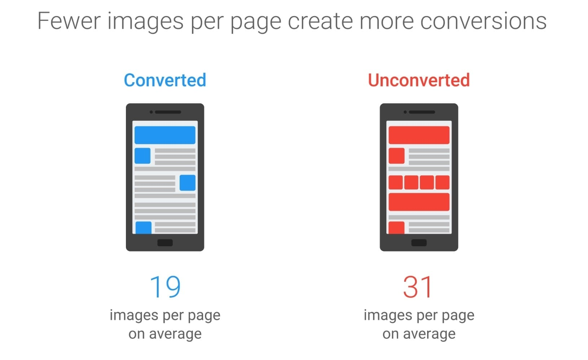

Per [Soasta/Google
research](https://www.thinkwithgoogle.com/marketing-resources/experience-design/mobile-page-speed-load-time/)
from 2016, images were the 2nd highest predictor of conversions with the best
pages having 38% fewer images.


Image optimization consists of different measures that can reduce the file size
of your images. It ultimately depends on what visual fidelity your images
require.


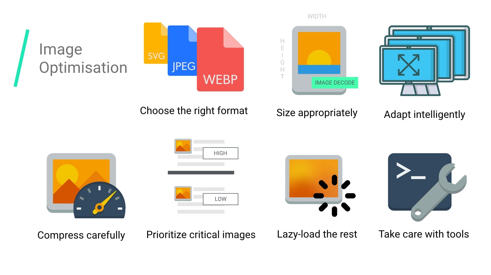 <strong>Image optimization:</strong> Choose the
        right format, compress carefully and prioritize critical images over
        those that can be lazy-loaded.


Common image optimizations include compression, responsively serving them down
based on screen size using
[`<picture>`](/web/fundamentals/design-and-ux/responsive/images)/[``](/web/fundamentals/design-and-ux/responsive/images),
and resizing them to reduce image decode costs.


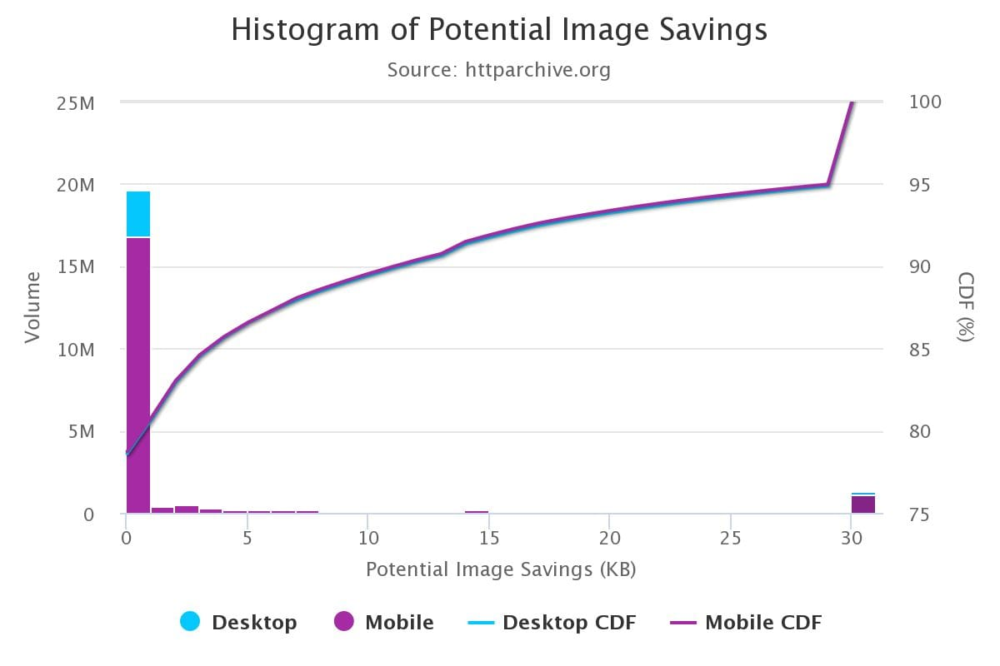 Per the [HTTP
       Archive](http://jsfiddle.net/rviscomi/rzneberp/embedded/result/),
       per-image savings at the 95th percentile (looking at the Cumulative
       Distribution Function) are 30KB!</strong>


There's plenty of room for us to collectively optimize images better.


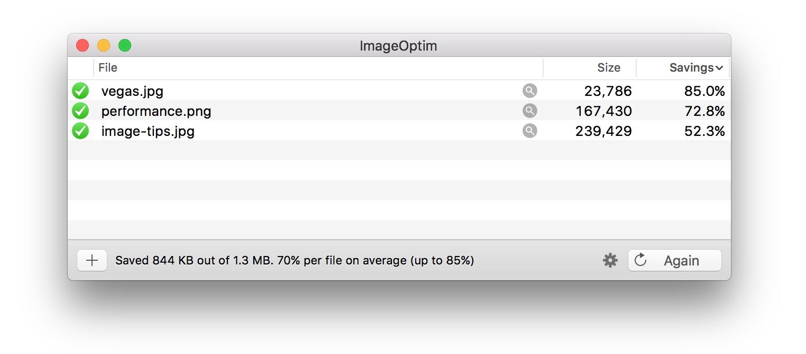

ImageOptim is free, reduces image size through modern compression techniques and
by stripping unnecessary EXIF meta-data.


If you're a designer, there's also an [ImageOptim plugin for
Sketch](https://github.com/ImageOptim/Sketch-plugin) that will optimize your
assets on export. I've found it a huge time saver.

### How can I tell if my images need to be optimized? {: #do-my-images-need-optimization }

Perform a site audit through [WebPageTest.org](https://www.webpagetest.org/) and
it will highlight opportunities to better optimize your images (see "Compress
Images").


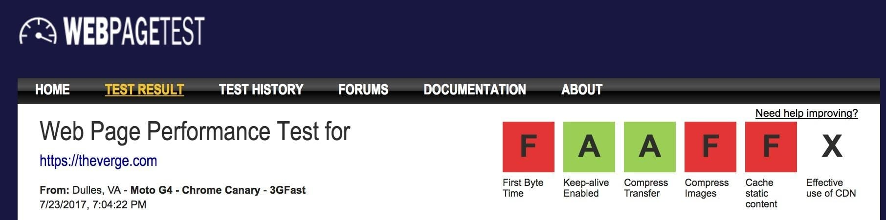

The "Compress Images" section of a WebPageTest report lists images that can be
compressed more efficiently and the estimated file-size savings of doing so.

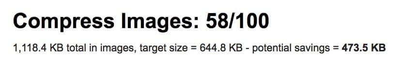


[Lighthouse](/web/tools/lighthouse/) audits for performance best practices. It
includes audits for image optimization and can make suggestions for images that
could be compressed further or point out images that are off-screen and could be
lazy-loaded.

As of Chrome 60, Lighthouse now powers the [Audits
panel](/web/updates/2017/05/devtools-release-notes#lighthouse) in the Chrome
DevTools:


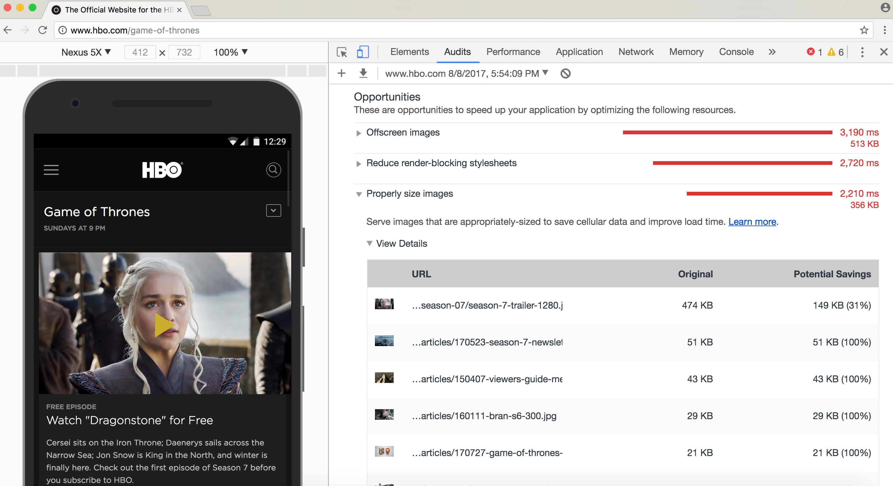 Lighthouse
        can audit for Web Performance, Best Practices and Progressive Web App
        features.


You may also be familiar of other performance auditing tools like [PageSpeed
Insights](/speed/pagespeed/insights/) or [Website Speed
Test](https://webspeedtest.cloudinary.com/) by Cloudinary which includes a
detailed image analysis audit.

## <a id="choosing-an-image-format" href="#choosing-an-image-format">How do I choose an image format?</a>

As Ilya Grigorik notes in his excellent [image optimization
guide](/web/fundamentals/performance/optimizing-content-efficiency/image-optimization),
the "right format" for an image is a combination of desired visual results and
functional requirements. Are you working with Raster or Vector images?


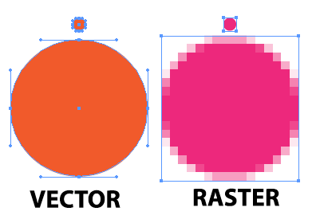


[Raster graphics](https://en.wikipedia.org/wiki/Raster_graphics) represent
images by encoding the values of each pixel within a rectangular grid of pixels.
They are not resolution or zoom independent. WebP or widely supported formats
like JPEG or PNG handle these graphics well where photorealism is a necessity.
Guetzli, MozJPEG and other ideas we've discussed apply well to raster graphics.

[Vector graphics](https://en.wikipedia.org/wiki/Vector_graphics) use points,
lines and polygons to represent images and formats using simple geometric shapes
(e.g logos) offering a high-resolution and zoom like SVG handle this use case
better.

The wrong format can cost you. The logical flow for choosing the right format
can be fraught with peril so experiment with the savings other formats can
afford with care.

Jeremy Wagner has covered
[trade-offs](http://jlwagner.net/talks/these-images/#/2/2) worth considering
when evaluating formats in his image optimization talks.

## The humble JPEG {: #the-humble-jpeg }

The [JPEG](https://en.wikipedia.org/wiki/JPEG) may well be the world's most
widely used image format. As noted earlier, [45% of the
images](http://httparchive.org/interesting.php) seen on sites crawled by HTTP
Archive are JPEGs. Your phone, your digital SLR, that old webcam - everything
pretty much supports this codec. It's also very old, dating all the way back to
1992 when it was first released. In that time, there's been an immense body of
research done attempting to improve what it offers.

JPEG is a lossy compression algorithm that discards information in order to save
space and many of the efforts that came after it attempted to preserve visual
fidelity while keeping file sizes as small as possible.

**What image quality is acceptable for your use-case?**

Formats like JPEG are best suited for photographs or images with a number of
color regions. Most optimization tools will allow you to set what level of
compression you're happy with; higher compression reduces file size but can
introduce artifacts, halos or blocky degrading.


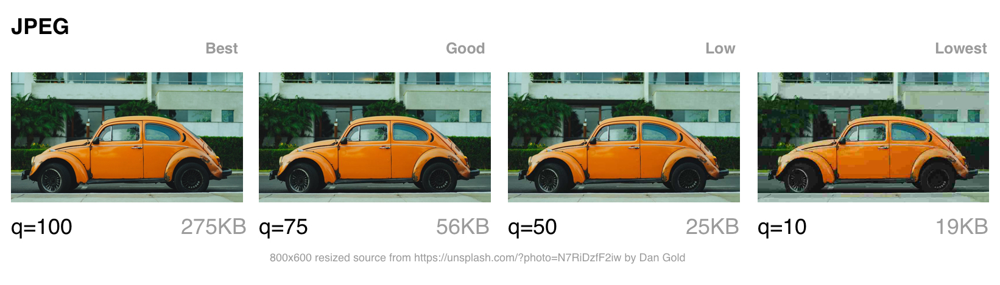

JPEG: Perceivable JPEG compression artifacts can increase as we shift from best
quality to lowest. Note that image quality scores in one tool can be very
different to quality scores in another.


When choosing what quality setting to opt for, consider what quality bucket your
images fall into:

*   **Best quality** - when quality matters more than bandwidth. This may be
    because the image has high prominence in your design or is displayed at full
    resolution.
*   **Good quality** - when you care about shipping smaller file-sizes, but
    don't want to negatively impact image quality too much. Users still care
    about some level of image quality.
*   **Low quality** - when you care enough about bandwidth that image
    degradation is okay. These images are suitable for spotty/poor network
    conditions.
*   **Lowest quality** - bandwidth savings are paramount. Users want a decent
    experience but will accept a pretty degraded experience for the benefit of
    pages loading more quickly.

Next, let's talk about JPEG's compression modes as these can have a large impact
on perceived performance.

Note: It's possible that we sometimes overestimate the image quality that our
users need. Image quality could be considered a deviation from an ideal,
uncompressed source. It can also be subjective.

## JPEG compression modes {: #jpeg-compression-modes }

The JPEG image format has a number of different [compression
modes](http://cs.haifa.ac.il/~nimrod/Compression/JPEG/J5mods2007.pdf). Three
popular modes are baseline (sequential), Progressive JPEG (PJPEG) and lossless.


**How do baseline (or sequential) JPEGs and Progressive JPEGs differ?**

Baseline JPEGs (the default for most image editing and optimization tools) are
encoded and decoded in a relatively simple manner: top to bottom. When baseline
JPEGs load on slow or spotty connections, users see the top of the image with
more of it revealed as the image loads. Lossless JPEGs are similar but have a
smaller compression ratio.


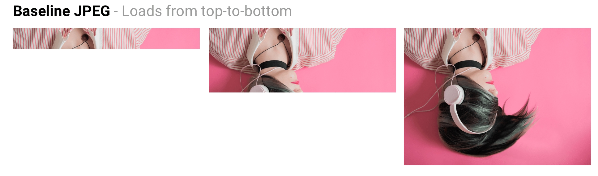
        Baseline JPEGs load top to bottom while Progressive JPEGs load from
        blurry to sharp.


Progressive JPEGs divide the image into a number of scans. The first scan shows
the image in a blurry or low-quality setting and following scans improve image
quality. Think of this as "progressively" refining it. Each "scan" of an image
adds an increasing level of detail. When combined this creates a full-quality
image.


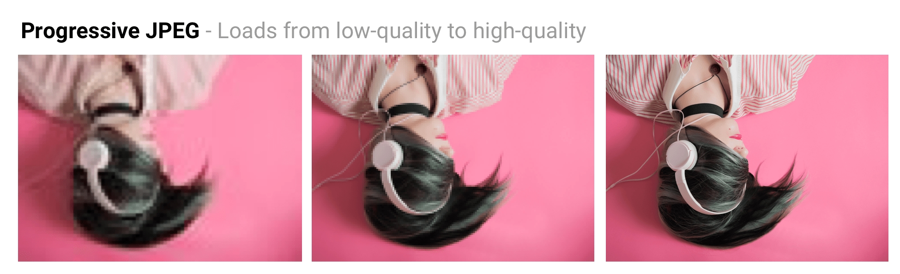 </picture> Baseline JPEGs load
        images from top to bottom. PJPEGs load from low-resolution (blurry) to
        high-resolution. Pat Meenan wrote an [interactive
        tool](http://www.patrickmeenan.com/progressive/view.php?img=https%3A%2F%2Fwww.nps.gov%2Fplanyourvisit%2Fimages%2FGrandCanyonSunset_960w.jpg)
        to test out and learn about Progressive JPEG scans too.


Lossless JPEG optimization can be achieved by [removing EXIF
data](http://www.verexif.com/en/) added by digital cameras or editors,
optimizing an image's [Huffman
tables](https://en.wikipedia.org/wiki/Huffman_coding), or rescanning the image.
Tools like [jpegtran](http://jpegclub.org/jpegtran/) achieve lossless
compression by rearranging the compressed data without image degradation.
[jpegrescan](https://github.com/kud/jpegrescan),
[jpegoptim](https://github.com/tjko/jpegoptim) and
[mozjpeg](https://github.com/mozilla/mozjpeg) (which we'll cover shortly) also
support lossless JPEG compression.


### The advantages of Progressive JPEGs {: #the-advantages-of-progressive-jpegs }

The ability for PJPEGs to offer low-resolution "previews" of an image as it
loads improves perceived performance - users can feel like the image is loading
faster compared to adaptive images.

On slower 3G connections, this allows users to see (roughly) what's in an image
when only part of the file has been received and make a call on whether to wait
for it to fully load. This can be more pleasant than the top-to-bottom display
of images offered by baseline JPEGs.


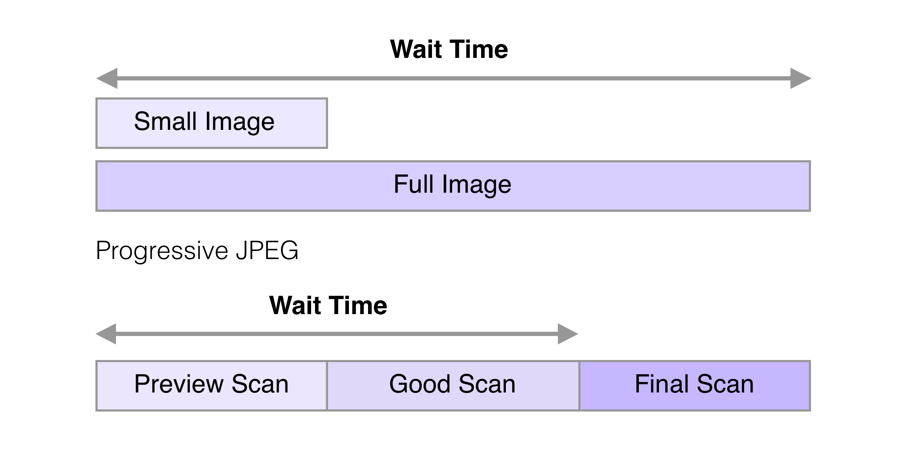 In 2015, [Facebook switched to PJPEG (for their iOS
        app)](https://code.facebook.com/posts/857662304298232/faster-photos-in-facebook-for-ios/)
        and saw a 10% reduction in data usage. They were able to show a good
        quality image 15% faster than previously, optimizing perceived loading
        time, as shown in the figure above.


PJPEGs can improve compression, consuming
[2-10%](http://www.bookofspeed.com/chapter5.html) less bandwidth compared to
baseline/simple JPEGs for images over 10KB. Their higher compression ratio is
thanks to each scan in the JPEG being able to have its own dedicated optional
[Huffman table](https://en.wikipedia.org/wiki/Huffman_coding). Modern JPEG
encoders (e.g [libjpeg-turbo](http://libjpeg-turbo.virtualgl.org/), MozJPEG,
etc.) take advantage of PJPEG’s flexibility to pack data better.

Note: Why do PJPEGs compress better? Baseline JPEG blocks are encoded one at a
time. With PJPEGs, similar [Discrete Cosine
Transform](https://en.wikipedia.org/wiki/Discrete_cosine_transform) coefficients
across more than one block can be encoded together leading to better
compression.

### Who's using Progressive JPEGs in production? {: #whos-using-progressive-jpegs-in-production }

*   [Twitter.com ships Progressive
    JPEGs](https://www.webpagetest.org/performance_optimization.php?test=170717_NQ_1K9P&run=2#compress_images)
    with a baseline of quality of 85%. They measured user perceived latency
    (time to first scan and overall load time) and found overall, PJPEGs were
    competitive at addressing their requirements for low file-sizes, acceptable
    transcode and decode times.
*   [Facebook ships Progressive JPEGs for their iOS
    app](https://code.facebook.com/posts/857662304298232/faster-photos-in-facebook-for-ios/).
    They found it reduced data-usage by 15% and enabling them to show a good
    quality image 15% faster.
*   [Yelp switched to Progressive
    JPEGs](https://engineeringblog.yelp.com/2017/06/making-photos-smaller.html)
    and found it was in part responsible for ~4.5% of their image size reduction
    savings. They also saved an extra 13.8% using MozJPEG

### The disadvantages of Progressive JPEGs {: #the-disadvantages-of-progressive-jpegs }

PJPEGs can be slower to decode than baseline JPEGs - sometimes taking 3x as
long. On desktop machines with powerful CPUs this can be less of a concern, but
is on underpowered mobile devices with limited resources. Displaying incomplete
layers takes work as you're basically decoding the image multiple times. These
multiple passes can eat CPU cycles.

Progressive JPEGs are also not *always* smaller. For very small images (like
thumbnails), progressive JPEGs can be larger than their baseline counterparts.
However for such small thumbnails, progressive rendering might not really offer
as much value.

This means that when deciding whether or not to ship PJPEGs, you'll need to
experiment and find the right balance of file-size, network latency and use of
CPU cycles.

Note: PJPEGs (and all JPEGs) can sometimes be hardware decodable on mobile
devices. It doesn't improve on RAM impact, but it can negate some of the CPU
concerns. Not all Android devices have hardware-acceleration support, but high
end devices do, and so do all iOS devices.

Some users may consider progressive loading to be a disadvantage as it can
become hard to tell when an image has completed loading. As this can vary
heavily per audience, evaluate what makes sense for your own users.

### How do you create Progressive JPEGs? {: #how-to-create-progressive-jpegs }

Tools and libraries like [ImageMagick](https://www.imagemagick.org/),
[libjpeg](http://libjpeg.sourceforge.net/),
[jpegtran](http://jpegclub.org/jpegtran/),[
jpeg-recompress](http://jpegclub.org/jpegtran/) and
[imagemin](https://github.com/imagemin/imagemin) support exporting Progressive
JPEGs. If you have an existing image optimization pipeline, there's a good
likelihood that adding progressive loading support could be straight-forward:

```js
const gulp = require('gulp');
const imagemin = require('gulp-imagemin');

gulp.task('images', function () {
    return gulp.src('images/*.jpg')
        .pipe(imagemin({
            progressive: true

        }))
        .pipe(gulp.dest('dist'));
});
```

Most image editing tools save images as Baseline JPEG files by default.


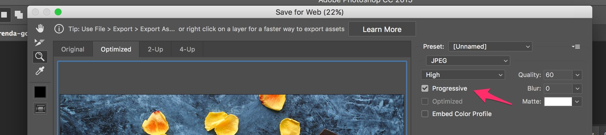 Most image editing tools save images
        as Baseline JPEG files by default. You can save any image you create in
        Photoshop as a Progressive JPEG by going to File -> Export -> Save for
        Web (legacy) and then clicking on the Progressive option. Sketch also
        supports exporting Progressive JPEGs - export as JPG and check the
        ‘Progressive’ checkbox while saving your images.

### Chroma (or color) subsampling {: #chroma-subsampling }

Our eyes are more forgiving to loss of color detail in an image (chroma) than
they are luminance (or luma for short - a measure of brightness). [Chroma
subsampling](https://en.wikipedia.org/wiki/Chroma_subsampling) is a form of
compression that reduces the precision of color in a signal in favor of luma.
This reduces file size, in some cases by up to
[15-17%](https://calendar.perfplanet.com/2015/why-arent-your-images-using-chroma-subsampling/),
without adversely affecting image quality and is an option available for JPEG
images. Subsampling can also reduce image memory usage.


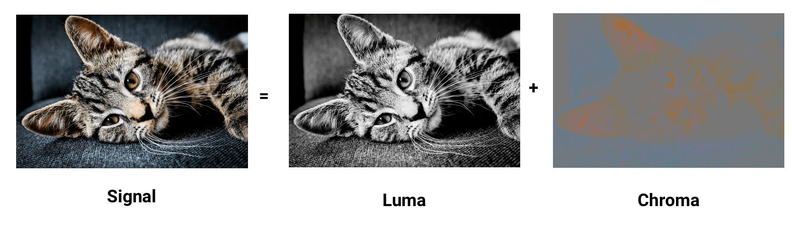


As contrast is responsible for forming shapes that we see in an image, luma,
which defines it, is pretty important. Older or filtered black and white photos
may not contain color, but thanks to luma, they can be just as detailed as their
color counterparts. Chroma (color) has less of an impact on visual perception.


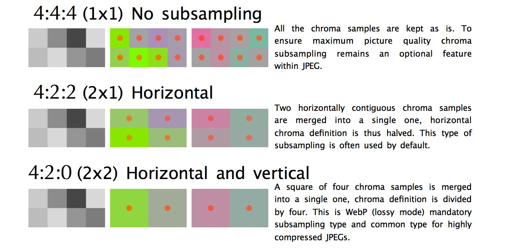

JPEG supports a number of different subsampling types: none, horizontal and
horizontal and vertical. This diagram is from [JPEGs for the horseshoe
crabs](http://frdx.free.fr/JPEG_for_the_horseshoe_crabs.pdf) by Frédéric Kayser.


There are a number of common samples discussed when talking about subsampling.
Generally, `4:4:4`, `4:2:2` and `4:2:0`. But what do these represent? Let’s say
a subsample takes the format A:B:C. A is the number of pixels in a row and for
JPEGs this is usually 4. B represents the amount of color in the first row and C
the color in the second.

* `4:4:4` has no compression, so color and luma are transported completely.
* `4:2:2` has half sampling horizontally and full sampling vertically.
* `4:2:0` samples colors out of half the first row’s pixels and ignores the
  second row.

Note: jpegtran and cjpeg support separate quality configuration of luminance and
chroma. This can be done adding the `-sample` flag (e.g `-sample 2x1`).

Some good general rules:  subsampling (`-sample 2x2`) is great for photos.
no-subsampling (`-sample 1x1`) is best for screenshots, banners and buttons.
There's finally compromise (`2x1`) is you're unsure what to use.</aside>

By reducing pixels in our chroma components, it’s possible to reduce the size of
color components significantly, ultimately reducing byte size.


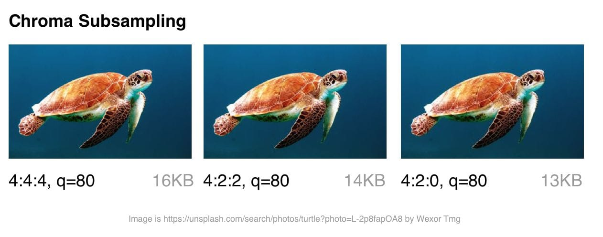 Chrome subsampling configurations for a JPEG at
        quality 80.


Chroma subsampling is worth considering for most types of image. It does have
some notable exceptions: as subsampling relies on limitations in our eyes, it is
not great for compressing images where color detail may be as important as
luminance (e.g medical images).

Images containing typefaces can also suffer as poor subsampling of text can
decrease its legibility. Sharper edges are harder to compress with JPEG as it
was designed to better handle photographic scenes with softer transitions.


 [Understanding
        JPEG](http://compress-or-die.com/Understanding-JPG/) recommends sticking
        with a subsampling of 4:4:4 (1x1) when working with images containing
        text.


Trivia: The exact method of Chroma subsampling wasn’t specified in the JPEG
specification, so different decoders handle it differently. MozJPEG and
libjpeg-turbo use the same scaling method. Older versions of libjpeg use a
different method that adds ringing artifacts in colors.

Note: Photoshop sets Chroma subsampling automatically when using the ‘Save for
web’ feature. When image quality is set between 51-100, no subsampling is used
at all (`4:4:4`). When quality is below this, a `4:2:0` subsampling is used
instead. This is one reason a far greater file-size reduction can be observed
when switching quality from 51 to 50.

Note: In subsampling discussions the term
[YCbCr](https://en.wikipedia.org/wiki/YCbCr) is often mentioned. This is a model
that can represent gamma-corrected
[RGB](https://en.wikipedia.org/wiki/RGB_color_model) color spaces. Y is
gamma-corrected luminance, Cb is the blue color’s chroma component and Cr is the
red color’s chroma component. If you look at ExifData, you’ll see YCbCr next to
sampling levels.

For a further read on Chroma Subsampling, see [Why aren’t your images using
Chroma
subsampling?](https://calendar.perfplanet.com/2015/why-arent-your-images-using-chroma-subsampling/).

### How far have we come from the JPEG? {: #how-far-have-we-come-from-the-jpeg }

**Here's the current state of image formats on the web:**

*tl;dr - there's a lot of fragmentation. We often need to conditionally serve
different formats to different browsers to take advantage of anything modern.*


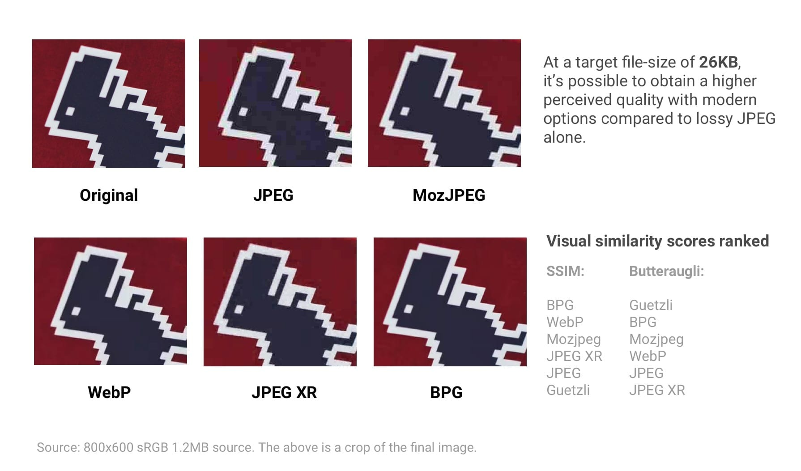 Different modern image formats (and optimizers) used to
        demonstrate what is possible at a target file-size of 26KB. We can
        compare quality using
        [SSIM](https://en.wikipedia.org/wiki/Structural_similarity) (structural
        similarity) or [Butteraugli](https://github.com/google/butteraugli),
        which we'll cover in more detail later.


*   **[JPEG 2000](https://en.wikipedia.org/wiki/JPEG_2000) (2000)** - an
    improvement to JPEG switching from a discrete cosine based transform to a
    wavelet-based method. **Browser support: Safari desktop + iOS**
*   **[JPEG XR](https://en.wikipedia.org/wiki/JPEG_XR) (2009)** - alternative to
    JPEG and JPEG 2000 supporting
    [HDR](http://wikivisually.com/wiki/High_dynamic_range_imaging) and wide
    [gamut](http://wikivisually.com/wiki/Gamut) color spaces. Produces smaller
    files than JPEG at slightly slower encode/decode speeds. **Browser support:
    Edge, IE.**
*   **[WebP](https://en.wikipedia.org/wiki/WebP) (2010)** - block-prediction
    based format by Google with support for lossy and lossless compression.
    Offers byte savings associated with JPEG and transparency support byte-heavy
    PNGs are often used for. Lacks chroma subsampling configuration and
    progressive loading. Decode times are also slower than JPEG decoding.
    **Browser support: Chrome, Opera. Experimented with by Safari and Firefox.**
*   **[FLIF](https://en.wikipedia.org/wiki/Free_Lossless_Image_Format) (2015)**
    - lossless image format claiming to outperform PNG, lossless WebP, lossless
    BPG and lossless JPEG 2000 based on compression ratio. **Browser support:
    none.**
*   **HEIF and BPG.** From a compression perspective, they're the same but have
    a different wrapper:
*   **[BPG](https://en.wikipedia.org/wiki/Better_Portable_Graphics) (2015)** -
    intended to be more compression-efficient replacement for JPEG, based on
    HEVC ([High Efficiency Video
    Coding](http://wikivisually.com/wiki/High_Efficiency_Video_Coding)). Appears
    to offer better file size compared to MozJPEG and WebP. Unlikely to get
    broad traction due to licensing issues. **Browser support: none. *Note that
    there is a [JS in-browser decoder](https://bellard.org/bpg/).***
*   **[HEIF](https://en.wikipedia.org/wiki/High_Efficiency_Image_File_Format)
    (2015)** - format for images and image sequences for storing HEVC-encoded
    images with constrained inter-prediction applied. Apple announced at
    [WWDC](https://www.cnet.com/news/apple-ios-boosts-heif-photos-over-jpeg-wwdc/)
    they would explore switching to HEIF over JPEG for iOS, citing up to 2x
    savings on file-size. **Browser support: None at the time of writing.
    Eventually, Safari desktop and iOS 11**

If you're more visual, you might appreciate
[one](https://people.xiph.org/~xiphmont/demo/daala/update1-tool2b.shtml) of
[these](http://xooyoozoo.github.io/yolo-octo-bugfixes/#cologne-cathedral&jpg=s&webp=s)
visual comparison tools for some of the above.

So, **browser support is fragmented** and if you wish to take advantage of any
of the above you'll likely need to conditionally serve fallbacks for each of
your target browsers. At Google, we've seen some promise with WebP so we'll dive
into it in more depth shortly.

You can also serve image formats (e.g WebP, JPEG 2000) with a .jpg extension (or
any other) as the browser can render an image it can decide the media type. This
allows for server-side [content-type
negotiation](https://www.igvita.com/2012/12/18/deploying-new-image-formats-on-the-web/)
to decide which image to send without needing to change the HTML at all.
Services like Instart Logic use this approach when delivering images to their
customers.

Next, let's talk about an option for when you can't conditionally serve
different image formats: **optimizing JPEG encoders**.


### Optimizing JPEG encoders {: #optimizing-jpeg-encoders }

Modern JPEG encoders attempt to produce smaller, higher fidelity JPEG files
while maintaining compatibility with existing browsers and image processing
apps. They avoid the need to introduce new image formats or changes in the
ecosystem in order for compression gains to be possible. Two such encoders are
MozJPEG and Guetzli.

***tl;dr Which optimizing JPEG Encoder should you use?***

* General web assets: MozJPEG
* Quality is your key concern and you don't mind long encode times: use Guetzli
* If you need configurability:
 * [JPEGRecompress](https://github.com/danielgtaylor/jpeg-archive) (which uses
   MozJPEG under the hood)
 * [JPEGMini](http://www.jpegmini.com/). It's similar to Guetzli - chooses best
   quality automatically. It's not as technically sophisticated as Guetzli, but
   it's faster, and aims at quality range more suitable for the web.
 * [ImageOptim API](https://imageoptim.com/api) (with free online interface
   [here](https://imageoptim.com/online)) - it's unique in its handling of
   color. You can choose color quality separately from overall quality. It
   automatically chooses chroma subsampling level to preserve high-res colors in
   screenshots, but avoid waste bytes on smooth colors in natural photos.

### What is MozJPEG? {: #what-is-mozjpeg }

Mozilla offers a modernized JPEG encoder in the form of
[MozJPEG](https://github.com/mozilla/mozjpeg). It
[claims](https://research.mozilla.org/2014/03/05/introducing-the-mozjpeg-project/)
to shave up to 10% off JPEG files. Files compressed with MozJPEG work
cross-browser and some of its features include progressive scan optimization,
[trellis quantization](https://en.wikipedia.org/wiki/Trellis_quantization)
(discarding details that compress the least) and a few decent [quantization
table presets](https://calendar.perfplanet.com/2014/mozjpeg-3-0/) that help
create smoother High-DPI images (although this is possible with ImageMagick if
you're willing to wade through XML configs).

MozJPEG is supported in both
[ImageOptim](https://github.com/ImageOptim/ImageOptim/issues/45) and there's a
relatively reliable configurable [imagemin
plugin](https://github.com/imagemin/imagemin-mozjpeg) for it. Here's a sample
implementation with Gulp:

```js
const gulp = require('gulp');
const imagemin = require('gulp-imagemin');
const imageminMozjpeg = require('imagemin-mozjpeg');

gulp.task('mozjpeg', () =>
    gulp.src('src/*.jpg')
    .pipe(imagemin([imageminMozjpeg({
        quality: 85

    })]))
    .pipe(gulp.dest('dist'))
);
```


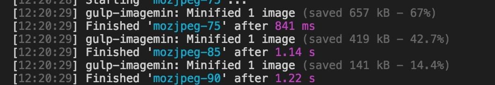


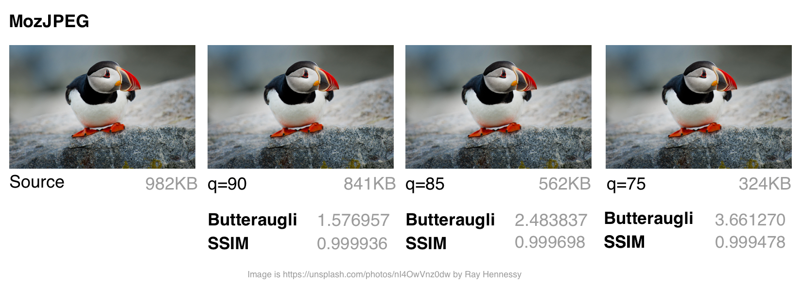

MozJPEG: A comparison of file-sizes and visual similarity scores at different
qualities.

I used [jpeg-compress](https://github.com/imagemin/imagemin-jpeg-recompress)
from the [jpeg-archive](https://github.com/danielgtaylor/jpeg-archive) project
to calculate the SSIM (The Structural Similarity) scores for a source image.
SSIM is a method for measuring the similarity between two images, where the SSIM
score is a quality measure of one image given the other is considered "perfect".

In my experience, MozJPEG is a good option for compressing images for the web at
a high visual quality while delivering reductions on file size. For small to
medium sized images, I found MozJPEG (at quality=80-85) led to 30-40% savings on
file size while maintaining acceptable SSIM, offering a 5-6% improvement on
jpeg-turbo. It does come with a [slower encoding
cost](http://www.libjpeg-turbo.org/About/Mozjpeg) than baseline JPEG, but you
may not find this a show stopper.

Note: if you need a tool supporting MozJPEG with additional configuration
support and some complimentary utilities for image comparison, check out
[jpeg-recompress](https://github.com/danielgtaylor/jpeg-archive). Jeremy Wagner,
author of Web Performance in Action has had some success using it with
[this](https://twitter.com/malchata/status/884836650563579904) configuration.


### What is Guetzli? {: #what-is-guetzli }

[Guetzli](https://github.com/google/guetzli) is a promising, if slow, perceptual
JPEG encoder from Google that tries to find the smallest JPEG that is
perceptually indistinguishable from the original to the human eye. It performs a
sequence of experiments that produces a proposal for the final JPEG, accounting
for the psychovisual error of each proposal. Out of these, it selects the
highest-scoring proposal as the final output.

To measure the differences between images, Guetzli uses
[Butteraugli](https://github.com/google/butteraugli), a model for measuring
image difference based on human perception (discussed below). Guetzli can take
into account a few properties of vision that other JPEG encoders do not. For
example, there is a relationship between the amount of green light seen and
sensitivity to blue, so changes in blue in the vicinity of green can be encoded
a little less precisely.

Note: Image file-size is **much** more dependent on the choice of **quality**
than the choice of **codec**. There are far far larger file-size differences
between the lowest and highest quality JPEGs compared to the file-size savings
made possible by  switching codecs. Using the lowest acceptable quality is very
important. Avoid setting your quality too high without paying attention to it.

Guetzli
[claims](https://research.googleblog.com/2017/03/announcing-guetzli-new-open-source-jpeg.html
) to achieve a 20-30% reduction in data-size for images for a given Butteraugli
score compared to other compressors. A large caveat to using Guetzli is that it
is extremely, extremely slow and is currently only suitable for static content.
From the README, we can note Guetzli requires a large amount of memory - it can
take 1 minute + 200MB RAM per megapixel. There's a good thread on real-world
experience with Guetzli in [this Github
thread](https://github.com/google/guetzli/issues/50). It can be ideal for when
you’re optimizing images as part of a build process for a static site but less
so when performed on demand.

Note: Guetzli may be more suitable when you're optimizing images as part of a
build process for a static site, or situations where image optimization is not
performed on demand.

Tools like ImageOptim support Guetzli optimization (in [the latest
versions](https://imageoptim.com/)).

```js
const gulp = require('gulp');
const imagemin = require('gulp-imagemin');
const imageminGuetzli = require('imagemin-guetzli');

gulp.task('guetzli', () =>
    gulp.src('src/*.jpg')
    .pipe(imagemin([
        imageminGuetzli({
            quality: 85
        })
    ]))
    .pipe(gulp.dest('dist'))

);
```


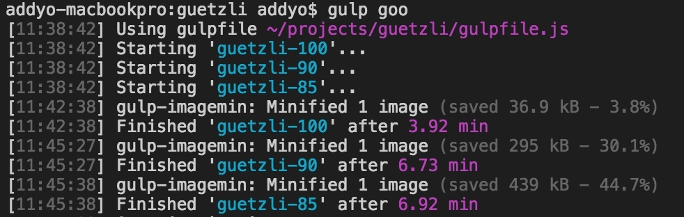


It took almost seven minutes (and high CPU usage) to encode 3 x 3MP images using
Guetzli with varied savings. For archiving higher-resolution photos, I could see
this offering some value.


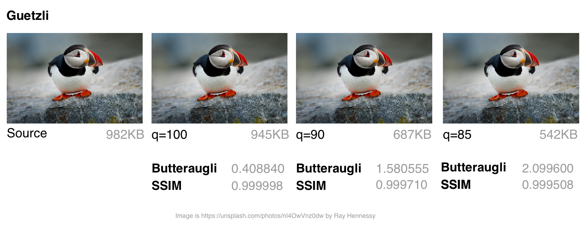 Guetzli: A
        comparison of file sizes and visual similarity scores at different
        qualities.


Note: It's recommended to run Guetzli on high quality images (e.g uncompressed
input images, PNG sources or JPEGs of 100% quality or close). While it will work
on other images (e.g JPEGs of quality 84 or lower), results can be poorer.

While compressing an image with Guetzli is very (very) time-consuming and will
make your fans spin, for larger images, it is worth it. I have seen a number of
examples where it saved anywhere up to 40% on file size while maintaining visual
fidelity. This made it perfect for archiving photos. On small to medium sized
images, I have still seen some savings (in the 10-15KB range) but they were not
quite as well pronounced. Guetzli can introduce more liquify-esque distortion on
smaller images while compressing.

You may also be interested in Eric Portis research
[comparing](https://cloudinary.com/blog/a_closer_look_at_guetzli) Guetzli to
Cloudinary's auto-compression for a different data point on effectiveness.

### How does MozJPEG compare to Guetzli? {: #mozjpeg-vs-guetzli }

Comparing different JPEG encoders is complex - one needs to compare both the
quality and fidelity of the compressed image as well as the final size. As image
compression expert Kornel Lesi&#x144;ski notes, benchmarking one but not both of
these aspects could lead to [invalid](https://kornel.ski/faircomparison)
conclusions.

How does Guetzli compare to MozJPEG? - Kornel's take:

* Guetzli is tuned for higher-quality images (butteraugli is said to be best for
  `q=90`+, MozJPEG's sweet spot is around `q=75`)
* Guetzli is much slower to compress (both produce standard JPEGs, so decoding
  is fast as usual)
* MozJPEG doesn't automagically pick quality setting, but you can find optimal
  quality using an external tool, e.g.
  [jpeg-archive](https://github.com/danielgtaylor/jpeg-archive)

A number of methods exist for determining if compressed images are visually
similar or perceivable similar to their sources. Image quality studies often use
methods like [SSIM](https://en.wikipedia.org/wiki/Structural_similarity)
(structural similarity). Guetzli however optimizes for Butteraugli.

### Butteraugli {: #butteraugli }

[Butteraugli](https://github.com/google/butteraugli) is a project by Google that
estimates the point when a person may notice visual image degradation (the
psychovisual similarity) of two images. It gives a score for the images that is
reliable in the domain of barely noticeable differences. Butteraugli not only
gives a scalar score, but also computes a spatial map of the level of
differences. While SSIM looks at the aggregate of errors from an image,
Butteraugli looks at the worst part.


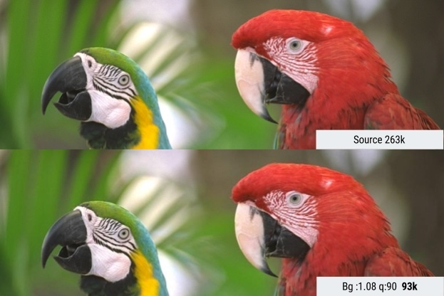 Above is an example that used Butteraugli to find the minimal
        JPEG quality threshold before visual degradation was bad enough for a
        user to notice something wasn’t clear. It resulted in a 65% reduction in
        total file size.


In practice, you would define a target goal for visual quality and then run
through a number of different image optimization strategies, looking at your
Butteraugli scores, before choosing something that fits the best balance of
file- size and level.


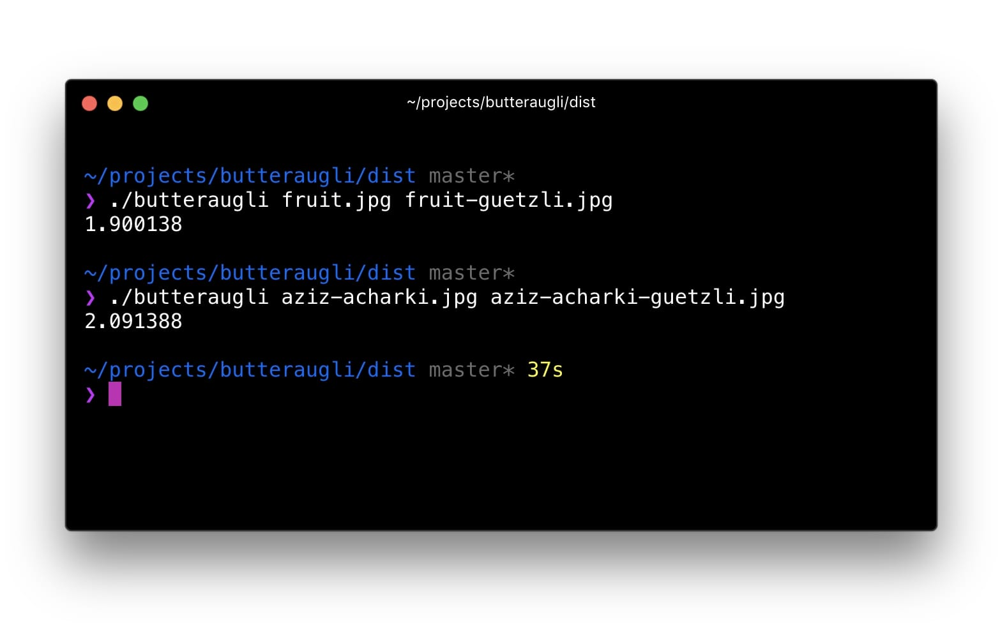 All in all, it took
        me about 30m to setup Butteraugli locally after installing Bazel and
        getting a build of the C++ sources to correctly compile on my Mac. Using
        it is then relatively straight-forward: specify the two images to
        compare (a source and compressed version) and it will give you a score
        to work from.


**How does Butteraugli differ to other ways of comparing visual similarity?**

[This
comment](https://github.com/google/guetzli/issues/10#issuecomment-276295265)
from a Guetzli project member suggests Guetzli scores best on Butteraugli, worst
on SSIM and MozJPEG scores about as well on both. This is in line with the
research I've put into my own image optimization strategy. I run Butteraugli and
a Node module like [img-ssim](https://www.npmjs.com/package/img-ssim) over
images comparing the source to their SSIM scores before/after Guetzli and
MozJPEG.

**Combining encoders?**

For larger images, I found combining Guetzli with **lossless compression **in
MozJPEG (jpegtran, not cjpeg to avoid throwing away the work done by Guetzli)
can lead to a further 10-15% decrease in filesize (55% overall) with only very
minor decreases in SSIM. This is something I would caution requires
experimentation and analysis but has also been tried by others in the field like
[Ariya Hidayat](https://ariya.io/2017/03/squeezing-jpeg-images-with-guetzli) with
promising results.

MozJPEG is a beginner-friendly encoder for web assets that is relatively fast
and produces good-quality images. As Guetzli is resource-intensive and works
best on larger, higher-quality images, it's an option I would reserve for
intermediate to advanced users.


## What is WebP? {: #what-is-webp }

[WebP](/speed/webp/) is a recent image format from
Google aiming to offer lower file-sizes for lossless and lossy compression at an
acceptable visual quality. It includes support for alpha-channel transparency
and animation.

In the last year, WebP gained a few percent over compression-wise in lossy and
lossless  modes and speed-wise the algorithm got twice as fast with a 10%
improvement in decompression.  WebP is not a tool for all purposes, but it has
some standing and a growing user base in the image compression community. Let's
examine why.


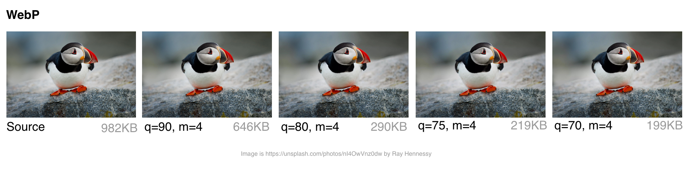
       WebP: A comparison of file sizes and visual similarity scores at
       different qualities.


### How does WebP perform? {: #how-does-webp-perform }

**Lossy Compression**

WebP lossy files, using a VP8 or VP9 video key frame encoding variant, are on
average cited by the WebP team as being
[25-34%](/speed/webp/docs/webp_study) smaller than
JPEG files.

In the low-quality range (0-50), WebP has a large advantage over JPEG because it
can blur away ugly blockiness artifacts. A medium quality setting (-m 4 -q 75)
is the default balancing speed/file-size. In the higher-range (80-99), the
advantages of WebP shrink. WebP is recommended where speed matters more than
quality.

**Lossless Compression**

[WebP lossless files are 26% smaller than PNG
files](/speed/webp/docs/webp_lossless_alpha_study).
The lossless load-time decrease compared to PNG is 3%. That said, you generally
don't want to deliver your users lossless on the web. There's a difference
between lossless and sharp edges (e.g non-JPEG). Lossless WebP may be more
suitable for archival content.

**Transparency**

WebP has a lossless 8-bit transparency channel with only 22% more bytes than
PNG. It also supports lossy RGB transparency, which is a feature unique to WebP.

**Metadata**

The WebP file format supports EXIF photo metadata and XMP digital document
metadata. It also contains an ICC Color Profile.

WebP offers better compression at the cost of being more CPU intensive. Back in
2013, the compression speed of WebP was ~10x slower than JPEG but is now
negligible (some images may be 2x slower). For static images that are processed
as part of your build, this shouldn't be a large issue. Dynamically generated
images will likely cause a perceivable CPU overhead and will be something you
will need to evaluate.

Note: WebP lossy quality settings are not directly comparable to JPEG. A JPEG at
"70% quality" will be quite different to a WebP image at "70% quality" because
WebP achieves smaller file sizes by discarding more data.


### Who's using WebP in production? {: #whos-using-webp-in-production }

Many large companies are using WebP in production to reduce costs and decrease
web page load times.

Google reported 30-35% savings using WebP over other lossy compression schemes,
serving 43 billion image requests a day, 26% of that being lossless compression.
That's a lot of requests and significant savings. Savings would undoubtedly be
larger if [browser support](http://caniuse.com/#search=webp) were better and
more widespread. Google also uses it in production sites like Google Play and
YouTube.

Netflix, Amazon, Quora, Yahoo, Walmart, Ebay, The Guardian, Fortune, and USA
Today, all compress and serve images with WebP for browsers which support it.
VoxMedia [shaved 1-3s off load
times](https://product.voxmedia.com/2015/8/13/9143805/performance-update-2-electric-boogaloo)
for The Verge by switching over to WebP for their Chrome users.
[500px](https://iso.500px.com/500px-color-profiles-file-formats-and-you/) saw an
average 25% reduction in image file size with similar or better image quality
when switching to serving it to their Chrome users.

There are quite a few more companies on board than this sample list indicates.


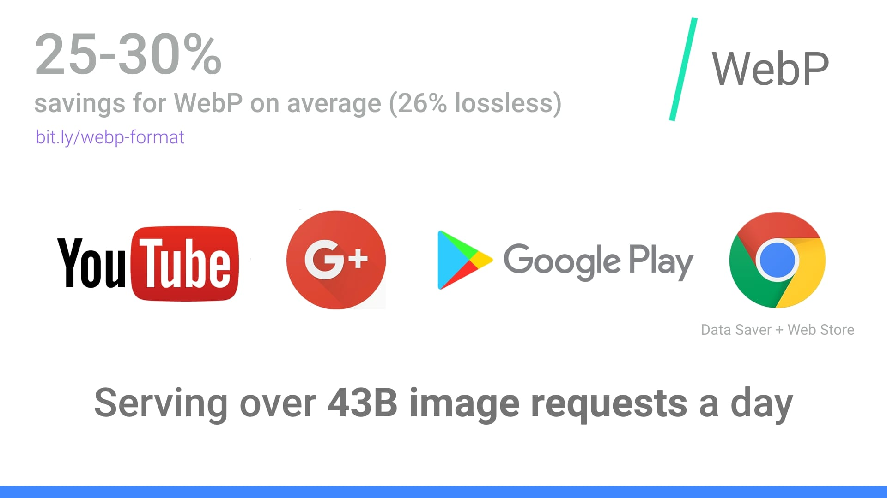 WebP usage at Google: 43 billion WebP image requests
        a day are served across YouTube, Google Play, Chrome Data Saver and G+.

### How does WebP encoding work? {: #how-does-webp-encoding-work }

WebP's lossy encoding is designed to compete with JPEG for still images. There
are three key phases to WebP's lossy encoding:

**Macro-blocking** - splitting an image into 16x16 (macro) blocks of luma pixels
and two 8x8 blocks of chroma pixels. This may sound familiar to the idea of
JPEGs doing color space conversion, chroma channel downsampling and image
subdivision.


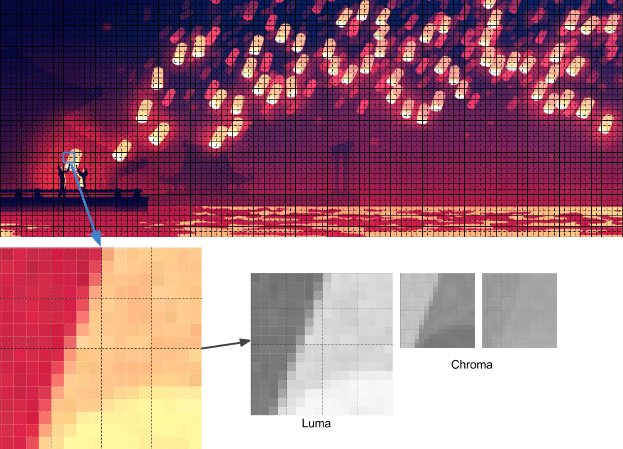


**Prediction** - every 4x4 subblock of a macroblock has a prediction model
applied that effectively does filtering. This defines two sets of pixels around
a block - A (the row directly above it) and L (the column to the left of it).
Using these two the encoder fills a test block with 4x4 pixels and determines
which creates values closest to the original block. Colt McAnlis talks about
this in more depth in [How WebP lossy mode
works](https://medium.com/@duhroach/how-webp-works-lossly-mode-33bd2b1d0670).


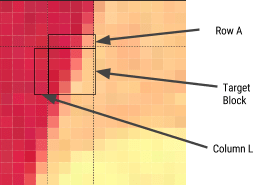


A Discrete Cosine Transform (DCT) is applied with a few steps similar to JPEG
encoding. A key difference is use of an [Arithmetic
Compressor](https://www.youtube.com/watch?v=FdMoL3PzmSA&index=7&list=PLOU2XLYxmsIJGErt5rrCqaSGTMyyqNt2H)
vs JPEG's Huffman.

If you want to dive deeper, Google Developer’s article [WebP Compression
Techniques](/speed/webp/docs/compression) goes into
this topic in depth.


### WebP browser support {: #webp-browser-support }

Not all browsers support WebP, however [according to
CanIUse.com](http://caniuse.com/webp), global user support is at about 74%.
Chrome and Opera natively support it. Safari, Edge, and Firefox have
experimented with it but not landed it yet in official releases. This often
leaves the task of getting the WebP image to the user up to the web developer.
More on this later.

Here are the major browsers and support information for each:

* Chrome: Chrome began full support at version 23.
* Chrome for Android: Since Chrome 50
* Android: Since Android 4.2
* Opera: Since 12.1
* Opera Mini: All versions
* Firefox: Some beta support
* Edge: Some beta support
* Internet Explorer: No support
* Safari: Some beta support

WebP is not without its downsides. It lacks full-resolution color space options
and does not support progressive decoding. That said, tooling for WebP is decent
and browser-support, while limited to Chrome and Opera at the time of writing,
may well cover enough of your users for it to be worth considering with a
fallback.

### How do I convert my images to WebP? {: #how-do-i-convert-to-webp }

Several commercial and open source image editing and processing packages support
WebP. One particularly useful application is XnConvert: a free, cross-platform,
batch image processing converter.

Note: It's important to avoid converting low or average quality JPEGs to WebP.
This is a common mistake and can generate WebP images with JPEG compression
artifacts. This can lead to WebP being less efficient as it has to save the
image _and_ the distortions added by JPEG, leading to you losing on quality
twice. Feed conversion apps the best quality source file available, preferably
the original.

**[XnConvert](http://www.xnview.com/en/xnconvert/)**

XnConvert enables batch image processing, compatible with over 500 image
formats. You can combine over 80 separate actions to transform or edit your
images in multiple ways.


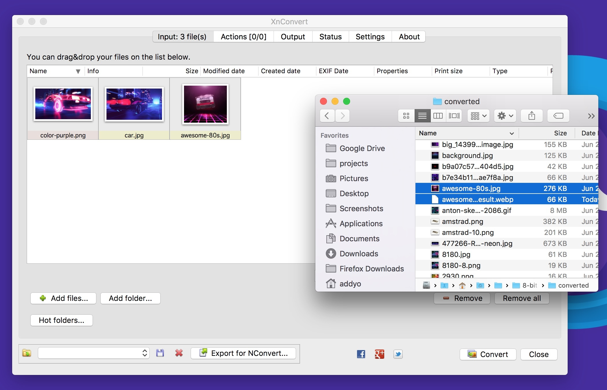
XnConvert supports batch image optimization, allowing straight-forward
conversion from source files to WebP and other formats. In addition to
compression, XnConvert can also help with metadata stripping, cropping, color
depth customization and other transforms.


Some of the options listed on the xnview website include:

*   Metadata: Editing
*   Transforms: Rotate, Crop, Resize
*   Adjustments: Brightness, Contrast, Saturation
*   Filters: Blur, Emboss, Sharpen
*   Effects: Masking, Watermark, Vignetting

The results of your operations can be exported to about 70 different file
formats, including WebP. XnConvert is free for Linux, Mac, and Windows.
XnConvert is highly recommended, especially for small businesses.

**Node modules**

[Imagemin](https://github.com/imagemin/imagemin) is a popular image minification
module that also has an add-on for converting images to WebP
([imagemin-webp](https://github.com/imagemin/imagemin-webp)). This supports both
lossy and lossless modes.

To install imagemin and imagemin-webp run:

```
> npm install --save imagemin imagemin-webp
```

We can then require() in both modules and run them over any images (e.g JPEGs)
in a project directory. Below we're using lossy encoding with a WebP encoder
quality of 60:


```js
const imagemin = require('imagemin');
const imageminWebp = require('imagemin-webp');

imagemin(['images/*.{jpg}'], 'images', {
    use: [
        imageminWebp({quality: 60})
    ]
}).then(() => {
    console.log('Images optimized');
});
```


Similar to JPEGs, it's possible to notice compression artifacts in our output.
Evaluate what quality setting makes sense for your own images. Imagemin-webp can
also be used to encode lossless quality WebP images (supporting 24-bit color and
full transparency) by passing `lossless: true` to options:


```js
const imagemin = require('imagemin');
const imageminWebp = require('imagemin-webp');

imagemin(['images/*.{jpg,png}'], 'build/images', {
    use: [
        imageminWebp({lossless: true})
    ]
}).then(() => {
    console.log('Images optimized');
});
```


A [WebP plugin for Gulp](https://github.com/sindresorhus/gulp-webp) by Sindre
Sorhus built on imagemin-webp and a [WebP loader for
WebPack](https://www.npmjs.com/package/webp-loader) are also available. The Gulp
plugin accepts any options the imagemin add-on does:

```js
const gulp = require('gulp');
const webp = require('gulp-webp');

gulp.task('webp', () =>
    gulp.src('src/*.jpg')
    .pipe(webp({
        quality: 80,
        preset: 'photo',
        method: 6
    }))
    .pipe(gulp.dest('dist'))
);
```

Or lossless:

```js
const gulp = require('gulp');
const webp = require('gulp-webp');

gulp.task('webp-lossless', () =>
    gulp.src('src/*.jpg')
    .pipe(webp({
        lossless: true
    }))
    .pipe(gulp.dest('dist'))
);
```

**Batch image optimization using Bash**

XNConvert supports batch image compression, but if you would prefer to avoid
using an app or a build system, bash and image optimization binaries keep things
fairly simple.

You can bulk convert your images to WebP using
[cwebp](/speed/webp/docs/cwebp):

```
find ./ -type f -name '*.jpg' -exec cwebp -q 70 {} -o {}.webp \;
```

Or bulk optimize your image sources with MozJPEG using
[jpeg-recompress](https://github.com/danielgtaylor/jpeg-archive):

```
find ./ -type f -name '*.jpg' -exec jpeg-recompress {} {} \;
```

and trim those SVGs down using [svgo](https://github.com/svg/svgo) (which we'll
cover later on):

```
find ./ -type f -name '*.svg' -exec svgo {} \;
```

Jeremy Wagner has a more comprehensive post on [image optimization using
Bash](https://jeremywagner.me/blog/bulk-image-optimization-in-bash) and another
on doing this work in
[parallel](https://jeremywagner.me/blog/faster-bulk-image-optimization-in-bash)
worth reading.

**Other WebP image processing and editing apps include:**

   * Leptonica — An entire website of open source image processing and analysis
     Apps.

*   Sketch supports outputting directly to WebP
    * GIMP — Free, open source Photoshop alternative. Image editor.
    * ImageMagick — Create, compose, convert, or edit bitmap images. Free.
      Command-Line app.
    * Pixelmator — Commercial image editor for Mac.
    * Photoshop WebP Plugin — Free. Image import and export. From Google.

**Android:** You can convert existing BMP, JPG, PNG or static GIF images to WebP
format using Android Studio. For more information, see [Create WebP Images Using
Android Studio](https://developer.android.com/studio/write/convert-webp.html).

### <a id="how-do-i-view-webp-on-my-os" href="#how-do-i-view-webp-on-my-os">How do I view WebP images on my OS?</a>

While you can drag and drop WebP images to Blink-based browsers (Chrome, Opera,
Brave) to preview them, you can also preview them directly from your OS using an
add-on for either Mac or Windows.

[Facebook experimented with
WebP](https://www.cnet.com/news/facebook-tries-googles-webp-image-format-users-squawk/)
a few years ago and found that users who tried to right-click on photos and save
them to disk noticed they wouldn't be displayed outside their browser due to
them being in WebP. There were three key problems here:

<ul> <li>"Save as" but unable to view WebP files locally. This was fixed by
Chrome registering itself as a ".webp" handler.</li> <li> "Save as" then
attaching the image to an email and sharing with someone without Chrome.
Facebook solved this by introducing a prominent "download" button in their UI
and returning a JPEG when users requested the download.</li> <li>Right click >
copy URL -> share URL on the web. This was solved by [content-type
negotation](https://www.igvita.com/2012/12/18/deploying-new-image-formats-on-the-web/).</li>
</ul>

These issues might matter less to your users, but is an interesting note on
social shareability in passing. Thankfully today, utilities exist for viewing
and working with WebP on different operating systems.

On Mac, try the [Quick Look plugin for
WebP](https://github.com/Nyx0uf/qlImageSize) (qlImageSize). It works pretty
well:


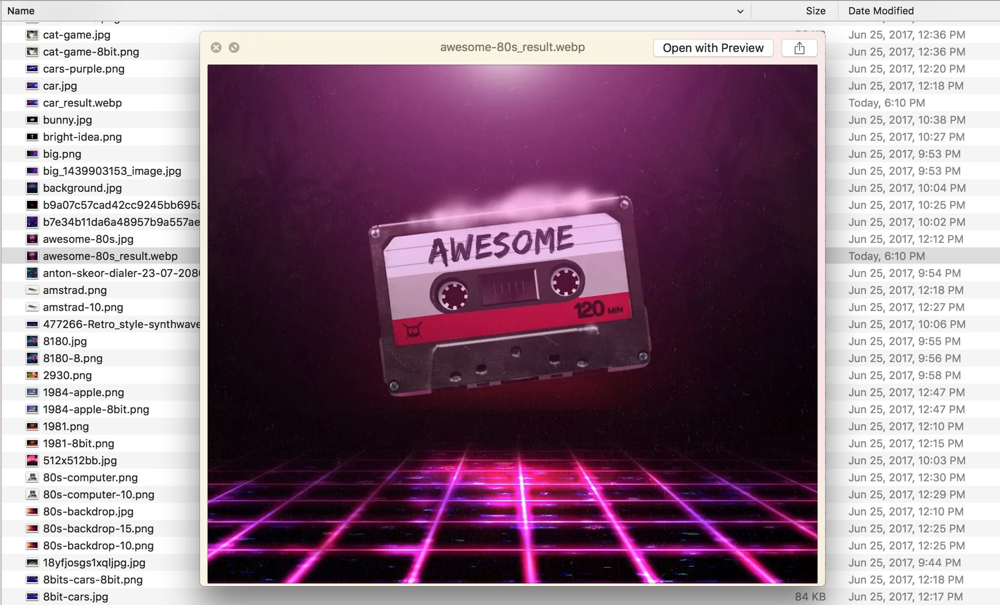


On Windows, you can also download the [WebP codec
package](https://storage.googleapis.com/downloads.webmproject.org/releases/webp/WebpCodecSetup.exe)
allowing WebP images to be previewed in the File Explorer and Windows Photo
Viewer.

### How do I serve WebP? {: #how-do-i-serve-webp }

Browsers without WebP support can end up not displaying an image at all, which
isn't ideal. To avoid this there are a few strategies we can use for
conditionally serving WebP based on browser support.


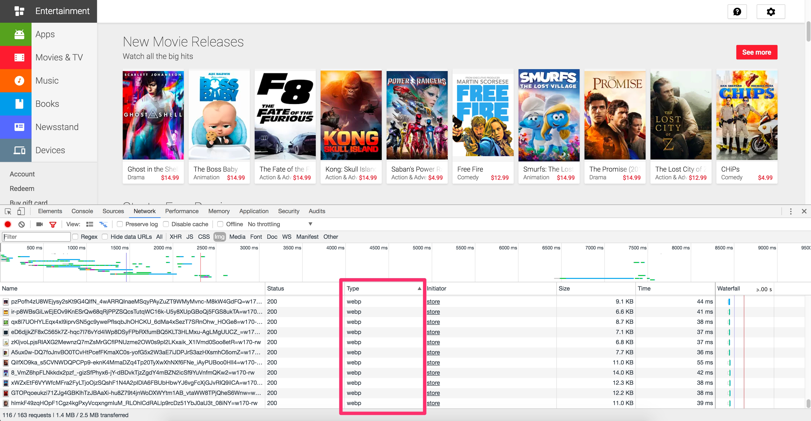
The Chrome DevTools Network panel highlighting WebP files being conditionally
served to Blink-based browsers under the "Type" column.


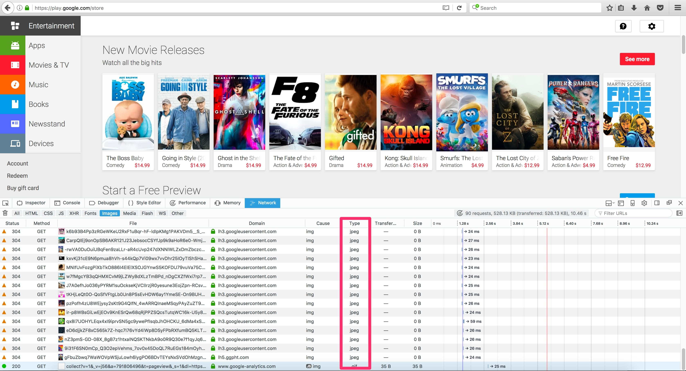
While the Play store delivers WebP to Blink, it falls back to JPEGs for browsers
like Firefox.


Here are some of the options for getting WebP images from your server to your
user:

**Using .htaccess to Serve WebP Copies**

Here's how to use a .htaccess file to serve WebP files to supported browsers
when a matching .webp version of a JPEG/PNG file exists on the server.

Vincent Orback recommended this approach:

Browsers can [signal WebP support
explicitly](http://vincentorback.se/blog/using-webp-images-with-htaccess/) via
an [Accept
header](https://developer.mozilla.org/en-US/docs/Web/HTTP/Headers/Accept). If
you control your backend, you can return a WebP version of an image if it exists
on disk rather than formats like JPEG or PNG. This isn’t always possible however
(e.g for static hosts like GitHub pages or S3) so be sure to check before
considering this option.

Here is a sample .htaccess file for the Apache web server:

```
<IfModule mod_rewrite.c>

  RewriteEngine On

  # Check if browser support WebP images
  RewriteCond %{HTTP_ACCEPT} image/webp

  # Check if WebP replacement image exists
  RewriteCond %{DOCUMENT_ROOT}/$1.webp -f

  # Serve WebP image instead
  RewriteRule (.+)\.(jpe?g|png)$ $1.webp [T=image/webp,E=accept:1]

</IfModule>

<IfModule mod_headers.c>

    Header append Vary Accept env=REDIRECT_accept

</IfModule>

AddType  image/webp .webp
```

If there are issues with the .webp images appearing on the page, make sure that
the image/webp MIME type is enabled on your server.

Apache: add the following code to your .htaccess file:

```
AddType image/webp .webp
```

Nginx: add the following code to your mime.types file:

```
image/webp webp;
```

Note: Vincent Orback has a sample [htaccess
config](https://github.com/vincentorback/WebP-images-with-htaccess) for serving
WebP for reference and Ilya Grigorik maintains a collection of [configuration
scripts for serving WebP](https://github.com/igrigorik/webp-detect) that can be
useful.


**Using the `<picture>` Tag**

The browser itself is capable of choosing which image format to display through
the use of the `<picture>` tag. The `<picture>` tag utilizes multiple `<source>`
elements, with one `` tag, which is the actual DOM element which contains
the image. The browser cycles through the sources and retrieves the first match.
If the `<picture>` tag isn't supported in the user's browser, a `<div>` is
rendered and the `` tag is used.

Note: Be careful with the position of `<source>` as order matters. Don't place
image/webp sources after legacy formats, but instead put them before. Browsers
that understand it will use them and those that don't will move onto more widely
supported frameworks. You can also place your images in order of file size if
they're all the same physical size (when not using the `media` attribute).
Generally this is the same order as putting legacy last.

Here is some sample HTML:

```html
<picture>
  <source srcset="/path/to/image.webp" type="image/webp">
  
</picture>

<picture>
    <source srcset='paul_irish.jxr' type='image/vnd.ms-photo'>
    <source srcset='paul_irish.jp2' type='image/jp2'>
    <source srcset='paul_irish.webp' type='image/webp'>
    
</picture>

<picture>
   <source srcset="photo.jxr" type="image/vnd.ms-photo">
   <source srcset="photo.jp2" type="image/jp2">
   <source srcset="photo.webp" type="image/webp">
   
</picture>
```

**Automatic CDN conversion to WebP**

Some CDNs support automated conversion to WebP and can use client hints to serve
up WebP images [whenever
possible](http://cloudinary.com/documentation/responsive_images#automating_responsive_images_with_client_hints).
Check with your CDN to see if WebP support is included in their service. You may
have an easy solution just waiting for you.

**WordPress WebP support**

Jetpack — Jetpack, a popular WordPress plugin, includes a CDN image service
called [Photon](https://jetpack.com/support/photon/). With Photon you get
seamless WebP image support. The Photon CDN is included in Jetpack's free level,
so this is a good value and a hands-off implementation. The drawback is that
Photon resizes your image, puts a query string in your URL and there is an extra
DNS lookup required for each image.

**Cache Enabler and Optimizer** — If you are using WordPress, there is at least
one halfway-open source option. The open source plugin [Cache
Enabler](https://wordpress.org/plugins/cache-enabler/) has a menu checkbox
option for caching WebP images to be served if available and the current user’s
browser supports them. This makes serving WebP images easy. There is a drawback:
Cache Enabler requires the use of a sister program called Optimizer, which has
an annual fee. This seems out of character for a genuinely open source solution.


**ShortPixel** — Another option that can be used stand-alone or with Cache Enabler, also at a cost, is
ShortPixel. In its stand alone use [ShortPixel](https://shortpixel.com) can add a &lt;picture&gt; tag that usually can serve the right type of image depending on the browser. You can optimize up to 100 images a month for free.

**Compressing Animated GIFs and why `<video>` is better**

Animated GIFs continue to enjoy widespread use, despite being a very limited
format. Although everything from social networks to popular media sites embed
animated GIFs heavily, the format was *never* designed for video storage or
animation. In fact, the [GIF89a
spec](https://www.w3.org/Graphics/GIF/spec-gif89a.txt) notes "the GIF is not
intended as a platform for animation". The [number of colors, number of frames
and
dimensions](http://gifbrewery.tumblr.com/post/39564982268/can-you-recommend-a-good-length-of-clip-to-keep-gifs)
all impact animated GIF size. Switching to video offers the largest savings.


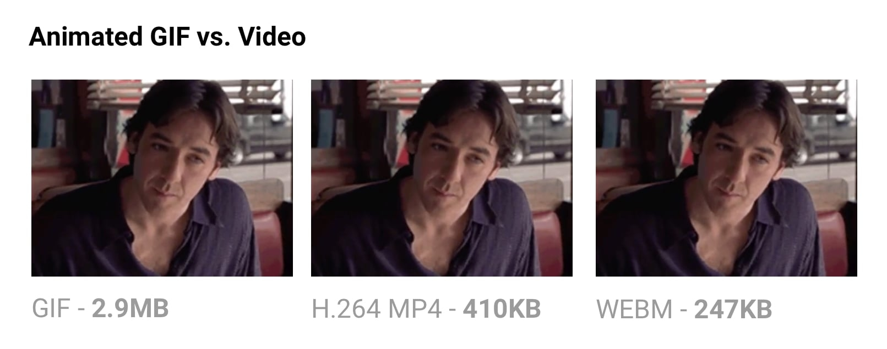
Animated GIF vs. Video: a comparison of file sizes at ~equivalent quality for
different formats.


**Delivering the same file as an MP4 video can often shave 80% or more off your
file-size.** Not only do GIFs often waste significant bandwidth, but they take
longer to load, include fewer colors and generally offer sub-part user
experiences. You may have noticed animated GIFs uploaded to Twitter perform
better on Twitter than on other websites. [Animated GIFs on Twitter aren't
actually GIFs](http://mashable.com/2014/06/20/twitter-gifs-mp4/#fiiFE85eQZqW).
To improve user experience and reduce bandwidth consumption, animated GIFs
uploaded to Twitter are actually converted to video. Similarly, [Imgur converts
GIFs to
videos](https://thenextweb.com/insider/2014/10/09/imgur-begins-converting-gif-uploads-mp4-videos-new-gifv-format/)
on upload, silently converting it to an MP4 for you.

Why are GIFs many times larger? Animated GIFs store each frame as a lossless GIF
image - yes, lossless. The degraded quality we often experience is due to GIFs
being limited to a 256-color palette. The format is often large as it doesn't
consider neighbor frames for compression, unlike video codecs like H.264. An MP4
video stores each key frame as a lossy JPEG, which discards some of the original
data to achieve better compression.

**If you can switch to videos**

*   Use [ffmpeg](https://www.ffmpeg.org/) to convert your animated GIFs (or
    sources) to H.264 MP4s. I use this one-liner from[
    Rigor](http://rigor.com/blog/2015/12/optimizing-animated-gifs-with-html5-video):
    `ffmpeg -i animated.gif -movflags faststart -pix_fmt yuv420p -vf
    "scale=trunc(iw/2)*2:trunc(ih/2)*2" video.mp4`
*   ImageOptim API also supports [converting animated gifs to WebM/H.264
    video](https://imageoptim.com/api/ungif), [removing dithering from
    GIFs](https://github.com/pornel/undither#examples) which can help video
    codecs compress even more.

**If you must use animated GIFs**

*   Tools like Gifsicle can strip metadata, unused palette entries and minimize
    what changes between frames
*   Consider a lossy GIF encoder. The
    [Giflossy](https://github.com/pornel/giflossy) fork of Gifsicle supports
    this with the `—lossy` flag and can shave ~60-65% off size. There's also a
    nice tool based on it called [Gifify](https://github.com/vvo/gifify). For
    non-animated GIFs, convert them to PNG or WebP.

For more information, checkout the[ Book of
GIF](https://rigor.com/wp-content/uploads/2017/03/TheBookofGIFPDF.pdf) by Rigor.

## SVG optimization {: #svg-optimization }

Keeping SVGs lean means stripping out anything unnecessary. SVG files created
with editors usually contain a large quantity of redundant information
(metadata, comments, hidden layers and so forth). This content can often be
safely removed or converted to a more minimal form without impacting the final
SVG that's being rendered.


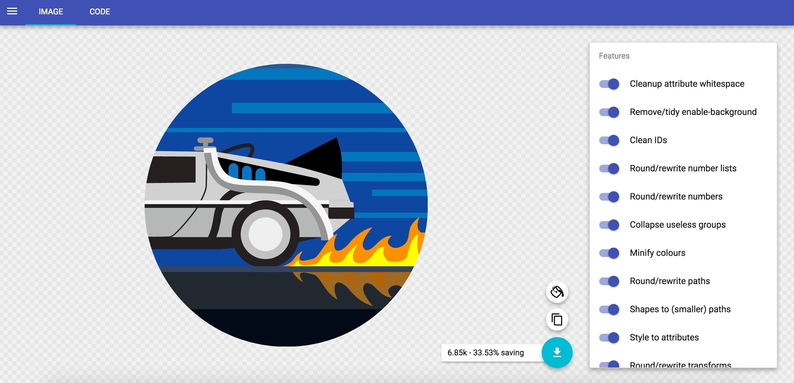
[SVGOMG](https://jakearchibald.github.io/svgomg/), by Jake Archibald, is a GUI
interface enabling you to optimize your SVGs to your preference  by selecting
optimizations, with a live preview of the outputted markup


**Some general rules for SVG optimization (SVGO):**

*   Minify and gzip your SVG files. SVGs are really just text assets expressed
    in XML, like CSS, HTML and JavaScript, and should be minified and gzipped to
    improve performance.
* Instead of paths, use predefined SVG shapes like `<rect>`, `<circle>`,
  `<ellipse>`, `<line>` and `<polygon>`. Preferring predefined shapes decreases
  how much markup is needed to produce a final image, meaning less code to parse
  and rasterize by the browser. Reducing SVG complexity means a browser can
  display it more quickly.
*   If you must use paths, try to reduce your curves and paths. Simplify and
    combine them where you can. Illustrator's [simplify
    tool](http://jlwagner.net/talks/these-images/#/2/10) is adept at removing
    superfluous points in even complex artwork while smoothing out
    irregularities.
*   Avoid using groups. If you can't, try to simplify them.
*   Delete layers that are invisible.
*   Avoid any Photoshop or Illustrator effects. They can get converted to large
    raster images.
*   Double check for any embedded raster images that aren't SVG-friendly
* Use a tool to optimize your SVGs.
  [SVGOMG](https://jakearchibald.github.io/svgomg/) is a super handy web-based
  GUI for [SVGO](https://github.com/svg/svgo) by Jake Archibald that I’ve found
  invaluable. If you use Sketch, the SVGO Compressor plugin([Sketch plugin for
  running SVGO](https://www.sketchapp.com/extensions/plugins/svgo-compressor/))
  can be used when exporting to shrink the file size.


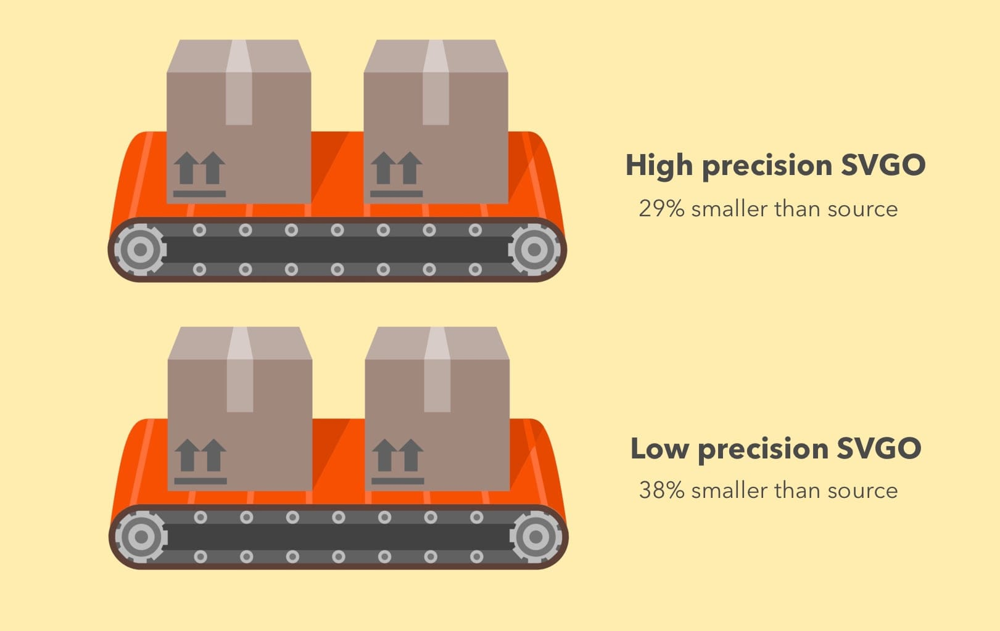
An example of running an SVG source through SVGO in high-precision mode (leading
to a 29% improvement in size) vs. low-precision mode (a 38% size improvement).


[SVGO](https://github.com/svg/svgo) is a Node-based tool for optimizing SVG.
SVGO can reduce file-size by lowering the *precision* of numbers in your <path>
definitions. Each digit after a point adds a byte and this is why changing the
precision (number of digits) can heavily influence file size. Be very very
careful with changing precision however as it can visually impact how your
shapes look.


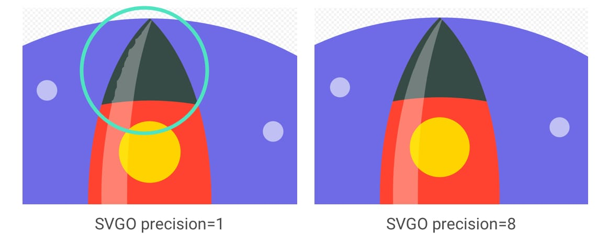
It's important to note that while SVGO does well in the previous example without
over-simplifying paths and shapes, there are plenty of cases where this may not
be the case. Observe how the light strip on the above rocket is distorted at a
lower precision.


**Using SVGO at the command-line:**

SVGO can be installed as a [global npm CLI](https://www.npmjs.com/package/svgo)
should you prefer that to a GUI:

```
npm i -g svgo
```

This can then be run against a local SVG file as follows:

```
svgo input.svg -o output.svg
```

It supports all the options you might expect, including adjusting floating point
precision:

```
svgo input.svg --precision=1 -o output.svg
```

See the SVGO [readme](https://github.com/svg/svgo) for the full list of
supported options.

**Don't forget to compress SVGs!**


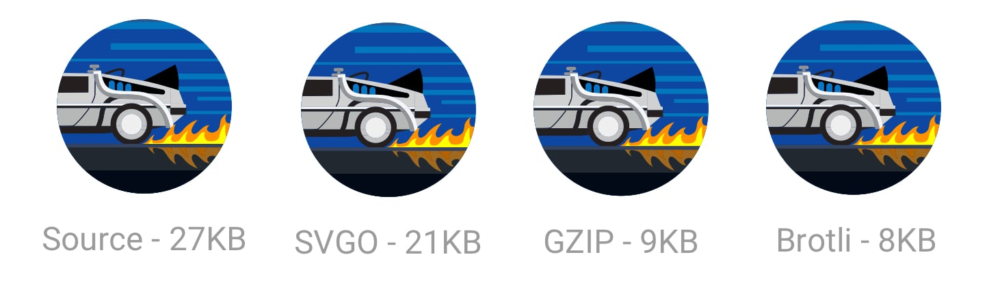
It's important to note that while SVGO does well in the previous example without
over-simplifying paths and shapes, there are plenty of cases where this may not
be the case. Observe how the light strip on the above rocket is distorted at a
lower precision.


Also, don't forget to [Gzip your SVG
assets](https://calendar.perfplanet.com/2014/tips-for-optimising-svg-delivery-for-the-web/)
or serve them using Brotli. As they're text based, they'll compress really well
(~50% of the original sources).

When Google shipped a new logo, we announced that the
[smallest](https://twitter.com/addyosmani/status/638753485555671040) version of
it was only 305 bytes in size.


There are [lots of advanced SVG
tricks](https://www.clicktorelease.com/blog/svg-google-logo-in-305-bytes/) you
can use to trim this down even further (all the way to 146 bytes)! Suffice to
say, whether it's through tools or manual clean-up, there's probably a *little*
more you can shave off your SVGs.

**SVG Sprites**

SVG can be [powerful](https://css-tricks.com/icon-fonts-vs-svg/) for icons,
offering a way to represent visualizations as a sprite without the
[quirky](https://www.filamentgroup.com/lab/bulletproof_icon_fonts.html)
workarounds needed for icon fonts. It has more granular CSS styling control than
icon fonts (SVG stroke properties),  better positioning control (no need to hack
around pseudo-elements and CSS `display`) and SVGs are much more
[accessible](http://www.sitepoint.com/tips-accessible-svg/).

Tools like [svg-sprite](https://github.com/jkphl/svg-sprite) and
[IcoMoon](https://icomoon.io/) can automate combining SVGs into sprites which
can be used via a [CSS Sprite](https://css-tricks.com/css-sprites/), [Symbol
Sprite](https://css-tricks.com/svg-use-with-external-reference-take-2) or
[Stacked Sprite](http://simurai.com/blog/2012/04/02/svg-stacks). Una Kravetz has
a practical [write-up](https://una.im/svg-icons/#💁) on how to use
gulp-svg-sprite for an SVG sprite workflow worth checking out. Sara Soudein also
covers [making the transition from icon fonts to
SVG](https://www.sarasoueidan.com/blog/icon-fonts-to-svg/) on her blog.

**Further reading**

Sara Soueidan's [tips for optimizing SVG delivery for the
web](https://calendar.perfplanet.com/2014/tips-for-optimising-svg-delivery-for-the-web/)
and Chris Coyier's [Practical SVG
book](https://abookapart.com/products/practical-svg) are excellent. I've also
found Andreas Larsen's optimizing SVG posts enlightening ([part
1](https://medium.com/larsenwork-andreas-larsen/optimising-svgs-for-web-use-part-1-67e8f2d4035),[part
2](https://medium.com/larsenwork-andreas-larsen/optimising-svgs-for-web-use-part-2-6711cc15df46)).[Preparing
and exporting SVG icons in
Sketch](https://medium.com/sketch-app-sources/preparing-and-exporting-svg-icons-in-sketch-1a3d65b239bb)
was also a great read.

## Avoid recompressing images with lossy codecs {: #avoid-recompressing-images-lossy-codecs }

It is recommended to always compress from the original image. Recompressing
images has consequences. Let's say you take a JPEG that's already been
compressed with a quality of 60. If you recompress this image with lossy
encoding, it will look worse. Each additional round of compression is going to
introduce generational loss - information will be lost and compression artifacts
will start to build up. Even if you're re-compressing at a high quality setting.

To avoid this trap, **set the lowest good quality you're willing to accept in
the first place** and you'll get maximum file savings from the start. You then
avoid this trap because any file-size reductions from quality reduction alone
will look bad.

Re-encoding a lossy file will almost always give you a smaller file, but this
doesn’t mean you’re getting as much quality out of it as you may think.


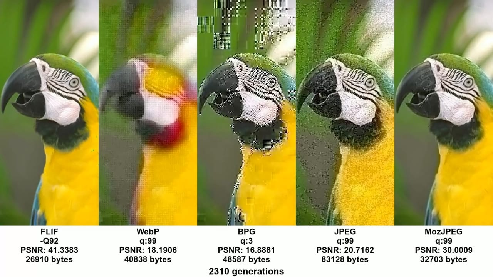
Above, from this [excellent video](https://www.youtube.com/watch?v=w7vXJbLhTyI)
and [accompanying
article](http://cloudinary.com/blog/why_jpeg_is_like_a_photocopier) by Jon
Sneyers, we can see the generational loss impact of recompression using several
formats. This is a problem you may have run into if saving (already compressed)
images from social networks and re-uploading them (causing recompression).
Quality loss will build up.


MozJPEG (perhaps accidentally) has a better resistance to recompression
degradation thanks to trellis quantization. Instead of compressing all DCT
values as they are exactly, it can check close values within a +1/-1 range to
see if similar values compress to fewer bits. Lossy FLIF has a hack similar to
lossy PNG in that prior to (re)compression, it can look at the data and decide
what to throw away. Recompressed PNGs have "holes" it can detect to avoid
changing data further.

**When editing your source files, store them in a lossless format like PNG or
TIFF, so you preserve as much quality as you can.** Your build tools or image
compression service than then handle outputting the compressed version you serve
to users with minimal loss in quality.

## Reduce unnecessary image decode and resize costs {: #reduce-unnecessary-image-decode-costs }

We've all shipped large, higher resolution images than needed to our users
before. This has a cost to it. Decoding and resizing images are expensive
operations for a browser on average mobile hardware. If sending down large
images and rescaling using CSS or width/height attributes, you're likely to see
this happen and it can impact performance.


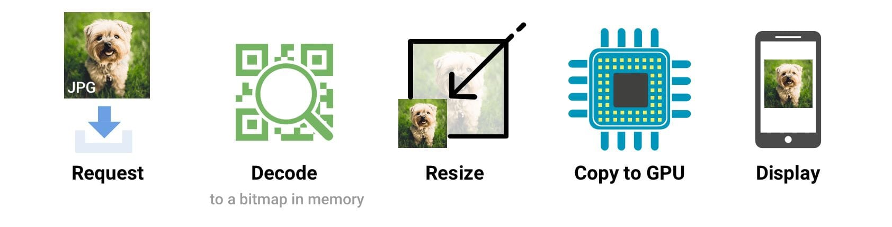

When a browser fetches an image, it has to decode the image from the original
source format (e.g JPEG) to a bitmap in memory. Often the image needs to be
resized (e.g width has been set to a percentage of its container). Decoding and
resizing images are expensive and can delay how long it takes for an image to be
displayed.


Sending down images that a browser can render without needing to resize at all
is ideal. So, serve the smallest images for your target screen sizes and
resolutions, taking advantage of [`srcset` and
`sizes`](https://developer.mozilla.org/en-US/docs/Learn/HTML/Multimedia_and_embedding/Responsive_images)
- we'll cover `srcset` shortly.

Omitting the `width` or `height` attributes on an image can also negatively
impact performance. Without them, a browser assigns a smaller placeholder region
for the image until sufficient bytes have arrived for it to know the correct
dimensions. At that point, the document layout must be updated in what can be a
costly step called reflow.


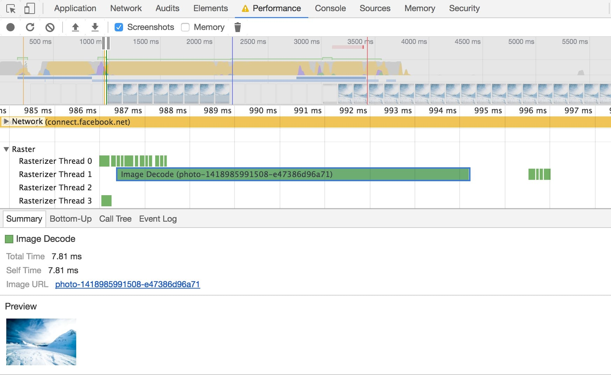
Browsers have to go through a number of steps to paint images on the screen. In
addition to fetching them, images need to be decoded and often resized. These
events can be audited in the Chrome DevTools
[Timeline](/web/tools/chrome-devtools/evaluate-performance/performance-reference).


Larger images also come with an increase in memory size costs. Decoded images
are ~4 bytes per pixel. If you're not careful, you can literally crash the
browser; on low-end devices it doesn't take that much to start memory swapping.
So, keep an eye on your image decode, resize and memory costs.


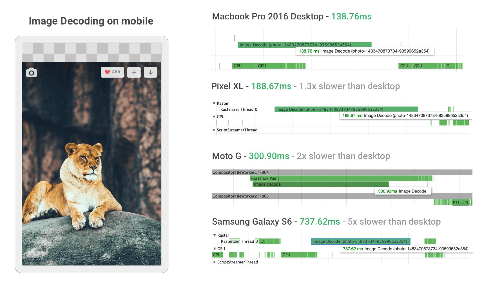
Decoding images can be incredibly costly on average and lower-end mobile phones.
In some cases it can be 5x slower to decode (if not longer).


When building their new [mobile web
experience](https://medium.com/@paularmstrong/twitter-lite-and-high-performance-react-progressive-web-apps-at-scale-d28a00e780a3),
Twitter improved image decode performance by ensuring they served appropriately
sized images to their users. This took decode time for many images in the
Twitter timeline from ~400ms all the way down to ~19!


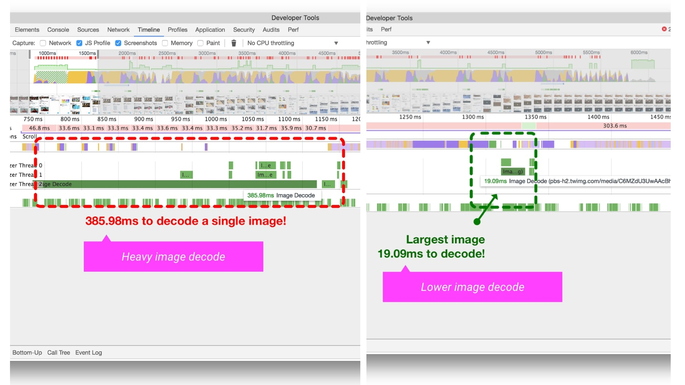
Chrome DevTools Timeline/Performance panel highlighting image decode times (in
green) before and after Twitter Lite optimized their image pipeline.

### Delivering HiDPI images using `srcset` {: #delivering-hidpi-with-srcset }

Users may access your site through a range of mobile and desktop devices with
high-resolution screens. The [Device Pixel
Ratio](https://stackoverflow.com/a/21413366) (DPR) (also called the "CSS pixel
ratio") determines how a device’s screen resolution is interpreted by CSS. DPR
was created by phone manufacturers to enable increasing the resolution and
sharpness of mobile screens without making elements appear too small.

To match the image quality users might expect, deliver the most appropriate
resolution images to their devices. Sharp, high-DPR images (e.g 2x, 3x) can be
served to devices that support them. Low and standard-DPR images should be
served to users without high-res screens as such 2x+ images will often weigh
significantly more bytes.


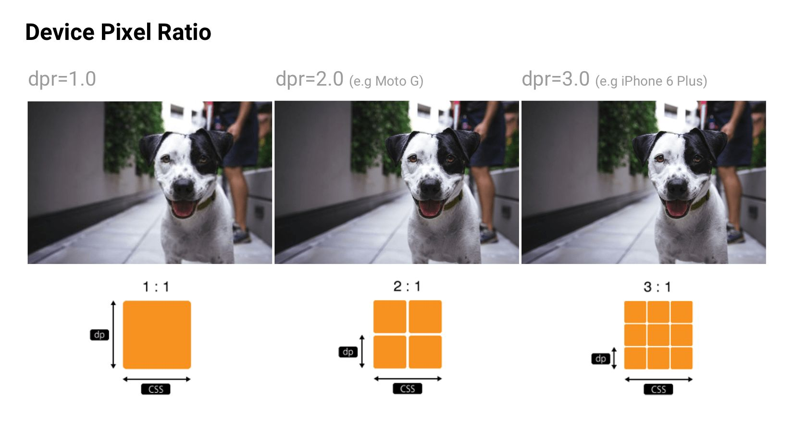
Device Pixel Ratio: Many sites track the DPR for popular devices including
[material.io](https://material.io/devices/) and
[mydevice.io](https://mydevice.io/devices/).


[srcset](https://developer.mozilla.org/en-US/docs/Learn/HTML/Multimedia_and_embedding/Responsive_images)
allows a browser to select the best available image per device, e.g selecting a
2x image for a 2x mobile display. Browsers without `srcset` support can fallback
to the default `src` specified in the `` tag.

```

```

Image CDNs like
[Cloudinary](http://cloudinary.com/blog/how_to_automatically_adapt_website_images_to_retina_and_hidpi_devices)
and [Imgix](https://docs.imgix.com/apis/url/dpr) both support controlling image
density to serve the best density to users from a single canonical source.

Note: You can learn more about Device Pixel Ratio and responsive images in this
free [Udacity](https://www.udacity.com/course/responsive-images--ud882) course
and the [Images](/web/fundamentals/design-and-ui/responsive/images) guide on Web
Fundamentals.

A friendly reminder that [Client
Hints](https://www.smashingmagazine.com/2016/01/leaner-responsive-images-client-hints/)
can also provide an alternative to specifying each possible pixel density and
format in your responsive image markup. Instead, they append this information to
the HTTP request so web servers can pick the best fit for the current device's
screen density.

### Art direction {: #art-direction }

Although shipping the right resolution to users is important, some sites also
need to think about this in terms of **[art
direction](http://usecases.responsiveimages.org/#art-direction)**. If a user is
on a smaller screen, you may want to crop or zoom in and display the subject to
make best use of available space. Although art direction is outside the scope of
this write-up, services like[
Cloudinary](http://cloudinary.com/blog/automatically_art_directed_responsive_images%20)
provide APIs to try automating this as much as possible.


Art direction: Eric Portis put together an excellent
[sample](https://ericportis.com/etc/cloudinary/) of how responsive images can be
used for art-direction. This example adapt's the main hero image's visual
characteristics at different breakpoints to make best use of the available
space.

## Color management {: #color-management }

There are at least three different perspectives of color: biology, physics and
print. In biology, color is a [perceptual
phenomenon](http://hubel.med.harvard.edu/book/ch8.pdf). Objects reflect light in
different combinations of wavelengths. Light receptors in our eyes translate
these wavelengths into the sensation we know as color. In physics, it’s light
that matters - light frequencies and brightness. Print is more about color
wheels, inks and artistic models.

Ideally, every screen and web browser in the world would display color exactly
the same. Unfortunately, due to a number of inherent inconsistencies, they
don’t. Color management allows us to reach a compromise on displaying color
through color models, spaces and profiles.

#### Color models {: #color-models }

[Color models](https://en.wikipedia.org/wiki/Gamma_correction) are a system for
generating a complete range of colors from a smaller set of primary colors.
There are different types of color spaces which use different parameters to
control colors. Some color spaces have fewer control parameters than others -
e.g grayscale only has a single parameter for controlling brightness between
black and white colors.

Two common color models are additive and subtractive. Additive color models
(like RGB, used for digital displays) use light to show color while subtractive
color models (like CMYK, used in printing) work by taking light away.


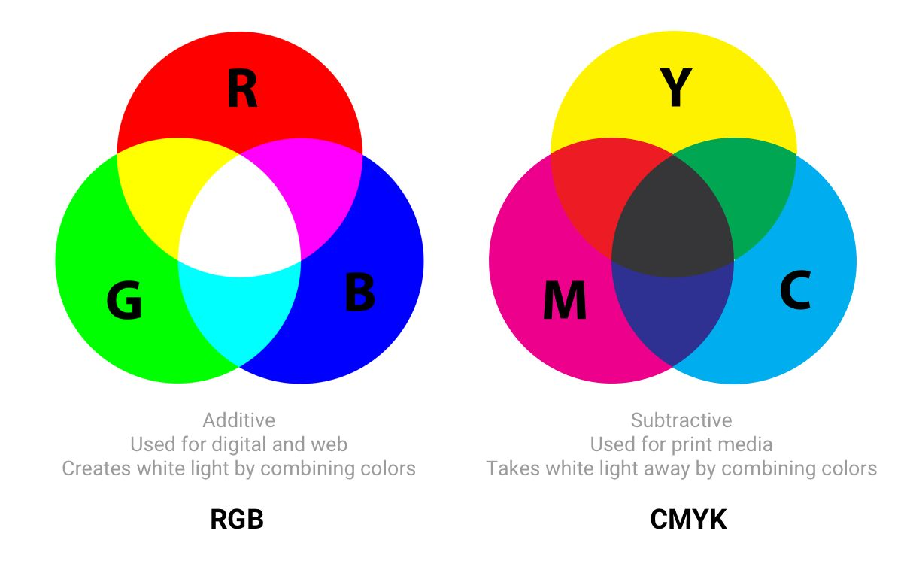 In
        RGB red, green and blue light are added in different combinations to
        produce a broad spectrum of colors. CYMK (cyan, magenta, yellow and
        black) works through different colors of ink subtracting brightness from
        white paper.


[Understanding Color Models and Spot Color
Systems](https://www.designersinsights.com/designer-resources/understanding-color-models/)
has a good description of other color models and modes, such as HSL, HSV and
LAB.

#### Color spaces {: #color-spaces }

[Color
spaces](http://www.dpbestflow.org/color/color-space-and-color-profiles#space)
are a specific range of colors that can be represented for a given image. For
example, if an image contains up to 16.7 million colors, different color spaces
allow the use of narrower or wider ranges of these colors. Some developers refer
to color models and color spaces as the same thing.

[sRGB](https://en.wikipedia.org/wiki/SRGB) was designed to be a
[standard](https://www.w3.org/Graphics/Color/sRGB.html) color space for the web
and is based on RGB. It’s a small color space that is typically considered the
lowest common denominator and is the safest option for color management
cross-browser. Other color spaces (such as [Adobe
RGB](https://en.wikipedia.org/wiki/Adobe_RGB_color_space) or [ProPhoto
RGB](https://en.wikipedia.org/wiki/ProPhoto_RGB_color_space) - used in Photoshop
and Lightroom) can represent more vibrant colors than sRGB but as the latter is
more ubiquitous across most web browsers, games and monitors, it’s what is
generally focused on.


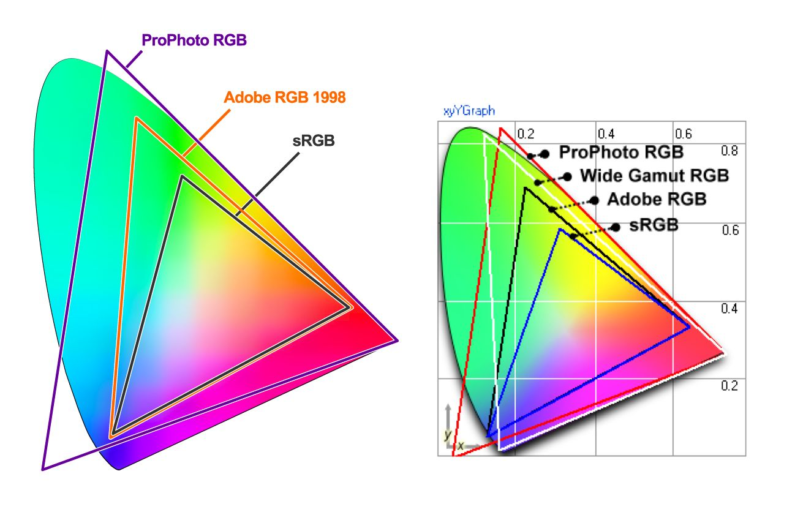 Above we can see a visualization of gamut - the range of colors a
        color space can define.


Color spaces have three channels (red, green and blue). There are 255 colors
possible in each channel under 8-bit mode, bringing us to a total of 16.7
million colors. 16-bit images can show trillions of colors.


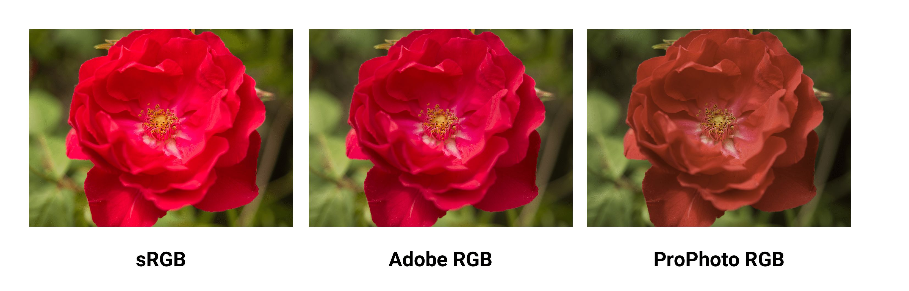
        A comparison of sRGB, Adobe RGB and ProPhoto RGB using an image from
        [Yardstick](https://yardstick.pictures/tags/img%3Adci-p3). It's
        incredibly hard to show this concept in sRGB, when you can't show colors
        that can't be seen. A regular photo in sRGB vs wide gamut should have
        everything identical, except most saturated "juicy" colors.


The differences in color spaces (like sRGB, Adobe RGB and ProPhoto RGB) are
their gamut (the range of colors they can reproduce with shades), illuminant and
[gamma](http://blog.johnnovak.net/2016/09/21/what-every-coder-should-know-about-gamma/)
curves. sRGB is ~20% smaller than Adobe RGB and ProPhoto RGB is ~[50%
larger](http://www.petrvodnakphotography.com/Articles/ColorSpace.htm) than Adobe
RGB. The above image sources are from [Clipping
Path](http://clippingpathzone.com/blog/essential-photoshop-color-settings-for-photographers).

[Wide-gamut](http://www.astramael.com/) is a term describing color spaces with a
gamut larger than sRGB. These types of displays are becoming more common. That
said, many digital displays are still simply unable to display color profiles
that are significantly better than sRGB. When saving for the web in Photoshop,
consider using the 'Convert to sRGB’ option unless targeting users with
higher-end wide-gamut screens.

<aside class="key-point"><b>Note:</b> When working with original photography,
avoid using sRGB as your primary color space. It's smaller than the color spaces
most cameras support and can cause clipping. Instead, work on a larger color
space (like ProPhoto RGB) and output to sRGB when exporting for the web.</aside>

**Are there any cases where wide gamut makes sense for web content?**

Yes. If an image contains very saturated/juicy/vibrant color and you care about
it being just as juicy on screens that support it. However, in real photos that
rarely happens. Often it's easy to tweak color to make it appear vibrant,
without it actually exceeding sRGB gamut

That's because human color perception is not absolute, but relative to our
surroundings and is easily fooled. If your image contains a fluorescent
highlighter color, then you'll have an easier time with wide gamut.

#### Gamma correction and compression {: #gamma-correction }

[Gamma correction](https://en.wikipedia.org/wiki/Gamma_correction) (or just
Gamma) controls the overall brightness of an image. Changing the gamma can also
alter the ratio of red to green and blue colors. Images without gamma correction
can look like their colors are bleached out or too dark.

In video and computer graphics, gamma is used for compression, similar to data
compression. This allows you to squeeze useful levels of brightness in fewer
bits (8-bit rather than 12 or 16). Human perception of brightness is not
linearly proportional to physical amount of light. Representing colors in their
true physical form would be wasteful when encoding images for human eyes. Gamma
compression is used to encode brightness on a scale that is closer to human
perception.

With gamma compression useful scale of brightness fits in 8 bits of precision
(0-255 used by most RGB colors). All of this comes from the fact that if colors
used some unit with 1:1 relationship to physics, RGB values would be from 1 to
million where values 0-1000 would look distinct, but values between
999000-1000000 would look identical. Imagine being in a dark room where there is
just 1 candle. Light a second candle and you notice significant increases in
brightness in the room light. Add a third candle and it’ll seem even brighter.
Now imagine being in a room with 100 candles. Light the 101st candle, the 102nd.
You won’t notice a change in brightness.

Even though in both cases, physically, exactly the same amount of light was
added. So because eyes are less sensitive when light is bright, gamma
compression "compresses" bright values, so in physical terms bright levels are
less precise but the scale is adjusted for humans so from the human perspective
all values are equally precise.

<aside class="key-point"><b>Note:</b> Gamma compression/correction here is
different to the image gamma curves you might configure in Photoshop. When gamma
compression works as it should, it doesn't look like anything.</aside>

#### Color profiles {: #color-profiles }

A color profile is the information describing what that the color space of a
device is. It’s used to convert between different color spaces. Profiles attempt
to ensure an image looks as similar as possible on these different kinds of
screens and mediums.

Images can have an embedded color profile as described by the [International
Color Consortium](http://www.color.org/icc_specs2.xalter) (ICC) to represent
precisely how colors should appear. This is supported by different formats
including JPEGs, PNGs, SVGs and
[WebP](/speed/webp/docs/riff_container) and most
major browsers support embedded ICC profiles. When an image is displayed in an
app and it knows the monitor's capabilities, these colors can be adjusted based
on the color profile.

<aside class="key-point"><b>Note:</b> Some monitors have a color profile similar
to sRGB and cannot display much better profiles so depending on your target
users displays, there may be limited value in embedding them. Check who your
target users are.</aside>

Embedded color profiles can also heavily increase the size of your images
(100KB+ occasionally) so be careful with embedding. Tools like ImageOptim will
actually [automatically](https://imageoptim.com/color-profiles.html) remove
color profiles if it finds them. In contrast, with the ICC profile removed in
the name of size reduction, browsers will be forced to display the image in your
monitor's color space which can lead to differences in expected saturation and
contrast. Evaluate the trade-offs here make sense for your use case.

[Nine Degrees Below](https://ninedegreesbelow.com/photography/articles.html)
have an excellent set of resources on ICC profile color management if you are
interested in learning more about profiles.

#### Color profiles and web browsers {: #color-profiles }

Earlier versions of Chrome did not have great support for color management, but
this is improving in 2017 with [Color Correct
Rendering](https://groups.google.com/a/chromium.org/forum/#!topic/blink-dev/ptuKdRQwPAo).
Displays that are not sRGB (newer Macbook Pros) will convert colors from sRGB to
the display profile. This will mean colors should look more similar across
different systems and browsers. Safari, Edge and Firefox can now also take ICC
profiles into account, so images with a different color profile (e.g ICC) can
now display them correctly whether your screen has wide gamut or not.

Note: For a great guide on how color applies to a broader spectrum of ways we
work on the web, see the [nerd’s guide to color on the web](https://css-tricks.com/nerds-guide-color-web/) by Sarah
Drasner.

## Image spriting {: #image-sprites }

[Image
sprites](/web/fundamentals/design-and-ui/responsive/images#use_image_sprites)
(or CSS sprites) have a long history on the web, are supported by all browsers
and have been a popular way to reduce the number of images a page loads by
combining them into a single larger image that is sliced.


Image sprites are still widely used in large, production sites, including the
Google homepage.


Under HTTP/1.x, some developers used spriting to reduce HTTP requests. This came
with a number of benefits, however care was needed as you quickly ran into
challenges with cache-invalidation - changes to any small part of an image
sprite would invalidate the entire image in a user's cache.

Spriting may now however be an [HTTP/2](https://hpbn.co/http2/) anti-pattern.
With HTTP/2, it may be best to [load individual
images](https://deliciousbrains.com/performance-best-practices-http2/) since
multiple requests within a single connection are now possible. Measure to
evaluate whether this is the case for your own network setup.

## Lazy-load non-critical images {: #lazy-load-non-critical-images }

Lazy loading is a web performance pattern that delays the loading of images in
the browser until the user needs to see it. One example is, as you scroll,
images load asynchronously on demand. This can further compliment the
byte-savings you see from having an image compression strategy.


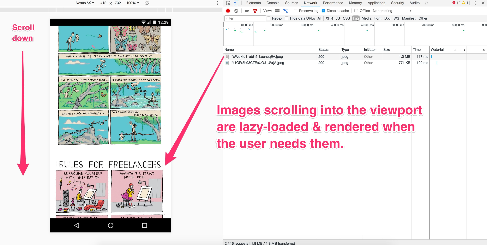


Images that must appear "above the fold," or when the web page first appears are
loaded straight away. The images which follow "below the fold," however, are not
yet visible to the user. They do not have to be immediately loaded into the
browser. They can be loaded later — or lazy loaded — only if and when the user
scrolls down and it becomes necessary to show them.

Lazy loading is not yet natively supported in the browser itself (although there
have been
[discussions](https://discourse.wicg.io/t/a-standard-way-to-lazy-load-images/1153/10)
about it in the past). Instead, we use JavaScript to add this capability.

**Why is Lazy Loading Useful?**

This "lazy" way of loading images only if and when necessary has many benefits:

* **Reduced data consumption**: As you aren’t assuming the user will need every
  image fetched ahead of time, you’re only loading the minimal number of
  resources. This is always a good thing, especially on mobile with more
  restrictive data plans.
* **Reduced battery consumption**: Less workload for the user’s browser which
  can save on battery life.
* **Improved download speed**: Decreasing your overall page load time on an
  image heavy website from several seconds to almost nothing is a tremendous
  boost to user experience. In fact, it could be the difference between a user
  staying around to enjoy your site and just another bounce statistic.

**But like all tools, with great power comes great responsibility.**

**Avoid lazy-loading images above the fold.** Use it for long-lists of images
(e.g products) or lists of user avatars. Don’t use it for the main page hero
image. Lazy-loading images above the fold can make loading visibly slower, both
technically and for human perception. It can kill the browser’s preloader,
progressive loading and the JavaScript can create extra work for the browser.

**Be very careful lazy-loading images when scrolling.**  If you wait until the
user is scrolling they are likely to see placeholders and may eventually get
images, if they haven’t already scrolled past them. One recommendation would be
to start lazy-loading after the above-the-fold images have loaded, loading all
of the images independent of user interaction.

**Who Uses Lazy Loading?**

For examples of lazy loading, look at most any major site that hosts a lot of
images. Some notable sites are [Medium](https://medium.com/) and
[Pinterest](https://www.pinterest.com/).


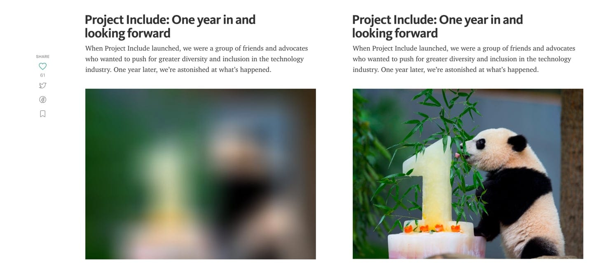
An example of Gaussian-blurred inline previews for images on Medium.com


A number of sites (such as Medium) display a small, Gaussian-blurred inline
preview (a few 100 bytes) that transitions (lazy-loads) to a full-quality image
once it has been fetched.

José M. Pérez has written about how to implement the Medium effect using [CSS
filters](https://jmperezperez.com/medium-image-progressive-loading-placeholder/)
and experimented with [different image
formats](https://jmperezperez.com/webp-placeholder-images/) to support such
placeholders. Facebook also did a write-up on their famous 200-byte approach for
such placeholders for their [cover
photos](https://code.facebook.com/posts/991252547593574/the-technology-behind-preview-photos/)
that is worth a read. If you’re a Webpack user, [LQIP
loader](https://lqip-loader.firebaseapp.com/) can help automate some of this
work away.

In fact, you can search for your favorite source of high-res photos and then
scroll down the page. In almost all cases you'll experience how the website
loads only a few full-resolution images at a time, with the rest being
placeholder colors or images. As you continue to scroll, the placeholder images
are replaced with full-resolution images. This is lazy loading in action.

**How Can I Apply Lazy Loading to My Pages?**

There are a number of techniques and plugins available for lazy loading. I
recommend [lazysizes](https://github.com/aFarkas/lazysizes) by Alexander Farkas
because of its decent performance, features, its optional integration with
[Intersection Observer](/web/updates/2016/04/intersectionobserver), and support
for plugins.

**What Can I Do with Lazysizes?**

Lazysizes is a JavaScript library. It requires no configuration. Download the
minified js file and include it in your webpage.


Here is some example code taken from the README file:

Add the class "lazyload" to your images/iframes in conjunction with a data-src
and/or data-srcset attribute.

Optionally you can also add a src attribute with a low quality image:

```html
<!-- non-responsive: -->


<!-- responsive example with automatic sizes calculation: -->


<!-- iframe example -->

<iframe frameborder="0"
    class="lazyload"
    allowfullscreen=""
    data-src="//www.youtube.com/embed/ZfV-aYdU4uE">
</iframe>
```

For the web version of this book, I paired Lazysizes (although you can use any
alternative) with Cloudinary for on-demand responsive images. This allowed me
the freedom to experiment with different values for scale, quality, format and
whether or not to progressively load with minimal effort:


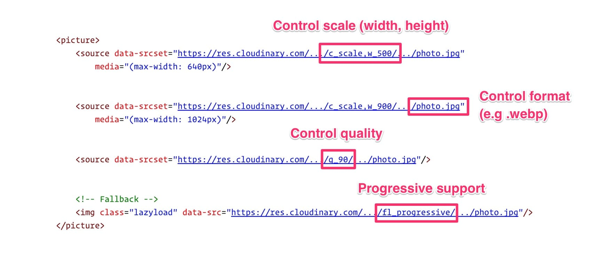


**Lazysizes features include:**

* Automatically detects visibility changes on current and future lazyload
  elements
* Includes standard responsive image support (picture and srcset)
* Adds automatic sizes calculation and alias names for media queries feature
* Can be used with hundreds of images/iframes on CSS and JS-heavy pages or web
  apps
* Extendable: Supports plugins
* Lightweight but mature solution
* SEO improved: Does not hide images/assets from crawlers

**More Lazy Loading Options**

Lazysizes is not your only option. Here are more lazy loading libraries:

*   [Lazy Load XT](http://ressio.github.io/lazy-load-xt/)
*   [BLazy.js](https://github.com/dinbror/blazy) (or [Be]Lazy)
*   [Unveil](http://luis-almeida.github.io/unveil/)
*   [yall.js (Yet Another Lazy Loader)](https://github.com/malchata/yall.js)
    which is ~1KB and uses Intersection Observer where supported.

**What's the catch with Lazy Loading?**

*   Screen readers, some search bots and any users with JavaScript disabled will
    not be able to view images lazy loaded with JavaScript. This is however
    something that we can work around with a `<noscript>` fallback.
*   Scroll listeners, such as used for determining when to load a lazy-loaded
    image, can have an adverse impact on browser scrolling performance. They can
    cause the browser to redraw many times, slowing the process to a crawl -
    however, smart lazy loading libraries will use throttling to mitigate this.
    One possible solution is Intersection Observer, which is supported by
    lazysizes.

Lazy loading images is a widespread pattern for reducing bandwidth, decreasing
costs, and improving user experience. Evaluate whether it makes sense for your
experience. For further reading see [lazy loading
images](https://jmperezperez.com/lazy-loading-images/) and [implementing
Medium's progressive
loading](https://jmperezperez.com/medium-image-progressive-loading-placeholder/).

## Avoiding the display:none trap {: #display-none-trap }

Older responsive image solutions have mistaken how browsers handle image
requests when setting the CSS  `display` property. This can cause significantly
more images to be requested than you might be expecting and is another reason
`<picture>` and `` are preferred for loading responsive images.

Have you ever written a media query that sets an image to `display:none` at
certain breakpoints?

```html

<style>
@media (max-width: 640px) {
    img {
        display: none;
    }
}
</style>
```

Or toggled what images are hidden using a `display:none` class?

```html
<style>
.hidden {
  display: none;
}
</style>


```

A quick check against the Chrome DevTools network panel will verify that images
hidden using these approaches still get fetched, even when we expect them not to
be. This behavior is actually correct per the embedded resources spec.


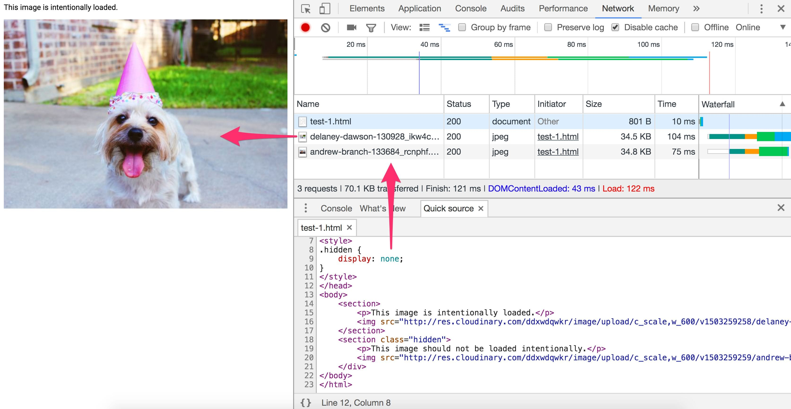


**Does `display:none` avoid triggering a request for an image `src`?**

```html
<div style="display:none"></div>
```

No. The image specified will still get requested. A library cannot rely on
display:none here as the image will be requested before JavaScript can alter the
src.

**Does `display:none` avoid triggering a request for a `background: url()`?**

```html
<div style="display:none">
  <div style="background: url(img.jpg)"></div>
</div>
```

Yes. CSS backgrounds aren’t fetched as soon as an element is parsed. Calculating
CSS styles for children of elements with `display:none` would be less useful as
they don’t impact rendering of the document. Background images on child elements
are not calculated nor downloaded.

Jake Archibald’s [Request Quest](https://jakearchibald.github.io/request-quest/)
has an excellent quiz on the pitfalls of using `display:none` for your
responsive images loading. When in doubt about how specific browser’s handle
image request loading, pop open their DevTools and verify for yourself.

Again, where possible, use `<picture>` and `` instead of relying on
`display:none`.

## Does an image processing CDN make sense for you? {: #image-processing-cdns }

*The time you'll spend reading the blog posts to setup your own image processing
pipeline and tweaking your config is often >> the fee for a service. With
[Cloudinary](http://cloudinary.com/) offering a free service,
[Imgix](https://www.imgix.com/) a free trial and
[Thumbor](https://github.com/thumbor/thumbor) existing as an OSS alternative,
there are plenty of options available to you for automation.*

To achieve optimal page load times, you need to optimize your image loading.
This optimization calls for a responsive image strategy and can benefit from
on-server image compression, auto-picking the best format and responsive
resizing. What matters is that you deliver the correctly sized image to the
proper device in the proper resolution as fast as possible. Doing this is not as
easy as one might think.

**Using Your Server vs. a CDN**

Because of the complexity and ever-evolving nature of image manipulation, we're
going to offer a quote from someone with experience in the field, then proceed
with a suggestion.

"If your product is not image manipulation, then don't do this yourself.
Services like Cloudinary [or imgix, Ed.] do this much more efficiently and much
better than you will, so use them. And if you're worried about the cost, think
about how much it'll cost you in development and upkeep, as well as hosting,
storage, and delivery costs." — [Chris
Gmyr](https://medium.com/@cmgmyr/moving-from-self-hosted-image-service-to-cloudinary-bd7370317a0d)


For the moment, we are going to agree and suggest that you consider using a CDN
for your image processing needs. Two CDNs will be examined to see how they
compare relative to the list of tasks we raised earlier.

**Cloudinary and imgix**

[Cloudinary](http://cloudinary.com/) and [imgix](https://www.imgix.com/) are two
established image processing CDNs. They are the choice of hundreds of thousands
of developers and companies worldwide, including Netflix and Red Bull. Let's
look at them in more detail.

**What are the Basics?**

Unless you are the owner of a network of servers like they are, their first huge
advantage over rolling your own solution is that they use a distributed global
network system to bring a copy of your images closer to your users. It's also
far easier for a CDN to "future proof" your image loading strategy as trends
change - doing this on your own requires maintenance, tracking browser support
for emerging formats & following the image compression community.

Second, each service has a tiered pricing plan, with Cloudinary offering a [free
level](http://cloudinary.com/pricing) and imgix pricing their standard level
inexpensively, relative to their high-volume premium plan. Imgix offers a free
[trial](https://www.imgix.com/pricing) with a credit towards services, so it
almost amounts to the same thing as a free level.

Third, API access is provided by both services. Developers can access the CDN
programmatically and automate their processing. Client libraries, framework
plugins, and API documentation are also available, with some features restricted
to higher paid levels.

**Let's Get to the Image Processing**

For now, let's limit our discussion to static images. Both Cloudinary and Imgix
offer a range of image manipulation methods, and both support primary functions
such as compression, resizing, cropping and thumbnail creation in their standard
and free plans.


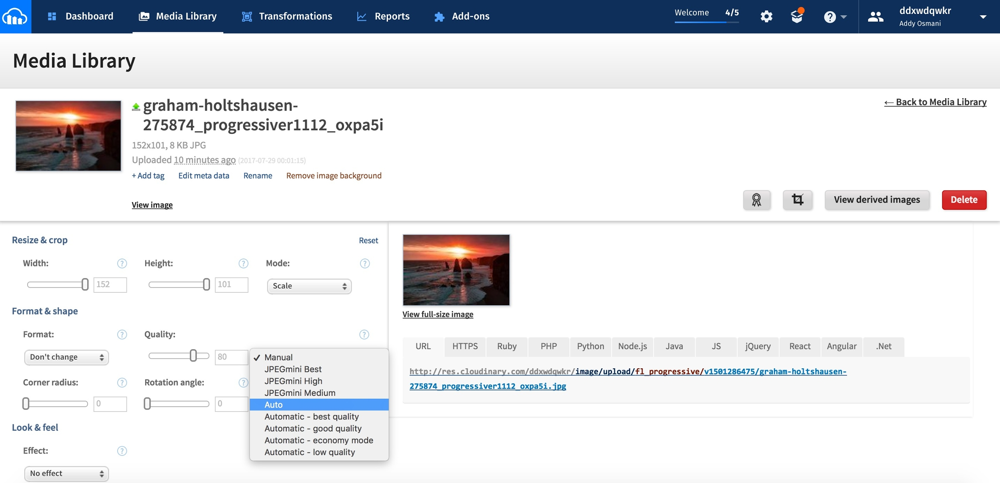
Cloudinary Media Library: By default Cloudinary encodes [non-Progressive
JPEGs](http://cloudinary.com/blog/progressive_jpegs_and_green_martians). To
opt-in to generating them, check the 'Progressive' option in 'More options' or
pass the 'fl_progressive' flag.


Cloudinary lists [seven broad image
transformation](http://cloudinary.com/documentation/image_transformations)
categories, with a total of 48 subcategories within them. Imgix advertises over
[100 image processing
operations](https://docs.imgix.com/apis/url?_ga=2.52377449.1538976134.1501179780-2118608066.1501179780).

**What Happens by Default?**

*   Cloudinary performs the following optimizations by default:
*   [Encodes JPEGs using
    MozJPEG](https://twitter.com/etportis/status/891529495336722432) (opted
    against Guetzli as a default)
*   Strips all associated metadata from the transformed image file (the original
    image is left untouched). To override this behavior and deliver a
    transformed image with its metadata intact, add the `keep_iptc` flag.
*   Can generate WebP, GIF, JPEG, and JPEG-XR formats with automatic quality. To
    override the default adjustments, set the quality parameter in your
    transformation.
*   Runs
    [optimization](http://cloudinary.com/documentation/image_optimization#default_optimizations)
    algorithms to minimize the file size with minimal impact to visual quality
    when generating images in the PNG, JPEG or GIF format.

Imgix has no default optimizations such as Cloudinary has. It does have a
settable default image quality. For imgix, auto parameters help you automate
your baseline optimization level across your image catalog.

Currently, it has [four different
methods](https://docs.imgix.com/apis/url/auto):

*   Compression
*   Visual enhancement
*   File format conversion
*   Redeye removal

Imgix supports the following image formats: JPEG, JPEG2000, PNG, GIF, Animated
GIF, TIFF, BMP, ICNS, ICO, PDF, PCT, PSD, AI

Cloudinary supports the following image formats: JPEG, JPEG 2000, JPEG XR, PNG,
GIF, Animated GIF, WebP, Animated WebP,BMPs, TIFF, ICOs, PDF, EPS, PSD, SVG, AI,
DjVu, FLIF, TARGA.

**What About Performance?**

CDN delivery performance is mostly about
[latency](https://docs.google.com/a/chromium.org/viewer?a=v&pid=sites&srcid=Y2hyb21pdW0ub3JnfGRldnxneDoxMzcyOWI1N2I4YzI3NzE2)
and speed.

Latency always increases somewhat for completely uncached images. But once an
image is cached and distributed among the network servers, the fact that a
global CDN can find the shortest hop to the user, added to the byte savings of a
properly-processed image, almost always mitigates latency issues when compared
to poorly processed images or solitary servers trying to reach across the
planet.

Both services use fast and wide CDN. This configuration reduces latency and
increases download speed. Download speed affects page load time, and this is one
of the most important metrics for both user experience and conversion.

**So How Do They Compare?**

Cloudinary has [160K customers](http://cloudinary.com/customers) including
Netflix, eBay and Dropbox. Imgix doesn't report how many customers it has, but
it is smaller than Cloudinary. Even so, imgix's base includes heavyweight image
users such as Kickstarter, Exposure, unsplash, and Eventbrite.

There are so many uncontrolled variables in image manipulation that a
head-to-head performance comparison between the two services is difficult. So
much depends on how much you need to process the image — which takes a variable
amount of time — and what size and resolution are required for the final output,
which affects speed and download time. Cost may ultimately be the most important
factor for you.

CDNs cost money. An image heavy site with a lot of traffic could cost hundreds
of US dollars a month in CDN fees. There is a certain level of prerequisite
knowledge and programming skill required to get the most out of these services.
If you are not doing anything too fancy, you're probably not going to have any
trouble.

But if you're not comfortable working with image processing tools or APIs, then
you are looking at a bit of a learning curve. In order to accommodate the CDN
server locations, you will need to change some URLs in your local links. Do the
right due diligence :)

**Conclusion**

If you are currently serving your own images or planning to, perhaps you should
give a CDN some consideration.

## Caching image assets {: #caching-image-assets }

Resources can specify a caching policy using [HTTP cache
headers](/web/fundamentals/performance/optimizing-content-efficiency/http-caching#cache-control).
Specifically, `Cache-Control` can define who can cache responses and for how
long

Most of the images you deliver to users are static assets that will[ not
change](http://kean.github.io/post/image-caching) in the future. The best
caching strategy for such assets is aggressive caching.

When setting your HTTP caching headers, set Cache-Control with a max-age of a
year (e.g `Cache-Control:public; max-age=31536000`). This type of aggressive
caching works well for most types of images, especially those that are
long-lived like avatars and image headers.

Note: If you're serving images using PHP, it can destroy caching due to the
default
[session_cache_limiter](http://php.net/manual/en/function.session-cache-limiter.php)
setting. This can be a disaster for image caching and you may want to [work
around](https://stackoverflow.com/a/3905468) this by setting
session_cache_limiter('public') which will set `public, max-age=`. Disabling and
setting custom cache-control headers is also fine.

## Preloading critical image assets {: #preload-critical-image-assets }

Critical image assets can be preloaded using [`<link
rel=preload>`](https://www.w3.org/TR/preload/).

`<link rel=preload>` is a declarative fetch, allowing you to force the browser
to make a request for a resource without blocking the document’s `onload` event.
It enables increasing the priority of requests for resources that might
otherwise not be discovered until later in the document parsing process.

Images can be preloaded by specifying an `as` value of `image`:

```html
<link rel="preload" as="image" href="logo.jpg"/>
```

Image resources for ``, `<picture>`, `srcset` and SVGs can all take
advantage of this optimization.

Note: `<link rel="preload">` is [supported](http://caniuse.com/#search=preload)
in Chrome and Blink-based browsers like Opera, [Safari Tech
Preview](https://developer.apple.com/safari/technology-preview/release-notes/)
and has been [implemented](https://bugzilla.mozilla.org/show_bug.cgi?id=1222633)
in Firefox.

Sites like [Philips](https://www.usa.philips.com/),
[FlipKart](https://www.flipkart.com/) and [Xerox](https://www.xerox.com/) use
`<link rel=preload>` to preload their main logo assets (often used early in the
document). [Kayak](https://kayak.com/) also uses preload to ensure the hero
image for their header is loaded as soon as possible.


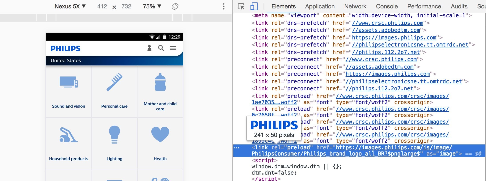


**What is the Link preload header?**

A preload link can be specified using either an HTML tag or an [HTTP Link
header](https://www.w3.org/wiki/LinkHeader). In either case, a preload link
directs the browser to begin loading a resource into the memory cache,
indicating that the page expects with high confidence to use the resource and
doesn’t want to wait for the preload scanner or the parser to discover it.

A Link preload header for images would look similar to this:

```
Link: <https://example.com/logo-hires.jpg>; rel=preload; as=image
```

When the Financial Times introduced a Link preload header to their site, they
shaved [1 second off](https://twitter.com/wheresrhys/status/843252599902167040)
the time it took to display their masthead image:


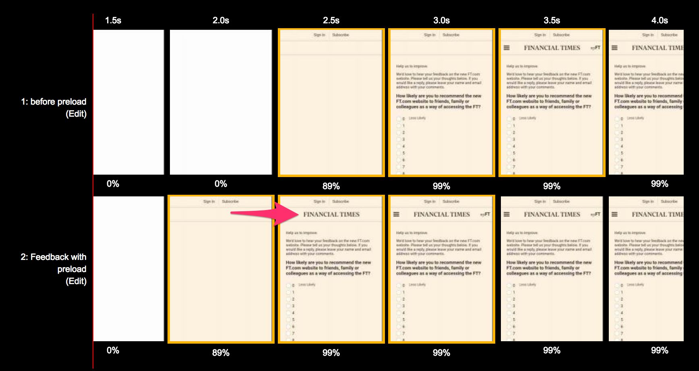
Bottom: with `<link rel=preload>`, Top: without. Comparison for a Moto G4 over
3G on WebPageTest both
[before](https://www.webpagetest.org/result/170319_Z2_GFR/) and
[after](https://www.webpagetest.org/result/170319_R8_G4Q/).


Similarly, Wikipedia improved time-to-logo performance with the Link preload
header as covered in their [case
study](https://phabricator.wikimedia.org/phame/post/view/19/improving_time-to-logo_performance_with_preload_links/).

**What caveats should be considered when using this optimization?**

Be very certain that it's worth preloading image assets as, if they aren't
critical to your user experience, there may be other content on the page worth
focusing your efforts on loading earlier instead. By prioritizing image
requests, you may end up pushing other resources further down the queue.

It's important to avoid using `rel=preload` to preload image formats without
broad browser support (e.g WebP). It's also good to avoid using it for
responsive images defined in `srcset` where the retrieved source may vary based
on device conditions.

To learn more about preloading, see [Preload, Prefetch and Priorities in
Chrome](https://medium.com/reloading/preload-prefetch-and-priorities-in-chrome-776165961bbf)
and [Preload: What Is It Good
For?](https://www.smashingmagazine.com/2016/02/preload-what-is-it-good-for/).

## Web performance budgets for images {: #performance-budgets }

A performance budget is a "budget" for web page performance that a team attempts
to not exceed. For example, "images will not exceed 200KB on any page" or "the
user experience must be usable in under 3 seconds". When a budget isn't being
met, explore why this is and how you get back on target.

Budgets provide a useful framework for discussing performance with stakeholders.
When a design or business decision may impact site performance, consult the
budget. They're a reference for pushing back or rethinking the change when it
can harm a site's user experience.

I've found teams have the best success with performance budgets when monitoring
them is automated. Rather than manually inspecting network waterfalls for budget
regressions, automation can flag when the budget is crossed. Two such services
that are useful for performance budget tracking are
[Calibre](https://calibreapp.com/docs/metrics/budgets) and
[SpeedCurve](https://speedcurve.com/blog/tag/performance-budgets/).

Once a performance budget for image sizes is defined, SpeedCurve starts
monitoring and alerts you if the budget is exceeded:


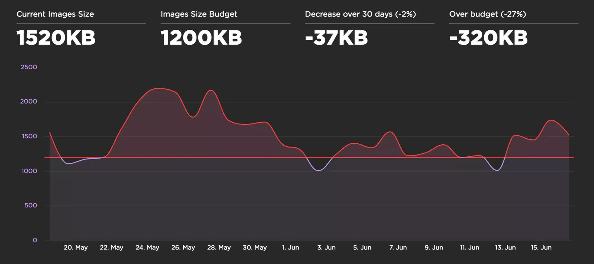


Calibre offers a similar feature with support for setting budgets for each
device-class you’re targeting. This is useful as your budget for image sizes on
desktop over WiFi may vary heavily to your budgets on mobile.


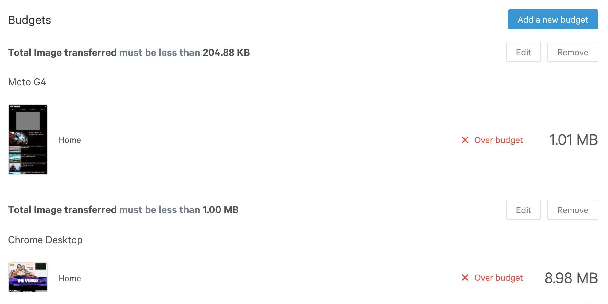

## Closing recommendations {: #closing-recommendations }

Ultimately, choosing an image optimization strategy will come down to the types
of images you're serving down to your users and what you decide is a reasonable
set of evaluation criteria. It might be using SSIM or Butteraugli or, if it's a
small enough set of images, going off of human perception for what makes the
most sense.

**Here are my closing recommendations:**

If you **can't** invest in conditionally serving formats based on browser
support:


* Guetzli + MozJPEG's jpegtran is a good format for JPEG quality > 90.
    * For the web `q=90` is wastefully high. You can get away with `q=80`, and
      on 2x displays even with `q=50`. Since Guetzli doesn't go that low, for
      the web you can MozJPEG.
    * Kornel Lesi&#x144;ski recently improved mozjpeg's cjpeg command to add
      tiny sRGB profile to help Chrome display natural color on wide-gamut
      displays
* PNG pngquant + advpng has a pretty good speed/compression ratio
* If you **can** conditionally serve (using `<picture>`, the [Accept
  header](https://www.igvita.com/2013/05/01/deploying-webp-via-accept-content-negotiation/)
  or [Picturefill](https://scottjehl.github.io/picturefill/)):
    * Serve WebP down to browsers that support it
        * Create WebP images from original 100% quality images. Otherwise you'll
          be giving browsers that do support it worse-looking images with JPEG
          distortions *and* WebP distortions! If you compress uncompressed
          source images using WebP it'll have the less visible WebP distortions
          and can compress better too.
        * The default settings the WebP team use of `-m 4 -q 75` are usually
          good for most cases where they optimize for speed/ratio.
        * WebP also has a special mode for lossless (`-m 6 -q 100`) which can
          reduce a file to its smallest size by exploring all parameter
          combinations. It's an order of magnitude slower but is worth it for
          static assets.
    *   As a fallback, serve Guetzli/MozJPEG compressed sources to other
        browsers

Happy compressing!

